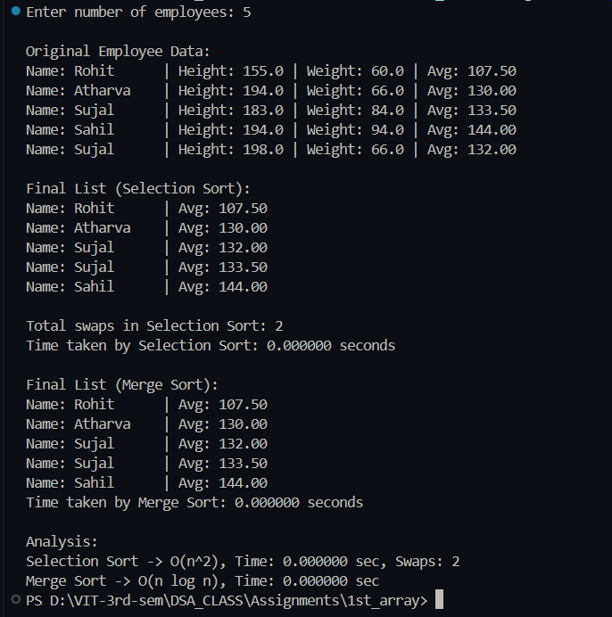

# Sorting Employees by Average of Height and Weight

**Name:** Sahil Ashok Khaire  
**Roll No:** 13 

## Aim
To arrange a list of employees as per the average of their height and weight using **Selection Sort** and **Merge Sort** and analyze their time complexities.


## Theory
- **Selection Sort:**  
  - Finds the minimum element and swaps it with the first unsorted element.
  - Time complexity: O(n²)
- **Merge Sort:**  
  - Divides the list into halves, recursively sorts, and merges them.
  - Time complexity: O(n log n)

- **Average of Height and Weight:**  
  avg = (height + weight) / 2  


## Algorithm

### Selection Sort
1. Start
2. Input number of employees n.
3. Assign random height and weight for employees.
4. Compute avg = (height + weight)/2.
5. For i = 0 to n-1:
   - Find min avg in remaining array.
   - Swap with current position.
   - Print array after each pass.
6. Stop.

### Merge Sort
1. **Start**  
2. **Input** an array of employees (`Employee_sak`) with attributes including `avg_sak`.  
3. **Check** if the left index `<` right index:  
   - If yes, continue dividing;  
   - If no, stop (base case reached).  
4. **Find** the middle index:  
   - `mid_sak = left_sak + (right_sak - left_sak) / 2`  
5. **Recursively apply merge sort**:  
   - Call `mergeSort_sak(emp_sak, left_sak, mid_sak)` → Sort left half  
   - Call `mergeSort_sak(emp_sak, mid_sak+1, right_sak)` → Sort right half  
6. **Merge the two halves** using `merge_sak`:  
   - Create two temporary arrays: `L_sak[]` and `R_sak[]`  
   - Copy left half elements into `L_sak[]` and right half elements into `R_sak[]`  
   - Compare elements of `L_sak` and `R_sak` one by one:  
     - If `L_sak[i].avg_sak <= R_sak[j].avg_sak`, place `L_sak[i]` into original array  
     - Else, place `R_sak[j]` into original array  
   - Continue until one of the temporary arrays is exhausted  
   - Copy any remaining elements from `L_sak` or `R_sak` back to the original array  
7. **Free temporary arrays** (`L_sak` and `R_sak`) to release memory.  
8. **Repeat** until the whole array is sorted.  
9. **Stop**.  


**Code** :
      
```
#include <stdio.h>
#include <stdlib.h>
#include <string.h>
#include <time.h>   

typedef struct
{
    char name_sak[50];
    float height_sak;
    float weight_sak;
    float avg_sak;
} Employee_sak;

int selectionSort_sak(Employee_sak emp_sak[], int n_sak)
{
    int swap_count_sak = 0;
    for (int i_sak = 0; i_sak < n_sak - 1; i_sak++)
    {
        int min_idx_sak = i_sak;
        for (int j_sak = i_sak + 1; j_sak < n_sak; j_sak++)
        {
            if (emp_sak[j_sak].avg_sak < emp_sak[min_idx_sak].avg_sak)
                min_idx_sak = j_sak;
        }
        if (min_idx_sak != i_sak)
        {
            Employee_sak temp_sak = emp_sak[i_sak];
            emp_sak[i_sak] = emp_sak[min_idx_sak];
            emp_sak[min_idx_sak] = temp_sak;
            swap_count_sak++;
        }
    }
    return swap_count_sak;
}

void merge_sak(Employee_sak emp_sak[], int left_sak, int mid_sak, int right_sak)
{
    int n1_sak = mid_sak - left_sak + 1;
    int n2_sak = right_sak - mid_sak;

    Employee_sak *L_sak = (Employee_sak *)malloc(n1_sak * sizeof(Employee_sak));
    Employee_sak *R_sak = (Employee_sak *)malloc(n2_sak * sizeof(Employee_sak));

    for (int i_sak = 0; i_sak < n1_sak; i_sak++)
        L_sak[i_sak] = emp_sak[left_sak + i_sak];
    for (int j_sak = 0; j_sak < n2_sak; j_sak++)
        R_sak[j_sak] = emp_sak[mid_sak + 1 + j_sak];

    int i_sak = 0, j_sak = 0, k_sak = left_sak;
    while (i_sak < n1_sak && j_sak < n2_sak)
    {
        if (L_sak[i_sak].avg_sak <= R_sak[j_sak].avg_sak)
            emp_sak[k_sak++] = L_sak[i_sak++];
        else
            emp_sak[k_sak++] = R_sak[j_sak++];
    }

    while (i_sak < n1_sak)
        emp_sak[k_sak++] = L_sak[i_sak++];
    while (j_sak < n2_sak)
        emp_sak[k_sak++] = R_sak[j_sak++];

    free(L_sak);
    free(R_sak);
}

void mergeSort_sak(Employee_sak emp_sak[], int left_sak, int right_sak)
{
    if (left_sak < right_sak)
    {
        int mid_sak = left_sak + (right_sak - left_sak) / 2;
        mergeSort_sak(emp_sak, left_sak, mid_sak);
        mergeSort_sak(emp_sak, mid_sak + 1, right_sak);
        merge_sak(emp_sak, left_sak, mid_sak, right_sak);
    }
}

int main()
{
    int n_sak;
    printf("Enter number of employees: ");
    scanf("%d", &n_sak);

    Employee_sak *emp_sak = (Employee_sak *)malloc(n_sak * sizeof(Employee_sak));
    if (emp_sak == NULL)
    {
        printf("Memory allocation failed!\n");
        exit(0);
    }

    const char *name_list_sak[] = {"Sahil", "Atharva", "Prathmesh", "Swikrut", "Apurv", "Sujal", "Kunal", "Aman", "Rohit", "Amit", "Rahul"};
    int name_count_sak = sizeof(name_list_sak) / sizeof(name_list_sak[0]);

    for (int i_sak = 0; i_sak < n_sak; i_sak++)
    {
        strcpy(emp_sak[i_sak].name_sak, name_list_sak[rand() % name_count_sak]);
        emp_sak[i_sak].height_sak = (float)(150 + rand() % 51);
        emp_sak[i_sak].weight_sak = (float)(50 + rand() % 51);
        emp_sak[i_sak].avg_sak = (emp_sak[i_sak].height_sak + emp_sak[i_sak].weight_sak) / 2;
    }

    printf("\nOriginal Employee Data:\n");
    for (int i_sak = 0; i_sak < n_sak; i_sak++)
        printf("Name: %-10s | Height: %.1f | Weight: %.1f | Avg: %.2f\n",
               emp_sak[i_sak].name_sak, emp_sak[i_sak].height_sak, emp_sak[i_sak].weight_sak, emp_sak[i_sak].avg_sak);

    Employee_sak *emp_sel_sak = (Employee_sak *)malloc(n_sak * sizeof(Employee_sak));
    memcpy(emp_sel_sak, emp_sak, n_sak * sizeof(Employee_sak));

    clock_t start_sel = clock();
    int sel_swaps_sak = selectionSort_sak(emp_sel_sak, n_sak);
    clock_t end_sel = clock();
    double time_sel = (double)(end_sel - start_sel) / CLOCKS_PER_SEC;

    printf("\nFinal List (Selection Sort):\n");
    for (int i_sak = 0; i_sak < n_sak; i_sak++)
        printf("Name: %-10s | Avg: %.2f\n", emp_sel_sak[i_sak].name_sak, emp_sel_sak[i_sak].avg_sak);
    printf("\nTotal swaps in Selection Sort: %d\n", sel_swaps_sak);
    printf("Time taken by Selection Sort: %.6f seconds\n", time_sel);

    Employee_sak *emp_merge_sak = (Employee_sak *)malloc(n_sak * sizeof(Employee_sak));
    memcpy(emp_merge_sak, emp_sak, n_sak * sizeof(Employee_sak));

    clock_t start_merge = clock();
    mergeSort_sak(emp_merge_sak, 0, n_sak - 1);
    clock_t end_merge = clock();
    double time_merge = (double)(end_merge - start_merge) / CLOCKS_PER_SEC;

    printf("\nFinal List (Merge Sort):\n");
    for (int i_sak = 0; i_sak < n_sak; i_sak++)
        printf("Name: %-10s | Avg: %.2f\n", emp_merge_sak[i_sak].name_sak, emp_merge_sak[i_sak].avg_sak);
    printf("Time taken by Merge Sort: %.6f seconds\n", time_merge);

    printf("\nAnalysis:\n");
    printf("Selection Sort -> O(n^2), Time: %.6f sec, Swaps: %d\n", time_sel, sel_swaps_sak);
    printf("Merge Sort -> O(n log n), Time: %.6f sec\n", time_merge);

    free(emp_sak);
    free(emp_sel_sak);
    free(emp_merge_sak);

    return 0;
}

```

## Output

