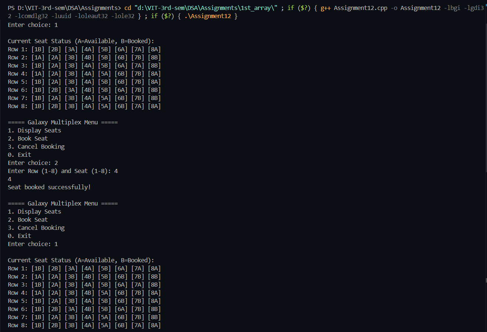

# Practical File – Galaxy Multiplex Ticket Reservation System

**Name:** Sahil Ashok Khaire  
**Roll No.:** 13  
**Title:** Ticket Reservation System using Doubly Circular Linked List  

---
## Theory  

A **ticket reservation system** can be implemented using a **Doubly Circular Linked List (DCLL)**, where:  
- Each seat is represented as a node with status:  
  - `0` → Available  
  - `1` → Booked  
- Each row has 8 seats.  
- There are 8 rows in total.  
- An **array of head pointers** stores each row’s linked list.  

---

## Operations  

1. **Display available seats**  
   - Traverse each row’s linked list.  
   - Print seat number with status (A = Available, B = Booked).  

2. **Book seat(s)**  
   - User enters row and seat number(s).  
   - If available, mark as booked. Otherwise, show "already booked".  

3. **Cancel booking**  
   - User enters row and seat number.  
   - If booked, mark as available again.  

---

## Algorithm  

### 1. Initialization  
1. For each row (1–8), create a doubly circular linked list of 8 seats.  
2. Randomly set some seats as booked (status = 1).  

### 2. Display Seats  
1. For each row, traverse 8 seats.  
2. Print seat numbers with `A` or `B`.  

### 3. Book Seat  
1. Input row and seat number.  
2. Traverse to the node.  
3. If `status = 0`, change to `1`. Else, display error.  

### 4. Cancel Booking  
1. Input row and seat number.  
2. Traverse to the node.  
3. If `status = 1`, change to `0`. Else, show error.  

---

## Code  

```
#include <iostream>
#include <cstdlib>
using namespace std;

struct Seat_sak {
    int seatno_sak;
    int status_sak;
    Seat_sak* next_sak;
    Seat_sak* prev_sak;
};

Seat_sak* rows_sak[8];

Seat_sak* createRow_sak(int row_sak) {
    Seat_sak* head_sak = NULL;
    Seat_sak* prev_sak = NULL;
    for(int i_sak=1;i_sak<=8;i_sak++) {
        Seat_sak* newnode_sak = new Seat_sak;
        newnode_sak->seatno_sak = i_sak;
        newnode_sak->status_sak = rand()%2;
        if(head_sak==NULL) {
            head_sak = newnode_sak;
            newnode_sak->next_sak = head_sak;
            newnode_sak->prev_sak = head_sak;
        } else {
            newnode_sak->prev_sak = prev_sak;
            newnode_sak->next_sak = head_sak;
            prev_sak->next_sak = newnode_sak;
            head_sak->prev_sak = newnode_sak;
        }
        prev_sak = newnode_sak;
    }
    return head_sak;
}

void initialize_sak() {
    for(int i_sak=0;i_sak<8;i_sak++) {
        rows_sak[i_sak] = createRow_sak(i_sak);
    }
}

void display_sak() {
    cout<<"\nCurrent Seat Status (A=Available, B=Booked):\n";
    for(int i_sak=0;i_sak<8;i_sak++) {
        cout<<"Row "<<i_sak+1<<": ";
        Seat_sak* temp_sak = rows_sak[i_sak];
        for(int j_sak=0;j_sak<8;j_sak++) {
            if(temp_sak->status_sak==0)
                cout<<"["<<temp_sak->seatno_sak<<"A] ";
            else
                cout<<"["<<temp_sak->seatno_sak<<"B] ";
            temp_sak = temp_sak->next_sak;
        }
        cout<<endl;
    }
}

void bookSeat_sak(int row_sak,int seatno_sak) {
    Seat_sak* temp_sak = rows_sak[row_sak-1];
    for(int i_sak=1;i_sak<seatno_sak;i_sak++) {
        temp_sak = temp_sak->next_sak;
    }
    if(temp_sak->status_sak==0) {
        temp_sak->status_sak=1;
        cout<<"Seat booked successfully!\n";
    } else {
        cout<<"Seat already booked!\n";
    }
}

void cancelSeat_sak(int row_sak,int seatno_sak) {
    Seat_sak* temp_sak = rows_sak[row_sak-1];
    for(int i_sak=1;i_sak<seatno_sak;i_sak++) {
        temp_sak = temp_sak->next_sak;
    }
    if(temp_sak->status_sak==1) {
        temp_sak->status_sak=0;
        cout<<"Booking cancelled!\n";
    } else {
        cout<<"Seat was not booked!\n";
    }
}

int main() {
    initialize_sak();
    int choice_sak,row_sak,seatno_sak;
    while(true) {
        cout<<"\n===== Galaxy Multiplex Menu =====\n";
        cout<<"1. Display Seats\n2. Book Seat\n3. Cancel Booking\n0. Exit\nEnter choice: ";
        cin>>choice_sak;
        switch(choice_sak) {
            case 1: display_sak(); break;
            case 2:
                cout<<"Enter Row (1-8) and Seat (1-8): ";
                cin>>row_sak>>seatno_sak;
                bookSeat_sak(row_sak,seatno_sak);
                break;
            case 3:
                cout<<"Enter Row (1-8) and Seat (1-8): ";
                cin>>row_sak>>seatno_sak;
                cancelSeat_sak(row_sak,seatno_sak);
                break;
            case 0: exit(0);
        }
    }
    return 0;
}
```

## Output
