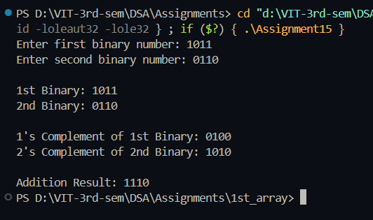

# Practical File – Binary Number using Doubly Linked List  

**Name:** Sahil Ashok Khaire  
**Roll No.:** 13  
**Title:** Binary Number Operations using Doubly Linked List  

---

## Theory  

A **Doubly Linked List (DLL)** is a linear data structure where each node contains three fields:  
- **Data** (the bit value: 0 or 1)  
- **Pointer to Previous Node**  
- **Pointer to Next Node**  

Using a DLL, binary numbers can be stored and manipulated efficiently from both ends.  
We can easily perform operations like:  
- **1’s Complement** (invert all bits)  
- **2’s Complement** (invert all bits, then add 1)  
- **Addition** of two binary numbers  

---

## Algorithm  

### a) 1’s Complement
1. Traverse DLL from head to tail.  
2. For each node, if data_sak == 0 → make it 1; else make it 0.  

### b) 2’s Complement
1. Find 1’s complement.  
2. Traverse from tail to head.  
3. Add 1 to the least significant bit and handle carry.  

### c) Addition of Two Binary Numbers
1. Start from the tail of both lists.  
2. Add corresponding bits with carry_sak.  
3. Create new nodes in result_sak DLL for each sum bit.  
4. Reverse the result_sak list for correct order.  

---

## Code  

```cpp
#include <iostream>
using namespace std;

struct Node_sak {
    int data_sak;
    Node_sak *prev_sak;
    Node_sak *next_sak;
};

class BinaryDLL_sak {
    Node_sak *head_sak, *tail_sak;
public:
    BinaryDLL_sak() {
        head_sak = tail_sak = NULL;
    }

    void insertBit_sak(int bit_sak) {
        Node_sak *newnode_sak = new Node_sak;
        newnode_sak->data_sak = bit_sak;
        newnode_sak->next_sak = NULL;
        newnode_sak->prev_sak = tail_sak;

        if (head_sak == NULL)
            head_sak = tail_sak = newnode_sak;
        else {
            tail_sak->next_sak = newnode_sak;
            tail_sak = newnode_sak;
        }
    }

    void display_sak() {
        Node_sak *temp_sak = head_sak;
        while (temp_sak != NULL) {
            cout << temp_sak->data_sak;
            temp_sak = temp_sak->next_sak;
        }
        cout << endl;
    }

    void onesComplement_sak() {
        Node_sak *temp_sak = head_sak;
        while (temp_sak != NULL) {
            temp_sak->data_sak = (temp_sak->data_sak == 0) ? 1 : 0;
            temp_sak = temp_sak->next_sak;
        }
    }

    void twosComplement_sak() {
        onesComplement_sak();
        Node_sak *temp_sak = tail_sak;
        int carry_sak = 1;

        while (temp_sak != NULL && carry_sak) {
            int sum_sak = temp_sak->data_sak + carry_sak;
            temp_sak->data_sak = sum_sak % 2;
            carry_sak = sum_sak / 2;
            temp_sak = temp_sak->prev_sak;
        }
        if (carry_sak == 1) {
            Node_sak *newnode_sak = new Node_sak;
            newnode_sak->data_sak = 1;
            newnode_sak->prev_sak = NULL;
            newnode_sak->next_sak = head_sak;
            head_sak->prev_sak = newnode_sak;
            head_sak = newnode_sak;
        }
    }

    static BinaryDLL_sak addBinary_sak(BinaryDLL_sak num1_sak, BinaryDLL_sak num2_sak) {
        BinaryDLL_sak result_sak;
        Node_sak *t1_sak = num1_sak.tail_sak;
        Node_sak *t2_sak = num2_sak.tail_sak;
        int carry_sak = 0;

        while (t1_sak != NULL || t2_sak != NULL || carry_sak != 0) {
            int bit1_sak = (t1_sak) ? t1_sak->data_sak : 0;
            int bit2_sak = (t2_sak) ? t2_sak->data_sak : 0;
            int sum_sak = bit1_sak + bit2_sak + carry_sak;

            result_sak.insertFront_sak(sum_sak % 2);
            carry_sak = sum_sak / 2;

            if (t1_sak) t1_sak = t1_sak->prev_sak;
            if (t2_sak) t2_sak = t2_sak->prev_sak;
        }
        return result_sak;
    }

    void insertFront_sak(int bit_sak) {
        Node_sak *newnode_sak = new Node_sak;
        newnode_sak->data_sak = bit_sak;
        newnode_sak->prev_sak = NULL;
        newnode_sak->next_sak = head_sak;
        if (head_sak != NULL)
            head_sak->prev_sak = newnode_sak;
        else
            tail_sak = newnode_sak;
        head_sak = newnode_sak;
    }
};

int main() {
    BinaryDLL_sak num1_sak, num2_sak;

    cout << "Enter first binary number: ";
    string bin1_sak;
    cin >> bin1_sak;
    for (char ch_sak : bin1_sak)
        num1_sak.insertBit_sak(ch_sak - '0');

    cout << "Enter second binary number: ";
    string bin2_sak;
    cin >> bin2_sak;
    for (char ch_sak : bin2_sak)
        num2_sak.insertBit_sak(ch_sak - '0');

    cout << "\n1st Binary: ";
    num1_sak.display_sak();

    cout << "2nd Binary: ";
    num2_sak.display_sak();

    cout << "\n1's Complement of 1st Binary: ";
    num1_sak.onesComplement_sak();
    num1_sak.display_sak();

    cout << "2's Complement of 2nd Binary: ";
    num2_sak.twosComplement_sak();
    num2_sak.display_sak();

    BinaryDLL_sak sum_sak = BinaryDLL_sak::addBinary_sak(num1_sak, num2_sak);
    cout << "\nAddition Result: ";
    sum_sak.display_sak();

    return 0;
}
```
## Output
