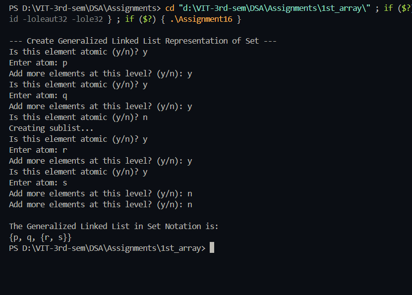

# Practical File – Generalized Linked List (Set Representation)

**Name:** Sahil Ashok Khaire  
**Roll No.:** 13  
**Title:** Implementation of Set using Generalized Linked List  

---

## Theory  

A **Generalized Linked List (GLL)** is a hierarchical data structure that can represent nested lists or sets.  
Each node can store either:
- An **atom (data element)**, or  
- A **sublist (pointer to another list)**  

It is useful for representing **mathematical sets, expressions, and hierarchical data** such as  
`S = { p, q, {r, s, t, {}, {u, v}, w, x, {y, z}, a1, b1} }`

---

## Structure of a Node  

Each node contains:
- `flag_sak`: to indicate if node holds data (0) or sublist (1)  
- `data_sak`: stores data when it is an atom  
- `down_sak`: pointer to sublist  
- `next_sak`: pointer to next node  

---

## Algorithm  

### Step 1: Create Node  
- If input is atomic → store in `data_sak`  
- If input is a sublist → recursively call create function for nested structure  

### Step 2: Display Set  
- If node is atomic → print its data  
- If node points to sublist → print “{” then recursively print its sub-elements and close “}”  

---

## Code  

```cpp
#include <iostream>
#include <string>
using namespace std;

struct GLLNode_sak {
    int flag_sak;             
    string data_sak;       
    GLLNode_sak *next_sak;      
    GLLNode_sak *down_sak;
};

class GLL_sak {
public:
    GLLNode_sak *head_sak;

    GLL_sak() {
        head_sak = NULL;
    }

    GLLNode_sak* createGLL_sak() {
        GLLNode_sak *start_sak = NULL, *temp_sak = NULL;
        char choice_sak;
        do {
            GLLNode_sak *newnode_sak = new GLLNode_sak;
            newnode_sak->next_sak = NULL;
            newnode_sak->down_sak = NULL;

            cout << "Is this element atomic (y/n)? ";
            cin >> choice_sak;

            if (choice_sak == 'y' || choice_sak == 'Y') {
                newnode_sak->flag_sak = 0;
                cout << "Enter atom: ";
                cin >> newnode_sak->data_sak;
            } else {
                newnode_sak->flag_sak = 1;
                cout << "Creating sublist...\n";
                newnode_sak->down_sak = createGLL_sak();
            }

            if (start_sak == NULL)
                start_sak = newnode_sak;
            else
                temp_sak->next_sak = newnode_sak;

            temp_sak = newnode_sak;

            cout << "Add more elements at this level? (y/n): ";
            cin >> choice_sak;

        } while (choice_sak == 'y' || choice_sak == 'Y');

        return start_sak;
    }

    void displayGLL_sak(GLLNode_sak *node_sak) {
        cout << "{";
        while (node_sak != NULL) {
            if (node_sak->flag_sak == 0)
                cout << node_sak->data_sak;
            else
                displayGLL_sak(node_sak->down_sak);

            if (node_sak->next_sak != NULL)
                cout << ", ";
            node_sak = node_sak->next_sak;
        }
        cout << "}";
    }
};

int main() {
    GLL_sak obj_sak;
    cout << "\n--- Create Generalized Linked List Representation of Set ---\n";
    obj_sak.head_sak = obj_sak.createGLL_sak();

    cout << "\nThe Generalized Linked List in Set Notation is:\n";
    obj_sak.displayGLL_sak(obj_sak.head_sak);
    cout << endl;

    return 0;
}
```

## Output
