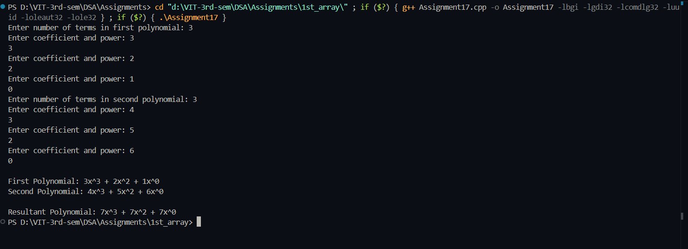

# Practical File – Polynomial Addition using Singly Linked List

**Name:** Sahil Ashok Khaire  
**Roll No.:** 13  
**Title:** Addition of Two Polynomials using Singly Linked List  

---

## Theory  

A **Polynomial** can be represented as a **Singly Linked List**, where each node contains:  
- **Coefficient**  
- **Exponent**  
- **Pointer to next term**  

Each polynomial is stored in **descending order of exponents**, and polynomial addition is done by comparing the powers of terms.

---

## Algorithm  

1. Create two linked lists representing two polynomials.  
2. Traverse both lists simultaneously:  
   - If powers are equal, add coefficients.  
   - If one power is greater, copy that term to result.  
3. Continue until all terms are processed.  
4. Display the final polynomial.

---

## Code  

```cpp
#include <iostream>
using namespace std;

struct PolyNode_sak {
    int coeff_sak;
    int pow_sak;
    PolyNode_sak *next_sak;
};

PolyNode_sak* createPoly_sak(int terms_sak) {
    PolyNode_sak *head_sak = NULL, *temp_sak = NULL;
    for (int i_sak = 0; i_sak < terms_sak; i_sak++) {
        PolyNode_sak *newnode_sak = new PolyNode_sak;
        cout << "Enter coefficient and power: ";
        cin >> newnode_sak->coeff_sak >> newnode_sak->pow_sak;
        newnode_sak->next_sak = NULL;
        if (head_sak == NULL)
            head_sak = newnode_sak;
        else
            temp_sak->next_sak = newnode_sak;
        temp_sak = newnode_sak;
    }
    return head_sak;
}

PolyNode_sak* addPoly_sak(PolyNode_sak *p1_sak, PolyNode_sak *p2_sak) {
    PolyNode_sak *result_sak = NULL, *temp_sak = NULL;
    while (p1_sak != NULL || p2_sak != NULL) {
        PolyNode_sak *newnode_sak = new PolyNode_sak;
        newnode_sak->next_sak = NULL;

        if (p2_sak == NULL || (p1_sak != NULL && p1_sak->pow_sak > p2_sak->pow_sak)) {
            newnode_sak->coeff_sak = p1_sak->coeff_sak;
            newnode_sak->pow_sak = p1_sak->pow_sak;
            p1_sak = p1_sak->next_sak;
        } else if (p1_sak == NULL || p2_sak->pow_sak > p1_sak->pow_sak) {
            newnode_sak->coeff_sak = p2_sak->coeff_sak;
            newnode_sak->pow_sak = p2_sak->pow_sak;
            p2_sak = p2_sak->next_sak;
        } else {
            newnode_sak->coeff_sak = p1_sak->coeff_sak + p2_sak->coeff_sak;
            newnode_sak->pow_sak = p1_sak->pow_sak;
            p1_sak = p1_sak->next_sak;
            p2_sak = p2_sak->next_sak;
        }

        if (result_sak == NULL)
            result_sak = newnode_sak;
        else
            temp_sak->next_sak = newnode_sak;
        temp_sak = newnode_sak;
    }
    return result_sak;
}

void displayPoly_sak(PolyNode_sak *head_sak) {
    while (head_sak != NULL) {
        cout << head_sak->coeff_sak << "x^" << head_sak->pow_sak;
        head_sak = head_sak->next_sak;
        if (head_sak != NULL)
            cout << " + ";
    }
    cout << endl;
}

int main() {
    int n1_sak, n2_sak;
    cout << "Enter number of terms in first polynomial: ";
    cin >> n1_sak;
    PolyNode_sak *poly1_sak = createPoly_sak(n1_sak);

    cout << "Enter number of terms in second polynomial: ";
    cin >> n2_sak;
    PolyNode_sak *poly2_sak = createPoly_sak(n2_sak);

    cout << "\nFirst Polynomial: ";
    displayPoly_sak(poly1_sak);

    cout << "Second Polynomial: ";
    displayPoly_sak(poly2_sak);

    PolyNode_sak *sum_sak = addPoly_sak(poly1_sak, poly2_sak);
    cout << "\nResultant Polynomial: ";
    displayPoly_sak(sum_sak);

    return 0;
}
```

## Output
