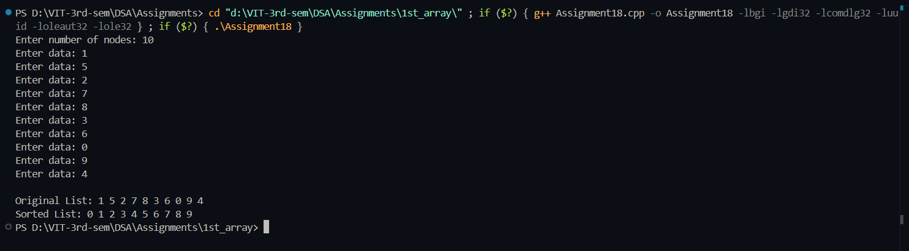

# Practical File – Bubble Sort using Doubly Linked List  

**Name:** Sahil Ashok Khaire  
**Roll No.:** 13  
**Title:** Implementation of Bubble Sort using Doubly Linked List  

---

## Theory  

A **Doubly Linked List (DLL)** is a data structure where each node contains three parts:  
- **Data field**  
- **Pointer to the next node**  
- **Pointer to the previous node**  

In this program, we implement **Bubble Sort** on a **Doubly Linked List** to arrange elements in ascending order.  
Bubble sort repeatedly swaps adjacent elements if they are in the wrong order.

---

## Algorithm  

1. Create a doubly linked list.  
2. Traverse the list and compare each node with its next node.  
3. Swap the data if they are not in order.  
4. Repeat the process until the list is sorted.  
5. Display the sorted list.

---

## Code  

```cpp
#include <iostream>
using namespace std;

struct Node_sak {
    int data_sak;
    Node_sak *next_sak;
    Node_sak *prev_sak;
};

Node_sak* createDLL_sak(int n_sak) {
    Node_sak *head_sak = NULL, *temp_sak = NULL;
    for (int i_sak = 0; i_sak < n_sak; i_sak++) {
        Node_sak *newnode_sak = new Node_sak;
        cout << "Enter data: ";
        cin >> newnode_sak->data_sak;
        newnode_sak->next_sak = NULL;
        newnode_sak->prev_sak = NULL;

        if (head_sak == NULL)
            head_sak = newnode_sak;
        else {
            temp_sak->next_sak = newnode_sak;
            newnode_sak->prev_sak = temp_sak;
        }
        temp_sak = newnode_sak;
    }
    return head_sak;
}

void displayDLL_sak(Node_sak *head_sak) {
    Node_sak *temp_sak = head_sak;
    while (temp_sak != NULL) {
        cout << temp_sak->data_sak << " ";
        temp_sak = temp_sak->next_sak;
    }
    cout << endl;
}

void bubbleSortDLL_sak(Node_sak *head_sak) {
    int swapped_sak;
    Node_sak *ptr1_sak;
    Node_sak *lptr_sak = NULL;

    if (head_sak == NULL)
        return;

    do {
        swapped_sak = 0;
        ptr1_sak = head_sak;

        while (ptr1_sak->next_sak != lptr_sak) {
            if (ptr1_sak->data_sak > ptr1_sak->next_sak->data_sak) {
                int temp_sak = ptr1_sak->data_sak;
                ptr1_sak->data_sak = ptr1_sak->next_sak->data_sak;
                ptr1_sak->next_sak->data_sak = temp_sak;
                swapped_sak = 1;
            }
            ptr1_sak = ptr1_sak->next_sak;
        }
        lptr_sak = ptr1_sak;
    } while (swapped_sak);
}

int main() {
    int n_sak;
    cout << "Enter number of nodes: ";
    cin >> n_sak;

    Node_sak *head_sak = createDLL_sak(n_sak);

    cout << "\nOriginal List: ";
    displayDLL_sak(head_sak);

    bubbleSortDLL_sak(head_sak);

    cout << "Sorted List: ";
    displayDLL_sak(head_sak);

    return 0;
}
```

## Output
