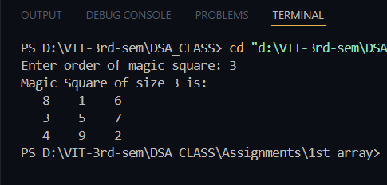

# Magic Square (Odd Order) Program

**Name:** Sahil Ashok Khaire  
**Roll No:** 13 

## Title  
Program to generate a Magic Square of odd order using dynamic memory allocation in C.  

## Theory  
- A **Magic Square** is an arrangement of numbers in a square grid where the sum of each row, column, and diagonal is the same.  
- This program uses the **Siamese method** (also known as De la Loubère’s method) to construct an odd-order magic square.  
- **Dynamic memory allocation (`malloc`)** is used to allocate memory for the square.  
- For an `n x n` square (where `n` is odd):  
  - Start at the middle of the first row.  
  - Place numbers sequentially from 1 to `n*n`.  
  - The next number goes **up one row and right one column** (with wrap-around).  
  - If the calculated cell is already filled, move **down one row** instead.  

## Algorithm  

### 1. Odd Order
1. Start  
2. Read size `n` of the square (must be odd).  
3. Allocate a 2D array (`magic[n][n]`) dynamically.  
4. Initialize all cells with 0.  
5. Place `1` at position `(0, n/2)`.  
6. For each number from `2` to `n*n`:  
   - Compute new position: `(i-1, j+1)` with wrap-around.  
   - If the new cell is already filled, move down `(i+1, j)` instead.  
   - Place the number in the new cell.  
7. Print the magic square.  
8. Free all dynamically allocated memory.  
9. Stop.  

### 2. Doubly Even Order (n % 4 == 0)  
1. Start  
2. Read size `n` (must be a multiple of 4).  
3. Allocate a 2D array (`magic[n][n]`) dynamically.  
4. Fill the matrix sequentially with numbers from 1 to n*n.  
5. For each 4x4 sub-square, invert numbers at positions forming the diagonals:  
   - Replace value with `(n*n + 1 - value)`  
6. Print the magic square.  
7. Free all dynamically allocated memory.  
8. Stop.  

### 3. Singly Even Order (n % 4 == 2)  
1. Start  
2. Read size `n` (even but not a multiple of 4).  
3. Divide the square into four sub-squares of size n/2 x n/2.  
4. Fill each sub-square using the **Odd Order (Siamese) method**.  
5. Swap specific columns between left and right sub-squares according to rules:  
   - Swap the first `k` columns in left quadrants  
   - Swap the last `k-1` columns in right quadrants (where k = n/4)  
6. Print the magic square.  
7. Free all dynamically allocated memory.  
8. Stop.  


**Code** :
      
```
#include<stdio.h>
#include<stdlib.h>

void generateOddMagicSquare_sak(int **magic_sak, int n_sak) {
    int i_sak = 0;
    int j_sak = n_sak / 2;
    int num_sak = 1;

    while (num_sak <= n_sak * n_sak) {
        magic_sak[i_sak][j_sak] = num_sak;
        num_sak++;

        int newi_sak = (i_sak - 1 + n_sak) % n_sak;
        int newj_sak = (j_sak + 1) % n_sak;

        if (magic_sak[newi_sak][newj_sak] != 0) {
            i_sak = (i_sak + 1) % n_sak;
        } else {
            i_sak = newi_sak;
            j_sak = newj_sak;
        }
    }
}

void generateDoublyEvenMagicSquare_sak(int **magic_sak, int n_sak) {
    int i_sak, j_sak;

    int num_sak = 1;
    for (i_sak = 0; i_sak < n_sak; i_sak++) {
        for (j_sak = 0; j_sak < n_sak; j_sak++) {
            magic_sak[i_sak][j_sak] = num_sak;
            num_sak++;
        }
    }

    for (i_sak = 0; i_sak < n_sak; i_sak++) {
        for (j_sak = 0; j_sak < n_sak; j_sak++) {
            if ((i_sak % 4 == j_sak % 4) || ((i_sak % 4 + j_sak % 4) == 3)) {
                magic_sak[i_sak][j_sak] = n_sak * n_sak + 1 - magic_sak[i_sak][j_sak];
            }
        }
    }
}

void generateSinglyEvenMagicSquare_sak(int **magic_sak, int n_sak) {
    int half_sak = n_sak / 2;
    int subSquareSize_sak = half_sak * half_sak;
    int i_sak, j_sak;

    int **temp_sak = (int **)malloc(half_sak * sizeof(int *));
    for (i_sak = 0; i_sak < half_sak; i_sak++) {
        temp_sak[i_sak] = (int *)malloc(half_sak * sizeof(int));
    }

    generateOddMagicSquare_sak(temp_sak, half_sak);

    for (i_sak = 0; i_sak < half_sak; i_sak++) {
        for (j_sak = 0; j_sak < half_sak; j_sak++) {
            magic_sak[i_sak][j_sak] = temp_sak[i_sak][j_sak];
            magic_sak[i_sak + half_sak][j_sak] = temp_sak[i_sak][j_sak] + 2 * subSquareSize_sak;
            magic_sak[i_sak][j_sak + half_sak] = temp_sak[i_sak][j_sak] + 3 * subSquareSize_sak;
            magic_sak[i_sak + half_sak][j_sak + half_sak] = temp_sak[i_sak][j_sak] + subSquareSize_sak;
        }
    }

    int k_sak = (n_sak - 2) / 4;
    for (i_sak = 0; i_sak < half_sak; i_sak++) {
        for (j_sak = 0; j_sak < k_sak; j_sak++) {
            int tempVal_sak = magic_sak[i_sak][j_sak];
            magic_sak[i_sak][j_sak] = magic_sak[i_sak + half_sak][j_sak];
            magic_sak[i_sak + half_sak][j_sak] = tempVal_sak;
        }
        for (j_sak = n_sak - k_sak + 1; j_sak < n_sak; j_sak++) {
            int tempVal_sak = magic_sak[i_sak][j_sak];
            magic_sak[i_sak][j_sak] = magic_sak[i_sak + half_sak][j_sak];
            magic_sak[i_sak + half_sak][j_sak] = tempVal_sak;
        }
    }

    for (i_sak = 0; i_sak < half_sak; i_sak++) free(temp_sak[i_sak]);
    free(temp_sak);
}

int main() {
    int **magic_sak;
    int n_sak;

    printf("Enter order of magic square: ");
    scanf("%d", &n_sak);

    magic_sak = (int **)malloc(n_sak * sizeof(int *));
    for (int i_sak = 0; i_sak < n_sak; i_sak++) {
        magic_sak[i_sak] = (int *)malloc(n_sak * sizeof(int));
        for (int j_sak = 0; j_sak < n_sak; j_sak++) {
            magic_sak[i_sak][j_sak] = 0;
        }
    }

    if (n_sak % 2 == 1) {
        generateOddMagicSquare_sak(magic_sak, n_sak);
    } else if (n_sak % 4 == 0) {
        generateDoublyEvenMagicSquare_sak(magic_sak, n_sak);
    } else {
        generateSinglyEvenMagicSquare_sak(magic_sak, n_sak);
    }

    printf("Magic Square of size %d is:\n", n_sak);
    for (int i_sak = 0; i_sak < n_sak; i_sak++) {
        for (int j_sak = 0; j_sak < n_sak; j_sak++) {
            printf("%4d ", magic_sak[i_sak][j_sak]);
        }
        printf("\n");
    }

    for (int i_sak = 0; i_sak < n_sak; i_sak++) free(magic_sak[i_sak]);
    free(magic_sak);

    return 0;
}

```

## Output


