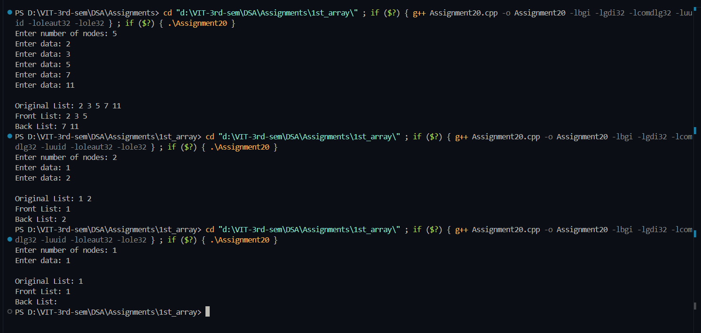

# Practical File – Front and Back Split of Singly Linked List

**Name:** Sahil Ashok Khaire  
**Roll No.:** 13  
**Title:** Front and Back Split of Singly Linked List  

---

## Theory

The **FrontBackSplit** operation divides a singly linked list into two halves:
- The **front list** contains the first half of the nodes.
- The **back list** contains the remaining nodes.
If the total number of nodes is **odd**, the extra node goes to the **front list**.

This operation is useful in algorithms such as **Merge Sort**, where lists need to be split recursively.

---

## Algorithm

1. Create a singly linked list.
2. Count total nodes in the list.
3. Calculate mid-point as `(count + 1) / 2`.
4. Traverse the list up to the mid-point.
5. Break the link and form two separate lists.
6. Display both lists.

---

## Code

```cpp
#include <iostream>
using namespace std;

struct Node_sak {
    int data_sak;
    Node_sak* next_sak;
};

Node_sak* createList_sak(int n_sak) {
    if (n_sak == 0) return NULL;

    Node_sak *head_sak = NULL, *temp_sak = NULL;
    for (int i_sak = 0; i_sak < n_sak; i_sak++) {
        Node_sak* newnode_sak = new Node_sak;
        cout << "Enter data: ";
        cin >> newnode_sak->data_sak;
        newnode_sak->next_sak = NULL;

        if (head_sak == NULL)
            head_sak = newnode_sak;
        else
            temp_sak->next_sak = newnode_sak;

        temp_sak = newnode_sak;
    }
    return head_sak;
}

void displayList_sak(Node_sak* head_sak) {
    Node_sak* temp_sak = head_sak;
    while (temp_sak != NULL) {
        cout << temp_sak->data_sak << " ";
        temp_sak = temp_sak->next_sak;
    }
    cout << endl;
}

void frontBackSplit_sak(Node_sak* source_sak, Node_sak** frontRef_sak, Node_sak** backRef_sak) {
    if (source_sak == NULL || source_sak->next_sak == NULL) {
        *frontRef_sak = source_sak;
        *backRef_sak = NULL;
        return;
    }

    Node_sak *slow_sak = source_sak;
    Node_sak *fast_sak = source_sak->next_sak;

    while (fast_sak != NULL) {
        fast_sak = fast_sak->next_sak;
        if (fast_sak != NULL) {
            slow_sak = slow_sak->next_sak;
            fast_sak = fast_sak->next_sak;
        }
    }

    *frontRef_sak = source_sak;
    *backRef_sak = slow_sak->next_sak;
    slow_sak->next_sak = NULL;
}

int main() {
    int n_sak;
    cout << "Enter number of nodes: ";
    cin >> n_sak;

    Node_sak* head_sak = createList_sak(n_sak);
    cout << "\nOriginal List: ";
    displayList_sak(head_sak);

    Node_sak *front_sak = NULL, *back_sak = NULL;
    frontBackSplit_sak(head_sak, &front_sak, &back_sak);

    cout << "Front List: ";
    displayList_sak(front_sak);

    cout << "Back List: ";
    displayList_sak(back_sak);

    return 0;
}
```

## Output
