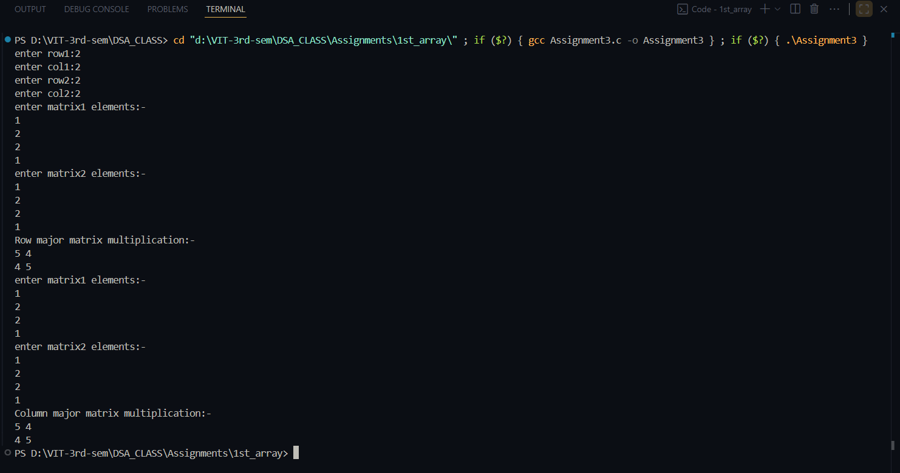

# Matrix Multiplication (Row-Major & Column-Major)

**Name:** Sahil Ashok Khaire  
**Roll No:** 13  
**Title:** Implementation of Matrix Multiplication using Row-Major and Column-Major Representation  


## Theory
Matrix multiplication is a binary operation that produces a matrix from two matrices.  
If `A` is of order `(m × n)` and `B` is of order `(n × p)`, then their product `C = A × B` is of order `(m × p)`.

- **Row-Major Representation:**  
  Stores matrix elements row by row in contiguous memory locations.

- **Column-Major Representation:**  
  Stores matrix elements column by column in contiguous memory locations.

**Condition for multiplication:**  
Number of columns of first matrix = Number of rows of second matrix  


## Algorithm

1. Start  
2. Input row and column sizes of two matrices.  
3. Check if `c1 == r2`, else multiplication is not possible.  
4. Dynamically allocate memory for matrices.  
5. Input elements for both matrices.  

6. Perform multiplication:

   **Row-Major Multiplication:**  
   a. For each row `i` of first matrix:  
      - For each column `j` of second matrix:  
        - Initialize `C[i][j] = 0`  
        - For `k = 0` to `c1-1`:  
          - `C[i][j] += A[i][k] * B[k][j]`  
   b. Store the result in dynamically allocated 2D array.  

   **Column-Major Multiplication:**  
   a. Store both matrices as 1D arrays in **column-major order** using `IDX(i,j,rows)` formula:  
      - `IDX(i,j,rows) = j*rows + i`  
   b. For each row `i` and column `j`:  
      - Initialize `C[IDX(i,j,rows)] = 0`  
      - For `k = 0` to `c1-1`:  
        - `C[IDX(i,j,rows)] += A[IDX(i,k,rows)] * B[IDX(k,j,rows)]`  
   c. Store the result in dynamically allocated 1D array representing column-major matrix.  

7. Print the resulting matrices.  
8. Free all dynamically allocated memory.  
9. Stop  


**Code** :
      
```
#include<stdio.h>
#include<stdlib.h>

#define IDX_sak(i,j,rows_sak) ((j)*(rows_sak)+(i))

int main()
{
    int r1_sak,c1_sak,r2_sak,c2_sak;

    printf("enter row1:");
    scanf("%d",&r1_sak);
    printf("enter col1:");
    scanf("%d",&c1_sak);

    printf("enter row2:");
    scanf("%d",&r2_sak);
    printf("enter col2:");
    scanf("%d",&c2_sak);

    if(c1_sak!=r2_sak)
    {
        printf("Matrix multiplication is not possible!!\n(Note:- r1==c2)");
        exit(-1);
    }

    int **m1_sak=(int **)malloc(sizeof(int *)*r1_sak);
    int **m2_sak=(int **)malloc(sizeof(int *)*r2_sak);
    int **m3_sak=(int **)malloc(sizeof(int *)*r1_sak);

    for(int i_sak=0;i_sak<r1_sak;i_sak++)
    {
        m1_sak[i_sak]=(int *)malloc(sizeof(int)*c1_sak);
    }

    for(int i_sak=0;i_sak<r2_sak;i_sak++)
    {
        m2_sak[i_sak]=(int *)malloc(sizeof(int)*c2_sak);
    }

    for(int i_sak=0;i_sak<r1_sak;i_sak++)
    {
        m3_sak[i_sak]=(int *)malloc(sizeof(int)*c2_sak);
    }

    printf("enter matrix1 elements:-\n");
    for(int i_sak=0;i_sak<r1_sak;i_sak++)
    {
        for(int j_sak=0;j_sak<c1_sak;j_sak++)
        {
            scanf("%d",&m1_sak[i_sak][j_sak]);
        }
    }

    printf("enter matrix2 elements:-\n");
    for(int i_sak=0;i_sak<r2_sak;i_sak++)
    {
        for(int j_sak=0;j_sak<c2_sak;j_sak++)
        {
            scanf("%d",&m2_sak[i_sak][j_sak]);
        }
    }

    for(int i_sak=0;i_sak<r1_sak;i_sak++)
    {
        for(int j_sak=0;j_sak<c2_sak;j_sak++)
        {
            m3_sak[i_sak][j_sak]=0;
            for(int k_sak=0;k_sak<c1_sak;k_sak++)
            {
                m3_sak[i_sak][j_sak]+=m1_sak[i_sak][k_sak] * m2_sak[k_sak][j_sak];
            }
        }
    }

    printf("Row major matrix multiplication:-\n");
    for(int i_sak=0;i_sak<r1_sak;i_sak++)
    {
        for(int j_sak=0;j_sak<c2_sak;j_sak++)
        {
            printf("%d ",m3_sak[i_sak][j_sak]);
        }
        printf("\n");
    }

    //-----------------column major matrix multiplication------------------

    int *A_sak=(int *)malloc(sizeof(int)*r1_sak*c1_sak);
    int *B_sak=(int *)malloc(sizeof(int)*r2_sak*c2_sak);
    int *C_sak=(int *)malloc(sizeof(int)*r1_sak*c2_sak);

    printf("enter matrix1 elements:-\n");
    for(int i_sak=0;i_sak<r1_sak;i_sak++)
    {
        for(int j_sak=0;j_sak<c1_sak;j_sak++)
        {
            scanf("%d",&A_sak[IDX_sak(i_sak,j_sak,r1_sak)]);
        }
    }

    printf("enter matrix2 elements:-\n");
    for(int i_sak=0;i_sak<r2_sak;i_sak++)
    {
        for(int j_sak=0;j_sak<c2_sak;j_sak++)
        {
            scanf("%d",&B_sak[IDX_sak(i_sak,j_sak,r2_sak)]);
        }
    }

    for(int i_sak=0;i_sak<r1_sak;i_sak++)
    {
        for(int j_sak=0;j_sak<c2_sak;j_sak++)
        {
            C_sak[IDX_sak(i_sak,j_sak,r1_sak)]=0;
        }
    }

    for(int i_sak=0;i_sak<r1_sak;i_sak++)
    {
        for(int j_sak=0;j_sak<c2_sak;j_sak++)
        {
            int sum_sak=0;
            for(int k_sak=0;k_sak<c1_sak;k_sak++)
            {
                sum_sak += A_sak[IDX_sak(i_sak,k_sak,r1_sak)]*B_sak[IDX_sak(k_sak,j_sak,r2_sak)];
            }
            C_sak[IDX_sak(i_sak,j_sak,r1_sak)]=sum_sak;
        }
    }
    printf("Column major matrix multiplication:-\n");
    for(int i_sak=0;i_sak<r1_sak;i_sak++)
    {
        for(int j_sak=0;j_sak<c2_sak;j_sak++)
        {
            printf("%d ",C_sak[IDX_sak(i_sak,j_sak,r1_sak)]);
        }
        printf("\n");
    }

    for(int i_sak=0;i_sak<r1_sak;i_sak++)
    {
        free(m1_sak[i_sak]);
        free(m3_sak[i_sak]);
    }
    for(int i_sak=0;i_sak<r2_sak;i_sak++)
    {
        free(m2_sak[i_sak]);
    }

    free(m1_sak);
    free(m2_sak);
    free(m3_sak);
    free(A_sak);
    free(B_sak);
    free(C_sak);

    return 0;

}

```
## Output
