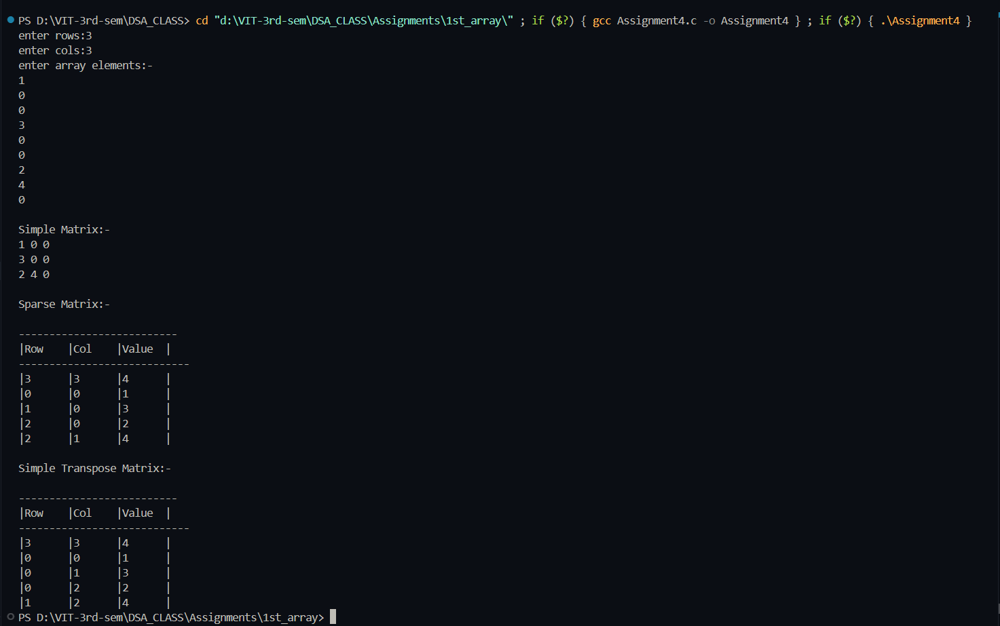

# Sparse Matrix Representation and Simple Transpose

**Name:** Sahil Ashok Khaire  
**Roll No:** 13 
**Title:** Sparse Matrix Representation with Simple Transpose  

## Theory
A **sparse matrix** is a matrix in which most of the elements are zero.  
To save memory, only **non-zero elements** are stored along with their positions.

### Sparse Matrix Representation
- Represented using a structure with fields: **row, col, value**.
- The **first entry** (header) stores:
  - Total number of rows
  - Total number of columns
  - Total number of non-zero elements

## Transpose of Sparse Matrix

### Simple Transpose
- The transpose of a matrix is obtained by **interchanging rows and columns**.  
- In the sparse representation, this means swapping the row and column values.  
- The **simple transpose method** works by:
  1. For each column `c` in the original sparse matrix:
  2. Scan all elements, and if any element belongs to column `c`,  
     - Place it in the transpose by interchanging `(row, col)`.  

Limitation: Requires **repeated scanning**, making it less efficient for large matrices.

## Algorithm

### Sparse Matrix Creation
1. Input number of rows and columns.  
2. Read matrix elements.  
3. Count non-zero elements.  
4. Create sparse matrix in triplet form:  
   - First entry: `(rows, cols, non-zero count)`  
   - Next entries: `(row, col, value)` for each non-zero element.  


### Simple Transpose
1. Copy header of sparse matrix with swapped rows and columns.  
2. For each column index `c` from `0` to `cols-1`:  
   - For each element in sparse matrix:  
     - If element’s column = `c`,  
       - Place `(col, row, value)` into transpose.  
3. Print transpose sparse matrix.


**Code** :
      
```
#include<stdio.h>
#include<stdlib.h>

typedef struct 
{
    int row_sak;
    int col_sak;
    int val_sak;
}Element_sak;

int main()
{
    int **matrix_sak=NULL;
    int rows_sak,cols_sak;
    int count_sak=0;

    printf("enter rows:");
    scanf("%d",&rows_sak);
    printf("enter cols:");
    scanf("%d",&cols_sak);

    matrix_sak=(int **)malloc(sizeof(int *)*rows_sak);

    if(matrix_sak==NULL)
    {
        printf("memory is not allocated!!!");
        exit(-1);
    }
    for(int i_sak=0;i_sak<rows_sak;i_sak++)
    {
        matrix_sak[i_sak]=(int *)malloc(sizeof(int)*cols_sak);
    }

    printf("enter array elements:-\n");
    for(int i_sak=0;i_sak<rows_sak;i_sak++)
    {
        for(int j_sak=0;j_sak<cols_sak;j_sak++)
        {
            scanf("%d",&matrix_sak[i_sak][j_sak]);
            if(matrix_sak[i_sak][j_sak]!=0)
            {
                count_sak++;
            }
        }
    }

    //--------------matrix print------------------

    printf("\nSimple Matrix:-\n");
    for(int i_sak=0;i_sak<rows_sak;i_sak++)
    {
        for(int j_sak=0;j_sak<cols_sak;j_sak++)
        {
            printf("%d ",matrix_sak[i_sak][j_sak]);
        }
        printf("\n");
    }

    //-----------------sparse matrix-------------------

    Element_sak *sparse_sak=(Element_sak *)malloc(sizeof(Element_sak)*(count_sak+1));

    if(sparse_sak==NULL)
    {
        printf("Memory is not allocated!!!");
        exit(-2);
    }

    sparse_sak[0].row_sak=rows_sak;
    sparse_sak[0].col_sak=cols_sak;
    sparse_sak[0].val_sak=count_sak;

    int k_sak=1;
    for(int i_sak=0;i_sak<rows_sak;i_sak++)
    {
        for(int j_sak=0;j_sak<cols_sak;j_sak++)
        {
            if(matrix_sak[i_sak][j_sak]!=0)
            {
                sparse_sak[k_sak].row_sak=i_sak;
                sparse_sak[k_sak].col_sak=j_sak;
                sparse_sak[k_sak].val_sak=matrix_sak[i_sak][j_sak];
                k_sak++;
            }
        }
    }

    printf("\nSparse Matrix:-\n");
    printf("\n--------------------------");
    printf("\n|Row\t|Col\t|Value\t|\n");
    printf("----------------------------\n");
    for(int i_sak=0;i_sak<=count_sak;i_sak++)
    {
        printf("|%d\t|%d\t|%d\t|\n",sparse_sak[i_sak].row_sak,sparse_sak[i_sak].col_sak,sparse_sak[i_sak].val_sak);
    }

    //-------------transpose of sparse matrix-------------

    Element_sak *transpose_sak=(Element_sak*)malloc(sizeof(Element_sak)*(count_sak+1));

    if(transpose_sak==NULL)
    {
        printf("Memory is not allocated!!!!");
        exit(-3);
    }

    transpose_sak[0].row_sak=sparse_sak[0].col_sak;
    transpose_sak[0].col_sak=sparse_sak[0].row_sak;
    transpose_sak[0].val_sak=sparse_sak[0].val_sak;

    int l_sak=1;
    for(int i_sak=0;i_sak<sparse_sak[0].col_sak;i_sak++)
    {
        for(int j_sak=1;j_sak<=sparse_sak[0].val_sak;j_sak++)
        {
            if(sparse_sak[j_sak].col_sak==i_sak)
            {
                transpose_sak[l_sak].row_sak=sparse_sak[j_sak].col_sak;
                transpose_sak[l_sak].col_sak=sparse_sak[j_sak].row_sak;
                transpose_sak[l_sak].val_sak=sparse_sak[j_sak].val_sak;
                l_sak++;
            }
        }
    }

    printf("\nSimple Transpose Matrix:-\n");
    printf("\n--------------------------");
    printf("\n|Row\t|Col\t|Value\t|\n");
    printf("----------------------------\n");
    for(int i_sak=0;i_sak<=count_sak;i_sak++)
    {
        printf("|%d\t|%d\t|%d\t|\n",transpose_sak[i_sak].row_sak,transpose_sak[i_sak].col_sak,transpose_sak[i_sak].val_sak);
    }

    for(int i_sak=0;i_sak<rows_sak;i_sak++)
    {
        free(matrix_sak[i_sak]);
    }
    free(matrix_sak);
    free(sparse_sak);
    free(transpose_sak);
    return 0;
}

```
## Output
