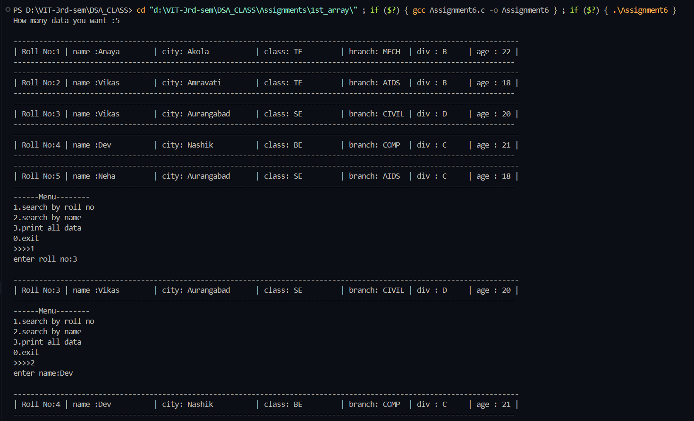

# Student Management System

**Name:** Sahil Ashok Khaire  
**Roll No:** 13

## Title  
Program to store, display, and search student information using structures and dynamic memory allocation in C.  

## Theory  
This program demonstrates:  

- **Structures** → used to group related student information.  
- **Dynamic Memory Allocation (`malloc`)** → memory is allocated at runtime depending on how many students the user wants to store.  
- **Random Data Assignment** → names, cities, branches, etc. are assigned using `rand()`.  
- **String Handling** → `strcpy` to copy strings and `strcmp` to compare strings.  
- **Menu-driven approach** → provides options to search students by roll number, search by name, or display all student records.  

This program is useful for understanding how to manage and organize real-life student databases.  

## Algorithm  

1. Start  
2. Define a `Student` structure with fields: roll number, name, city, class, branch, division, and age.  
3. Ask the user how many student records are required.  
4. Dynamically allocate memory for that many students using `malloc()`.  
5. Generate random student data (names, cities, branches, etc.).  
6. Display all student data.  
7. Show a menu with options:  
   - Search by Roll Number  
   - Search by Name  
   - Print all data  
   - Exit  
8. If search by roll number:  
   - Input roll number  
   - Traverse student array  
   - If match found → print data, else show "Not Found".  
9. If search by name:  
   - Input name  
   - Traverse student array  
   - If match found → print data, else show "Not Found".  
10. If "Print all data" → print details of all students.  
11. Repeat until user selects Exit.  
12. Free allocated memory.  
13. Stop.  


**Code** :
      
```
#include <stdio.h>
#include <stdlib.h>
#include <time.h>
#include <string.h>

#define N_L_sak 32
#define ct_L_sak 32
#define CL_L_sak 12
#define B_L_sak 8
#define D_L_sak 4

typedef struct Student_sak
{
    int roll_no_sak;
    char name_sak[N_L_sak];
    char city_sak[ct_L_sak];
    char class_sak[CL_L_sak];
    char branch_sak[B_L_sak];
    char div_sak[D_L_sak];
    int age_sak;
} Student_sak;

void printdata_sak(Student_sak s_sak)
{
    printf("\n-----------------------------------------------------------------------------------------------------------------------\n");
    printf("| Roll No:%d | name :%-10s\t | city: %-15s | class: %-10s | branch: %-5s | div : %-5s | age : %d |\n",
           s_sak.roll_no_sak, s_sak.name_sak, s_sak.city_sak, s_sak.class_sak, s_sak.branch_sak, s_sak.div_sak, s_sak.age_sak);
    printf("----------------------------------------------------------------------------------------------------------------------");
}

int main()
{
    Student_sak *s_sak = NULL;
    int n_sak;
    printf("How many data you want :");
    scanf("%d", &n_sak);

    s_sak = (Student_sak *)malloc(sizeof(Student_sak) * n_sak);

    if (s_sak == NULL)
    {
        printf("Memory is not allocated!!!");
        exit(-1);
    }

    const char *names_sak[] = {"Abir", "Aarav", "Isha", "Rohan", "Priya", "Vikas", "Neha", "Sahil", "Anaya", "Dev", "Kriti"};
    const char *citis_sak[] = {"Amravati", "Akola", "Pune", "Mumbai", "Nashik", "Nagpur", "Aurangabad"};
    const char *classes_sak[] = {"FE", "SE", "TE", "BE"};
    const char *branches_sak[] = {"COMP", "IT", "AIDS", "ENTC", "MECH", "CIVIL"};
    const char *divs_sak[] = {"A", "B", "C", "D"};

    int N_Names_sak = (int)(sizeof(names_sak) / sizeof(names_sak[0]));
    int N_Cities_sak = (int)(sizeof(citis_sak) / sizeof(citis_sak[0]));
    int N_Class_sak = (int)(sizeof(classes_sak) / sizeof(classes_sak[0]));
    int N_branch_sak = (int)(sizeof(branches_sak) / sizeof(branches_sak[0]));
    int N_div_sak = (int)(sizeof(divs_sak) / sizeof(divs_sak[0]));

    for (int i_sak = 0; i_sak < n_sak; i_sak++)
    {
        s_sak[i_sak].roll_no_sak = i_sak + 1;
        strcpy(s_sak[i_sak].name_sak, names_sak[rand() % N_Names_sak]);
        strcpy(s_sak[i_sak].city_sak, citis_sak[rand() % N_Cities_sak]);
        strcpy(s_sak[i_sak].class_sak, classes_sak[rand() % N_Class_sak]);
        strcpy(s_sak[i_sak].branch_sak, branches_sak[rand() % N_branch_sak]);
        strcpy(s_sak[i_sak].div_sak, divs_sak[rand() % N_div_sak]);
        s_sak[i_sak].age_sak = 18 + rand() % 5;
    }

    for (int i_sak = 0; i_sak < n_sak; i_sak++)
    {
        printdata_sak(s_sak[i_sak]);
    }

    int ch_sak;
    int roll_sak;
    char targetn_sak[N_L_sak];
    do
    {
        printf("\n------Menu--------\n");
        printf("1.search by roll no \n2.search by name\n3.print all data\n0.exit\n>>>>");
        scanf("%d", &ch_sak);
        int found_sak = 0;
        switch (ch_sak)
        {
        case 1:
            printf("enter roll no:");
            scanf("%d", &roll_sak);
            for (int i_sak = 0; i_sak < n_sak; i_sak++)
            {
                if (s_sak[i_sak].roll_no_sak == roll_sak)
                {
                    printdata_sak(s_sak[i_sak]);
                    found_sak = 1;
                    break;
                }
            }
            if (!found_sak)
                printf("\nNo student found with Roll No %d\n", roll_sak);
            break;
        case 2:
            printf("enter name:");
            scanf("%s", targetn_sak);
            for (int i_sak = 0; i_sak < n_sak; i_sak++)
            {
                if (strcmp(s_sak[i_sak].name_sak, targetn_sak) == 0)
                {
                    printdata_sak(s_sak[i_sak]);
                    found_sak = 1;
                    break;
                }
            }
            if (!found_sak)
                printf("\nNo student found with Name %s\n", targetn_sak);
            break;
        case 3:
            for (int i_sak = 0; i_sak < n_sak; i_sak++)
            {
                printdata_sak(s_sak[i_sak]);
            }
            break;
        case 0:
            printf("Exiting program...\n");
            break;
        default:
            printf("invalid choice!!!!");
            break;
        }
    } while (ch_sak != 0);

    free(s_sak);
    return 0;
}

```

## Output
