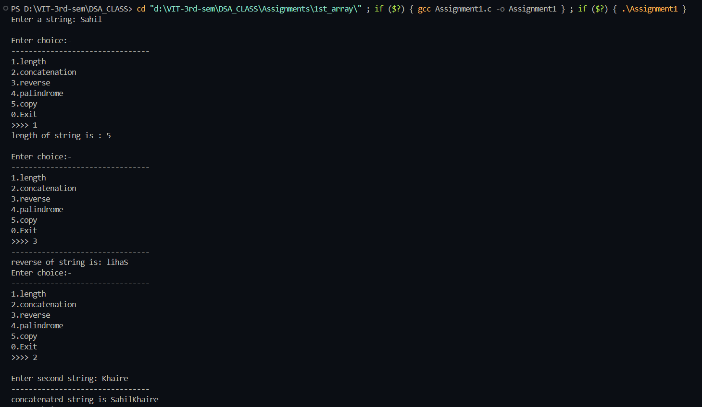

# Practical File – String Operations in C

**Name:** Sahil Ashok Khaire  
**Roll No.:** 13 
**Title:** String Operations (Length, Concatenation, Reverse, Palindrome, Copy) without using `<string.h>`

## Theory

A **string** in C is a sequence of characters terminated by a **null character (`\0`)**.  
In this program, we perform basic string operations **manually** without using predefined library functions from `<string.h>`.

### Operations Implemented:
1. **Length of string** → counts number of characters until `\0`.  
2. **Concatenation** → joins two strings.  
3. **Reverse** → prints the string in reverse order.  
4. **Palindrome check** → compares string with its reverse.  
5. **Copy** → copies one string into another.

## Algorithm

### 1. Length of String
1. Initialize `counter = 0`.  
2. Traverse string until `\0`.  
3. Increment counter.  
4. Return counter.

### 2. Concatenation
1. Find length of `str1`.  
2. Append each character of `str2` at the end of `str1`.  
3. Add `\0` at the end.

### 3. Reverse
1. Find length of string.  
2. Print characters from last index to first index.

### 4. Palindrome
1. Copy string into reverse order in another array.  
2. Compare each character of original and reverse.  
3. If all match → Palindrome. Otherwise, not Palindrome.

### 5. Copy
1. Traverse original string.  
2. Copy each character into new string.  
3. Add `\0` at the end.


**Code** :
      
```c
#include<stdio.h>

int lengthstr_sak(char str_sak[]) {
    int counter_sak = 0;
    for(int i_sak = 0; str_sak[i_sak] != '\0'; i_sak++) {
        counter_sak++;
    }
    return counter_sak;
}

void concatination_sak(char str1_sak[], char str2_sak[]) {
    int l1_sak = lengthstr_sak(str1_sak);
    int i_sak = 0, j_sak = 0;
    while(str2_sak[j_sak] != '\0') {
        str1_sak[l1_sak + i_sak] = str2_sak[j_sak];
        i_sak++;
        j_sak++;
    }
    str1_sak[l1_sak + i_sak] = '\0';
    printf("--------------------------------\n");
    printf("concatenated string is %s", str1_sak);
}

void reverse_sak(char str_sak[]) {
    int l_sak = lengthstr_sak(str_sak);
    printf("--------------------------------\n");
    printf("reverse of string is: ");
    for(int i_sak = l_sak - 1; i_sak >= 0; i_sak--) {
        printf("%c", str_sak[i_sak]);
    }
}

void palindrome_sak(char str_sak[]) {
    int i_sak = 0, k_sak = 0;
    char rev_sak[100];
    int j_sak = 0;
    int l_sak = lengthstr_sak(str_sak);

    for(int i_sak2 = l_sak - 1; i_sak2 >= 0; i_sak2--) {
        rev_sak[j_sak] = str_sak[i_sak2];
        j_sak++;
    }
    rev_sak[j_sak] = '\0';

    int flag_sak = 1;
    while(str_sak[i_sak] != '\0' && rev_sak[k_sak] != '\0') {
        if(str_sak[i_sak] != rev_sak[k_sak]) {
            flag_sak = 0;
        }
        i_sak++;
        k_sak++;
    }

    printf("--------------------------------\n");
    if(flag_sak == 1) {
        printf("string is palindrome");
    } else {
        printf("string is not palindrome");
    }
}

void copy_sak(char str_sak[]) {
    char str3_sak[100];
    int i_sak = 0;
    while(str_sak[i_sak] != '\0') {
        str3_sak[i_sak] = str_sak[i_sak];
        i_sak++;
    }
    str3_sak[i_sak] = '\0';
    printf("--------------------------------\n");
    printf("copied string is %s", str3_sak);
}

int main() {
    char str1_sak[100];
    char str2_sak[100];
    int l_sak, ch_sak;

    printf("Enter a string: ");
    scanf("%s", str1_sak);

    do {
        printf("\nEnter choice:-\n");
        printf("--------------------------------\n");
        printf("1.length\n2.concatenation\n3.reverse\n4.palindrome\n5.copy\n0.Exit\n>>>> ");
        scanf("%d", &ch_sak);

        switch(ch_sak) {
            case 1:
                l_sak = lengthstr_sak(str1_sak);
                printf("length of string is : %d\n", l_sak);
                break;
            case 2:
                printf("\nEnter second string: ");
                scanf("%s", str2_sak);
                concatination_sak(str1_sak, str2_sak);
                break;
            case 3:
                reverse_sak(str1_sak);
                break;
            case 4:
                palindrome_sak(str1_sak);
                break;
            case 5:
                copy_sak(str1_sak);
                break;
            case 0:
                printf("Exiting program...\n");
                break;
            default:
                printf("invalid choice\n");
                break;
        }
    } while(ch_sak != 0);

    return 0;
}

```
## Output

