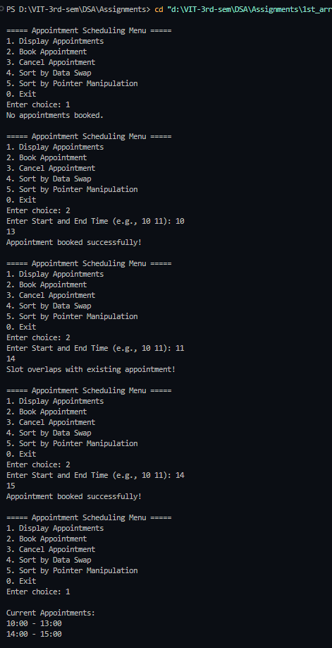

# Practical File – Appointment Scheduling System  

**Name:** Sahil Ashok Khaire  
**Roll No.:** 13  
**Title:** Appointment Scheduling System using Singly Linked List  

---

## Theory  

An **Appointment Scheduling System** can be implemented using a **Singly Linked List**, where:  
- Each node represents an appointment.  
- Each appointment contains:  
  - **Start Time**  
  - **End Time**  
  - **Duration**  
- The system ensures that appointments are booked within a valid duration range and no two appointments overlap.  

This system manages daily appointments by displaying available slots, allowing users to book or cancel appointments, and sort them by time.

---

## Operations  

1. **Display Available Time Slots**  
   - Traverse the list and show all unbooked time ranges within working hours.  

2. **Book Appointment**  
   - User enters start and end time.  
   - If the slot is free and within allowed limits, it is added to the list.  

3. **Cancel Appointment**  
   - User enters the time to cancel.  
   - The system verifies existence and deletes that appointment node.  

4. **Sort Appointments by Time (Data Swapping)**  
   - Sort the list using bubble sort based on start time by swapping node data.  

5. **Sort Appointments by Time (Pointer Manipulation)**  
   - Sort the linked list using pointer rearrangement instead of swapping data.  

---

## Algorithm  

### 1. Initialization  
1. Define working hours (e.g., 9:00 AM to 5:00 PM).  
2. Define minimum and maximum appointment duration (e.g., 30 to 120 minutes).  

### 2. Display Available Slots  
1. Traverse the list of appointments.  
2. Compare end time of each booked slot with start time of the next slot to find gaps.  

### 3. Book Appointment  
1. Input start and end time.  
2. Check if it overlaps with any existing appointment.  
3. If not, create a new node and insert in sorted order.  

### 4. Cancel Appointment  
1. Search for the appointment node with the given start time.  
2. Delete the node if found, else display “Appointment not found”.  

### 5. Sort Appointments (Pointer Manipulation)  
1. Use two-pointer approach.  
2. Rearrange the `next` pointers to reflect sorted order without changing the node data.  

---

## Code  

```cpp
#include <iostream>
#include <cstdlib>
using namespace std;

struct Appointment {
    int start, end;
    Appointment* next;
};

Appointment* head = NULL;

Appointment* createAppointment(int s, int e) {
    Appointment* newnode = new Appointment;
    newnode->start = s;
    newnode->end = e;
    newnode->next = NULL;
    return newnode;
}

bool isOverlap(int s, int e) {
    Appointment* temp = head;
    while (temp) {
        if (!(e <= temp->start || s >= temp->end)) return true;
        temp = temp->next;
    }
    return false;
}

void bookAppointment(int s, int e) {
    if (s < 9 || e > 17 || e <= s) {
        cout << "Invalid timing! (Working hours: 9-17)\n";
        return;
    }
    if (isOverlap(s, e)) {
        cout << "Slot overlaps with existing appointment!\n";
        return;
    }

    Appointment* newnode = createAppointment(s, e);
    if (!head || s < head->start) {
        newnode->next = head;
        head = newnode;
    } else {
        Appointment* temp = head;
        while (temp->next && temp->next->start < s)
            temp = temp->next;
        newnode->next = temp->next;
        temp->next = newnode;
    }
    cout << "Appointment booked successfully!\n";
}

void cancelAppointment(int s) {
    if (!head) {
        cout << "No appointments to cancel.\n";
        return;
    }
    Appointment* temp = head;
    Appointment* prev = NULL;
    while (temp && temp->start != s) {
        prev = temp;
        temp = temp->next;
    }
    if (!temp) {
        cout << "Appointment not found!\n";
        return;
    }
    if (!prev) head = temp->next;
    else prev->next = temp->next;
    delete temp;
    cout << "Appointment cancelled successfully!\n";
}

void displayAppointments() {
    if (!head) {
        cout << "No appointments booked.\n";
        return;
    }
    Appointment* temp = head;
    cout << "\nCurrent Appointments:\n";
    while (temp) {
        cout << temp->start << ":00 - " << temp->end << ":00\n";
        temp = temp->next;
    }
}

void sortByDataSwap() {
    if (!head) return;
    for (Appointment* i = head; i->next; i = i->next) {
        for (Appointment* j = i->next; j; j = j->next) {
            if (i->start > j->start) {
                swap(i->start, j->start);
                swap(i->end, j->end);
            }
        }
    }
    cout << "Appointments sorted by data swapping!\n";
}

void sortByPointerManipulation() {
    if (!head || !head->next) return;
    Appointment* sorted = NULL;

    while (head) {
        Appointment* curr = head;
        head = head->next;

        if (!sorted || curr->start < sorted->start) {
            curr->next = sorted;
            sorted = curr;
        } else {
            Appointment* temp = sorted;
            while (temp->next && temp->next->start < curr->start)
                temp = temp->next;
            curr->next = temp->next;
            temp->next = curr;
        }
    }
    head = sorted;
    cout << "Appointments sorted by pointer manipulation!\n";
}

int main() {
    int choice, s, e;
    while (true) {
        cout << "\n===== Appointment Scheduling Menu =====\n";
        cout << "1. Display Appointments\n";
        cout << "2. Book Appointment\n";
        cout << "3. Cancel Appointment\n";
        cout << "4. Sort by Data Swap\n";
        cout << "5. Sort by Pointer Manipulation\n";
        cout << "0. Exit\n";
        cout << "Enter choice: ";
        cin >> choice;
        switch (choice) {
            case 1: displayAppointments(); break;
            case 2:
                cout << "Enter Start and End Time (e.g., 10 11): ";
                cin >> s >> e;
                bookAppointment(s, e);
                break;
            case 3:
                cout << "Enter Start Time to Cancel: ";
                cin >> s;
                cancelAppointment(s);
                break;
            case 4: sortByDataSwap(); break;
            case 5: sortByPointerManipulation(); break;
            case 0: exit(0);
            default: cout << "Invalid choice!\n";
        }
    }
    return 0;
}
```

## Output
