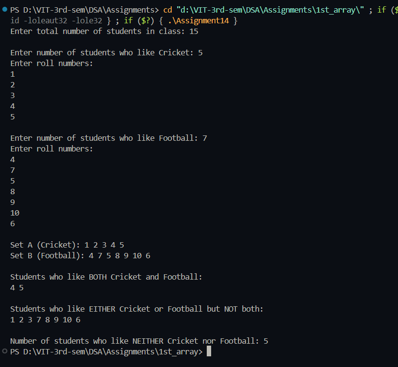

# Practical File – Sports Preference Management System  

**Name:** Sahil Ashok Khaire  
**Roll No.:** 13  
**Title:** Set Operations using Linked List (Cricket & Football Preferences)  

---

## Theory  

A **Set** is a collection of unique elements.  
In this program, we use **Singly Linked Lists** to represent two sets of students:  
- **Set A** → Students who like *Cricket*  
- **Set B** → Students who like *Football*  

We perform common **set operations** using linked lists to find:  
- Students who like **both** sports (Intersection).  
- Students who like **either Cricket or Football but not both** (Symmetric Difference).  
- Students who like **neither** sport (Complement).  

---

## Operations  

1. **Display Students who like both Cricket and Football**  
   - Perform **Intersection (A ∩ B)** of two linked lists.  

2. **Display Students who like either Cricket or Football but not both**  
   - Perform **Symmetric Difference (A ⊕ B)** of two linked lists.  

3. **Display Number of Students who like neither Cricket nor Football**  
   - Total Students – (Students in A ∪ B).  

---

## Algorithm  

### 1. Create Linked Lists for Set A and Set B  
- Each node contains the student’s roll number.  
- Append nodes for each student in both sets.  

### 2. Intersection (A ∩ B)  
1. Traverse both lists.  
2. For each node in A, check if it exists in B.  
3. If yes, add it to the new list representing intersection.  

### 3. Symmetric Difference (A ⊕ B)  
1. Traverse both lists.  
2. Add elements present in A but not in B, and vice versa.  

### 4. Students who like neither  
1. Input total number of students.  
2. Count nodes in union (A ∪ B).  
3. Subtract from total students to get number who like neither.  

---

## Code  

```cpp
#include <iostream>
using namespace std;

struct Node_sak {
    int data_sak;
    Node_sak* next_sak;
};

Node_sak* insert_sak(Node_sak* head_sak, int val_sak) {
    Node_sak* newnode_sak = new Node_sak;
    newnode_sak->data_sak = val_sak;
    newnode_sak->next_sak = NULL;

    if (!head_sak)
        return newnode_sak;
    Node_sak* temp_sak = head_sak;
    while (temp_sak->next_sak)
        temp_sak = temp_sak->next_sak;
    temp_sak->next_sak = newnode_sak;
    return head_sak;
}

bool search_sak(Node_sak* head_sak, int val_sak) {
    Node_sak* temp_sak = head_sak;
    while (temp_sak) {
        if (temp_sak->data_sak == val_sak)
            return true;
        temp_sak = temp_sak->next_sak;
    }
    return false;
}

void display_sak(Node_sak* head_sak) {
    Node_sak* temp_sak = head_sak;
    while (temp_sak) {
        cout << temp_sak->data_sak << " ";
        temp_sak = temp_sak->next_sak;
    }
    cout << endl;
}

Node_sak* intersection_sak(Node_sak* A_sak, Node_sak* B_sak) {
    Node_sak* result_sak = NULL;
    Node_sak* temp_sak = A_sak;
    while (temp_sak) {
        if (search_sak(B_sak, temp_sak->data_sak))
            result_sak = insert_sak(result_sak, temp_sak->data_sak);
        temp_sak = temp_sak->next_sak;
    }
    return result_sak;
}

Node_sak* unionSet_sak(Node_sak* A_sak, Node_sak* B_sak) {
    Node_sak* result_sak = NULL;
    Node_sak* temp_sak = A_sak;
    while (temp_sak) {
        result_sak = insert_sak(result_sak, temp_sak->data_sak);
        temp_sak = temp_sak->next_sak;
    }
    temp_sak = B_sak;
    while (temp_sak) {
        if (!search_sak(result_sak, temp_sak->data_sak))
            result_sak = insert_sak(result_sak, temp_sak->data_sak);
        temp_sak = temp_sak->next_sak;
    }
    return result_sak;
}

Node_sak* symmetricDiff_sak(Node_sak* A_sak, Node_sak* B_sak) {
    Node_sak* result_sak = NULL;
    Node_sak* temp_sak = A_sak;
    while (temp_sak) {
        if (!search_sak(B_sak, temp_sak->data_sak))
            result_sak = insert_sak(result_sak, temp_sak->data_sak);
        temp_sak = temp_sak->next_sak;
    }
    temp_sak = B_sak;
    while (temp_sak) {
        if (!search_sak(A_sak, temp_sak->data_sak))
            result_sak = insert_sak(result_sak, temp_sak->data_sak);
        temp_sak = temp_sak->next_sak;
    }
    return result_sak;
}

int countNodes_sak(Node_sak* head_sak) {
    int count_sak = 0;
    Node_sak* temp_sak = head_sak;
    while (temp_sak) {
        count_sak++;
        temp_sak = temp_sak->next_sak;
    }
    return count_sak;
}

int main() {
    Node_sak *A_sak = NULL, *B_sak = NULL;
    int n1_sak, n2_sak, total_sak, val_sak;

    cout << "Enter total number of students in class: ";
    cin >> total_sak;

    cout << "\nEnter number of students who like Cricket: ";
    cin >> n1_sak;
    cout << "Enter roll numbers:\n";
    for (int i_sak = 0; i_sak < n1_sak; i_sak++) {
        cin >> val_sak;
        A_sak = insert_sak(A_sak, val_sak);
    }

    cout << "\nEnter number of students who like Football: ";
    cin >> n2_sak;
    cout << "Enter roll numbers:\n";
    for (int i_sak = 0; i_sak < n2_sak; i_sak++) {
        cin >> val_sak;
        B_sak = insert_sak(B_sak, val_sak);
    }

    cout << "\nSet A (Cricket): ";
    display_sak(A_sak);
    cout << "Set B (Football): ";
    display_sak(B_sak);

    Node_sak* both_sak = intersection_sak(A_sak, B_sak);
    cout << "\nStudents who like BOTH Cricket and Football:\n";
    display_sak(both_sak);

    Node_sak* either_sak = symmetricDiff_sak(A_sak, B_sak);
    cout << "\nStudents who like EITHER Cricket or Football but NOT both:\n";
    display_sak(either_sak);

    Node_sak* union_sak = unionSet_sak(A_sak, B_sak);
    int neither_sak = total_sak - countNodes_sak(union_sak);
    cout << "\nNumber of students who like NEITHER Cricket nor Football: " << neither_sak << endl;

    return 0;
}
```
## Output

