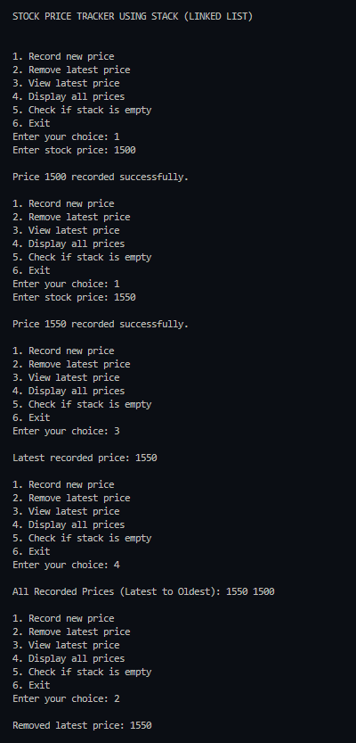

# Practical – Stock Price Tracker

**Name:** Sahil Ashok Khaire  
**Roll No.:** 13   

---

## AIM
To write a C program to build a simple Stock Price Tracker that keeps a history of daily stock prices entered by the user.  
The program should allow users to add, view, or remove the most recent price using a stack implemented with a linked list.

---

## Objectives
1. To understand the concept of Stack data structure and its operations.  
2. To implement Stack operations using a Linked List.  
3. To apply the Stack concept in a real-world example of tracking stock prices.  
4. To use dynamic memory allocation in C for node creation and deletion.

---

## Theory
A Stack is a linear data structure that follows the **LIFO (Last In First Out)** principle.  
The element inserted last is removed first.  

Common Stack operations include:
- **Push** – Insert an element at the top of the stack.  
- **Pop** – Remove the element from the top of the stack.  
- **Peek (Top)** – View the topmost element without removing it.  
- **isEmpty** – Check whether the stack is empty or not.

When implemented using a **linked list**, the stack size becomes dynamic and memory-efficient.  
Each node in the linked list contains:
- `data` – to store the stock price  
- `next` – a pointer to the next node in the stack  

---

## Operations to be Implemented

| Operation | Function | Description |
|------------|-----------|-------------|
| Record | `record_sak(price_sak)` | Add a new stock price (push operation). |
| Remove | `remove_sak()` | Remove and return the most recent stock price (pop operation). |
| Latest | `latest_sak()` | View the most recent stock price without removing it (peek operation). |
| isEmpty | `is_empty_sak()` | Check whether any prices are recorded. |

---

## Algorithm

### record_sak(price_sak)
1. Create a new node using dynamic memory.  
2. Assign `price_sak` to the node’s data field.  
3. Set `new_node_sak->next_sak = top_sak`.  
4. Update `top_sak = new_node_sak`.

### remove_sak()
1. If `top_sak == NULL`, display “No prices to remove”.  
2. Otherwise, store `top_sak->data_sak` in a variable.  
3. Move `top_sak = top_sak->next_sak`.  
4. Free the removed node.  
5. Display the removed price.

### latest_sak()
1. If `top_sak == NULL`, display “No prices recorded”.  
2. Otherwise, display `top_sak->data_sak`.

### is_empty_sak()
1. Return true if `top_sak == NULL`, otherwise return false.

---

## C Program

```c
#include <stdio.h>
#include <stdlib.h>

// Node structure definition
struct Node_sak {
    int data_sak;
    struct Node_sak* next_sak;
};

// Initialize top pointer
struct Node_sak* top_sak = NULL;

// Function to check if stack is empty
int is_empty_sak() {
    return top_sak == NULL;
}

// Function to record a new stock price (Push)
void record_sak(int price_sak) {
    struct Node_sak* new_node_sak = (struct Node_sak*)malloc(sizeof(struct Node_sak));
    if (new_node_sak == NULL) {
        printf("\nMemory allocation failed.");
        return;
    }
    new_node_sak->data_sak = price_sak;
    new_node_sak->next_sak = top_sak;
    top_sak = new_node_sak;
    printf("\nPrice %d recorded successfully.", price_sak);
}

// Function to remove latest stock price (Pop)
void remove_sak() {
    if (is_empty_sak()) {
        printf("\nNo prices to remove. Stack is empty.");
        return;
    }
    struct Node_sak* temp_sak = top_sak;
    printf("\nRemoved latest price: %d", temp_sak->data_sak);
    top_sak = top_sak->next_sak;
    free(temp_sak);
}

// Function to view latest stock price (Peek)
void latest_sak() {
    if (is_empty_sak()) {
        printf("\nNo prices recorded yet.");
        return;
    }
    printf("\nLatest recorded price: %d", top_sak->data_sak);
}

// Function to display all recorded stock prices
void display_sak() {
    if (is_empty_sak()) {
        printf("\nNo prices recorded yet.");
        return;
    }
    struct Node_sak* temp_sak = top_sak;
    printf("\nAll Recorded Prices (Latest to Oldest): ");
    while (temp_sak != NULL) {
        printf("%d ", temp_sak->data_sak);
        temp_sak = temp_sak->next_sak;
    }
}

// Main function
int main() {
    int choice_sak, price_sak;

    printf("\nSTOCK PRICE TRACKER USING STACK (LINKED LIST)\n");

    while (1) {
        printf("\n\n1. Record new price");
        printf("\n2. Remove latest price");
        printf("\n3. View latest price");
        printf("\n4. Display all prices");
        printf("\n5. Check if stack is empty");
        printf("\n6. Exit");
        printf("\nEnter your choice: ");
        scanf("%d", &choice_sak);

        switch (choice_sak) {
            case 1:
                printf("Enter stock price: ");
                scanf("%d", &price_sak);
                record_sak(price_sak);
                break;

            case 2:
                remove_sak();
                break;

            case 3:
                latest_sak();
                break;

            case 4:
                display_sak();
                break;

            case 5:
                if (is_empty_sak())
                    printf("\nStack is empty.");
                else
                    printf("\nStack is not empty.");
                break;

            case 6:
                printf("\nExiting program.");
                exit(0);

            default:
                printf("\nInvalid choice. Please try again.");
        }
    }

    return 0;
}
```

## Output

