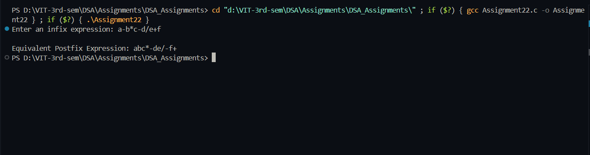

## Practical – Infix to Postfix Conversion using Stack

**Name:** Sahil Ashok Khaire  
**Roll No.:** 13   

---

## AIM
To write a C program to convert a given **infix expression** (for example, `a-b*c-d/e+f`) into its equivalent **postfix form** using the concept of **stack**, and to show the operations performed step by step.

---

## Objectives
1. To understand the concept of **expression notations** (infix, postfix, prefix).  
2. To learn how to use **stack** for converting infix expressions to postfix.  
3. To apply operator precedence and associativity rules correctly.  
4. To demonstrate the step-by-step use of push and pop operations during conversion.

---

## Theory

### Expression Notations
1. **Infix Expression** – Operator is written between operands.  
   Example: `A + B * C`  
2. **Postfix Expression (Reverse Polish Notation)** – Operator is written after operands.  
   Example: `A B C * +`  
3. **Prefix Expression (Polish Notation)** – Operator is written before operands.  
   Example: `+ A * B C`

### Advantages of Postfix Form
- No need for parentheses.  
- Easy evaluation using stack.  
- Operator precedence and associativity are handled naturally.

### Operator Precedence and Associativity

| Operator | Precedence | Associativity |
|-----------|-------------|---------------|
| `^` | Highest | Right to Left |
| `*`, `/`, `%` | Medium | Left to Right |
| `+`, `-` | Lowest | Left to Right |

---

## Algorithm: Infix to Postfix Conversion

1. **Initialize** an empty stack for operators.  
2. **Scan** the infix expression from left to right.  
3. **If the symbol is an operand**, add it directly to the postfix expression.  
4. **If the symbol is an opening parenthesis `(`**, push it onto the stack.  
5. **If the symbol is a closing parenthesis `)`**, pop operators from the stack and add them to the postfix expression until an opening parenthesis is found.  
6. **If the symbol is an operator (`+`, `-`, `*`, `/`, `^`)**:  
   - While the stack is not empty and the top of the stack has **higher or equal precedence**, pop it and add to postfix.  
   - Push the current operator onto the stack.  
7. **After scanning** the entire infix expression, pop and add all remaining operators to postfix.  
8. **Display** the final postfix expression.

---

## Step-by-Step Example  
Convert `a-b*c-d/e+f` to postfix:

| Step | Symbol | Stack | Postfix Expression |
|------|---------|--------|-------------------|
| 1 | a |  | a |
| 2 | - | - | a |
| 3 | b | - | ab |
| 4 | * | - * | ab |
| 5 | c | - * | abc |
| 6 | * popped (higher precedence) | - | abc* |
| 7 | - remains | - | abc*- |
| 8 | d | - | abc*-d |
| 9 | / | - / | abc*-d |
| 10 | e | - / | abc*-de |
| 11 | / popped | - | abc*-de/ |
| 12 | - popped |  | abc*-de/- |
| 13 | + | + | abc*-de/- |
| 14 | f | + | abc*-de/-f |
| 15 | + popped |  | abc*-de/-f+ |

**Final Postfix Expression:**  
`abc*-de/-f+`

---

## C Program

```c
#include <stdio.h>
#include <ctype.h>
#include <stdlib.h>

#define SIZE_SAK 50

// Stack structure
struct Stack_sak {
    char arr_sak[SIZE_SAK];
    int top_sak;
};

// Initialize stack
void init_stack_sak(struct Stack_sak *stack_sak) {
    stack_sak->top_sak = -1;
}

// Check if stack is empty
int is_empty_sak(struct Stack_sak *stack_sak) {
    return stack_sak->top_sak == -1;
}

// Push an element to stack
void push_sak(struct Stack_sak *stack_sak, char item_sak) {
    if (stack_sak->top_sak == SIZE_SAK - 1) {
        printf("\nStack overflow.");
        return;
    }
    stack_sak->arr_sak[++stack_sak->top_sak] = item_sak;
}

// Pop an element from stack
char pop_sak(struct Stack_sak *stack_sak) {
    if (is_empty_sak(stack_sak)) {
        return '\0';
    }
    return stack_sak->arr_sak[stack_sak->top_sak--];
}

// Peek top of stack
char peek_sak(struct Stack_sak *stack_sak) {
    if (is_empty_sak(stack_sak))
        return '\0';
    return stack_sak->arr_sak[stack_sak->top_sak];
}

// Function to check operator precedence
int precedence_sak(char op_sak) {
    switch (op_sak) {
        case '^': return 3;
        case '*':
        case '/':
        case '%': return 2;
        case '+':
        case '-': return 1;
        default: return 0;
    }
}

// Function to convert infix to postfix
void infix_to_postfix_sak(char infix_sak[], char postfix_sak[]) {
    struct Stack_sak stack_sak;
    init_stack_sak(&stack_sak);
    int i_sak = 0, j_sak = 0;
    char ch_sak;

    while ((ch_sak = infix_sak[i_sak++]) != '\0') {
        if (isalnum(ch_sak)) {
            postfix_sak[j_sak++] = ch_sak;
        }
        else if (ch_sak == '(') {
            push_sak(&stack_sak, ch_sak);
        }
        else if (ch_sak == ')') {
            while (!is_empty_sak(&stack_sak) && peek_sak(&stack_sak) != '(')
                postfix_sak[j_sak++] = pop_sak(&stack_sak);
            pop_sak(&stack_sak); // remove '('
        }
        else { // operator
            while (!is_empty_sak(&stack_sak) && precedence_sak(peek_sak(&stack_sak)) >= precedence_sak(ch_sak))
                postfix_sak[j_sak++] = pop_sak(&stack_sak);
            push_sak(&stack_sak, ch_sak);
        }
    }

    while (!is_empty_sak(&stack_sak))
        postfix_sak[j_sak++] = pop_sak(&stack_sak);

    postfix_sak[j_sak] = '\0';
}

int main() {
    char infix_sak[SIZE_SAK], postfix_sak[SIZE_SAK];

    printf("Enter an infix expression: ");
    scanf("%s", infix_sak);

    infix_to_postfix_sak(infix_sak, postfix_sak);

    printf("\nEquivalent Postfix Expression: %s\n", postfix_sak);

    return 0;
}
```
## Output
