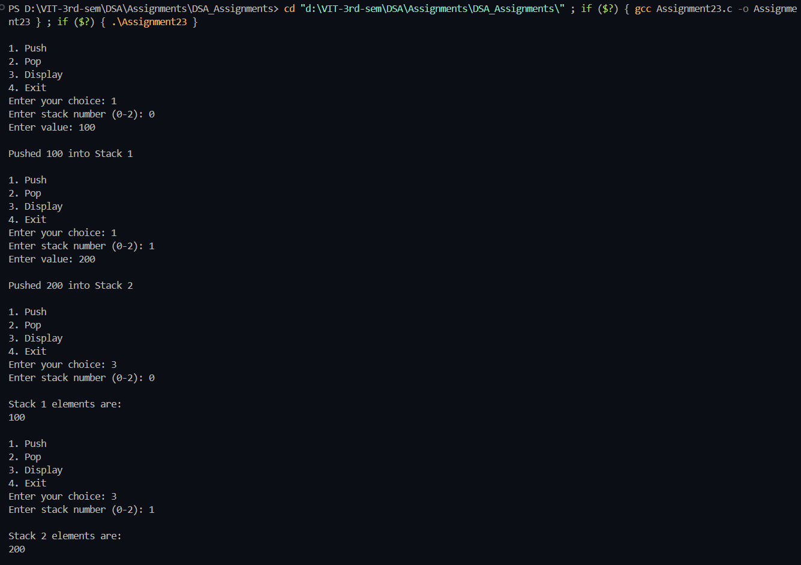
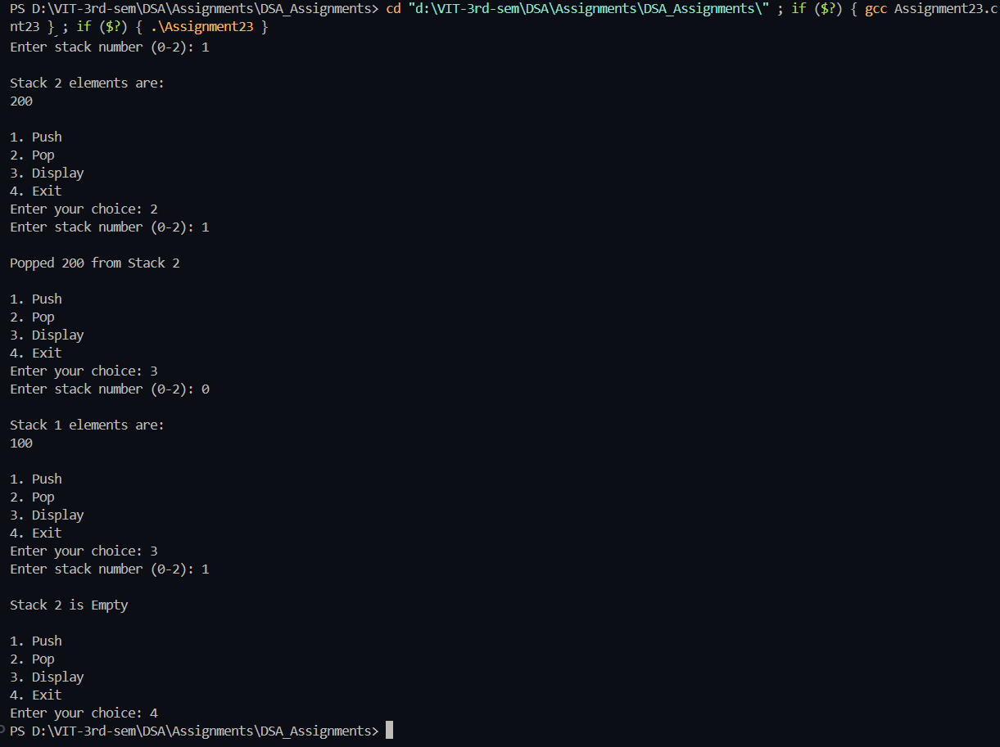

# Perform stack operations on multiple stacks

**Name:** Sahil Ashok Khaire  
**Roll No.:** 13   

---

## AIM
To write a program to implement multiple stacks (more than two) using a single array and perform the following operations:  
A. Push  
B. Pop  
C. Stack Overflow  
D. Stack Underflow  
E. Display

---

## THEORY
A stack is a linear data structure that follows the LIFO (Last In First Out) principle.  
In some situations, we need to maintain more than one stack in a single memory area.  
Instead of creating separate arrays, we can divide a single array into equal parts and assign each part to a different stack.  
Each stack has its own top pointer, which keeps track of the last inserted element.  

This approach saves memory and allows efficient stack operations within a single array structure.

---

## ALGORITHM

## Initialization
1. Start the program.  
2. Declare an array `stack_sak[MAX_SAK]` to store all elements of multiple stacks.  
3. Set `n_sak` as the number of stacks.  
4. Calculate `size_sak = MAX_SAK / n_sak`.  
5. Initialize `top_sak[n_sak]` with `-1` to represent empty stacks.

---

## push_sak(stk_no_sak, val_sak)
1. Calculate the maximum index allowed for the given stack:  
   `limit_sak = (stk_no_sak + 1) * size_sak - 1`
2. If `top_sak[stk_no_sak] == limit_sak`, display "Stack Overflow".  
3. Otherwise, increment `top_sak[stk_no_sak]` by 1.  
4. Insert `val_sak` into `stack_sak[top_sak[stk_no_sak]]`.  
5. Print a message indicating successful insertion.

---

## pop_sak(stk_no_sak)
1. Calculate the starting index for the given stack:  
   `start_sak = stk_no_sak * size_sak`
2. If `top_sak[stk_no_sak] < start_sak` or `top_sak[stk_no_sak] == -1`, display "Stack Underflow".  
3. Otherwise, remove the element from `stack_sak[top_sak[stk_no_sak]]`.  
4. Decrement `top_sak[stk_no_sak]` by 1.  
5. Print the popped element.

---

## display_sak(stk_no_sak)
1. Calculate the starting index for the given stack:  
   `start_sak = stk_no_sak * size_sak`
2. If `top_sak[stk_no_sak] < start_sak` or `top_sak[stk_no_sak] == -1`, display "Stack is Empty".  
3. Otherwise, print all elements from `start_sak` to `top_sak[stk_no_sak]`.

---

## PROGRAM (C Language)

```c
#include <stdio.h>
#define MAX_SAK 30
#define NUM_STACKS_SAK 3

int stack_sak[MAX_SAK];
int top_sak[NUM_STACKS_SAK];
int size_sak;

void initialize_sak() {
    for (int i = 0; i < NUM_STACKS_SAK; i++) {
        top_sak[i] = -1;
    }
    size_sak = MAX_SAK / NUM_STACKS_SAK;
}

void push_sak(int stk_no_sak, int val_sak) {
    int base_sak = stk_no_sak * size_sak;
    if (top_sak[stk_no_sak] == size_sak - 1) {
        printf("\nStack Overflow in Stack %d\n", stk_no_sak + 1);
        return;
    }
    top_sak[stk_no_sak]++;
    stack_sak[base_sak + top_sak[stk_no_sak]] = val_sak;
    printf("\nPushed %d into Stack %d\n", val_sak, stk_no_sak + 1);
}

void pop_sak(int stk_no_sak) {
    int base_sak = stk_no_sak * size_sak;
    if (top_sak[stk_no_sak] == -1) {
        printf("\nStack Underflow in Stack %d\n", stk_no_sak + 1);
        return;
    }
    int val_sak = stack_sak[base_sak + top_sak[stk_no_sak]];
    top_sak[stk_no_sak]--;
    printf("\nPopped %d from Stack %d\n", val_sak, stk_no_sak + 1);
}

void display_sak(int stk_no_sak) {
    int base_sak = stk_no_sak * size_sak;
    if (top_sak[stk_no_sak] == -1) {
        printf("\nStack %d is Empty\n", stk_no_sak + 1);
        return;
    }
    printf("\nStack %d elements are:\n", stk_no_sak + 1);
    for (int i = 0; i <= top_sak[stk_no_sak]; i++) {
        printf("%d ", stack_sak[base_sak + i]);
    }
    printf("\n");
}

int main() {
    int choice_sak, stk_no_sak, val_sak;
    initialize_sak();

    while (1) {
        printf("\n1. Push\n2. Pop\n3. Display\n4. Exit\n");
        printf("Enter your choice: ");
        scanf("%d", &choice_sak);

        switch (choice_sak) {
            case 1:
                printf("Enter stack number (0-%d): ", NUM_STACKS_SAK - 1);
                scanf("%d", &stk_no_sak);
                if (stk_no_sak < 0 || stk_no_sak >= NUM_STACKS_SAK) {
                    printf("Invalid stack number.\n");
                    break;
                }
                printf("Enter value: ");
                scanf("%d", &val_sak);
                push_sak(stk_no_sak, val_sak);
                break;

            case 2:
                printf("Enter stack number (0-%d): ", NUM_STACKS_SAK - 1);
                scanf("%d", &stk_no_sak);
                if (stk_no_sak < 0 || stk_no_sak >= NUM_STACKS_SAK) {
                    printf("Invalid stack number.\n");
                    break;
                }
                pop_sak(stk_no_sak);
                break;

            case 3:
                printf("Enter stack number (0-%d): ", NUM_STACKS_SAK - 1);
                scanf("%d", &stk_no_sak);
                if (stk_no_sak < 0 || stk_no_sak >= NUM_STACKS_SAK) {
                    printf("Invalid stack number.\n");
                    break;
                }
                display_sak(stk_no_sak);
                break;

            case 4:
                return 0;

            default:
                printf("Invalid Choice\n");
        }
    }
}

```

## Output

