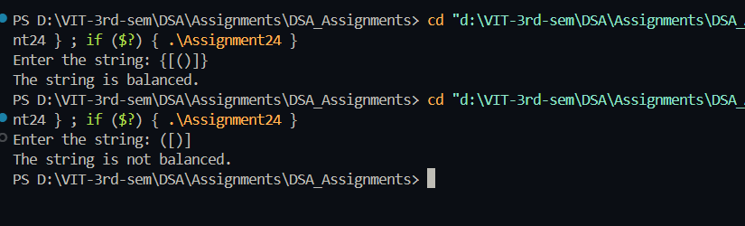

# string containing parentheses characters is balanced or not

**Name:** Sahil Ashok Khaire  
**Roll No.:** 13   

---

## AIM
To write a program to check whether a string containing parentheses characters is balanced or not using a stack.

---
## THEORY
A string of parentheses is considered **balanced** if every opening bracket has a corresponding closing bracket of the same type and the brackets are closed in the correct order.  

For example:  
- Balanced: `()`, `([])`, `{[()]}`
- Not balanced: `(`, `([)]`, `{[()}`

A **stack** is used to solve this problem because it follows **LIFO (Last In First Out)**.  
- When an opening bracket is encountered, it is pushed onto the stack.  
- When a closing bracket is encountered, the stack is popped and checked for a match.  
- At the end, if the stack is empty, the string is balanced; otherwise, it is not.

---

## ALGORITHM
1. Start the program.  
2. Initialize an empty stack `stack_sak` and a `top_sak` variable as `-1`.  
3. Read the input string `str_sak`.  
4. For each character `ch_sak` in `str_sak`:  
   - If `ch_sak` is an opening bracket `(`, `{`, `[`, push it onto the stack.  
   - If `ch_sak` is a closing bracket `)`, `}`, `]`:  
     - If the stack is empty, the string is **not balanced**.  
     - Else, pop the top element and check if it matches the closing bracket type.  
       - If it does not match, the string is **not balanced**.  
5. After processing all characters:  
   - If the stack is empty, the string is **balanced**.  
   - If the stack is not empty, the string is **not balanced**.  

---

## PROGRAM (C Language)
```c
#include <stdio.h>
#include <string.h>

#define MAX_SAK 100

char stack_sak[MAX_SAK];
int top_sak = -1;

void push_sak(char ch_sak) {
    if (top_sak < MAX_SAK - 1) {
        stack_sak[++top_sak] = ch_sak;
    }
}

char pop_sak() {
    if (top_sak == -1) return '\0';
    return stack_sak[top_sak--];
}

int isBalanced_sak(char str_sak[]) {
    top_sak = -1;
    for (int i_sak = 0; str_sak[i_sak] != '\0'; i_sak++) {
        char ch_sak = str_sak[i_sak];

        if (ch_sak == '(' || ch_sak == '{' || ch_sak == '[') {
            push_sak(ch_sak);
        } else if (ch_sak == ')' || ch_sak == '}' || ch_sak == ']') {
            if (top_sak == -1) return 0;
            char top_ch_sak = pop_sak();
            if ((ch_sak == ')' && top_ch_sak != '(') ||
                (ch_sak == '}' && top_ch_sak != '{') ||
                (ch_sak == ']' && top_ch_sak != '[')) {
                return 0;
            }
        }
    }
    return top_sak == -1;
}

int main() {
    char str_sak[MAX_SAK];
    printf("Enter the string: ");
    scanf("%s", str_sak);

    if (isBalanced_sak(str_sak))
        printf("The string is balanced.\n");
    else
        printf("The string is not balanced.\n");

    return 0;
}
```

## Output
