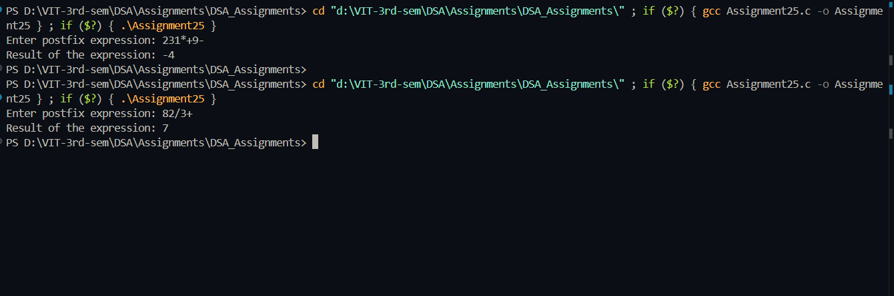

## Postfix Expression Evaluation

**Name:** Sahil Ashok Khaire  
**Roll No.:** 13  

---

# AIM
To evaluate a postfix expression containing single-digit operands and operators (+, -, *, /) using a stack.

---

## Theory
A postfix expression (Reverse Polish Notation) places operators **after** their operands.  

Example:  
- Infix: `(2 + 3) * 4` → Postfix: `23+4*`  
- Infix: `3 + 4` → Postfix: `34+`  

Stacks are ideal because of **LIFO**:  
- Push operands onto the stack.  
- Pop operands when an operator is encountered, compute, and push the result back.  
- Final result remains on the stack.

---

## Algorithm
1. Initialize an empty stack `stack_sak` and `top_sak = -1`.  
2. Read the postfix expression `expr_sak`.  
3. For each character `ch_sak` in `expr_sak`:  
   - If it is a digit, push its integer value onto the stack.  
   - If it is an operator:  
     - Pop two operands `val2_sak` and `val1_sak`.  
     - Compute `val1_sak operator val2_sak`.  
     - Push the result back.  
4. After processing all characters, pop and display the final result.

---

## Program (C Language)
```c
#include <stdio.h>
#include <ctype.h>

#define MAX_SAK 100

int stack_sak[MAX_SAK];
int top_sak = -1;

void push_sak(int val_sak) {
    stack_sak[++top_sak] = val_sak;
}

int pop_sak() {
    return stack_sak[top_sak--];
}

int evaluatePostfix_sak(char expr_sak[]) {
    top_sak = -1;
    for (int i_sak = 0; expr_sak[i_sak] != '\0'; i_sak++) {
        char ch_sak = expr_sak[i_sak];

        if (isdigit(ch_sak)) {
            push_sak(ch_sak - '0');
        } else {
            int val2_sak = pop_sak();
            int val1_sak = pop_sak();
            int res_sak;

            switch (ch_sak) {
                case '+': res_sak = val1_sak + val2_sak; break;
                case '-': res_sak = val1_sak - val2_sak; break;
                case '*': res_sak = val1_sak * val2_sak; break;
                case '/': res_sak = val1_sak / val2_sak; break;
            }
            push_sak(res_sak);
        }
    }
    return pop_sak();
}

int main() {
    char expr_sak[MAX_SAK];
    printf("Enter postfix expression: ");
    scanf("%s", expr_sak);

    int result_sak = evaluatePostfix_sak(expr_sak);
    printf("Result of the expression: %d\n", result_sak);

    return 0;
}
```

## Output
