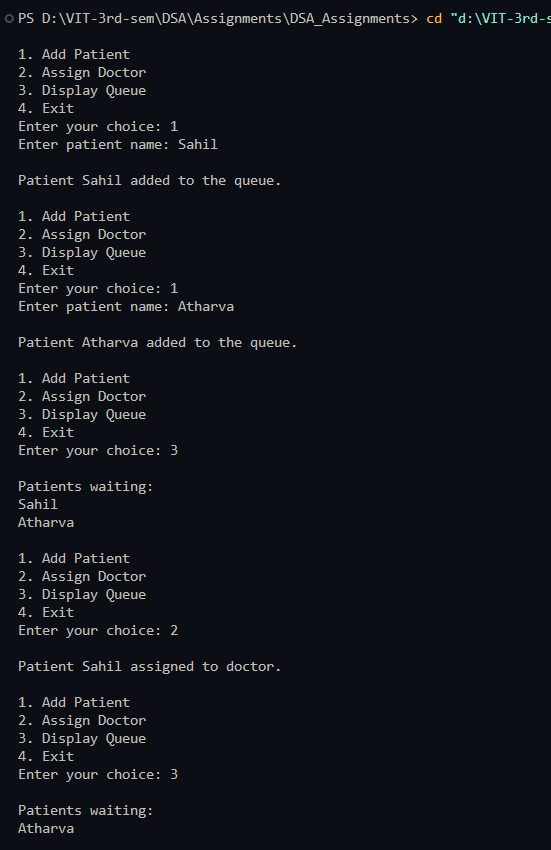

# Patient Tracking System

**Name:** Sahil Ashok Khaire  
**Roll No.:** 13  

---

## AIM
To write a program to track patients in a medical clinic, assigning them to doctors on a first-come, first-served basis using a queue.

---

## Theory
A **queue** is a linear data structure that follows **FIFO (First In First Out)**.  
In a medical clinic, patients are served in the order they arrive.  
Using a queue ensures that the first patient who checks in is assigned to a doctor first.  

Operations on a queue:  
- **Enqueue:** Add a patient to the rear of the queue.  
- **Dequeue:** Remove the patient from the front of the queue when assigned to a doctor.  
- **Display:** Show the current list of waiting patients.  

---

## Algorithm
1. Initialize an empty queue `queue_sak` with `front_sak = -1` and `rear_sak = -1`.  
2. Read the action from the user: Add patient, Assign doctor, Display queue, or Exit.  
3. **Add patient:**  
   - If queue is full, display "Queue Overflow".  
   - Else, increment `rear_sak` and add `patient_sak` to `queue_sak[rear_sak]`.  
   - If `front_sak == -1`, set `front_sak = 0`.  
4. **Assign doctor (Dequeue):**  
   - If queue is empty, display "No patients waiting".  
   - Else, remove the patient at `queue_sak[front_sak]` and increment `front_sak`.  
   - If `front_sak > rear_sak`, reset both to `-1`.  
5. **Display queue:**  
   - Print all patients from `front_sak` to `rear_sak`.  
6. Repeat until user chooses Exit.

---

## Program (C Language)
```c
#include <stdio.h>
#include <string.h>

#define MAX_SAK 50

char queue_sak[MAX_SAK][50];
int front_sak = -1;
int rear_sak = -1;

void enqueue_sak(char patient_sak[]) {
    if (rear_sak == MAX_SAK - 1) {
        printf("\nQueue Overflow. Cannot add patient.\n");
        return;
    }
    rear_sak++;
    strcpy(queue_sak[rear_sak], patient_sak);
    if (front_sak == -1) front_sak = 0;
    printf("\nPatient %s added to the queue.\n", patient_sak);
}

void dequeue_sak() {
    if (front_sak == -1 || front_sak > rear_sak) {
        printf("\nNo patients waiting.\n");
        return;
    }
    printf("\nPatient %s assigned to doctor.\n", queue_sak[front_sak]);
    front_sak++;
    if (front_sak > rear_sak) front_sak = rear_sak = -1;
}

void display_sak() {
    if (front_sak == -1) {
        printf("\nNo patients in queue.\n");
        return;
    }
    printf("\nPatients waiting:\n");
    for (int i_sak = front_sak; i_sak <= rear_sak; i_sak++) {
        printf("%s\n", queue_sak[i_sak]);
    }
}

int main() {
    int choice_sak;
    char patient_sak[50];

    while (1) {
        printf("\n1. Add Patient\n2. Assign Doctor\n3. Display Queue\n4. Exit\n");
        printf("Enter your choice: ");
        scanf("%d", &choice_sak);
        getchar(); // clear newline

        switch (choice_sak) {
            case 1:
                printf("Enter patient name: ");
                fgets(patient_sak, sizeof(patient_sak), stdin);
                patient_sak[strcspn(patient_sak, "\n")] = '\0';
                enqueue_sak(patient_sak);
                break;

            case 2:
                dequeue_sak();
                break;

            case 3:
                display_sak();
                break;

            case 4:
                return 0;

            default:
                printf("Invalid choice.\n");
        }
    }
}
```

## Output
