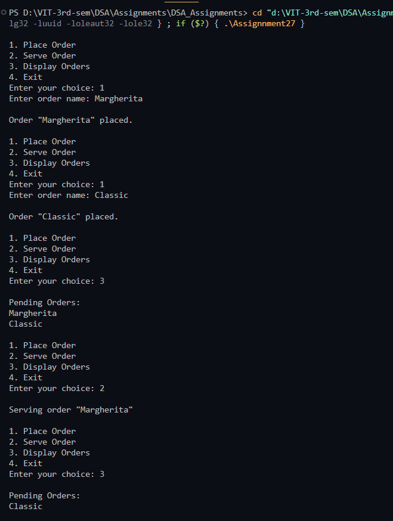

# Simulate a pizza parlour

**Name:** Sahil Ashok Khaire  
**Roll No.:** 13  

---

## AIM
To simulate a pizza parlour accepting a maximum of `n` orders, serving them on a first-come, first-served (FCFS) basis using a circular queue in C++.

---

## Theory
A **circular queue** is a linear data structure that connects the last position back to the first, efficiently utilizing available space.  
In a pizza parlour:  
- Orders are served in **FCFS** order.  
- Once an order is placed, it **cannot be canceled**.  
- Using a circular queue ensures that space is reused when orders are served and new orders are placed.

Operations:  
- **Enqueue:** Place a new order at the rear of the queue.  
- **Dequeue:** Serve the order at the front of the queue.  
- **Display:** Show all pending orders.

---

## Algorithm
1. Initialize circular queue `queue_sak[]` of size `n_sak` with `front_sak = -1` and `rear_sak = -1`.  
2. Read the user choice: Place Order, Serve Order, Display Orders, or Exit.  
3. **Place Order (Enqueue):**  
   - If `(rear_sak + 1) % n_sak == front_sak`, display "Queue Full".  
   - Else, increment `rear_sak = (rear_sak + 1) % n_sak` and add order.  
   - If `front_sak == -1`, set `front_sak = 0`.  
4. **Serve Order (Dequeue):**  
   - If `front_sak == -1`, display "No orders".  
   - Else, serve `queue_sak[front_sak]`.  
   - If `front_sak == rear_sak`, reset both to `-1`.  
   - Else, `front_sak = (front_sak + 1) % n_sak`.  
5. **Display Orders:**  
   - Print all orders from `front_sak` to `rear_sak` circularly.  
6. Repeat until user chooses Exit.

---

## Program (C++ Language)
```cpp
#include <iostream>
#include <string>
using namespace std;

#define MAX_SAK 5

string queue_sak[MAX_SAK];
int front_sak = -1;
int rear_sak = -1;

void enqueue_sak(string order_sak) {
    if ((rear_sak + 1) % MAX_SAK == front_sak) {
        cout << "\nOrder queue is full. Cannot place order.\n";
        return;
    }
    rear_sak = (rear_sak + 1) % MAX_SAK;
    queue_sak[rear_sak] = order_sak;
    if (front_sak == -1) front_sak = 0;
    cout << "\nOrder \"" << order_sak << "\" placed.\n";
}

void dequeue_sak() {
    if (front_sak == -1) {
        cout << "\nNo orders to serve.\n";
        return;
    }
    cout << "\nServing order \"" << queue_sak[front_sak] << "\"\n";
    if (front_sak == rear_sak) {
        front_sak = rear_sak = -1;
    } else {
        front_sak = (front_sak + 1) % MAX_SAK;
    }
}

void display_sak() {
    if (front_sak == -1) {
        cout << "\nNo pending orders.\n";
        return;
    }
    cout << "\nPending Orders:\n";
    int i_sak = front_sak;
    while (true) {
        cout << queue_sak[i_sak] << endl;
        if (i_sak == rear_sak) break;
        i_sak = (i_sak + 1) % MAX_SAK;
    }
}

int main() {
    int choice_sak;
    string order_sak;

    while (true) {
        cout << "\n1. Place Order\n2. Serve Order\n3. Display Orders\n4. Exit\n";
        cout << "Enter your choice: ";
        cin >> choice_sak;
        cin.ignore();

        switch (choice_sak) {
            case 1:
                cout << "Enter order name: ";
                getline(cin, order_sak);
                enqueue_sak(order_sak);
                break;
            case 2:
                dequeue_sak();
                break;
            case 3:
                display_sak();
                break;
            case 4:
                return 0;
            default:
                cout << "Invalid choice.\n";
        }
    }
}
```

## Output
