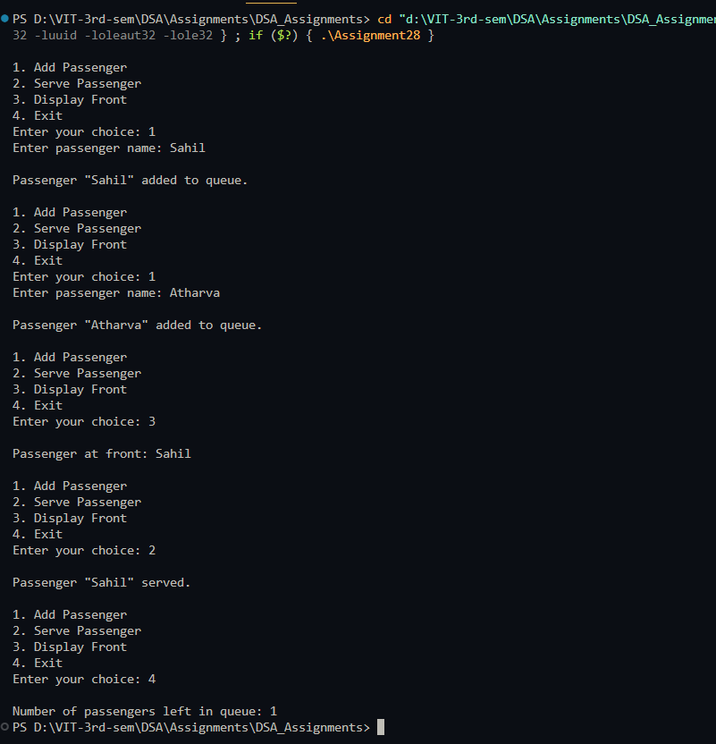

# Maintain queue of passengers

**Name:** Sahil Ashok Khaire  
**Roll No.:** 13  

---

## AIM
To write a program that maintains a queue of passengers waiting to see a ticket agent, allowing insertion, deletion, and displaying the front passenger, and showing the number of passengers left in the queue.

---

## Theory
A **queue** is a **FIFO (First In First Out)** data structure.  
In a ticket counter scenario:  
- Passengers are served in the order they arrive.  
- The program allows **inserting a new passenger**, **serving a passenger**, and **displaying the passenger at the front**.  
- The queue tracks the number of passengers remaining.

Operations:  
- **Enqueue:** Add a passenger at the rear.  
- **Dequeue:** Remove the passenger at the front.  
- **Display Front:** Show the passenger at the front without removing.  
- **Count:** Number of passengers left in the queue.

---

## Algorithm
1. Initialize an empty queue `queue_sak[]` with `front_sak = -1` and `rear_sak = -1`.  
2. Read user choice: Add Passenger, Serve Passenger, Display Front, or Exit.  
3. **Add Passenger (Enqueue):**  
   - If queue is full, display "Queue Overflow".  
   - Else, increment `rear_sak` and add passenger.  
   - If `front_sak == -1`, set `front_sak = 0`.  
4. **Serve Passenger (Dequeue):**  
   - If queue is empty, display "No passengers waiting".  
   - Else, remove passenger at `queue_sak[front_sak]`.  
   - If `front_sak > rear_sak`, reset both to `-1`.  
5. **Display Front:**  
   - Print the passenger at `queue_sak[front_sak]`.  
6. Repeat until user chooses Exit.  
7. Display number of passengers left in the queue.

---

## Program (C++ Language)
```cpp
#include <iostream>
#include <string>
using namespace std;

#define MAX_SAK 50

string queue_sak[MAX_SAK];
int front_sak = -1;
int rear_sak = -1;

void enqueue_sak(string passenger_sak) {
    if (rear_sak == MAX_SAK - 1) {
        cout << "\nQueue Overflow. Cannot add passenger.\n";
        return;
    }
    rear_sak++;
    queue_sak[rear_sak] = passenger_sak;
    if (front_sak == -1) front_sak = 0;
    cout << "\nPassenger \"" << passenger_sak << "\" added to queue.\n";
}

void dequeue_sak() {
    if (front_sak == -1) {
        cout << "\nNo passengers waiting.\n";
        return;
    }
    cout << "\nPassenger \"" << queue_sak[front_sak] << "\" served.\n";
    front_sak++;
    if (front_sak > rear_sak) front_sak = rear_sak = -1;
}

void displayFront_sak() {
    if (front_sak == -1) {
        cout << "\nNo passengers waiting.\n";
        return;
    }
    cout << "\nPassenger at front: " << queue_sak[front_sak] << endl;
}

void displayCount_sak() {
    if (front_sak == -1) {
        cout << "\nNo passengers left in queue.\n";
        return;
    }
    cout << "\nNumber of passengers left in queue: " << (rear_sak - front_sak + 1) << endl;
}

int main() {
    int choice_sak;
    string passenger_sak;

    while (true) {
        cout << "\n1. Add Passenger\n2. Serve Passenger\n3. Display Front\n4. Exit\n";
        cout << "Enter your choice: ";
        cin >> choice_sak;
        cin.ignore();

        switch (choice_sak) {
            case 1:
                cout << "Enter passenger name: ";
                getline(cin, passenger_sak);
                enqueue_sak(passenger_sak);
                break;
            case 2:
                dequeue_sak();
                break;
            case 3:
                displayFront_sak();
                break;
            case 4:
                displayCount_sak();
                return 0;
            default:
                cout << "Invalid choice.\n";
        }
    }
}
```

## Output
