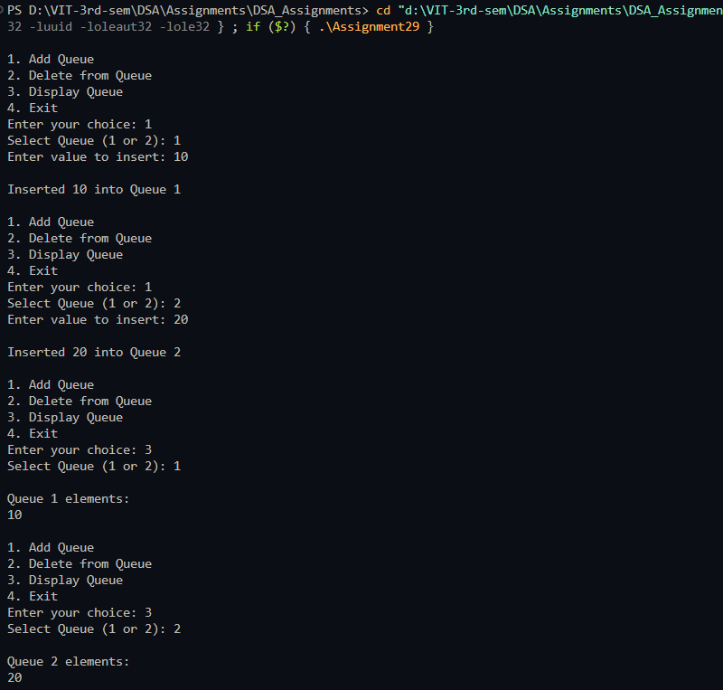
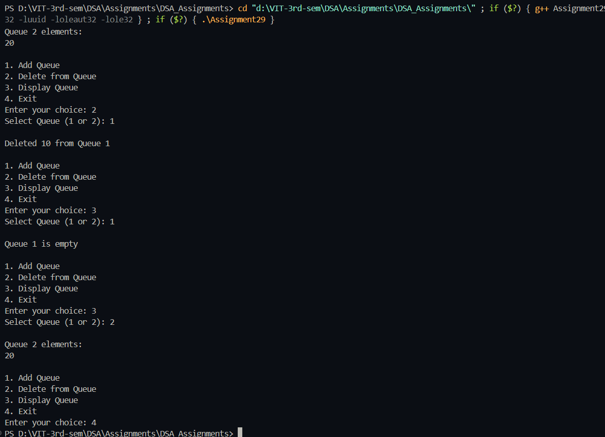

# Queue operations on multiple Queues

**Name:** Sahil Ashok Khaire  
**Roll No.:** 13  

---

## AIM
To implement two queues using a single array and perform operations: add to queue, delete from queue, and display queue.

---

## Theory
A **queue** is a **FIFO (First In First Out)** data structure.  
Implementing multiple queues in a single array allows efficient use of space.  

Operations:  
- **Add Queue (Enqueue):** Insert an element at the rear of a selected queue.  
- **Delete from Queue (Dequeue):** Remove an element from the front of a selected queue.  
- **Display Queue:** Show elements of a selected queue.  

---

## Algorithm
1. Initialize a single array `queue_sak[]` of size `MAX_SAK` for two queues.  
2. Initialize `front_sak[2] = {-1, -1}` and `rear_sak[2] = {-1, -1}` for two queues.  
3. Read user choice: Add Queue, Delete from Queue, Display Queue, or Exit.  
4. **Add Queue (Enqueue):**  
   - If the selected queue is full, display "Queue Overflow".  
   - Else, increment `rear_sak[queue_no_sak]` and insert element.  
   - If `front_sak[queue_no_sak] == -1`, set it to 0.  
5. **Delete from Queue (Dequeue):**  
   - If the selected queue is empty, display "Queue Underflow".  
   - Else, remove the element at `queue_sak[front_sak[queue_no_sak]]`.  
   - Increment `front_sak[queue_no_sak]`. If queue becomes empty, reset front and rear to -1.  
6. **Display Queue:**  
   - Print all elements from `front_sak[queue_no_sak]` to `rear_sak[queue_no_sak]`.  
7. Repeat until user chooses Exit.

---

## Program (C++ Language)
```cpp
#include <iostream>
using namespace std;

#define MAX_SAK 50

int queue_sak[MAX_SAK];
int front_sak[2] = {-1, -1};
int rear_sak[2] = {-1, -1};
int size_sak = MAX_SAK / 2;

void enqueue_sak(int queue_no_sak, int val_sak) {
    int start_sak = queue_no_sak * size_sak;
    if (rear_sak[queue_no_sak] == size_sak - 1) {
        cout << "\nQueue Overflow in Queue " << queue_no_sak + 1 << "\n";
        return;
    }
    rear_sak[queue_no_sak]++;
    queue_sak[start_sak + rear_sak[queue_no_sak]] = val_sak;
    if (front_sak[queue_no_sak] == -1) front_sak[queue_no_sak] = 0;
    cout << "\nInserted " << val_sak << " into Queue " << queue_no_sak + 1 << "\n";
}

void dequeue_sak(int queue_no_sak) {
    int start_sak = queue_no_sak * size_sak;
    if (front_sak[queue_no_sak] == -1 || front_sak[queue_no_sak] > rear_sak[queue_no_sak]) {
        cout << "\nQueue Underflow in Queue " << queue_no_sak + 1 << "\n";
        return;
    }
    cout << "\nDeleted " << queue_sak[start_sak + front_sak[queue_no_sak]] << " from Queue " << queue_no_sak + 1 << "\n";
    front_sak[queue_no_sak]++;
    if (front_sak[queue_no_sak] > rear_sak[queue_no_sak]) front_sak[queue_no_sak] = rear_sak[queue_no_sak] = -1;
}

void display_sak(int queue_no_sak) {
    int start_sak = queue_no_sak * size_sak;
    if (front_sak[queue_no_sak] == -1) {
        cout << "\nQueue " << queue_no_sak + 1 << " is empty\n";
        return;
    }
    cout << "\nQueue " << queue_no_sak + 1 << " elements:\n";
    for (int i_sak = front_sak[queue_no_sak]; i_sak <= rear_sak[queue_no_sak]; i_sak++) {
        cout << queue_sak[start_sak + i_sak] << " ";
    }
    cout << "\n";
}

int main() {
    int choice_sak, queue_no_sak, val_sak;

    while (true) {
        cout << "\n1. Add Queue\n2. Delete from Queue\n3. Display Queue\n4. Exit\n";
        cout << "Enter your choice: ";
        cin >> choice_sak;

        switch (choice_sak) {
            case 1:
                cout << "Select Queue (1 or 2): ";
                cin >> queue_no_sak;
                queue_no_sak--;
                cout << "Enter value to insert: ";
                cin >> val_sak;
                enqueue_sak(queue_no_sak, val_sak);
                break;
            case 2:
                cout << "Select Queue (1 or 2): ";
                cin >> queue_no_sak;
                queue_no_sak--;
                dequeue_sak(queue_no_sak);
                break;
            case 3:
                cout << "Select Queue (1 or 2): ";
                cin >> queue_no_sak;
                queue_no_sak--;
                display_sak(queue_no_sak);
                break;
            case 4:
                return 0;
            default:
                cout << "Invalid choice\n";
        }
    }
}
```

## Output

