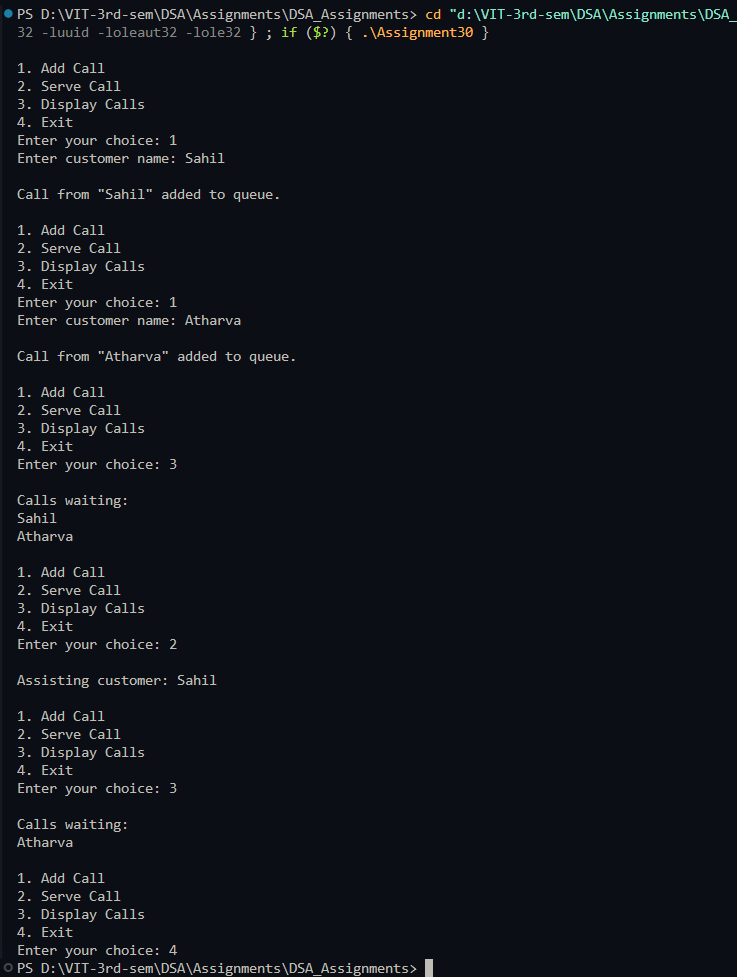

# Call center queue system

**Name:** Sahil Ashok Khaire  
**Roll No.:** 13  

---

## AIM
To implement a call center queue system using a linked list where calls are handled on a first-come, first-served basis.

---

## Theory
A **queue** is a **FIFO (First In First Out)** data structure.  
In a call center:  
- Customers' calls are received in order and enqueued.  
- Agents assist customers by dequeuing calls.  
- If there are no calls, agents wait for the next call.  

A **linked list** allows dynamic memory allocation, so the queue can grow and shrink as needed.  

Operations:  
- **Enqueue:** Add a new call at the rear.  
- **Dequeue:** Remove a call from the front.  
- **Display:** Show all waiting calls.  

---

## Algorithm
1. Define a `Node_sak` structure with `customer_sak` and `next_sak` pointer.  
2. Initialize `front_sak = NULL` and `rear_sak = NULL`.  
3. Read user choice: Add Call, Serve Call, Display Calls, or Exit.  
4. **Add Call (Enqueue):**  
   - Create a new node with customer name.  
   - If queue is empty, set `front_sak = rear_sak = new_node`.  
   - Else, link `rear_sak->next_sak = new_node` and update `rear_sak = new_node`.  
5. **Serve Call (Dequeue):**  
   - If queue is empty, display "No calls waiting".  
   - Else, remove `front_sak` node and display the customer being assisted.  
6. **Display Calls:**  
   - Traverse from `front_sak` to `rear_sak` and display all customer names.  
7. Repeat until user chooses Exit.

---

## Program (C++ Language)
```cpp
#include <iostream>
#include <string>
using namespace std;

struct Node_sak {
    string customer_sak;
    Node_sak* next_sak;
};

Node_sak* front_sak = NULL;
Node_sak* rear_sak = NULL;

void enqueue_sak(string customer_sak) {
    Node_sak* new_node_sak = new Node_sak();
    new_node_sak->customer_sak = customer_sak;
    new_node_sak->next_sak = NULL;

    if (rear_sak == NULL) {
        front_sak = rear_sak = new_node_sak;
    } else {
        rear_sak->next_sak = new_node_sak;
        rear_sak = new_node_sak;
    }
    cout << "\nCall from \"" << customer_sak << "\" added to queue.\n";
}

void dequeue_sak() {
    if (front_sak == NULL) {
        cout << "\nNo calls waiting.\n";
        return;
    }
    Node_sak* temp_sak = front_sak;
    cout << "\nAssisting customer: " << temp_sak->customer_sak << endl;
    front_sak = front_sak->next_sak;
    if (front_sak == NULL) rear_sak = NULL;
    delete temp_sak;
}

void display_sak() {
    if (front_sak == NULL) {
        cout << "\nNo calls in queue.\n";
        return;
    }
    cout << "\nCalls waiting:\n";
    Node_sak* temp_sak = front_sak;
    while (temp_sak != NULL) {
        cout << temp_sak->customer_sak << endl;
        temp_sak = temp_sak->next_sak;
    }
}

int main() {
    int choice_sak;
    string customer_sak;

    while (true) {
        cout << "\n1. Add Call\n2. Serve Call\n3. Display Calls\n4. Exit\n";
        cout << "Enter your choice: ";
        cin >> choice_sak;
        cin.ignore();

        switch (choice_sak) {
            case 1:
                cout << "Enter customer name: ";
                getline(cin, customer_sak);
                enqueue_sak(customer_sak);
                break;
            case 2:
                dequeue_sak();
                break;
            case 3:
                display_sak();
                break;
            case 4:
                return 0;
            default:
                cout << "Invalid choice.\n";
        }
    }
}
```

## Output
