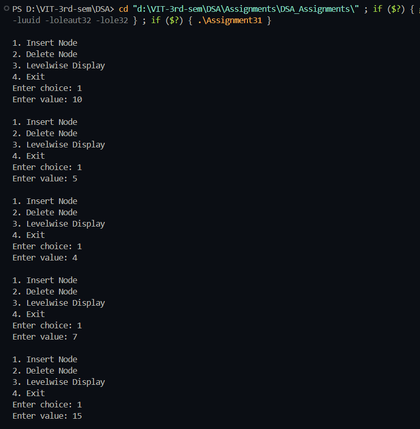
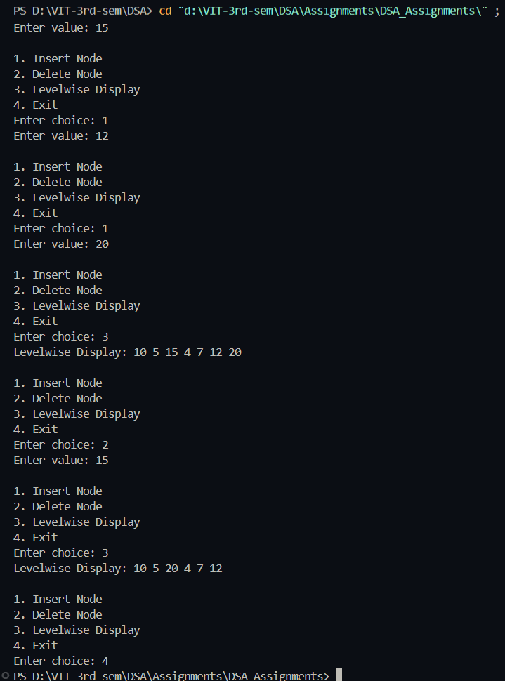

# Practical – Binary Search Tree (BST) Operations

**Name:** Sahil Ashok Khaire  
**Roll No.:** 13  
**Title:** Perform Binary Search Tree (BST) operations (Create, Insert, Delete, Levelwise Display)

---

## Theory

A **Binary Search Tree (BST)** is a special type of binary tree where each node has at most two children and satisfies the **binary search property**:
- The left child contains data less than the parent node.
- The right child contains data greater than the parent node.

BSTs allow fast insertion, deletion, and searching operations in **O(log n)** time (average case).  
They are widely used in data storage, indexing, and searching systems because of their ordered structure.

---

## Algorithm

### Algorithm: Create BST
1. Start  
2. Initialize `root_sak = NULL`  
3. Accept number of nodes `n_sak`  
4. Repeat for `n_sak` times  
   - Read `data_sak`  
   - Call `insertNode_sak(root_sak, data_sak)`  
5. Stop  

### Algorithm: Insert Node
1. If `root_sak == NULL`, create new node and return it  
2. If `data_sak < root_sak->data_sak`, insert in left subtree  
3. Else insert in right subtree  
4. Return `root_sak`

### Algorithm: Delete Node
1. If `root_sak == NULL`, return `root_sak`  
2. If `key_sak < root_sak->data_sak`, delete from left subtree  
3. Else if `key_sak > root_sak->data_sak`, delete from right subtree  
4. Else  
   - If node has no child → return NULL  
   - If node has one child → return that child  
   - Else find inorder successor, copy its data, and delete it recursively  
5. Return `root_sak`

### Algorithm: Levelwise Display
1. If `root_sak == NULL`, print empty tree  
2. Initialize queue and push `root_sak`  
3. While queue not empty  
   - Pop front node  
   - Print `data_sak`  
   - If left child exists → push it  
   - If right child exists → push it  
4. Stop  

---

## Program

```cpp
#include <iostream>
using namespace std;

struct Node_sak {
    int data_sak;
    Node_sak *left_sak, *right_sak;
};

Node_sak* createNode_sak(int data_sak) {
    Node_sak* newNode_sak = new Node_sak();
    newNode_sak->data_sak = data_sak;
    newNode_sak->left_sak = newNode_sak->right_sak = NULL;
    return newNode_sak;
}

Node_sak* insertNode_sak(Node_sak* root_sak, int data_sak) {
    if (root_sak == NULL)
        return createNode_sak(data_sak);
    if (data_sak < root_sak->data_sak)
        root_sak->left_sak = insertNode_sak(root_sak->left_sak, data_sak);
    else if (data_sak > root_sak->data_sak)
        root_sak->right_sak = insertNode_sak(root_sak->right_sak, data_sak);
    return root_sak;
}

Node_sak* minValueNode_sak(Node_sak* node_sak) {
    Node_sak* current_sak = node_sak;
    while (current_sak && current_sak->left_sak != NULL)
        current_sak = current_sak->left_sak;
    return current_sak;
}

Node_sak* deleteNode_sak(Node_sak* root_sak, int key_sak) {
    if (root_sak == NULL)
        return root_sak;
    if (key_sak < root_sak->data_sak)
        root_sak->left_sak = deleteNode_sak(root_sak->left_sak, key_sak);
    else if (key_sak > root_sak->data_sak)
        root_sak->right_sak = deleteNode_sak(root_sak->right_sak, key_sak);
    else {
        if (root_sak->left_sak == NULL) {
            Node_sak* temp_sak = root_sak->right_sak;
            delete root_sak;
            return temp_sak;
        } else if (root_sak->right_sak == NULL) {
            Node_sak* temp_sak = root_sak->left_sak;
            delete root_sak;
            return temp_sak;
        }
        Node_sak* temp_sak = minValueNode_sak(root_sak->right_sak);
        root_sak->data_sak = temp_sak->data_sak;
        root_sak->right_sak = deleteNode_sak(root_sak->right_sak, temp_sak->data_sak);
    }
    return root_sak;
}

void levelOrder_sak(Node_sak* root_sak) {
    if (root_sak == NULL) {
        cout << "Tree is empty\n";
        return;
    }

    Node_sak* queue_sak[100];
    int front_sak = 0, rear_sak = 0;
    queue_sak[rear_sak++] = root_sak;

    cout << "Levelwise Display: ";
    while (front_sak < rear_sak) {
        Node_sak* current_sak = queue_sak[front_sak++];
        cout << current_sak->data_sak << " ";
        if (current_sak->left_sak)
            queue_sak[rear_sak++] = current_sak->left_sak;
        if (current_sak->right_sak)
            queue_sak[rear_sak++] = current_sak->right_sak;
    }
    cout << endl;
}

int main() {
    Node_sak* root_sak = NULL;
    int choice_sak, value_sak;
    while (true) {
        cout << "\n1. Insert Node\n2. Delete Node\n3. Levelwise Display\n4. Exit\nEnter choice: ";
        cin >> choice_sak;
        switch (choice_sak) {
            case 1:
                cout << "Enter value: ";
                cin >> value_sak;
                root_sak = insertNode_sak(root_sak, value_sak);
                break;
            case 2:
                cout << "Enter value: ";
                cin >> value_sak;
                root_sak = deleteNode_sak(root_sak, value_sak);
                break;
            case 3:
                levelOrder_sak(root_sak);
                break;
            case 4:
                return 0;
            default:
                cout << "Invalid choice\n";
        }
    }
}

```

## Output

