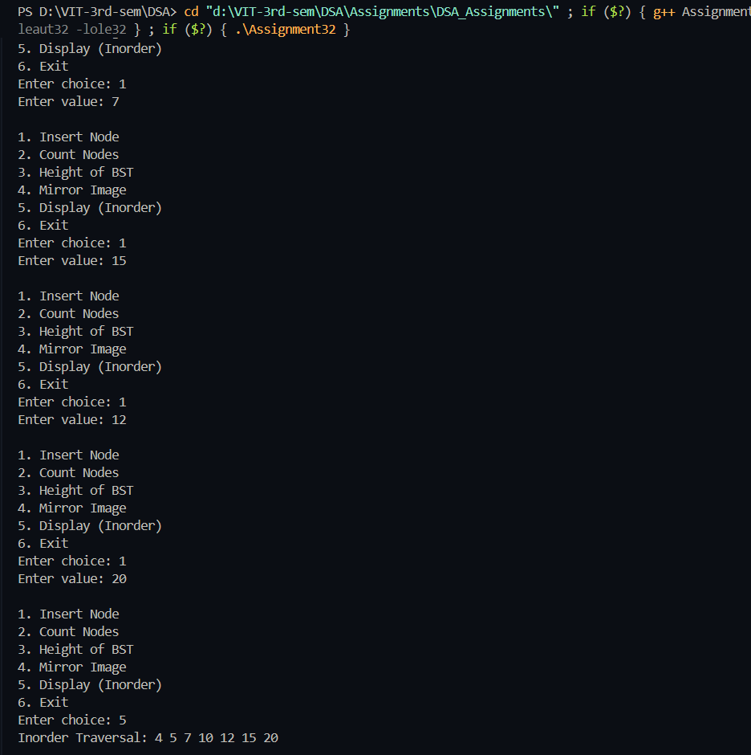
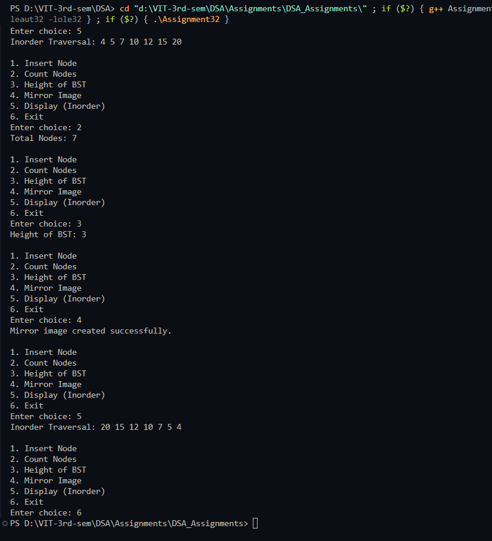

# Practical – Binary Search Tree (BST) Operations

**Name:** Sahil Ashok Khaire  
**Roll No.:** 13  
**Title:** Perform Binary Search Tree (BST) operations (Count total number of nodes, Compute height of BST, Mirror Image)

---

## Theory

A **Binary Search Tree (BST)** is a hierarchical data structure in which each node has at most two children — left and right.  
It follows the **binary search property**:
- The left subtree of a node contains nodes with keys smaller than the node’s key.  
- The right subtree contains nodes with keys greater than the node’s key.  

BSTs are used in applications like **searching, sorting, indexing, and symbol tables** due to their efficient data organization.  
Operations such as insertion, deletion, and searching can be performed in **O(log n)** time (average case).

---

## Algorithm

### Algorithm: Count Total Nodes
1. Start  
2. If the tree is empty, return 0  
3. Recursively count nodes in left and right subtrees  
4. Return `1 + count(left) + count(right)`  
5. Stop  

### Algorithm: Compute Height of BST
1. Start  
2. If the tree is empty, return 0  
3. Recursively find the height of left and right subtrees  
4. Return `max(leftHeight, rightHeight) + 1`  
5. Stop  

### Algorithm: Mirror Image
1. Start  
2. If the tree is empty, return  
3. Recursively call mirror on left and right subtrees  
4. Swap left and right pointers of the current node  
5. Stop  

---

## Program

```cpp
#include <iostream>
using namespace std;

struct Node_sak {
    int data_sak;
    Node_sak *left_sak, *right_sak;
};

Node_sak* createNode_sak(int data_sak) {
    Node_sak* newNode_sak = new Node_sak();
    newNode_sak->data_sak = data_sak;
    newNode_sak->left_sak = newNode_sak->right_sak = NULL;
    return newNode_sak;
}

Node_sak* insertNode_sak(Node_sak* root_sak, int data_sak) {
    if (root_sak == NULL)
        return createNode_sak(data_sak);
    if (data_sak < root_sak->data_sak)
        root_sak->left_sak = insertNode_sak(root_sak->left_sak, data_sak);
    else if (data_sak > root_sak->data_sak)
        root_sak->right_sak = insertNode_sak(root_sak->right_sak, data_sak);
    return root_sak;
}

int countNodes_sak(Node_sak* root_sak) {
    if (root_sak == NULL)
        return 0;
    return 1 + countNodes_sak(root_sak->left_sak) + countNodes_sak(root_sak->right_sak);
}

int heightBST_sak(Node_sak* root_sak) {
    if (root_sak == NULL)
        return 0;
    int leftHeight_sak = heightBST_sak(root_sak->left_sak);
    int rightHeight_sak = heightBST_sak(root_sak->right_sak);
    return (leftHeight_sak > rightHeight_sak ? leftHeight_sak : rightHeight_sak) + 1;
}

void mirrorBST_sak(Node_sak* root_sak) {
    if (root_sak == NULL)
        return;
    mirrorBST_sak(root_sak->left_sak);
    mirrorBST_sak(root_sak->right_sak);
    Node_sak* temp_sak = root_sak->left_sak;
    root_sak->left_sak = root_sak->right_sak;
    root_sak->right_sak = temp_sak;
}

void inorder_sak(Node_sak* root_sak) {
    if (root_sak != NULL) {
        inorder_sak(root_sak->left_sak);
        cout << root_sak->data_sak << " ";
        inorder_sak(root_sak->right_sak);
    }
}

int main() {
    Node_sak* root_sak = NULL;
    int choice_sak, value_sak;
    while (true) {
        cout << "\n1. Insert Node\n2. Count Nodes\n3. Height of BST\n4. Mirror Image\n5. Display (Inorder)\n6. Exit\nEnter choice: ";
        cin >> choice_sak;
        switch (choice_sak) {
            case 1:
                cout << "Enter value: ";
                cin >> value_sak;
                root_sak = insertNode_sak(root_sak, value_sak);
                break;
            case 2:
                cout << "Total Nodes: " << countNodes_sak(root_sak) << endl;
                break;
            case 3:
                cout << "Height of BST: " << heightBST_sak(root_sak) << endl;
                break;
            case 4:
                mirrorBST_sak(root_sak);
                cout << "Mirror image created successfully.\n";
                break;
            case 5:
                cout << "Inorder Traversal: ";
                inorder_sak(root_sak);
                cout << endl;
                break;
            case 6:
                return 0;
            default:
                cout << "Invalid choice\n";
        }
    }
}
```

## Output

