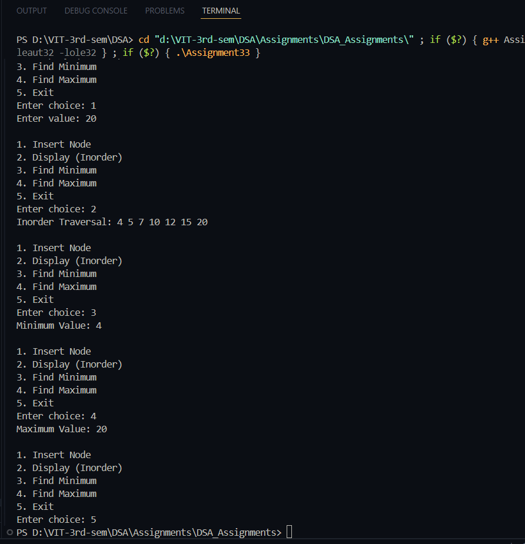

# Practical – Binary Search Tree (BST) Operations

**Name:** Sahil Ashok Khaire  
**Roll No.:** 13  
**Title:** Write a Program to create a Binary Search Tree (BST) and Find Minimum/Maximum in BST

---

## Theory

A **Binary Search Tree (BST)** is a binary tree in which each node contains a key such that:
- The left subtree contains values **less than** the node’s key.  
- The right subtree contains values **greater than** the node’s key.  

This property allows **efficient searching, insertion, and deletion** operations with an average time complexity of **O(log n)**.  
In a BST:
- The **minimum** value is found by continuously traversing the **left child** until a leaf node is reached.  
- The **maximum** value is found by continuously traversing the **right child** until a leaf node is reached.

---

## Algorithm

### Algorithm: Create BST
1. Start  
2. Initialize `root_sak = NULL`  
3. Accept number of nodes `n_sak`  
4. Repeat for `n_sak` times  
   - Read `data_sak`  
   - Call `insertNode_sak(root_sak, data_sak)`  
5. Stop  

### Algorithm: Find Minimum
1. Start  
2. If tree is empty → print “Empty Tree”  
3. Traverse left subtree until `left_sak == NULL`  
4. Return current node’s value as **minimum**  
5. Stop  

### Algorithm: Find Maximum
1. Start  
2. If tree is empty → print “Empty Tree”  
3. Traverse right subtree until `right_sak == NULL`  
4. Return current node’s value as **maximum**  
5. Stop  

---

## Program

```cpp
#include <iostream>
using namespace std;

struct Node_sak {
    int data_sak;
    Node_sak *left_sak, *right_sak;
};

Node_sak* createNode_sak(int data_sak) {
    Node_sak* newNode_sak = new Node_sak();
    newNode_sak->data_sak = data_sak;
    newNode_sak->left_sak = newNode_sak->right_sak = NULL;
    return newNode_sak;
}

Node_sak* insertNode_sak(Node_sak* root_sak, int data_sak) {
    if (root_sak == NULL)
        return createNode_sak(data_sak);
    if (data_sak < root_sak->data_sak)
        root_sak->left_sak = insertNode_sak(root_sak->left_sak, data_sak);
    else if (data_sak > root_sak->data_sak)
        root_sak->right_sak = insertNode_sak(root_sak->right_sak, data_sak);
    return root_sak;
}

int findMin_sak(Node_sak* root_sak) {
    if (root_sak == NULL) {
        cout << "Tree is empty.\n";
        return -1;
    }
    while (root_sak->left_sak != NULL)
        root_sak = root_sak->left_sak;
    return root_sak->data_sak;
}

int findMax_sak(Node_sak* root_sak) {
    if (root_sak == NULL) {
        cout << "Tree is empty.\n";
        return -1;
    }
    while (root_sak->right_sak != NULL)
        root_sak = root_sak->right_sak;
    return root_sak->data_sak;
}

void inorder_sak(Node_sak* root_sak) {
    if (root_sak != NULL) {
        inorder_sak(root_sak->left_sak);
        cout << root_sak->data_sak << " ";
        inorder_sak(root_sak->right_sak);
    }
}

int main() {
    Node_sak* root_sak = NULL;
    int choice_sak, value_sak;
    while (true) {
        cout << "\n1. Insert Node\n2. Display (Inorder)\n3. Find Minimum\n4. Find Maximum\n5. Exit\nEnter choice: ";
        cin >> choice_sak;
        switch (choice_sak) {
            case 1:
                cout << "Enter value: ";
                cin >> value_sak;
                root_sak = insertNode_sak(root_sak, value_sak);
                break;
            case 2:
                cout << "Inorder Traversal: ";
                inorder_sak(root_sak);
                cout << endl;
                break;
            case 3:
                cout << "Minimum Value: " << findMin_sak(root_sak) << endl;
                break;
            case 4:
                cout << "Maximum Value: " << findMax_sak(root_sak) << endl;
                break;
            case 5:
                return 0;
            default:
                cout << "Invalid choice\n";
        }
    }
}
```

## Output

