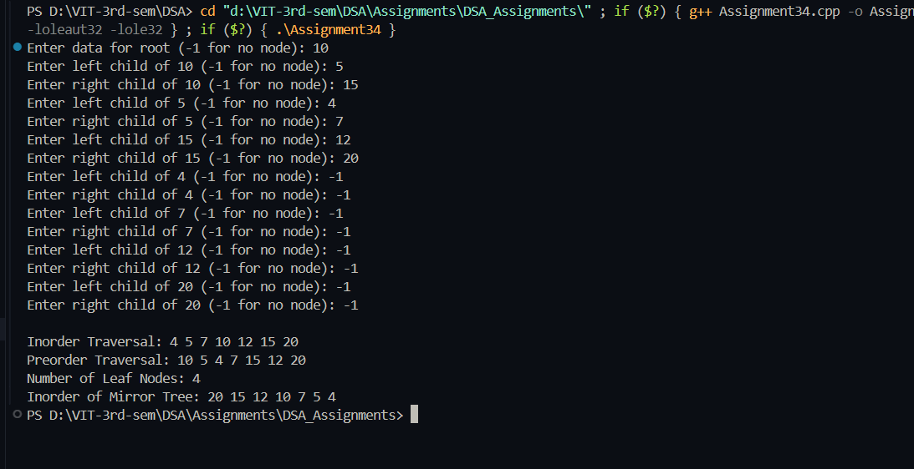

# Experiment: Binary Tree Non-Recursive Operations

**Name:** Sahil Ashok Khaire  
**Class:** SE Computer Engineering  
**Subject:** Data Structures Laboratory  
**Topic:** Binary Tree – Nonrecursive Traversals, Leaf Node Count, and Mirror Image

---

## **Aim**
Write a program to create a Binary Tree and perform the following **non-recursive operations** on it:  
a. Inorder Traversal  
b. Preorder Traversal  
c. Display Number of Leaf Nodes  
d. Mirror Image

---

## **Theory**

A **Binary Tree** is a data structure in which each node has at most two children: a left and a right child.  
Traversing the tree means visiting each node in a particular order.  

### **Key Concepts:**
1. **Inorder Traversal (LNR):** Left → Node → Right  
2. **Preorder Traversal (NLR):** Node → Left → Right  
3. **Leaf Node:** Node with no children.  
4. **Mirror Image:** A tree formed by swapping left and right children of all nodes.

Non-recursive traversals use an **explicit stack** implemented manually using arrays or linked lists.

---

## **Algorithm**

### **Algorithm for Binary Tree Creation**
1. Create a structure for nodes containing data, left, and right pointers.  
2. Create nodes dynamically and link them as per user-defined structure.  
3. Root node acts as the entry point.

### **Algorithm for Non-Recursive Inorder Traversal**
1. Initialize a custom stack.  
2. Push nodes while moving left.  
3. When no left node exists, pop a node, print data, and move to its right child.  
4. Repeat until stack is empty and all nodes are visited.

### **Algorithm for Non-Recursive Preorder Traversal**
1. Initialize a custom stack.  
2. Push root node.  
3. Pop node, print data, then push right child and left child.  
4. Continue until stack is empty.

### **Algorithm for Counting Leaf Nodes**
1. Traverse tree using stack.  
2. Increment counter for each node with no left or right child.

### **Algorithm for Mirror Image**
1. Swap left and right child pointers of every node.  
2. Traverse recursively or using a custom stack.

---

## **Program**

```cpp
#include <iostream>
using namespace std;

struct Node {
    int data;
    Node *left, *right;
};

Node* createNode(int val) {
    Node* newNode = new Node;
    newNode->data = val;
    newNode->left = newNode->right = NULL;
    return newNode;
}

// Manual Stack implementation
struct Stack {
    Node* arr[50];
    int top;
    Stack() { top = -1; }
    void push(Node* n) { arr[++top] = n; }
    Node* pop() { return arr[top--]; }
    bool isEmpty() { return top == -1; }
};

// Simple queue structure for tree creation
struct Queue {
    Node* arr[50];
    int front, rear;
    Queue() { front = rear = -1; }
    void enqueue(Node* n) {
        if (rear == 49) return;
        if (front == -1) front = 0;
        arr[++rear] = n;
    }
    Node* dequeue() {
        if (front == -1 || front > rear) return NULL;
        return arr[front++];
    }
    bool isEmpty() { return (front == -1 || front > rear); }
};

// Create tree level-wise from user input
Node* createTree() {
    int val;
    cout << "Enter data for root (-1 for no node): ";
    cin >> val;
    if (val == -1) return NULL;

    Node* root = createNode(val);
    Queue q;
    q.enqueue(root);

    while (!q.isEmpty()) {
        Node* current = q.dequeue();
        cout << "Enter left child of " << current->data << " (-1 for no node): ";
        cin >> val;
        if (val != -1) {
            current->left = createNode(val);
            q.enqueue(current->left);
        }
        cout << "Enter right child of " << current->data << " (-1 for no node): ";
        cin >> val;
        if (val != -1) {
            current->right = createNode(val);
            q.enqueue(current->right);
        }
    }
    return root;
}

void inorderNonRecursive(Node* root) {
    Stack s;
    Node* curr = root;
    while (curr != NULL || !s.isEmpty()) {
        while (curr != NULL) {
            s.push(curr);
            curr = curr->left;
        }
        curr = s.pop();
        cout << curr->data << " ";
        curr = curr->right;
    }
}

void preorderNonRecursive(Node* root) {
    if (root == NULL) return;
    Stack s;
    s.push(root);
    while (!s.isEmpty()) {
        Node* node = s.pop();
        cout << node->data << " ";
        if (node->right) s.push(node->right);
        if (node->left) s.push(node->left);
    }
}

int countLeafNodes(Node* root) {
    if (root == NULL) return 0;
    int count = 0;
    Stack s;
    s.push(root);
    while (!s.isEmpty()) {
        Node* node = s.pop();
        if (node->left == NULL && node->right == NULL)
            count++;
        if (node->right) s.push(node->right);
        if (node->left) s.push(node->left);
    }
    return count;
}

void mirrorTree(Node* root) {
    if (root == NULL) return;
    Stack s;
    s.push(root);
    while (!s.isEmpty()) {
        Node* node = s.pop();
        Node* temp = node->left;
        node->left = node->right;
        node->right = temp;
        if (node->left) s.push(node->left);
        if (node->right) s.push(node->right);
    }
}

int main() {
    Node* root = createTree();

    cout << "\nInorder Traversal: ";
    inorderNonRecursive(root);
    cout << "\nPreorder Traversal: ";
    preorderNonRecursive(root);
    cout << "\nNumber of Leaf Nodes: " << countLeafNodes(root);
    mirrorTree(root);
    cout << "\nInorder of Mirror Tree: ";
    inorderNonRecursive(root);
    return 0;
}

```

## Output
