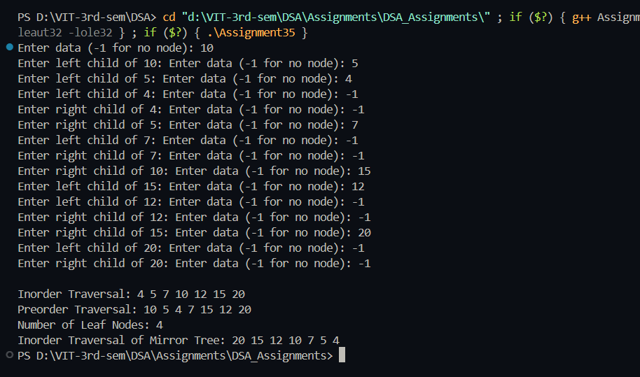

# Practical – Binary Tree Recursive Operations

**Name:** Sahil Ashok Khaire  
**Roll No.:** 13  
**Title:** Write a Program to create a Binary Tree and perform the following Recursive operations on it:  
a) Inorder Traversal  
b) Preorder Traversal  
c) Display Number of Leaf Nodes  
d) Mirror Image  

---

## Theory

A **Binary Tree** is a hierarchical data structure in which each node has at most two children, referred to as the **left child** and **right child**.  
Recursive traversal methods simplify the process of visiting each node by letting each node perform the same operation on its subtrees.

### Types of Recursive Traversals:
1. **Inorder (Left → Root → Right):** Visits the left subtree first, then the root node, and finally the right subtree.  
2. **Preorder (Root → Left → Right):** Visits the root first, then left subtree, and then right subtree.  
3. **Postorder (Left → Right → Root):** Visits both subtrees before the root.  

The **leaf nodes** are nodes that have no children.  
The **mirror image** of a binary tree is formed by interchanging the left and right subtrees of all nodes in the tree.

---

## Algorithm

### Algorithm: Create Binary Tree
1. Start  
2. Accept data for root node  
3. Recursively create left and right subtrees by asking user for each node  
4. Return root node  

### Algorithm: Inorder Traversal
1. Traverse left subtree  
2. Visit root node  
3. Traverse right subtree  

### Algorithm: Preorder Traversal
1. Visit root node  
2. Traverse left subtree  
3. Traverse right subtree  

### Algorithm: Count Leaf Nodes
1. If node is NULL → return 0  
2. If both children are NULL → return 1  
3. Else → recursively count leaf nodes in left and right subtrees  

### Algorithm: Mirror Image
1. If root is NULL → return  
2. Swap left and right child of root  
3. Recursively call for left and right subtrees  

---

## Program

```cpp
#include <iostream>
using namespace std;

struct Node_sak {
    int data_sak;
    Node_sak *left_sak, *right_sak;
};

Node_sak* createNode_sak(int val_sak) {
    Node_sak* newNode_sak = new Node_sak;
    newNode_sak->data_sak = val_sak;
    newNode_sak->left_sak = newNode_sak->right_sak = NULL;
    return newNode_sak;
}

Node_sak* createTree_sak() {
    int val_sak;
    cout << "Enter data (-1 for no node): ";
    cin >> val_sak;
    if (val_sak == -1) return NULL;
    Node_sak* root_sak = createNode_sak(val_sak);
    cout << "Enter left child of " << val_sak << ": ";
    root_sak->left_sak = createTree_sak();
    cout << "Enter right child of " << val_sak << ": ";
    root_sak->right_sak = createTree_sak();
    return root_sak;
}

void inorder_sak(Node_sak* root_sak) {
    if (root_sak == NULL) return;
    inorder_sak(root_sak->left_sak);
    cout << root_sak->data_sak << " ";
    inorder_sak(root_sak->right_sak);
}

void preorder_sak(Node_sak* root_sak) {
    if (root_sak == NULL) return;
    cout << root_sak->data_sak << " ";
    preorder_sak(root_sak->left_sak);
    preorder_sak(root_sak->right_sak);
}

int countLeaf_sak(Node_sak* root_sak) {
    if (root_sak == NULL) return 0;
    if (root_sak->left_sak == NULL && root_sak->right_sak == NULL)
        return 1;
    return countLeaf_sak(root_sak->left_sak) + countLeaf_sak(root_sak->right_sak);
}

void mirrorTree_sak(Node_sak* root_sak) {
    if (root_sak == NULL) return;
    Node_sak* temp_sak = root_sak->left_sak;
    root_sak->left_sak = root_sak->right_sak;
    root_sak->right_sak = temp_sak;
    mirrorTree_sak(root_sak->left_sak);
    mirrorTree_sak(root_sak->right_sak);
}

int main() {
    Node_sak* root_sak = createTree_sak();
    cout << "\nInorder Traversal: ";
    inorder_sak(root_sak);
    cout << "\nPreorder Traversal: ";
    preorder_sak(root_sak);
    cout << "\nNumber of Leaf Nodes: " << countLeaf_sak(root_sak);
    mirrorTree_sak(root_sak);
    cout << "\nInorder Traversal of Mirror Tree: ";
    inorder_sak(root_sak);
    return 0;
}
```

## Output
