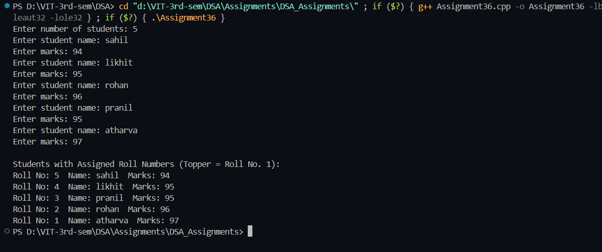

# Practical – Assign Roll Numbers Using Binary Search Tree

**Name:** Sahil Ashok Khaire  
**Roll No.:** 13  
**Title:** Write a program, using trees, to assign the roll numbers to the students of your class as per their previous year's result (i.e. topper will be roll no. 1).

---

## Theory

A **Binary Search Tree (BST)** is a hierarchical data structure where each node contains a value such that the left subtree has values smaller than the node, and the right subtree has values greater than it.  

By inserting students' marks as keys, the BST organizes students automatically according to their performance.  
To assign roll numbers based on rank:
- Perform a **reverse inorder traversal (Right → Root → Left)** to visit nodes from highest to lowest marks.
- Assign roll numbers in increasing order during traversal.  
Thus, the topper (highest marks) receives **Roll No. 1**, and so on.

---

## Algorithm

### Algorithm: Create BST
1. Start  
2. Create a structure `Node` having name, marks, roll, left, and right fields  
3. Insert each student into BST based on marks  
4. Return the root node  

### Algorithm: Assign Roll Numbers
1. Perform reverse inorder traversal  
2. Maintain a counter variable `roll` starting from 0  
3. For each visited node, increment `roll` and assign to the node’s roll number  

### Algorithm: Display BST
1. Perform inorder traversal  
2. Display name, marks, and assigned roll number  

---

## Program

```cpp
#include <iostream>
#include <string>
using namespace std;

struct Node_sak {
    string name_sak;
    int marks_sak;
    int roll_sak;
    Node_sak *left_sak, *right_sak;
};

Node_sak* createNode_sak(string name_sak, int marks_sak) {
    Node_sak* newNode_sak = new Node_sak;
    newNode_sak->name_sak = name_sak;
    newNode_sak->marks_sak = marks_sak;
    newNode_sak->roll_sak = 0;
    newNode_sak->left_sak = newNode_sak->right_sak = NULL;
    return newNode_sak;
}

Node_sak* insert_sak(Node_sak* root_sak, string name_sak, int marks_sak) {
    if (root_sak == NULL)
        return createNode_sak(name_sak, marks_sak);
    if (marks_sak < root_sak->marks_sak)
        root_sak->left_sak = insert_sak(root_sak->left_sak, name_sak, marks_sak);
    else
        root_sak->right_sak = insert_sak(root_sak->right_sak, name_sak, marks_sak);
    return root_sak;
}

void assignRoll_sak(Node_sak* root_sak, int &roll_sak) {
    if (root_sak == NULL)
        return;
    assignRoll_sak(root_sak->right_sak, roll_sak);
    root_sak->roll_sak = ++roll_sak;
    assignRoll_sak(root_sak->left_sak, roll_sak);
}

void display_sak(Node_sak* root_sak) {
    if (root_sak == NULL)
        return;
    display_sak(root_sak->left_sak);
    cout << "Roll No: " << root_sak->roll_sak
         << "  Name: " << root_sak->name_sak
         << "  Marks: " << root_sak->marks_sak << endl;
    display_sak(root_sak->right_sak);
}

int main() {
    Node_sak* root_sak = NULL;
    int n_sak, marks_sak;
    string name_sak;

    cout << "Enter number of students: ";
    cin >> n_sak;

    for (int i = 0; i < n_sak; i++) {
        cout << "Enter student name: ";
        cin >> name_sak;
        cout << "Enter marks: ";
        cin >> marks_sak;
        root_sak = insert_sak(root_sak, name_sak, marks_sak);
    }

    int roll_sak = 0;
    assignRoll_sak(root_sak, roll_sak);

    cout << "\nStudents with Assigned Roll Numbers (Topper = Roll No. 1):\n";
    display_sak(root_sak);

    return 0;
}
```

## Output
