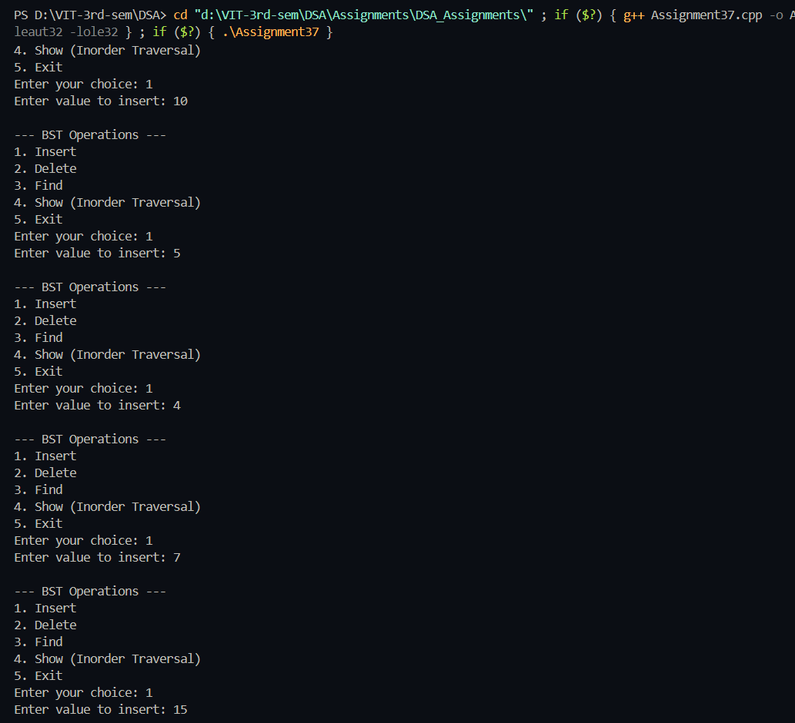
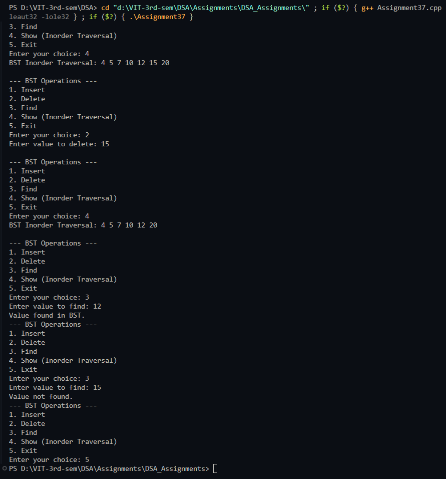

# Practical – Operations on Binary Search Tree (BST)

**Name:** Sahil Ashok Khaire  
**Roll No.:** 13  
**Title:** Write a program to illustrate operations on a BST holding numeric keys.  
The menu must include:  
• Insert  
• Delete  
• Find  
• Show  

---

## Theory

A **Binary Search Tree (BST)** is a non-linear data structure in which each node contains a key, and every node follows the **binary search property**:  
- The key in the left child is smaller than the key in the parent node.  
- The key in the right child is greater than the key in the parent node.  

BST provides efficient operations for insertion, deletion, searching, and traversal — all having average time complexity **O(log n)**.  
These properties make BSTs suitable for applications like symbol tables, indexing, and sorted data storage.

---

## Algorithm

### Algorithm: Insert Node
1. Start  
2. If the tree is empty, create a new node as root  
3. If `key < root->data`, insert into left subtree  
4. If `key > root->data`, insert into right subtree  
5. Return root  

### Algorithm: Delete Node
1. If tree is empty → return NULL  
2. If `key < root->data` → delete from left subtree  
3. If `key > root->data` → delete from right subtree  
4. Else (found the node):  
   - Case 1: No child → delete node  
   - Case 2: One child → replace node with child  
   - Case 3: Two children → find inorder successor, copy its value, and delete it recursively  

### Algorithm: Find Node
1. If root is NULL → key not found  
2. If `key == root->data` → key found  
3. If `key < root->data` → search left subtree  
4. Else → search right subtree  

### Algorithm: Show (Inorder Traversal)
1. Traverse left subtree  
2. Display root data  
3. Traverse right subtree  

---

## Program

```cpp
#include <iostream>
using namespace std;

struct Node_sak {
    int data_sak;
    Node_sak *left_sak, *right_sak;
};

Node_sak* createNode_sak(int value_sak) {
    Node_sak* newNode_sak = new Node_sak;
    newNode_sak->data_sak = value_sak;
    newNode_sak->left_sak = newNode_sak->right_sak = NULL;
    return newNode_sak;
}

Node_sak* insertNode_sak(Node_sak* root_sak, int value_sak) {
    if (root_sak == NULL)
        return createNode_sak(value_sak);
    if (value_sak < root_sak->data_sak)
        root_sak->left_sak = insertNode_sak(root_sak->left_sak, value_sak);
    else if (value_sak > root_sak->data_sak)
        root_sak->right_sak = insertNode_sak(root_sak->right_sak, value_sak);
    return root_sak;
}

Node_sak* findMin_sak(Node_sak* root_sak) {
    while (root_sak && root_sak->left_sak != NULL)
        root_sak = root_sak->left_sak;
    return root_sak;
}

Node_sak* deleteNode_sak(Node_sak* root_sak, int key_sak) {
    if (root_sak == NULL)
        return root_sak;

    if (key_sak < root_sak->data_sak)
        root_sak->left_sak = deleteNode_sak(root_sak->left_sak, key_sak);
    else if (key_sak > root_sak->data_sak)
        root_sak->right_sak = deleteNode_sak(root_sak->right_sak, key_sak);
    else {
        if (root_sak->left_sak == NULL) {
            Node_sak* temp_sak = root_sak->right_sak;
            delete root_sak;
            return temp_sak;
        } else if (root_sak->right_sak == NULL) {
            Node_sak* temp_sak = root_sak->left_sak;
            delete root_sak;
            return temp_sak;
        }
        Node_sak* temp_sak = findMin_sak(root_sak->right_sak);
        root_sak->data_sak = temp_sak->data_sak;
        root_sak->right_sak = deleteNode_sak(root_sak->right_sak, temp_sak->data_sak);
    }
    return root_sak;
}

bool findNode_sak(Node_sak* root_sak, int key_sak) {
    if (root_sak == NULL)
        return false;
    if (root_sak->data_sak == key_sak)
        return true;
    else if (key_sak < root_sak->data_sak)
        return findNode_sak(root_sak->left_sak, key_sak);
    else
        return findNode_sak(root_sak->right_sak, key_sak);
}

void inorder_sak(Node_sak* root_sak) {
    if (root_sak == NULL)
        return;
    inorder_sak(root_sak->left_sak);
    cout << root_sak->data_sak << " ";
    inorder_sak(root_sak->right_sak);
}

int main() {
    Node_sak* root_sak = NULL;
    int choice_sak, value_sak;

    while (true) {
        cout << "\n--- BST Operations ---";
        cout << "\n1. Insert";
        cout << "\n2. Delete";
        cout << "\n3. Find";
        cout << "\n4. Show (Inorder Traversal)";
        cout << "\n5. Exit";
        cout << "\nEnter your choice: ";
        cin >> choice_sak;

        switch (choice_sak) {
            case 1:
                cout << "Enter value to insert: ";
                cin >> value_sak;
                root_sak = insertNode_sak(root_sak, value_sak);
                break;

            case 2:
                cout << "Enter value to delete: ";
                cin >> value_sak;
                root_sak = deleteNode_sak(root_sak, value_sak);
                break;

            case 3:
                cout << "Enter value to find: ";
                cin >> value_sak;
                if (findNode_sak(root_sak, value_sak))
                    cout << "Value found in BST.";
                else
                    cout << "Value not found.";
                break;

            case 4:
                cout << "BST Inorder Traversal: ";
                inorder_sak(root_sak);
                cout << endl;
                break;

            case 5:
                return 0;

            default:
                cout << "Invalid choice.";
        }
    }
}
```

## Output


