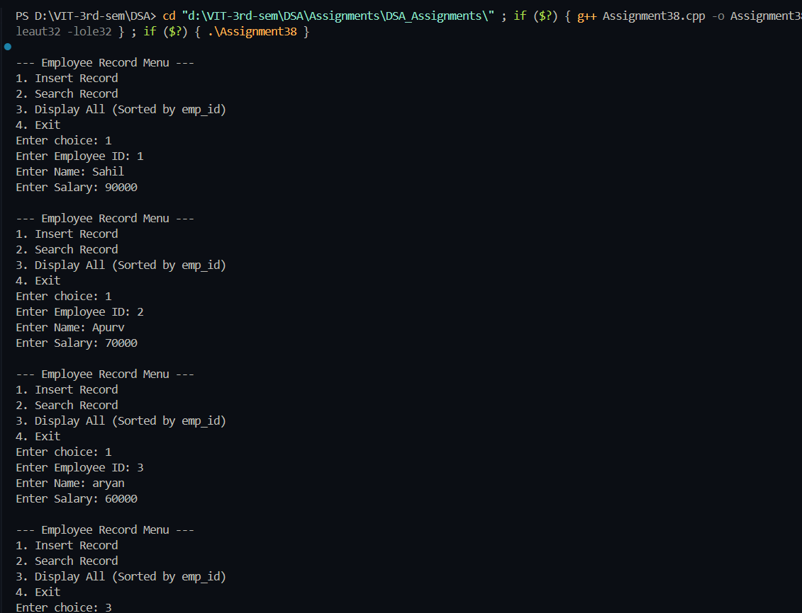
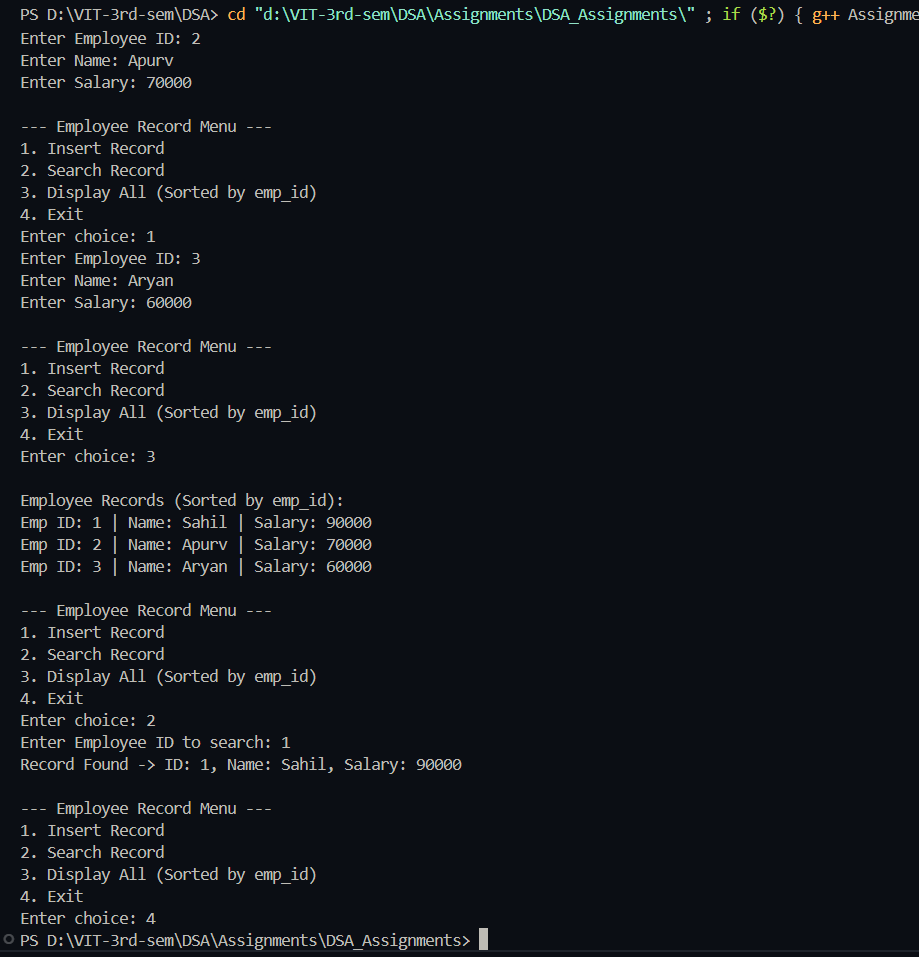

# Practical – Employee Record Search and Sort using Binary Search Tree (BST)

**Name:** Sahil Ashok Khaire  
**Roll No.:** 13  
**Title:** Write a program to efficiently search a particular employee record by using Tree data structure. Also sort the data on emp_id in ascending order.  

---

## Theory

A **Binary Search Tree (BST)** is a hierarchical data structure where each node has a key greater than all keys in its left subtree and less than all keys in its right subtree.  

It supports efficient **insertion**, **searching**, and **sorting** operations — all with an average time complexity of **O(log n)**.  

When employee data is stored using a BST with `emp_id` as the key:
- Searching for an employee becomes fast.  
- An **inorder traversal** of the tree automatically produces records in **ascending order of emp_id**.  

---

## Algorithm

### Algorithm: Insert Employee Record
1. Start  
2. If the tree is empty, create a new node and assign it as root.  
3. If emp_id < root’s emp_id, insert into the left subtree.  
4. If emp_id > root’s emp_id, insert into the right subtree.  
5. Repeat recursively until correct position is found.  
6. Stop.  

### Algorithm: Search Employee
1. Start with the root node.  
2. If emp_id matches the current node → return the record.  
3. If emp_id < current node → move to the left subtree.  
4. If emp_id > current node → move to the right subtree.  
5. Repeat until record is found or NULL is reached.  

### Algorithm: Inorder Traversal (Sorting)
1. Traverse left subtree.  
2. Display current node’s record.  
3. Traverse right subtree.  

---

## Program

```cpp
#include <iostream>
#include <string>
using namespace std;

struct Employee {
    int emp_id;
    string name;
    float salary;
    Employee *left, *right;
};

Employee* createNode(int id, string n, float s) {
    Employee* newNode = new Employee;
    newNode->emp_id = id;
    newNode->name = n;
    newNode->salary = s;
    newNode->left = newNode->right = NULL;
    return newNode;
}

Employee* insert(Employee* root, int id, string name, float salary) {
    if (root == NULL)
        return createNode(id, name, salary);
    if (id < root->emp_id)
        root->left = insert(root->left, id, name, salary);
    else if (id > root->emp_id)
        root->right = insert(root->right, id, name, salary);
    else
        cout << "Duplicate Employee ID not allowed!\n";
    return root;
}

Employee* search(Employee* root, int id) {
    if (root == NULL || root->emp_id == id)
        return root;
    if (id < root->emp_id)
        return search(root->left, id);
    return search(root->right, id);
}

void inorder(Employee* root) {
    if (root != NULL) {
        inorder(root->left);
        cout << "Emp ID: " << root->emp_id 
             << " | Name: " << root->name 
             << " | Salary: " << root->salary << endl;
        inorder(root->right);
    }
}

int main() {
    Employee* root = NULL;
    int choice;
    do {
        cout << "\n--- Employee Record Menu ---";
        cout << "\n1. Insert Record";
        cout << "\n2. Search Record";
        cout << "\n3. Display All (Sorted by emp_id)";
        cout << "\n4. Exit";
        cout << "\nEnter choice: ";
        cin >> choice;

        if (choice == 1) {
            int id;
            string name;
            float salary;
            cout << "Enter Employee ID: ";
            cin >> id;
            cout << "Enter Name: ";
            cin >> name;
            cout << "Enter Salary: ";
            cin >> salary;
            root = insert(root, id, name, salary);
        } 
        else if (choice == 2) {
            int id;
            cout << "Enter Employee ID to search: ";
            cin >> id;
            Employee* emp = search(root, id);
            if (emp != NULL)
                cout << "Record Found -> ID: " << emp->emp_id 
                     << ", Name: " << emp->name 
                     << ", Salary: " << emp->salary << endl;
            else
                cout << "Record Not Found.\n";
        } 
        else if (choice == 3) {
            cout << "\nEmployee Records (Sorted by emp_id):\n";
            inorder(root);
        }
    } while (choice != 4);
    return 0;
}
```

## Output

