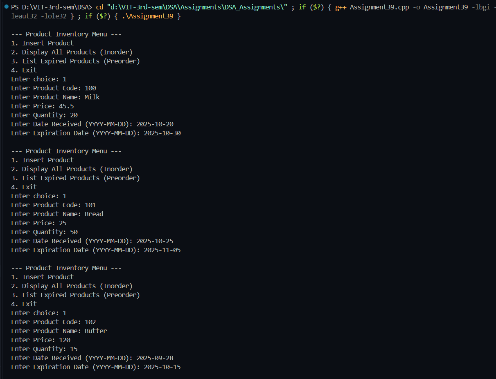
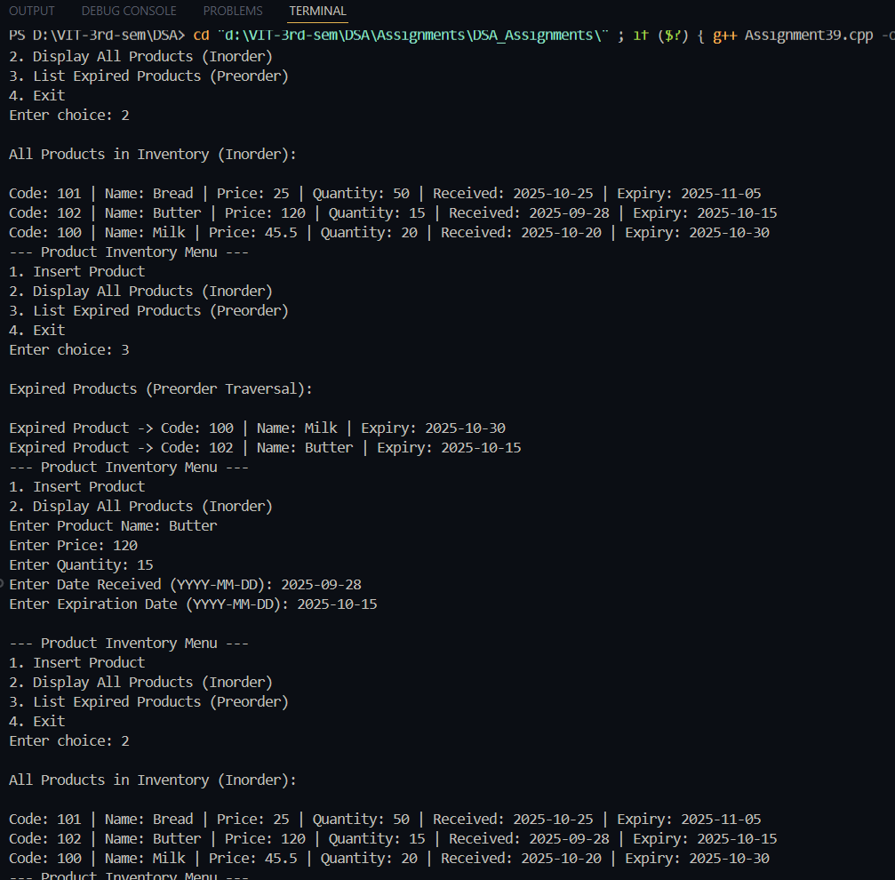
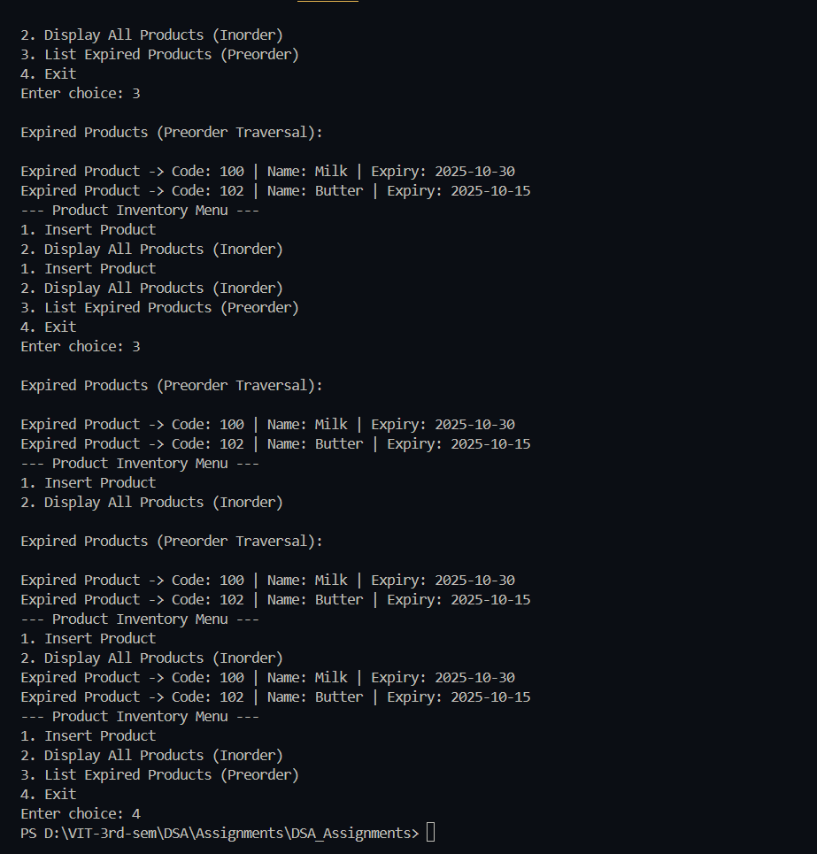

# Practical – Product Inventory Management using Binary Search Tree (BST)

**Name:** Sahil Ashok Khaire  
**Roll No.:** 13  
**Title:** Write a program to implement a Product Inventory Management System for a shop using a Search Tree data structure.  
Each product must store the following information:  
- Unique Product Code  
- Product Name  
- Price  
- Quantity in Stock  
- Date Received  
- Expiration Date  

Implement the following operations:  
1. Insert a product into the tree (organized by product name)  
2. Display all items in the inventory using inorder traversal  
3. List expired items in preorder order of their names  

---

## Theory

A **Binary Search Tree (BST)** is an efficient data structure for organizing records based on a specific key.  
In this problem, products are organized by **product name** so that searching, inserting, and displaying data in sorted order (alphabetically) becomes fast and systematic.

- **Insertion:** Inserts product nodes in BST based on product name comparison.  
- **Inorder Traversal:** Displays all products in ascending order of names.  
- **Preorder Traversal of Expired Products:** Displays only expired items in preorder sequence.  

BST allows efficient record management with average time complexities of **O(log n)** for search and insert operations.

---

## Algorithm

### Algorithm: Insert Product
1. Start  
2. If the tree is empty, create a new product node and set it as root.  
3. Compare the new product’s name with the current node’s name.  
4. If smaller, move to the left subtree; else, move to the right subtree.  
5. Repeat until correct position is found and insert the node.  
6. Stop.  

### Algorithm: Inorder Traversal
1. Traverse left subtree.  
2. Visit current node (display product details).  
3. Traverse right subtree.  

### Algorithm: List Expired Items (Preorder)
1. Visit current node.  
2. If current product is expired → display it.  
3. Recursively check left and right subtrees.  

---

## Program

```cpp
#include <iostream>
#include <string>
using namespace std;

struct Product_sak {
    int code_sak;
    string name_sak;
    float price_sak;
    int quantity_sak;
    string dateReceived_sak;
    string expiryDate_sak;
    Product_sak *left_sak, *right_sak;
};

Product_sak* createNode_sak(int code, string name, float price, int qty, string rec, string exp) {
    Product_sak* newNode_sak = new Product_sak;
    newNode_sak->code_sak = code;
    newNode_sak->name_sak = name;
    newNode_sak->price_sak = price;
    newNode_sak->quantity_sak = qty;
    newNode_sak->dateReceived_sak = rec;
    newNode_sak->expiryDate_sak = exp;
    newNode_sak->left_sak = newNode_sak->right_sak = NULL;
    return newNode_sak;
}

Product_sak* insert_sak(Product_sak* root_sak, int code, string name, float price, int qty, string rec, string exp) {
    if (root_sak == NULL)
        return createNode_sak(code, name, price, qty, rec, exp);
    if (name < root_sak->name_sak)
        root_sak->left_sak = insert_sak(root_sak->left_sak, code, name, price, qty, rec, exp);
    else if (name > root_sak->name_sak)
        root_sak->right_sak = insert_sak(root_sak->right_sak, code, name, price, qty, rec, exp);
    else
        cout << "Duplicate product name not allowed!\n";
    return root_sak;
}

void inorder_sak(Product_sak* root_sak) {
    if (root_sak != NULL) {
        inorder_sak(root_sak->left_sak);
        cout << "\nCode: " << root_sak->code_sak
             << " | Name: " << root_sak->name_sak
             << " | Price: " << root_sak->price_sak
             << " | Quantity: " << root_sak->quantity_sak
             << " | Received: " << root_sak->dateReceived_sak
             << " | Expiry: " << root_sak->expiryDate_sak;
        inorder_sak(root_sak->right_sak);
    }
}

bool isExpired_sak(string expDate) {
    string current = "2025-11-02";
    return expDate < current;
}

void preorderExpired_sak(Product_sak* root_sak) {
    if (root_sak != NULL) {
        if (isExpired_sak(root_sak->expiryDate_sak)) {
            cout << "\nExpired Product -> "
                 << "Code: " << root_sak->code_sak
                 << " | Name: " << root_sak->name_sak
                 << " | Expiry: " << root_sak->expiryDate_sak;
        }
        preorderExpired_sak(root_sak->left_sak);
        preorderExpired_sak(root_sak->right_sak);
    }
}

int main() {
    Product_sak* root_sak = NULL;
    int choice;
    do {
        cout << "\n--- Product Inventory Menu ---";
        cout << "\n1. Insert Product";
        cout << "\n2. Display All Products (Inorder)";
        cout << "\n3. List Expired Products (Preorder)";
        cout << "\n4. Exit";
        cout << "\nEnter choice: ";
        cin >> choice;

        if (choice == 1) {
            int code, qty;
            float price;
            string name, rec, exp;
            cout << "Enter Product Code: ";
            cin >> code;
            cout << "Enter Product Name: ";
            cin >> name;
            cout << "Enter Price: ";
            cin >> price;
            cout << "Enter Quantity: ";
            cin >> qty;
            cout << "Enter Date Received (YYYY-MM-DD): ";
            cin >> rec;
            cout << "Enter Expiration Date (YYYY-MM-DD): ";
            cin >> exp;
            root_sak = insert_sak(root_sak, code, name, price, qty, rec, exp);
        }
        else if (choice == 2) {
            cout << "\nAll Products in Inventory (Inorder):\n";
            inorder_sak(root_sak);
        }
        else if (choice == 3) {
            cout << "\nExpired Products (Preorder Traversal):\n";
            preorderExpired_sak(root_sak);
        }
    } while (choice != 4);
    return 0;
}
```

## Output


