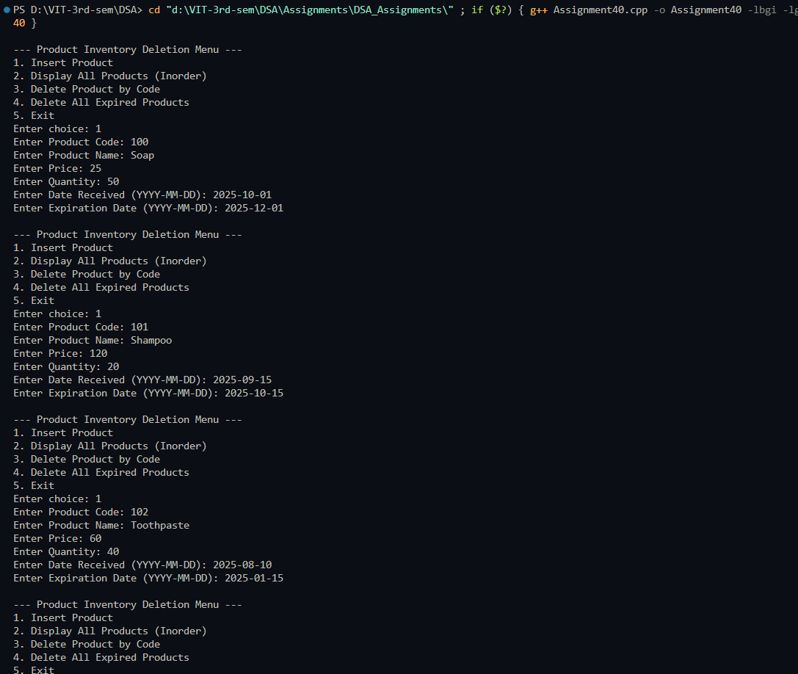
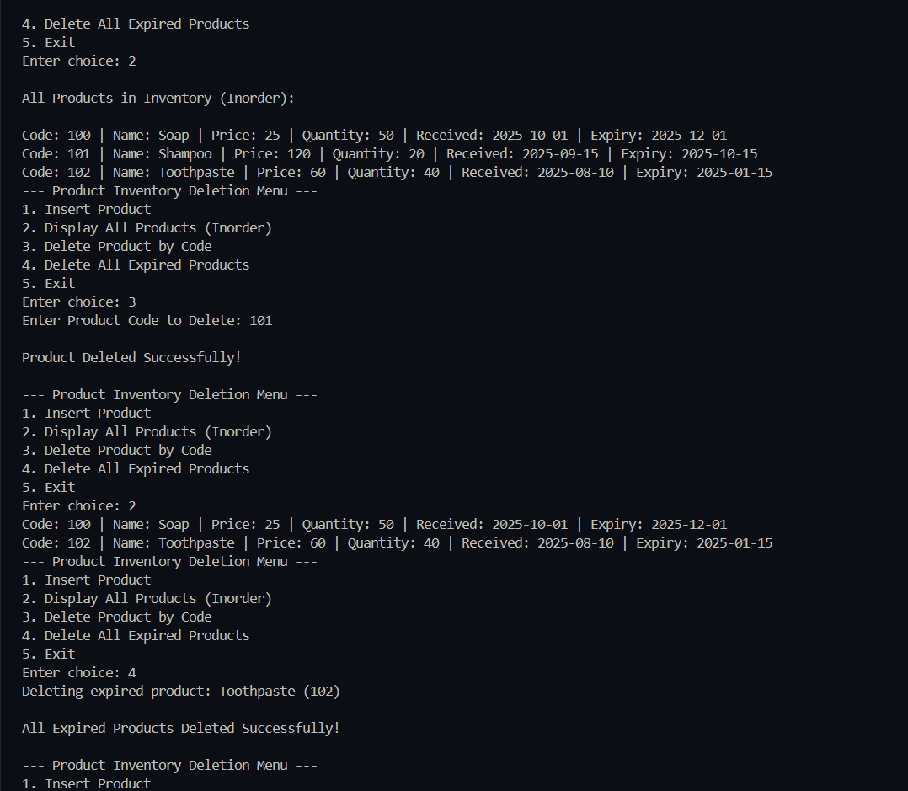
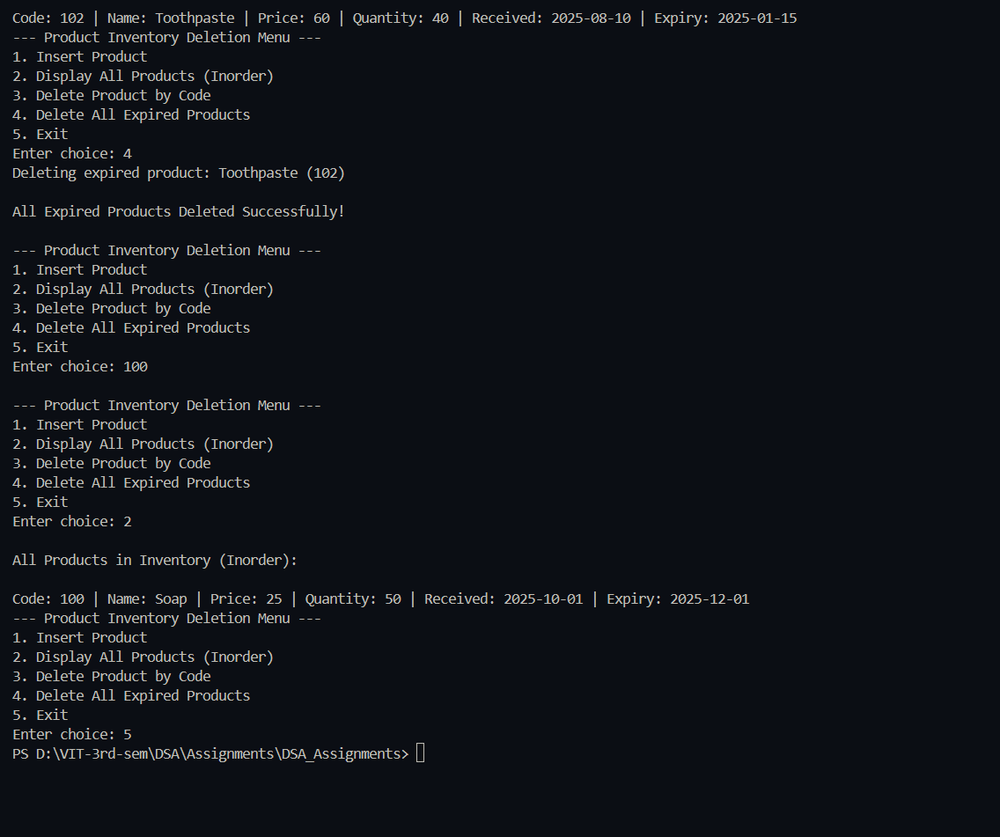

# Practical – Product Inventory Deletion using Binary Search Tree (BST)

**Name:** Sahil Ashok Khaire  
**Roll No.:** 13  
**Title:** Write a program to implement deletion operations in the Product Inventory System using a Search Tree.  

Each product must store the following information:  
- Unique Product Code  
- Product Name  
- Price  
- Quantity in Stock  
- Date Received  
- Expiration Date  

### Implement the following operations:
1. Delete a product using its unique product code.  
2. Delete all expired products based on the current date.  

---

## Theory

A **Binary Search Tree (BST)** is a hierarchical data structure that allows efficient searching, insertion, and deletion operations.  
Each node in a BST contains a **key**, and all keys in the left subtree are smaller than the node’s key, while those in the right subtree are larger.

In this practical, we maintain product details in a BST organized by **product code**.  
- **Delete by Code:** Removes a product using its unique identifier.  
- **Delete Expired Products:** Removes all nodes whose expiration date is earlier than the current date.  

This helps manage inventory efficiently by automatically cleaning outdated products and maintaining structured data storage.  

---

## Algorithm

### Algorithm: Delete Product by Code
1. Start  
2. If the tree is empty → return NULL.  
3. Search for the product code.  
4. If found:  
   - Case 1: Node has no child → delete directly.  
   - Case 2: Node has one child → replace node with its child.  
   - Case 3: Node has two children → find the inorder successor and replace values.  
5. Stop.  

### Algorithm: Delete All Expired Products
1. Traverse the BST recursively.  
2. Check if the product’s expiration date is less than the current date.  
3. If yes, delete the node using the delete function.  
4. Continue for both left and right subtrees.  
5. Stop.  

---

## Program

```cpp
#include <iostream>
#include <string>
#include <ctime>
using namespace std;

struct Product_sak {
    int code_sak;
    string name_sak;
    float price_sak;
    int quantity_sak;
    string dateReceived_sak;
    string expiryDate_sak;
    Product_sak *left_sak, *right_sak;
};

Product_sak* createNode_sak(int code, string name, float price, int qty, string rec, string exp) {
    Product_sak* newNode_sak = new Product_sak;
    newNode_sak->code_sak = code;
    newNode_sak->name_sak = name;
    newNode_sak->price_sak = price;
    newNode_sak->quantity_sak = qty;
    newNode_sak->dateReceived_sak = rec;
    newNode_sak->expiryDate_sak = exp;
    newNode_sak->left_sak = newNode_sak->right_sak = NULL;
    return newNode_sak;
}

Product_sak* insert_sak(Product_sak* root_sak, Product_sak* newNode_sak) {
    if (!root_sak)
        return newNode_sak;
    if (newNode_sak->code_sak < root_sak->code_sak)
        root_sak->left_sak = insert_sak(root_sak->left_sak, newNode_sak);
    else if (newNode_sak->code_sak > root_sak->code_sak)
        root_sak->right_sak = insert_sak(root_sak->right_sak, newNode_sak);
    else
        cout << "Duplicate Product Code not allowed!\n";
    return root_sak;
}

Product_sak* findMin_sak(Product_sak* node) {
    while (node && node->left_sak)
        node = node->left_sak;
    return node;
}

bool isExpired_sak(string expDate) {
    string current = "2025-11-02";
    return expDate < current;
}

Product_sak* deleteByCode_sak(Product_sak* root_sak, int code) {
    if (!root_sak) return NULL;

    if (code < root_sak->code_sak)
        root_sak->left_sak = deleteByCode_sak(root_sak->left_sak, code);
    else if (code > root_sak->code_sak)
        root_sak->right_sak = deleteByCode_sak(root_sak->right_sak, code);
    else {
        // Found node to delete
        if (!root_sak->left_sak && !root_sak->right_sak) {
            delete root_sak;
            return NULL;
        } else if (!root_sak->left_sak) {
            Product_sak* temp = root_sak->right_sak;
            delete root_sak;
            return temp;
        } else if (!root_sak->right_sak) {
            Product_sak* temp = root_sak->left_sak;
            delete root_sak;
            return temp;
        } else {
            Product_sak* temp = findMin_sak(root_sak->right_sak);
            root_sak->code_sak = temp->code_sak;
            root_sak->name_sak = temp->name_sak;
            root_sak->price_sak = temp->price_sak;
            root_sak->quantity_sak = temp->quantity_sak;
            root_sak->dateReceived_sak = temp->dateReceived_sak;
            root_sak->expiryDate_sak = temp->expiryDate_sak;
            root_sak->right_sak = deleteByCode_sak(root_sak->right_sak, temp->code_sak);
        }
    }
    return root_sak;
}

Product_sak* deleteExpired_sak(Product_sak* root_sak) {
    if (!root_sak) return NULL;

    root_sak->left_sak = deleteExpired_sak(root_sak->left_sak);
    root_sak->right_sak = deleteExpired_sak(root_sak->right_sak);

    if (isExpired_sak(root_sak->expiryDate_sak)) {
        cout << "Deleting expired product: " << root_sak->name_sak << " (" << root_sak->code_sak << ")\n";
        root_sak = deleteByCode_sak(root_sak, root_sak->code_sak);
    }
    return root_sak;
}

void inorder_sak(Product_sak* root_sak) {
    if (root_sak) {
        inorder_sak(root_sak->left_sak);
        cout << "\nCode: " << root_sak->code_sak
             << " | Name: " << root_sak->name_sak
             << " | Price: " << root_sak->price_sak
             << " | Quantity: " << root_sak->quantity_sak
             << " | Received: " << root_sak->dateReceived_sak
             << " | Expiry: " << root_sak->expiryDate_sak;
        inorder_sak(root_sak->right_sak);
    }
}

int main() {
    Product_sak* root_sak = NULL;
    int choice;
    do {
        cout << "\n--- Product Inventory Deletion Menu ---";
        cout << "\n1. Insert Product";
        cout << "\n2. Display All Products (Inorder)";
        cout << "\n3. Delete Product by Code";
        cout << "\n4. Delete All Expired Products";
        cout << "\n5. Exit";
        cout << "\nEnter choice: ";
        cin >> choice;

        if (choice == 1) {
            int code, qty;
            float price;
            string name, rec, exp;
            cout << "Enter Product Code: ";
            cin >> code;
            cout << "Enter Product Name: ";
            cin >> name;
            cout << "Enter Price: ";
            cin >> price;
            cout << "Enter Quantity: ";
            cin >> qty;
            cout << "Enter Date Received (YYYY-MM-DD): ";
            cin >> rec;
            cout << "Enter Expiration Date (YYYY-MM-DD): ";
            cin >> exp;
            root_sak = insert_sak(root_sak, createNode_sak(code, name, price, qty, rec, exp));
        }
        else if (choice == 2) {
            cout << "\nAll Products in Inventory (Inorder):\n";
            inorder_sak(root_sak);
        }
        else if (choice == 3) {
            int code;
            cout << "Enter Product Code to Delete: ";
            cin >> code;
            root_sak = deleteByCode_sak(root_sak, code);
            cout << "\nProduct Deleted Successfully!\n";
        }
        else if (choice == 4) {
            root_sak = deleteExpired_sak(root_sak);
            cout << "\nAll Expired Products Deleted Successfully!\n";
        }
    } while (choice != 5);
    return 0;
}
```

## Output



