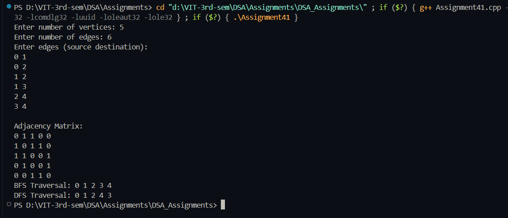

# Practical – Graph Traversals

**Name:** Sahil Ashok Khaire  
**Roll No.:** 13  
**Title:** Graph Representation using Adjacency Matrix and BFS/DFS Traversals  

- Accept an undirected graph from the user
- Represent the graph using an adjacency matrix
- Perform Breadth-First Search (BFS) traversal
- Perform Depth-First Search (DFS) traversal
- Display the traversal sequences

---

## Theory

A **Graph** is a non-linear data structure consisting of vertices (nodes) and edges connecting these vertices. Graphs are used to represent networks like social connections, computer networks, and transportation systems.

The **Adjacency Matrix** is a 2D array of size V×V where V is the number of vertices. The entry at row i and column j is 1 if there is an edge between vertex i and vertex j, otherwise 0. For undirected graphs, the matrix is symmetric.

**BFS (Breadth-First Search)** is a graph traversal algorithm that explores all vertices at the present depth level before moving to vertices at the next depth level. It uses a **Queue** data structure and is useful for finding the shortest path in unweighted graphs.

**DFS (Depth-First Search)** is a graph traversal algorithm that explores as far as possible along each branch before backtracking. It uses **Recursion** or a **Stack** data structure and is useful for topological sorting, cycle detection, and path finding.

---

## Algorithm

### Algorithm: Create Adjacency Matrix
1. Read the number of vertices `vertices_sak` and edges `edges_sak`
2. Initialize a 2D array `adjMatrix_sak` of size `vertices_sak × vertices_sak` with zeros
3. For each edge:
   - Read the source `src_sak` and destination `dest_sak`
   - Set `adjMatrix_sak[src_sak][dest_sak] = 1`
   - Set `adjMatrix_sak[dest_sak][src_sak] = 1` (for undirected graph)
4. Display the adjacency matrix

### Algorithm: BFS Traversal
1. Create a visited array `visited_sak` of size `vertices_sak` initialized to false
2. Create a queue `queue_sak` for BFS
3. Start from vertex 0, mark it visited and enqueue it
4. While queue is not empty:
   - Dequeue a vertex `current_sak`
   - Display `current_sak`
   - For all adjacent vertices of `current_sak`:
     - If not visited, mark visited and enqueue

### Algorithm: DFS Traversal
1. Create a visited array `visited_sak` of size `vertices_sak` initialized to false
2. Start DFS from vertex 0:
   - Mark current vertex `v_sak` as visited and display it
   - For all adjacent vertices of `v_sak`:
     - If not visited, recursively call DFS

---

## Program

```cpp
#include <iostream>
#include <queue>
using namespace std;

class Graph_sak {
private:
    int vertices_sak;
    int** adjMatrix_sak;
    
public:
    Graph_sak(int v_sak) {
        vertices_sak = v_sak;
        adjMatrix_sak = new int*[vertices_sak];
        for (int i_sak = 0; i_sak < vertices_sak; i_sak++) {
            adjMatrix_sak[i_sak] = new int[vertices_sak];
            for (int j_sak = 0; j_sak < vertices_sak; j_sak++) {
                adjMatrix_sak[i_sak][j_sak] = 0;
            }
        }
    }
    
    void addEdge_sak(int src_sak, int dest_sak) {
        adjMatrix_sak[src_sak][dest_sak] = 1;
        adjMatrix_sak[dest_sak][src_sak] = 1;
    }
    
    void displayMatrix_sak() {
        cout << "\nAdjacency Matrix:\n";
        for (int i_sak = 0; i_sak < vertices_sak; i_sak++) {
            for (int j_sak = 0; j_sak < vertices_sak; j_sak++) {
                cout << adjMatrix_sak[i_sak][j_sak] << " ";
            }
            cout << endl;
        }
    }
    
    void BFS_sak(int startVertex_sak) {
        bool* visited_sak = new bool[vertices_sak];
        for (int i_sak = 0; i_sak < vertices_sak; i_sak++) {
            visited_sak[i_sak] = false;
        }
        
        queue<int> queue_sak;
        visited_sak[startVertex_sak] = true;
        queue_sak.push(startVertex_sak);
        
        cout << "BFS Traversal: ";
        while (!queue_sak.empty()) {
            int current_sak = queue_sak.front();
            cout << current_sak << " ";
            queue_sak.pop();
            
            for (int i_sak = 0; i_sak < vertices_sak; i_sak++) {
                if (adjMatrix_sak[current_sak][i_sak] == 1 && !visited_sak[i_sak]) {
                    visited_sak[i_sak] = true;
                    queue_sak.push(i_sak);
                }
            }
        }
        cout << endl;
        delete[] visited_sak;
    }
    
    void DFSUtil_sak(int v_sak, bool visited_sak[]) {
        visited_sak[v_sak] = true;
        cout << v_sak << " ";
        
        for (int i_sak = 0; i_sak < vertices_sak; i_sak++) {
            if (adjMatrix_sak[v_sak][i_sak] == 1 && !visited_sak[i_sak]) {
                DFSUtil_sak(i_sak, visited_sak);
            }
        }
    }
    
    void DFS_sak(int startVertex_sak) {
        bool* visited_sak = new bool[vertices_sak];
        for (int i_sak = 0; i_sak < vertices_sak; i_sak++) {
            visited_sak[i_sak] = false;
        }
        
        cout << "DFS Traversal: ";
        DFSUtil_sak(startVertex_sak, visited_sak);
        cout << endl;
        delete[] visited_sak;
    }
    
    ~Graph_sak() {
        for (int i_sak = 0; i_sak < vertices_sak; i_sak++) {
            delete[] adjMatrix_sak[i_sak];
        }
        delete[] adjMatrix_sak;
    }
};

int main() {
    int vertices_sak, edges_sak;
    
    cout << "Enter number of vertices: ";
    cin >> vertices_sak;
    
    cout << "Enter number of edges: ";
    cin >> edges_sak;
    
    Graph_sak g_sak(vertices_sak);
    
    cout << "Enter edges (source destination):\n";
    for (int i_sak = 0; i_sak < edges_sak; i_sak++) {
        int src_sak, dest_sak;
        cin >> src_sak >> dest_sak;
        g_sak.addEdge_sak(src_sak, dest_sak);
    }
    
    g_sak.displayMatrix_sak();
    g_sak.BFS_sak(0);
    g_sak.DFS_sak(0);
    
    return 0;
}
```

## Output
