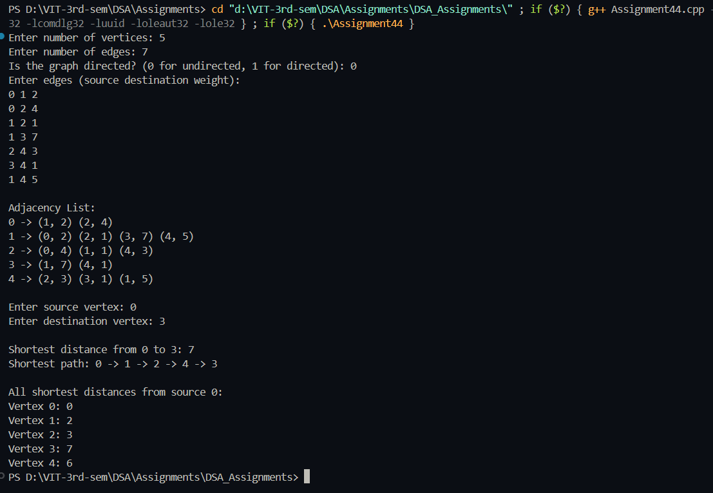

# Practical – Dijkstra's Algorithm

**Name:** Sahil Ashok Khaire  
**Roll No.:** 13  
**Title:** Implementation of Dijkstra's Algorithm to Find Shortest Path  

- Accept a weighted directed/undirected graph from the user
- Represent the graph using adjacency list
- Implement Dijkstra's algorithm to find shortest path between two nodes
- Display the shortest distance and path between source and destination

---

## Theory

**Dijkstra's Algorithm** is a greedy algorithm that finds the shortest path between nodes in a graph with non-negative edge weights. It works by maintaining a set of vertices whose shortest distance from the source is known, and iteratively selecting the vertex with the minimum distance from the source.

The algorithm uses a **priority queue** (min-heap) to efficiently select the next vertex with the smallest known distance. It maintains two arrays:
- `dist_sak`: Stores the shortest distance from source to each vertex
- `visited_sak`: Tracks which vertices have been processed

Key properties:
- Works only with non-negative edge weights
- Time complexity: O((V+E) log V) with adjacency list and priority queue
- Uses **Greedy Approach** by always selecting the vertex with minimum distance

Key terms: **Dijkstra's Algorithm**, **Shortest Path**, **Priority Queue**, **Greedy Algorithm**, **Non-negative Weights**

---

## Algorithm

### Algorithm: Create Adjacency List
1. Read the number of vertices `vertices_sak` and edges `edges_sak`
2. Create an array of lists `adjList_sak` of size `vertices_sak`
3. For each weighted edge:
   - Read source `u_sak`, destination `v_sak`, and weight `weight_sak`
   - Add `(v_sak, weight_sak)` to `adjList_sak[u_sak]`
   - For undirected graph, also add `(u_sak, weight_sak)` to `adjList_sak[v_sak]`

### Algorithm: Dijkstra's Shortest Path
1. Read source `src_sak` and destination `dest_sak`
2. Initialize:
   - Distance array `dist_sak` with infinity for all vertices
   - Visited array `visited_sak` with false for all vertices
   - Parent array `parent_sak` to reconstruct path
3. Set `dist_sak[src_sak] = 0` and `parent_sak[src_sak] = -1`
4. Create min-heap priority queue `pq_sak` storing (distance, vertex)
5. Push `(0, src_sak)` to `pq_sak`
6. While `pq_sak` is not empty:
   - Extract vertex `u_sak` with minimum distance from `pq_sak`
   - If `u_sak` is visited, continue to next iteration
   - Mark `u_sak` as visited
   - For each neighbor `v_sak` of `u_sak`:
     - If `v_sak` is not visited and new distance is smaller:
       - Update `dist_sak[v_sak] = dist_sak[u_sak] + weight_sak`
       - Update `parent_sak[v_sak] = u_sak`
       - Push `(dist_sak[v_sak], v_sak)` to `pq_sak`
7. Display shortest distance and path from `src_sak` to `dest_sak`

### Algorithm: Path Reconstruction
1. Start from destination `dest_sak`
2. Use parent array to backtrack to source
3. Reverse the path for correct order
4. Display the complete path

---

## Program

```cpp
#include <iostream>
#include <vector>
#include <climits>
#include <algorithm>
using namespace std;

class Graph_sak {
private:
    int vertices_sak;
    vector<vector<pair<int, int>>> adjList_sak;

public:
    Graph_sak(int v_sak) {
        vertices_sak = v_sak;
        adjList_sak.resize(vertices_sak);
    }

    void addEdge_sak(int u_sak, int v_sak, int weight_sak, bool directed_sak = false) {
        adjList_sak[u_sak].push_back({v_sak, weight_sak});
        if (!directed_sak) {
            adjList_sak[v_sak].push_back({u_sak, weight_sak});
        }
    }

    void dijkstra_sak(int src_sak, int dest_sak) {
        vector<int> dist_sak(vertices_sak, INT_MAX);
        vector<bool> visited_sak(vertices_sak, false);
        vector<int> parent_sak(vertices_sak, -1);

        dist_sak[src_sak] = 0;

        for (int count = 0; count < vertices_sak - 1; count++) {
            // Find vertex with minimum distance not yet processed
            int u_sak = -1;
            int minDist_sak = INT_MAX;
            for (int i_sak = 0; i_sak < vertices_sak; i_sak++) {
                if (!visited_sak[i_sak] && dist_sak[i_sak] < minDist_sak) {
                    minDist_sak = dist_sak[i_sak];
                    u_sak = i_sak;
                }
            }

            if (u_sak == -1) break;
            visited_sak[u_sak] = true;

            for (auto &neighbor_sak : adjList_sak[u_sak]) {
                int v_sak = neighbor_sak.first;
                int weight_sak = neighbor_sak.second;

                if (!visited_sak[v_sak] && dist_sak[u_sak] != INT_MAX &&
                    dist_sak[u_sak] + weight_sak < dist_sak[v_sak]) {
                    dist_sak[v_sak] = dist_sak[u_sak] + weight_sak;
                    parent_sak[v_sak] = u_sak;
                }
            }
        }

        if (dist_sak[dest_sak] == INT_MAX) {
            cout << "No path exists from " << src_sak << " to " << dest_sak << endl;
            return;
        }

        cout << "\nShortest distance from " << src_sak << " to " << dest_sak << ": " << dist_sak[dest_sak] << endl;

        vector<int> path_sak;
        for (int v_sak = dest_sak; v_sak != -1; v_sak = parent_sak[v_sak]) {
            path_sak.push_back(v_sak);
        }
        reverse(path_sak.begin(), path_sak.end());

        cout << "Shortest path: ";
        for (size_t i_sak = 0; i_sak < path_sak.size(); i_sak++) {
            cout << path_sak[i_sak];
            if (i_sak != path_sak.size() - 1)
                cout << " -> ";
        }
        cout << endl;

        cout << "\nAll shortest distances from source " << src_sak << ":\n";
        for (int i_sak = 0; i_sak < vertices_sak; i_sak++) {
            cout << "Vertex " << i_sak << ": ";
            if (dist_sak[i_sak] == INT_MAX)
                cout << "INF";
            else
                cout << dist_sak[i_sak];
            cout << endl;
        }
    }

    void displayGraph_sak() {
        cout << "\nAdjacency List:\n";
        for (int i_sak = 0; i_sak < vertices_sak; i_sak++) {
            cout << i_sak << " -> ";
            for (auto &neighbor_sak : adjList_sak[i_sak]) {
                cout << "(" << neighbor_sak.first << ", " << neighbor_sak.second << ") ";
            }
            cout << endl;
        }
    }
};

int main() {
    int vertices_sak, edges_sak;
    bool directed_sak;

    cout << "Enter number of vertices: ";
    cin >> vertices_sak;

    cout << "Enter number of edges: ";
    cin >> edges_sak;

    cout << "Is the graph directed? (0 for undirected, 1 for directed): ";
    cin >> directed_sak;

    Graph_sak g_sak(vertices_sak);

    cout << "Enter edges (source destination weight):\n";
    for (int i_sak = 0; i_sak < edges_sak; i_sak++) {
        int u_sak, v_sak, weight_sak;
        cin >> u_sak >> v_sak >> weight_sak;
        g_sak.addEdge_sak(u_sak, v_sak, weight_sak, directed_sak);
    }

    g_sak.displayGraph_sak();

    int src_sak, dest_sak;
    cout << "\nEnter source vertex: ";
    cin >> src_sak;
    cout << "Enter destination vertex: ";
    cin >> dest_sak;

    g_sak.dijkstra_sak(src_sak, dest_sak);

    return 0;
}

```

## Output
