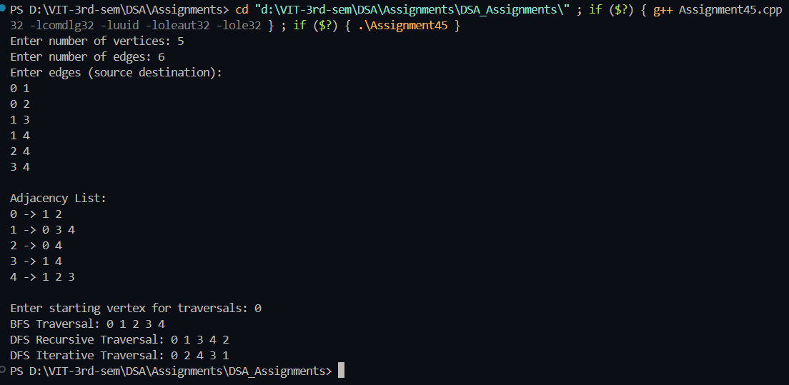

# Practical – Graph Traversals with Adjacency List

**Name:** Sahil Ashok Khaire  
**Roll No.:** 13  
**Title:** Graph Representation using Adjacency List and BFS/DFS Traversals  

- Accept an undirected graph from the user
- Represent the graph using adjacency list
- Perform Breadth-First Search (BFS) traversal
- Perform Depth-First Search (DFS) traversal
- Display the traversal sequences

---

## Theory

A **Graph** is a non-linear data structure consisting of vertices (nodes) and edges connecting these vertices. Graphs are used to represent networks like social connections, computer networks, and transportation systems.

The **Adjacency List** is a collection of lists or arrays used to represent a graph. Each vertex has a list of its adjacent vertices. This representation is memory efficient for sparse graphs and allows for efficient traversal of neighbors.

**BFS (Breadth-First Search)** is a graph traversal algorithm that explores all vertices at the present depth level before moving to vertices at the next depth level. It uses a **Queue** data structure and is useful for finding the shortest path in unweighted graphs.

**DFS (Depth-First Search)** is a graph traversal algorithm that explores as far as possible along each branch before backtracking. It uses **Recursion** or a **Stack** data structure and is useful for topological sorting, cycle detection, and path finding.

Key terms: **Graph**, **Adjacency List**, **BFS**, **DFS**, **Queue**, **Stack**, **Recursion**

---

## Algorithm

### Algorithm: Create Adjacency List
1. Read the number of vertices `vertices_sak` and edges `edges_sak`
2. Create an array of lists `adjList_sak` of size `vertices_sak`
3. For each edge:
   - Read the source `src_sak` and destination `dest_sak`
   - Add `dest_sak` to `adjList_sak[src_sak]`
   - Add `src_sak` to `adjList_sak[dest_sak]` (for undirected graph)
4. Display the adjacency list

### Algorithm: BFS Traversal
1. Create a visited array `visited_sak` of size `vertices_sak` initialized to false
2. Create a queue `queue_sak` for BFS
3. Start from vertex 0, mark it visited and enqueue it
4. While queue is not empty:
   - Dequeue a vertex `current_sak`
   - Display `current_sak`
   - For all adjacent vertices of `current_sak`:
     - If not visited, mark visited and enqueue

### Algorithm: DFS Traversal
1. Create a visited array `visited_sak` of size `vertices_sak` initialized to false
2. Start DFS from vertex 0:
   - Mark current vertex `v_sak` as visited and display it
   - For all adjacent vertices of `v_sak`:
     - If not visited, recursively call DFS

### Algorithm: Iterative DFS
1. Create a visited array `visited_sak` of size `vertices_sak` initialized to false
2. Create a stack `stack_sak` for DFS
3. Push starting vertex to stack and mark visited
4. While stack is not empty:
   - Pop vertex `current_sak` from stack
   - Display `current_sak`
   - Push all unvisited adjacent vertices to stack and mark visited

---

## Program

```cpp
#include <iostream>
#include <vector>
using namespace std;

class Graph_sak {
private:
    int vertices_sak;
    vector<vector<int>> adjList_sak;

public:
    Graph_sak(int v_sak) {
        vertices_sak = v_sak;
        adjList_sak.resize(vertices_sak);
    }

    void addEdge_sak(int src_sak, int dest_sak) {
        adjList_sak[src_sak].push_back(dest_sak);
        adjList_sak[dest_sak].push_back(src_sak);
    }

    void displayAdjList_sak() {
        cout << "\nAdjacency List:\n";
        for (int i_sak = 0; i_sak < vertices_sak; i_sak++) {
            cout << i_sak << " -> ";
            for (int neighbor_sak : adjList_sak[i_sak]) {
                cout << neighbor_sak << " ";
            }
            cout << endl;
        }
    }

    class MyQueue {
        int front, rear, size;
        vector<int> arr;
    public:
        MyQueue(int capacity) {
            arr.resize(capacity);
            front = rear = 0;
            size = capacity;
        }
        bool isEmpty() { return front == rear; }
        void enqueue(int val) {
            if (rear < size)
                arr[rear++] = val;
        }
        int dequeue() {
            if (!isEmpty())
                return arr[front++];
            return -1;
        }
    };

    class MyStack {
        int top;
        vector<int> arr;
    public:
        MyStack(int capacity) {
            arr.resize(capacity);
            top = -1;
        }
        bool isEmpty() { return top == -1; }
        void push(int val) {
            arr[++top] = val;
        }
        int pop() {
            if (!isEmpty())
                return arr[top--];
            return -1;
        }
    };

    void BFS_sak(int startVertex_sak) {
        vector<bool> visited_sak(vertices_sak, false);
        MyQueue queue_sak(vertices_sak);

        visited_sak[startVertex_sak] = true;
        queue_sak.enqueue(startVertex_sak);

        cout << "BFS Traversal: ";
        while (!queue_sak.isEmpty()) {
            int current_sak = queue_sak.dequeue();
            cout << current_sak << " ";

            for (int neighbor_sak : adjList_sak[current_sak]) {
                if (!visited_sak[neighbor_sak]) {
                    visited_sak[neighbor_sak] = true;
                    queue_sak.enqueue(neighbor_sak);
                }
            }
        }
        cout << endl;
    }

    void DFSUtil_sak(int v_sak, vector<bool>& visited_sak) {
        visited_sak[v_sak] = true;
        cout << v_sak << " ";

        for (int neighbor_sak : adjList_sak[v_sak]) {
            if (!visited_sak[neighbor_sak]) {
                DFSUtil_sak(neighbor_sak, visited_sak);
            }
        }
    }

    void DFSRecursive_sak(int startVertex_sak) {
        vector<bool> visited_sak(vertices_sak, false);
        cout << "DFS Recursive Traversal: ";
        DFSUtil_sak(startVertex_sak, visited_sak);
        cout << endl;
    }

    void DFSIterative_sak(int startVertex_sak) {
        vector<bool> visited_sak(vertices_sak, false);
        MyStack stack_sak(vertices_sak);

        stack_sak.push(startVertex_sak);
        visited_sak[startVertex_sak] = true;

        cout << "DFS Iterative Traversal: ";
        while (!stack_sak.isEmpty()) {
            int current_sak = stack_sak.pop();
            cout << current_sak << " ";

            for (int neighbor_sak : adjList_sak[current_sak]) {
                if (!visited_sak[neighbor_sak]) {
                    visited_sak[neighbor_sak] = true;
                    stack_sak.push(neighbor_sak);
                }
            }
        }
        cout << endl;
    }
};

int main() {
    int vertices_sak, edges_sak;

    cout << "Enter number of vertices: ";
    cin >> vertices_sak;

    cout << "Enter number of edges: ";
    cin >> edges_sak;

    Graph_sak g_sak(vertices_sak);

    cout << "Enter edges (source destination):\n";
    for (int i_sak = 0; i_sak < edges_sak; i_sak++) {
        int src_sak, dest_sak;
        cin >> src_sak >> dest_sak;
        g_sak.addEdge_sak(src_sak, dest_sak);
    }

    g_sak.displayAdjList_sak();

    int startVertex_sak;
    cout << "\nEnter starting vertex for traversals: ";
    cin >> startVertex_sak;

    g_sak.BFS_sak(startVertex_sak);
    g_sak.DFSRecursive_sak(startVertex_sak);
    g_sak.DFSIterative_sak(startVertex_sak);

    return 0;
}
```

## Output
