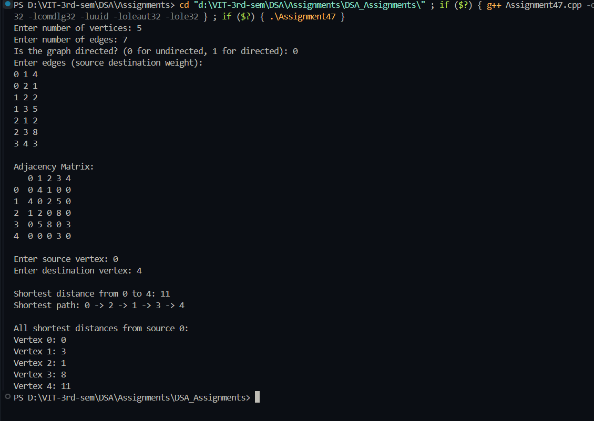

# Practical – Dijkstra's Algorithm

**Name:** Sahil Ashok Khaire  
**Roll No.:** 13  
**Title:** Implementation of Dijkstra's Algorithm to Find Shortest Path using Adjacency Matrix  

- Accept a weighted graph from the user (directed or undirected)
- Represent the graph using adjacency matrix
- Implement Dijkstra's algorithm to find shortest path between two nodes
- Display the shortest distance and complete path
- Show all shortest distances from source vertex

---

## Theory

**Dijkstra's Algorithm** is a greedy algorithm that finds the shortest path between nodes in a graph with non-negative edge weights. It works by maintaining a set of vertices whose shortest distance from the source is known, and iteratively selecting the vertex with the minimum distance from the source.

The algorithm uses a **priority queue** (min-heap) to efficiently select the next vertex with the smallest known distance. It maintains:
- `dist_sak`: Stores shortest distance from source to each vertex
- `visited_sak`: Tracks which vertices have been processed
- `parent_sak`: Stores the previous vertex in shortest path for reconstruction

The **Adjacency Matrix** representation uses a 2D array where `matrix[i][j]` represents the weight of edge from vertex i to vertex j. A value of 0 indicates no direct edge.

**Key Properties**:
- Works only with non-negative edge weights
- Time complexity: O(V²) with adjacency matrix
- Uses **Greedy Approach** by always selecting vertex with minimum distance
- Guaranteed to find shortest path in weighted graphs with non-negative weights

Key terms: **Dijkstra's Algorithm**, **Shortest Path**, **Priority Queue**, **Greedy Algorithm**, **Non-negative Weights**, **Adjacency Matrix**

---

## Algorithm

### Algorithm: Create Adjacency Matrix
1. Read the number of vertices `vertices_sak`
2. Initialize a 2D array `adjMatrix_sak` of size `vertices_sak × vertices_sak` with zeros
3. For each weighted edge:
   - Read source `u_sak`, destination `v_sak`, and weight `weight_sak`
   - Set `adjMatrix_sak[u_sak][v_sak] = weight_sak`
   - If undirected graph, set `adjMatrix_sak[v_sak][u_sak] = weight_sak`

### Algorithm: Dijkstra's Shortest Path
1. Read source `src_sak` and destination `dest_sak`
2. Initialize arrays:
   - `dist_sak`: All values set to INF except `dist_sak[src_sak] = 0`
   - `visited_sak`: All values set to false
   - `parent_sak`: All values set to -1
3. For each vertex:
   - Find vertex `u_sak` with minimum distance that is not visited
   - Mark `u_sak` as visited
   - If `u_sak` is destination, break
   - For each neighbor `v_sak` of `u_sak`:
     - If `v_sak` is not visited and there's an edge from `u_sak` to `v_sak`:
       - Calculate new distance = `dist_sak[u_sak] + adjMatrix_sak[u_sak][v_sak]`
       - If new distance < `dist_sak[v_sak]`:
         - Update `dist_sak[v_sak]` and `parent_sak[v_sak] = u_sak`

### Algorithm: Path Reconstruction
1. Start from destination `dest_sak`
2. Use parent array to backtrack to source
3. Store path in reverse order
4. Reverse the path for correct sequence
5. Display the complete path

### Algorithm: Display Results
1. If no path exists (`dist_sak[dest_sak] == INF`), display appropriate message
2. Otherwise, display shortest distance and path
3. Display all shortest distances from source vertex

---

## Program

```cpp
#include <iostream>
#include <vector>
#include <climits>
#include <algorithm>
using namespace std;

class Graph_sak {
private:
    int vertices_sak;
    vector<vector<int>> adjMatrix_sak;
    
public:
    Graph_sak(int v_sak) {
        vertices_sak = v_sak;
        adjMatrix_sak.resize(vertices_sak, vector<int>(vertices_sak, 0));
    }
    
    void addEdge_sak(int u_sak, int v_sak, int weight_sak, bool directed_sak = false) {
        adjMatrix_sak[u_sak][v_sak] = weight_sak;
        if (!directed_sak) {
            adjMatrix_sak[v_sak][u_sak] = weight_sak;
        }
    }
    
    int findMinDistance_sak(vector<int>& dist_sak, vector<bool>& visited_sak) {
        int min_sak = INT_MAX;
        int minIndex_sak = -1;
        
        for (int v_sak = 0; v_sak < vertices_sak; v_sak++) {
            if (!visited_sak[v_sak] && dist_sak[v_sak] <= min_sak) {
                min_sak = dist_sak[v_sak];
                minIndex_sak = v_sak;
            }
        }
        
        return minIndex_sak;
    }
    
    void dijkstra_sak(int src_sak, int dest_sak) {
        vector<int> dist_sak(vertices_sak, INT_MAX);
        vector<bool> visited_sak(vertices_sak, false);
        vector<int> parent_sak(vertices_sak, -1);
        
        dist_sak[src_sak] = 0;
        
        for (int count_sak = 0; count_sak < vertices_sak - 1; count_sak++) {
            int u_sak = findMinDistance_sak(dist_sak, visited_sak);
            
            if (u_sak == -1) break;
            
            visited_sak[u_sak] = true;
            
            if (u_sak == dest_sak) break;
            
            for (int v_sak = 0; v_sak < vertices_sak; v_sak++) {
                if (!visited_sak[v_sak] && adjMatrix_sak[u_sak][v_sak] != 0 && 
                    dist_sak[u_sak] != INT_MAX && 
                    dist_sak[u_sak] + adjMatrix_sak[u_sak][v_sak] < dist_sak[v_sak]) {
                    dist_sak[v_sak] = dist_sak[u_sak] + adjMatrix_sak[u_sak][v_sak];
                    parent_sak[v_sak] = u_sak;
                }
            }
        }
        
        displayResults_sak(src_sak, dest_sak, dist_sak, parent_sak);
    }
    
    void displayResults_sak(int src_sak, int dest_sak, vector<int>& dist_sak, vector<int>& parent_sak) {
        if (dist_sak[dest_sak] == INT_MAX) {
            cout << "No path exists from " << src_sak << " to " << dest_sak << endl;
            return;
        }
        
        cout << "\nShortest distance from " << src_sak << " to " << dest_sak << ": " << dist_sak[dest_sak] << endl;
        
        vector<int> path_sak;
        for (int v_sak = dest_sak; v_sak != -1; v_sak = parent_sak[v_sak]) {
            path_sak.push_back(v_sak);
        }
        reverse(path_sak.begin(), path_sak.end());
        
        cout << "Shortest path: ";
        for (size_t i_sak = 0; i_sak < path_sak.size(); i_sak++) {
            cout << path_sak[i_sak];
            if (i_sak != path_sak.size() - 1) {
                cout << " -> ";
            }
        }
        cout << endl;
        
        cout << "\nAll shortest distances from source " << src_sak << ":\n";
        for (int i_sak = 0; i_sak < vertices_sak; i_sak++) {
            cout << "Vertex " << i_sak << ": ";
            if (dist_sak[i_sak] == INT_MAX) {
                cout << "INF";
            } else {
                cout << dist_sak[i_sak];
            }
            cout << endl;
        }
    }
    
    void displayMatrix_sak() {
        cout << "\nAdjacency Matrix:\n";
        cout << "   ";
        for (int i_sak = 0; i_sak < vertices_sak; i_sak++) {
            cout << i_sak << " ";
        }
        cout << endl;
        
        for (int i_sak = 0; i_sak < vertices_sak; i_sak++) {
            cout << i_sak << "  ";
            for (int j_sak = 0; j_sak < vertices_sak; j_sak++) {
                if (adjMatrix_sak[i_sak][j_sak] == 0 && i_sak != j_sak) {
                    cout << "0 ";
                } else {
                    cout << adjMatrix_sak[i_sak][j_sak] << " ";
                }
            }
            cout << endl;
        }
    }
};

int main() {
    int vertices_sak, edges_sak;
    bool directed_sak;
    
    cout << "Enter number of vertices: ";
    cin >> vertices_sak;
    
    cout << "Enter number of edges: ";
    cin >> edges_sak;
    
    cout << "Is the graph directed? (0 for undirected, 1 for directed): ";
    cin >> directed_sak;
    
    Graph_sak g_sak(vertices_sak);
    
    cout << "Enter edges (source destination weight):\n";
    for (int i_sak = 0; i_sak < edges_sak; i_sak++) {
        int u_sak, v_sak, weight_sak;
        cin >> u_sak >> v_sak >> weight_sak;
        g_sak.addEdge_sak(u_sak, v_sak, weight_sak, directed_sak);
    }
    
    g_sak.displayMatrix_sak();
    
    int src_sak, dest_sak;
    cout << "\nEnter source vertex: ";
    cin >> src_sak;
    cout << "Enter destination vertex: ";
    cin >> dest_sak;
    
    g_sak.dijkstra_sak(src_sak, dest_sak);
    
    return 0;
}
```

## Output
