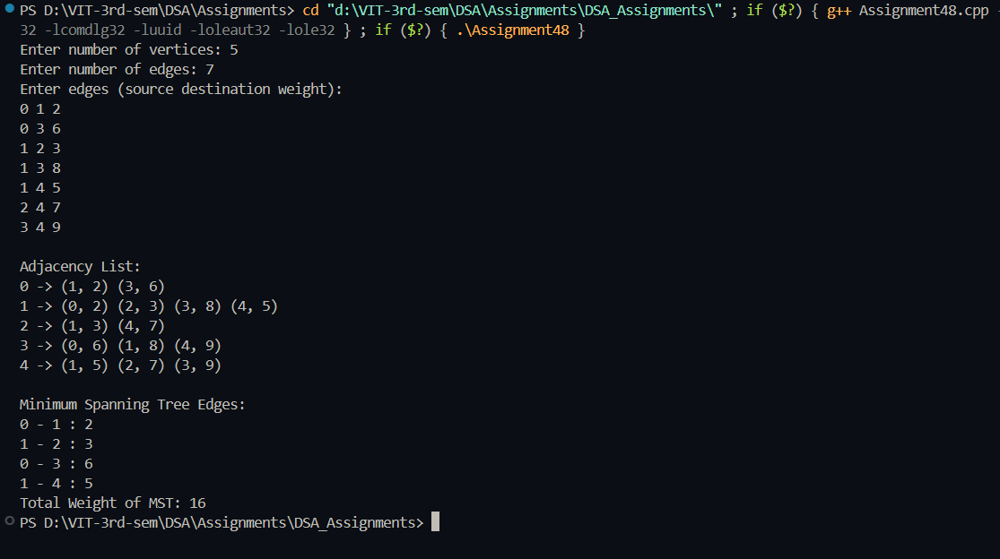

# Practical – Prim's Algorithm

**Name:** Sahil Ashok Khaire  
**Roll No.:** 13  
**Title:** Implementation of Prim's Algorithm to Find Minimum Spanning Tree using Adjacency List  

- Accept a weighted undirected graph from the user
- Represent the graph using adjacency list
- Implement Prim's algorithm to find Minimum Spanning Tree (MST)
- Use priority queue for efficient edge selection
- Display the edges and total weight of the MST

---

## Theory

A **Minimum Spanning Tree (MST)** is a subset of edges of a connected, weighted, undirected graph that connects all vertices together without any cycles and with the minimum possible total edge weight.

**Prim's Algorithm** is a greedy algorithm that finds a minimum spanning tree by starting from an arbitrary vertex and repeatedly adding the cheapest possible connection from the tree to another vertex. The algorithm maintains a set of vertices included in the MST and always selects the edge with the minimum weight that connects a vertex in the MST to a vertex outside the MST.

The algorithm uses a **priority queue** (min-heap) to efficiently select the next edge with the minimum weight. The **Adjacency List** representation is used for efficient storage and traversal of the graph, especially for sparse graphs.

**Time Complexity**: O(E log V) using adjacency list and priority queue  
**Space Complexity**: O(V + E) for adjacency list storage

Key terms: **MST**, **Prim's Algorithm**, **Priority Queue**, **Greedy Algorithm**, **Adjacency List**, **Min-Heap**

---

## Algorithm

### Algorithm: Create Adjacency List
1. Read the number of vertices `vertices_sak` and edges `edges_sak`
2. Create an array of lists `adjList_sak` of size `vertices_sak`
3. Each list element is a pair `(vertex, weight)`
4. For each weighted edge:
   - Read source `u_sak`, destination `v_sak`, and weight `weight_sak`
   - Add `(v_sak, weight_sak)` to `adjList_sak[u_sak]`
   - Add `(u_sak, weight_sak)` to `adjList_sak[v_sak]` (undirected graph)

### Algorithm: Prim's MST
1. Create three arrays:
   - `key_sak`: Minimum weight to connect each vertex to MST (initialize with INF)
   - `inMST_sak`: Track if vertex is in MST (initialize with false)
   - `parent_sak`: Store parent of each vertex in MST (initialize with -1)
2. Initialize `key_sak[0] = 0`
3. Create min-heap priority queue `pq_sak` storing `(key, vertex)`
4. Push `(0, 0)` to `pq_sak`
5. While `pq_sak` is not empty:
   - Extract vertex `u_sak` with minimum key from `pq_sak`
   - If `u_sak` is already in MST, continue
   - Mark `u_sak` in MST
   - For each neighbor `v_sak` of `u_sak`:
     - If `v_sak` not in MST and edge weight < `key_sak[v_sak]`:
       - Update `key_sak[v_sak] = weight_sak`
       - Update `parent_sak[v_sak] = u_sak`
       - Push `(key_sak[v_sak], v_sak)` to `pq_sak`
6. Calculate total weight and display MST edges

### Algorithm: Display MST
1. Initialize `totalWeight_sak = 0`
2. For each vertex from 1 to `vertices_sak-1`:
   - Display edge: `parent_sak[i] - i` with weight `key_sak[i]`
   - Add `key_sak[i]` to `totalWeight_sak`
3. Display total weight of MST

---

## Program

```cpp
#include <iostream>
#include <vector>
#include <climits>
using namespace std;

class Graph_sak {
private:
    int vertices_sak;
    vector<vector<pair<int, int>>> adjList_sak;

public:
    Graph_sak(int v_sak) {
        vertices_sak = v_sak;
        adjList_sak.resize(vertices_sak);
    }

    void addEdge_sak(int u_sak, int v_sak, int weight_sak) {
        adjList_sak[u_sak].push_back({v_sak, weight_sak});
        adjList_sak[v_sak].push_back({u_sak, weight_sak});
    }

    void primMST_sak() {
        vector<int> key_sak(vertices_sak, INT_MAX);
        vector<bool> inMST_sak(vertices_sak, false);
        vector<int> parent_sak(vertices_sak, -1);

        key_sak[0] = 0;

        for (int count_sak = 0; count_sak < vertices_sak - 1; count_sak++) {
            int u_sak = -1;
            int minKey_sak = INT_MAX;

            // Find vertex with minimum key value not in MST
            for (int v_sak = 0; v_sak < vertices_sak; v_sak++) {
                if (!inMST_sak[v_sak] && key_sak[v_sak] < minKey_sak) {
                    minKey_sak = key_sak[v_sak];
                    u_sak = v_sak;
                }
            }

            if (u_sak == -1)
                break;

            inMST_sak[u_sak] = true;

            for (auto neighbor_sak : adjList_sak[u_sak]) {
                int v_sak = neighbor_sak.first;
                int weight_sak = neighbor_sak.second;

                if (!inMST_sak[v_sak] && weight_sak < key_sak[v_sak]) {
                    key_sak[v_sak] = weight_sak;
                    parent_sak[v_sak] = u_sak;
                }
            }
        }

        displayMST_sak(parent_sak, key_sak);
    }

    void displayMST_sak(vector<int>& parent_sak, vector<int>& key_sak) {
        int totalWeight_sak = 0;
        cout << "\nMinimum Spanning Tree Edges:\n";
        for (int i_sak = 1; i_sak < vertices_sak; i_sak++) {
            cout << parent_sak[i_sak] << " - " << i_sak << " : " << key_sak[i_sak] << endl;
            totalWeight_sak += key_sak[i_sak];
        }
        cout << "Total Weight of MST: " << totalWeight_sak << endl;
    }

    void displayGraph_sak() {
        cout << "\nAdjacency List:\n";
        for (int i_sak = 0; i_sak < vertices_sak; i_sak++) {
            cout << i_sak << " -> ";
            for (auto neighbor_sak : adjList_sak[i_sak]) {
                cout << "(" << neighbor_sak.first << ", " << neighbor_sak.second << ") ";
            }
            cout << endl;
        }
    }
};

int main() {
    int vertices_sak, edges_sak;

    cout << "Enter number of vertices: ";
    cin >> vertices_sak;

    cout << "Enter number of edges: ";
    cin >> edges_sak;

    Graph_sak g_sak(vertices_sak);

    cout << "Enter edges (source destination weight):\n";
    for (int i_sak = 0; i_sak < edges_sak; i_sak++) {
        int u_sak, v_sak, weight_sak;
        cin >> u_sak >> v_sak >> weight_sak;
        g_sak.addEdge_sak(u_sak, v_sak, weight_sak);
    }

    g_sak.displayGraph_sak();
    g_sak.primMST_sak();

    return 0;
}
```

## Output
