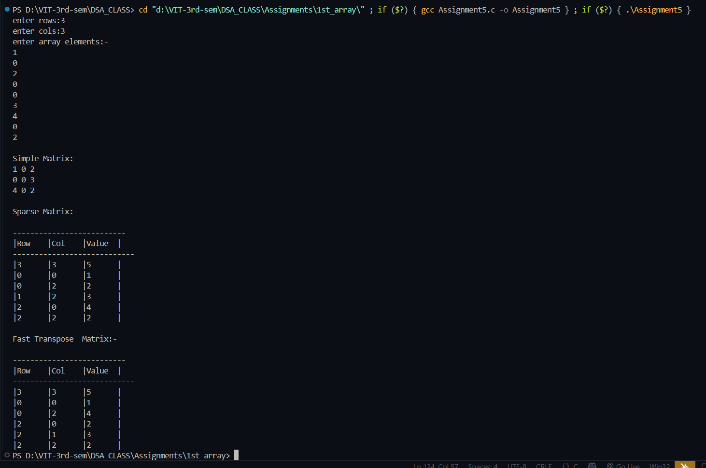

# Sparse Matrix Representation and Fast Transpose

**Name:** Sahil Ashok Khaire  
**Roll No:** 13 
**Title:** Sparse Matrix Representation with Fast Transpose .

## Theory
A **sparse matrix** is a matrix in which most of the elements are zero.  
Instead of storing all elements, we only store non-zero elements with their positions.

### Sparse Matrix Representation
- Represented using a structure with **row, column, value**.
- First element (header) stores: total rows, total columns, and count of non-zero elements.

### Transpose of Sparse Matrix
- **Simple Transpose:** Interchange row and column indices by scanning column-wise.  
- **Fast Transpose:** Optimized version using `rowterms` and `startpos` arrays to directly place elements without repeated scanning.

## Algorithm

### Sparse Matrix Creation
1. Read `rows` and `cols`.  
2. Input matrix elements and count non-zero values.  
3. Store matrix in triplet form `(row, col, value)`.  

###  Fast Transpose

1. Initialize arrays `rowterms[col] = 0` and `startpos[col]`.  
2. For each element `(row, col, value)` → increment `rowterms[col]`.  
3. Compute starting positions:  
   - `startpos[0] = 1`  
   - `startpos[i] = startpos[i-1] + rowterms[i-1]`  
4. For each element in sparse matrix:  
   - Place it directly at `startpos[col]` in transposed matrix.  
   - Increment `startpos[col]`.


**Code** :
      
```
#include<stdio.h>
#include<stdlib.h>

typedef struct 
{
    int row_sak;
    int col_sak;
    int val_sak;
}Element_sak;

int main()
{
    int **matrix_sak=NULL;
    int rows_sak,cols_sak;
    int count_sak=0;

    printf("enter rows:");
    scanf("%d",&rows_sak);
    printf("enter cols:");
    scanf("%d",&cols_sak);

    matrix_sak=(int **)malloc(sizeof(int *)*rows_sak);

    if(matrix_sak==NULL)
    {
        printf("memory is not allocated!!!");
        exit(-1);
    }
    for(int i_sak=0;i_sak<rows_sak;i_sak++)
    {
        matrix_sak[i_sak]=(int *)malloc(sizeof(int)*cols_sak);
    }

    printf("enter array elements:-\n");
    for(int i_sak=0;i_sak<rows_sak;i_sak++)
    {
        for(int j_sak=0;j_sak<cols_sak;j_sak++)
        {
            scanf("%d",&matrix_sak[i_sak][j_sak]);
            if(matrix_sak[i_sak][j_sak]!=0)
            {
                count_sak++;
            }
        }
    }

    //--------------matrix print------------------

    printf("\nSimple Matrix:-\n");
    for(int i_sak=0;i_sak<rows_sak;i_sak++)
    {
        for(int j_sak=0;j_sak<cols_sak;j_sak++)
        {
            printf("%d ",matrix_sak[i_sak][j_sak]);
        }
        printf("\n");
    }

    //-----------------sparse matrix-------------------

    Element_sak *sparse_sak=(Element_sak *)malloc(sizeof(Element_sak)*(count_sak+1));

    if(sparse_sak==NULL)
    {
        printf("Memory is not allocated!!!");
        exit(-2);
    }

    sparse_sak[0].row_sak=rows_sak;
    sparse_sak[0].col_sak=cols_sak;
    sparse_sak[0].val_sak=count_sak;

    int k_sak=1;
    for(int i_sak=0;i_sak<rows_sak;i_sak++)
    {
        for(int j_sak=0;j_sak<cols_sak;j_sak++)
        {
            if(matrix_sak[i_sak][j_sak]!=0)
            {
                sparse_sak[k_sak].row_sak=i_sak;
                sparse_sak[k_sak].col_sak=j_sak;
                sparse_sak[k_sak].val_sak=matrix_sak[i_sak][j_sak];
                k_sak++;
            }
        }
    }

    printf("\nSparse Matrix:-\n");
    printf("\n--------------------------");
    printf("\n|Row\t|Col\t|Value\t|\n");
    printf("----------------------------\n");
    for(int i_sak=0;i_sak<=count_sak;i_sak++)
    {
        printf("|%d\t|%d\t|%d\t|\n",sparse_sak[i_sak].row_sak,sparse_sak[i_sak].col_sak,sparse_sak[i_sak].val_sak);
    }

    for(int i_sak=0;i_sak<rows_sak;i_sak++)
    {
        free(matrix_sak[i_sak]);
    }


    Element_sak *f_transpose_sak=(Element_sak *)malloc(sizeof(Element_sak)*(count_sak+1));

    if(f_transpose_sak==NULL)
    {
        printf("Memory is not allocated!!!!");
        exit(-4);
    }

    f_transpose_sak[0].row_sak=sparse_sak[0].col_sak;
    f_transpose_sak[0].col_sak=sparse_sak[0].row_sak;
    f_transpose_sak[0].val_sak=sparse_sak[0].val_sak;

    int *rowterms_sak=(int *)calloc(sparse_sak[0].col_sak,sizeof(int));
    int *startpos_sak=(int *)malloc(sizeof(int)*sparse_sak[0].col_sak);

    for(int i_sak=1;i_sak<=count_sak;i_sak++)
    {
        rowterms_sak[sparse_sak[i_sak].col_sak]++;
    }

    startpos_sak[0]=1;
    for(int i_sak=1;i_sak<sparse_sak[0].col_sak;i_sak++)
    {
        startpos_sak[i_sak]=startpos_sak[i_sak-1]+rowterms_sak[i_sak-1];
    }

    for(int i_sak=1;i_sak<=count_sak;i_sak++)
    {
        int col_sak=sparse_sak[i_sak].col_sak;
        int pos_sak=startpos_sak[col_sak];

        f_transpose_sak[pos_sak].row_sak=sparse_sak[i_sak].col_sak;
        f_transpose_sak[pos_sak].col_sak=sparse_sak[i_sak].row_sak;
        f_transpose_sak[pos_sak].val_sak=sparse_sak[i_sak].val_sak;

        startpos_sak[col_sak]++;
    }

    printf("\nFast Transpose  Matrix:-\n");
    printf("\n--------------------------");
    printf("\n|Row\t|Col\t|Value\t|\n");
    printf("----------------------------\n");
    for(int i_sak=0;i_sak<=count_sak;i_sak++)
    {
        printf("|%d\t|%d\t|%d\t|\n",f_transpose_sak[i_sak].row_sak,f_transpose_sak[i_sak].col_sak,f_transpose_sak[i_sak].val_sak);
    }
    free(matrix_sak);
    free(sparse_sak);
    free(f_transpose_sak);
    return 0;
}

```
## Output
