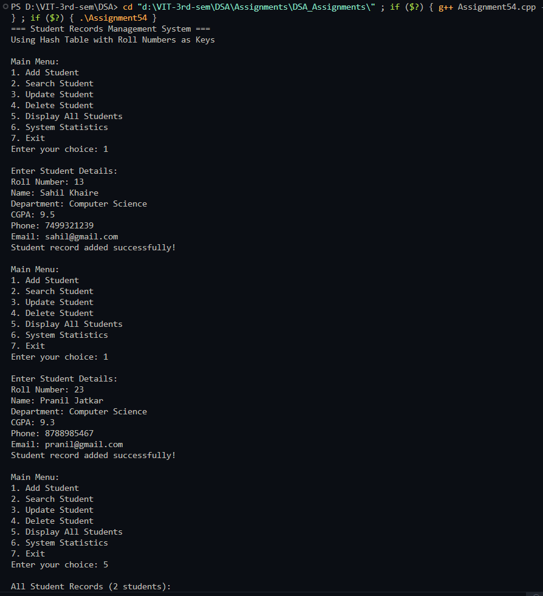
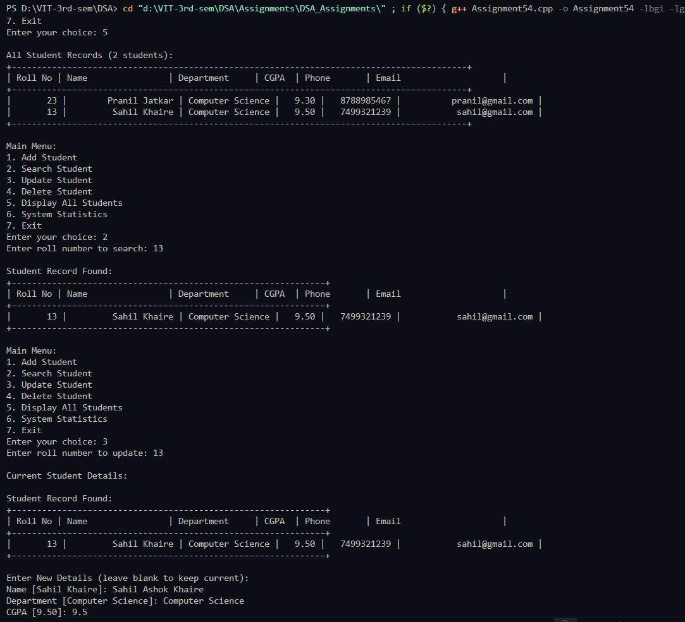
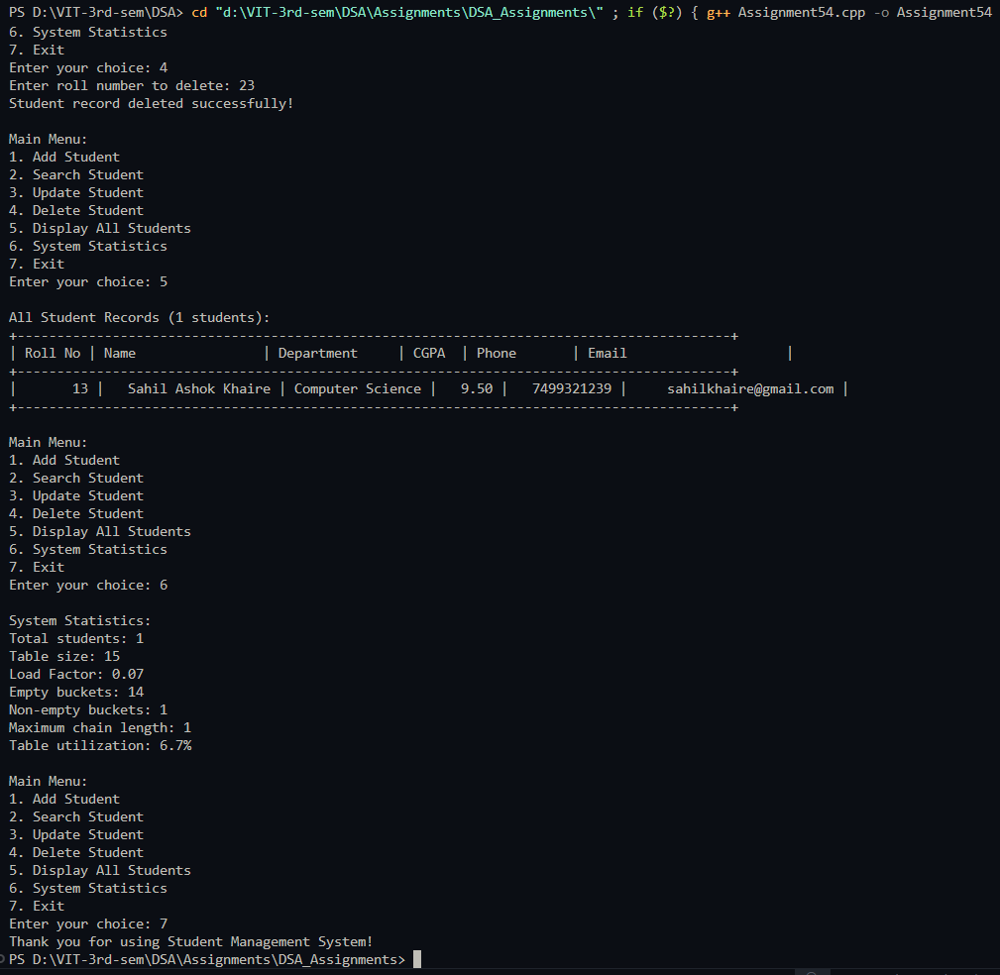

# Practical – Student Records Management System

**Name:** Sahil Ashok Khaire  
**Roll No.:** 13  
**Title:** Store and Retrieve Student Records Using Roll Numbers with Hash Table  

- Implement a student records management system
- Use hash table with roll numbers as keys
- Support operations: add, search, update, delete, display all records
- Handle collisions using separate chaining
- Provide comprehensive student information storage

---

## Theory

A **Student Records Management System** is an application that stores and manages student information efficiently. Using a **Hash Table** with roll numbers as keys provides fast access to student records with average O(1) time complexity for basic operations.

**Key Components**:
- **Hash Table**: Data structure for efficient storage and retrieval
- **Roll Number**: Unique key for each student record
- **Student Record**: Contains personal and academic information
- **Collision Handling**: Separate chaining with linked lists

**System Features**:
- **Add Student**: Insert new student record into the system
- **Search Student**: Find student by roll number
- **Update Student**: Modify existing student information
- **Delete Student**: Remove student record from system
- **Display All**: Show all student records with statistics

**Advantages of Using Hash Table**:
- Fast insertion, deletion, and search operations
- Direct access using roll numbers as keys
- Efficient handling of large number of records
- Scalable design for growing data

**Data Structure**:
- Hash table with buckets
- Linked lists for collision resolution
- Student record structure with multiple fields

Key terms: **Hash Table**, **Student Records**, **Roll Number**, **Collision Resolution**, **Separate Chaining**, **Records Management**

---

## Algorithm

### Algorithm: Student Record Structure
1. Define student record with fields:
   - `rollNo_sak`: integer (unique key)
   - `name_sak`: string
   - `department_sak`: string
   - `cgpa_sak`: float
   - `phone_sak`: string
   - `email_sak`: string

### Algorithm: Hash Function
1. Input: roll number `rollNo_sak`, table size `size_sak`
2. Compute hash: `hash_index_sak = rollNo_sak % size_sak`
3. Return `hash_index_sak`

### Algorithm: Add Student
1. Input student details from user
2. Compute hash index using roll number
3. Check if roll number already exists in the chain
4. If exists, show error message
5. If not exists, create new student node and add to chain
6. Increment student count

### Algorithm: Search Student
1. Input roll number to search
2. Compute hash index
3. Traverse the chain at that index
4. If found, display all student details
5. If not found, show appropriate message

### Algorithm: Update Student
1. Input roll number to update
2. Search for the student record
3. If found, input new details (except roll number)
4. Update the student record
5. If not found, show error message

### Algorithm: Delete Student
1. Input roll number to delete
2. Compute hash index
3. Traverse the chain and delete the node
4. Update pointers and decrement count
5. Show success or error message

### Algorithm: Display All Students
1. Iterate through all buckets
2. For each bucket, traverse the chain
3. Display all student records in formatted table
4. Show statistics: total students, table utilization

### Algorithm: Display Statistics
1. Calculate load factor
2. Count empty and non-empty buckets
3. Find maximum chain length
4. Display collision information

---

## Program

```cpp
#include <iostream>
#include <vector>
#include <string>
#include <iomanip>
using namespace std;

struct Student_sak {
    int rollNo_sak;
    string name_sak;
    string department_sak;
    float cgpa_sak;
    string phone_sak;
    string email_sak;
    
    Student_sak* next_sak;
    
    Student_sak(int roll_sak, string n_sak, string dept_sak, float gpa_sak, string ph_sak, string em_sak) {
        rollNo_sak = roll_sak;
        name_sak = n_sak;
        department_sak = dept_sak;
        cgpa_sak = gpa_sak;
        phone_sak = ph_sak;
        email_sak = em_sak;
        next_sak = nullptr;
    }
    
    void display_sak() {
        cout << "| " << setw(8) << rollNo_sak << " | "
             << setw(20) << name_sak << " | "
             << setw(15) << department_sak << " | "
             << setw(6) << fixed << setprecision(2) << cgpa_sak << " | "
             << setw(12) << phone_sak << " | "
             << setw(25) << email_sak << " |" << endl;
    }
};

class StudentManagementSystem_sak {
private:
    vector<Student_sak*> table_sak;
    int size_sak;
    int studentCount_sak;
    
    int hashFunction_sak(int rollNo_sak) {
        return rollNo_sak % size_sak;
    }
    
public:
    StudentManagementSystem_sak(int tableSize_sak = 10) {
        size_sak = tableSize_sak;
        studentCount_sak = 0;
        table_sak.resize(size_sak, nullptr);
    }
    
    void addStudent_sak() {
        int rollNo_sak;
        string name_sak, department_sak, phone_sak, email_sak;
        float cgpa_sak;
        
        cout << "\nEnter Student Details:" << endl;
        cout << "Roll Number: ";
        cin >> rollNo_sak;
        
        // Check if roll number already exists
        if (searchStudent_sak(rollNo_sak) != nullptr) {
            cout << "Error: Student with roll number " << rollNo_sak << " already exists!" << endl;
            return;
        }
        
        cin.ignore(); // Clear input buffer
        cout << "Name: ";
        getline(cin, name_sak);
        cout << "Department: ";
        getline(cin, department_sak);
        cout << "CGPA: ";
        cin >> cgpa_sak;
        cout << "Phone: ";
        cin >> phone_sak;
        cout << "Email: ";
        cin >> email_sak;
        
        int index_sak = hashFunction_sak(rollNo_sak);
        Student_sak* newStudent_sak = new Student_sak(rollNo_sak, name_sak, department_sak, cgpa_sak, phone_sak, email_sak);
        
        // Insert at beginning of chain
        newStudent_sak->next_sak = table_sak[index_sak];
        table_sak[index_sak] = newStudent_sak;
        studentCount_sak++;
        
        cout << "Student record added successfully!" << endl;
    }
    
    Student_sak* searchStudent_sak(int rollNo_sak) {
        int index_sak = hashFunction_sak(rollNo_sak);
        Student_sak* current_sak = table_sak[index_sak];
        
        while (current_sak != nullptr) {
            if (current_sak->rollNo_sak == rollNo_sak) {
                return current_sak;
            }
            current_sak = current_sak->next_sak;
        }
        return nullptr;
    }
    
    void displayStudent_sak(int rollNo_sak) {
        Student_sak* student_sak = searchStudent_sak(rollNo_sak);
        
        if (student_sak != nullptr) {
            cout << "\nStudent Record Found:" << endl;
            cout << "+--------------------------------------------------------------+" << endl;
            cout << "| Roll No | Name                | Department     | CGPA  | Phone       | Email                    |" << endl;
            cout << "+--------------------------------------------------------------+" << endl;
            student_sak->display_sak();
            cout << "+--------------------------------------------------------------+" << endl;
        } else {
            cout << "Student with roll number " << rollNo_sak << " not found!" << endl;
        }
    }
    
    void updateStudent_sak() {
        int rollNo_sak;
        cout << "Enter roll number to update: ";
        cin >> rollNo_sak;
        
        Student_sak* student_sak = searchStudent_sak(rollNo_sak);
        
        if (student_sak != nullptr) {
            cout << "\nCurrent Student Details:" << endl;
            displayStudent_sak(rollNo_sak);
            
            cout << "\nEnter New Details (leave blank to keep current):" << endl;
            cin.ignore();
            
            string input_sak;
            cout << "Name [" << student_sak->name_sak << "]: ";
            getline(cin, input_sak);
            if (!input_sak.empty()) student_sak->name_sak = input_sak;
            
            cout << "Department [" << student_sak->department_sak << "]: ";
            getline(cin, input_sak);
            if (!input_sak.empty()) student_sak->department_sak = input_sak;
            
            cout << "CGPA [" << student_sak->cgpa_sak << "]: ";
            getline(cin, input_sak);
            if (!input_sak.empty()) student_sak->cgpa_sak = stof(input_sak);
            
            cout << "Phone [" << student_sak->phone_sak << "]: ";
            getline(cin, input_sak);
            if (!input_sak.empty()) student_sak->phone_sak = input_sak;
            
            cout << "Email [" << student_sak->email_sak << "]: ";
            getline(cin, input_sak);
            if (!input_sak.empty()) student_sak->email_sak = input_sak;
            
            cout << "Student record updated successfully!" << endl;
        } else {
            cout << "Student with roll number " << rollNo_sak << " not found!" << endl;
        }
    }
    
    void deleteStudent_sak() {
        int rollNo_sak;
        cout << "Enter roll number to delete: ";
        cin >> rollNo_sak;
        
        int index_sak = hashFunction_sak(rollNo_sak);
        Student_sak* current_sak = table_sak[index_sak];
        Student_sak* prev_sak = nullptr;
        
        while (current_sak != nullptr) {
            if (current_sak->rollNo_sak == rollNo_sak) {
                if (prev_sak == nullptr) {
                    table_sak[index_sak] = current_sak->next_sak;
                } else {
                    prev_sak->next_sak = current_sak->next_sak;
                }
                
                delete current_sak;
                studentCount_sak--;
                cout << "Student record deleted successfully!" << endl;
                return;
            }
            prev_sak = current_sak;
            current_sak = current_sak->next_sak;
        }
        
        cout << "Student with roll number " << rollNo_sak << " not found!" << endl;
    }
    
    void displayAllStudents_sak() {
        if (studentCount_sak == 0) {
            cout << "No student records found!" << endl;
            return;
        }
        
        cout << "\nAll Student Records (" << studentCount_sak << " students):" << endl;
        cout << "+------------------------------------------------------------------------------------------+" << endl;
        cout << "| Roll No | Name                | Department     | CGPA  | Phone       | Email                    |" << endl;
        cout << "+------------------------------------------------------------------------------------------+" << endl;
        
        for (int i_sak = 0; i_sak < size_sak; i_sak++) {
            Student_sak* current_sak = table_sak[i_sak];
            while (current_sak != nullptr) {
                current_sak->display_sak();
                current_sak = current_sak->next_sak;
            }
        }
        cout << "+------------------------------------------------------------------------------------------+" << endl;
    }
    
    void displayStatistics_sak() {
        int emptyBuckets_sak = 0;
        int maxChainLength_sak = 0;
        int totalChains_sak = 0;
        
        for (int i_sak = 0; i_sak < size_sak; i_sak++) {
            if (table_sak[i_sak] == nullptr) {
                emptyBuckets_sak++;
            } else {
                totalChains_sak++;
                Student_sak* current_sak = table_sak[i_sak];
                int chainLength_sak = 0;
                
                while (current_sak != nullptr) {
                    chainLength_sak++;
                    current_sak = current_sak->next_sak;
                }
                
                if (chainLength_sak > maxChainLength_sak) {
                    maxChainLength_sak = chainLength_sak;
                }
            }
        }
        
        cout << "\nSystem Statistics:" << endl;
        cout << "Total students: " << studentCount_sak << endl;
        cout << "Table size: " << size_sak << endl;
        cout << "Load Factor: " << fixed << setprecision(2) << (double)studentCount_sak / size_sak << endl;
        cout << "Empty buckets: " << emptyBuckets_sak << endl;
        cout << "Non-empty buckets: " << (size_sak - emptyBuckets_sak) << endl;
        cout << "Maximum chain length: " << maxChainLength_sak << endl;
        cout << "Table utilization: " << fixed << setprecision(1) 
             << ((double)(size_sak - emptyBuckets_sak) / size_sak) * 100 << "%" << endl;
    }
    
    ~StudentManagementSystem_sak() {
        for (int i_sak = 0; i_sak < size_sak; i_sak++) {
            Student_sak* current_sak = table_sak[i_sak];
            while (current_sak != nullptr) {
                Student_sak* temp_sak = current_sak;
                current_sak = current_sak->next_sak;
                delete temp_sak;
            }
        }
    }
};

int main() {
    StudentManagementSystem_sak sms_sak(15);
    int choice_sak, rollNo_sak;
    
    cout << "=== Student Records Management System ===" << endl;
    cout << "Using Hash Table with Roll Numbers as Keys" << endl;
    
    do {
        cout << "\nMain Menu:" << endl;
        cout << "1. Add Student" << endl;
        cout << "2. Search Student" << endl;
        cout << "3. Update Student" << endl;
        cout << "4. Delete Student" << endl;
        cout << "5. Display All Students" << endl;
        cout << "6. System Statistics" << endl;
        cout << "7. Exit" << endl;
        cout << "Enter your choice: ";
        cin >> choice_sak;
        
        switch (choice_sak) {
            case 1:
                sms_sak.addStudent_sak();
                break;
                
            case 2:
                cout << "Enter roll number to search: ";
                cin >> rollNo_sak;
                sms_sak.displayStudent_sak(rollNo_sak);
                break;
                
            case 3:
                sms_sak.updateStudent_sak();
                break;
                
            case 4:
                sms_sak.deleteStudent_sak();
                break;
                
            case 5:
                sms_sak.displayAllStudents_sak();
                break;
                
            case 6:
                sms_sak.displayStatistics_sak();
                break;
                
            case 7:
                cout << "Thank you for using Student Management System!" << endl;
                break;
                
            default:
                cout << "Invalid choice! Please try again." << endl;
        }
    } while (choice_sak != 7);
    
    return 0;
}
```

## Output


