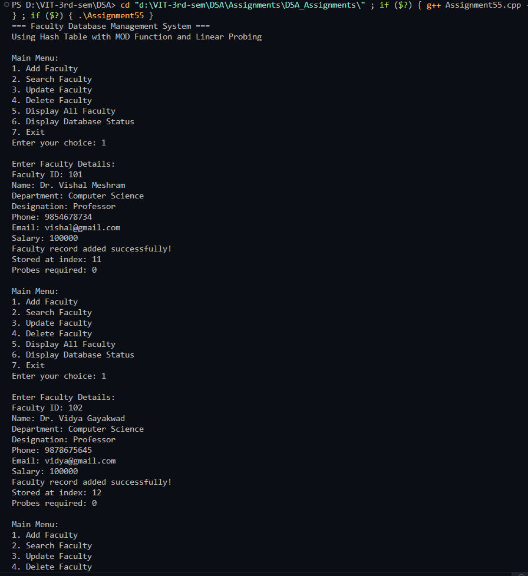
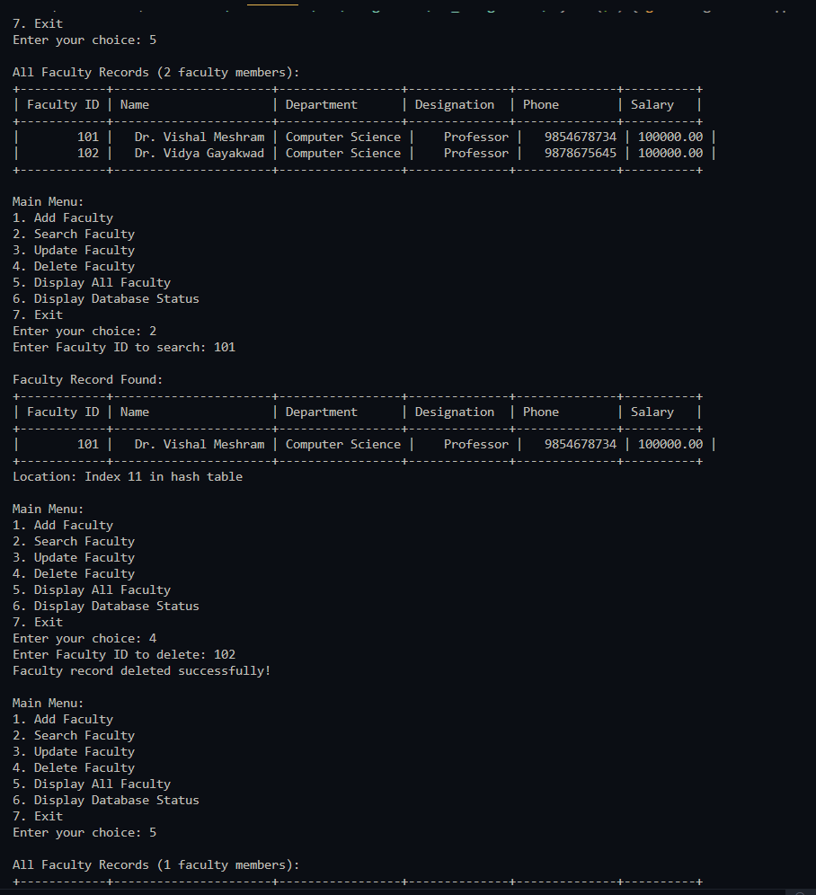
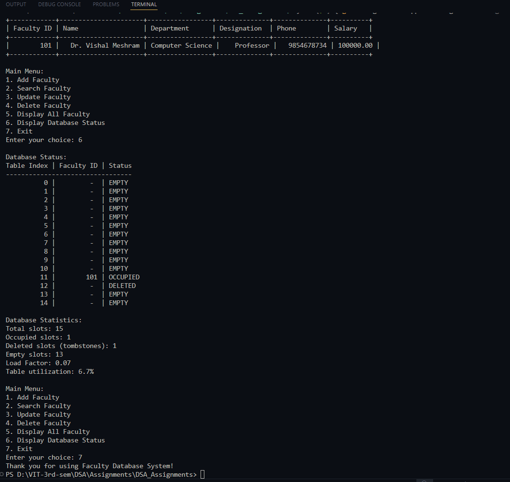

# Practical – Faculty Database Simulation

**Name:** Sahil Ashok Khaire  
**Roll No.:** 13  
**Title:** Faculty Database Simulation using Hash Table with Linear Probing  

- Implement a faculty database using hash table
- Use MOD as hash function for faculty ID
- Apply linear probing for collision resolution
- Support operations: add, search, update, delete, display faculty
- Assume suitable faculty record structure with multiple fields

---

## Theory

A **Faculty Database System** is an application that stores and manages faculty information efficiently. Using a **Hash Table** with faculty IDs as keys provides fast access to faculty records. The **MOD hash function** is used to map faculty IDs to table indices, and **linear probing** handles collisions by sequentially searching for the next available slot.

**Key Components**:
- **Hash Table**: Array-based structure for storing faculty records
- **Faculty ID**: Unique key for each faculty member
- **MOD Hash Function**: `hash = faculty_id % table_size`
- **Linear Probing**: Collision resolution by checking subsequent slots
- **Faculty Record**: Contains professional and personal information

**Linear Probing Technique**:
- When collision occurs, check next slot `(index + 1) % size`
- Continue until empty slot or matching key is found
- Handles deletions with special markers (tombstones)

**Advantages**:
- Simple implementation
- Good cache performance due to locality
- No extra memory for pointers

**Disadvantages**:
- Primary clustering can occur
- Performance degrades with high load factor

**Faculty Record Structure**:
- Faculty ID, Name, Department, Designation, Phone, Email, Salary

Key terms: **Hash Table**, **Faculty Database**, **MOD Hash Function**, **Linear Probing**, **Collision Resolution**, **Faculty Records**

---

## Algorithm

### Algorithm: Faculty Record Structure
1. Define faculty record with fields:
   - `facultyId_sak`: integer (unique key)
   - `name_sak`: string
   - `department_sak`: string
   - `designation_sak`: string
   - `phone_sak`: string
   - `email_sak`: string
   - `salary_sak`: double

### Algorithm: Hash Table Slot
1. Each slot contains:
   - Faculty record data
   - `isOccupied_sak`: boolean flag
   - `isDeleted_sak`: boolean flag for tombstones

### Algorithm: MOD Hash Function
1. Input: faculty ID `facultyId_sak`, table size `size_sak`
2. Compute hash: `hash_index_sak = facultyId_sak % size_sak`
3. Return `hash_index_sak`

### Algorithm: Insert Faculty
1. Compute initial index using MOD hash function
2. If slot is empty or deleted:
   - Insert faculty record
   - Set `isOccupied_sak = true`, `isDeleted_sak = false`
3. If slot is occupied:
   - Linear probe: `index_sak = (index_sak + 1) % size_sak`
   - Repeat until empty/deleted slot found
4. If table full, display error message

### Algorithm: Search Faculty
1. Compute initial index using MOD hash function
2. If slot contains target faculty ID:
   - Return faculty record
3. If slot is empty (not deleted):
   - Return not found
4. If slot occupied with different ID or deleted:
   - Linear probe until found or empty slot
5. Return search result with probe count

### Algorithm: Update Faculty
1. Search for faculty by ID
2. If found, input new details (except ID)
3. Update the faculty record
4. If not found, show error message

### Algorithm: Delete Faculty
1. Search for faculty by ID
2. If found:
   - Set `isDeleted_sak = true`, `isOccupied_sak = false`
   - Keep data for probing purposes
3. If not found, show error message

### Algorithm: Display All Faculty
1. Iterate through all table slots
2. Display occupied slots in formatted table
3. Show empty and deleted slots separately

### Algorithm: Display Statistics
1. Calculate load factor
2. Count occupied, empty, and deleted slots
3. Show table utilization and collision information

---

## Program

```cpp
#include <iostream>
#include <vector>
#include <string>
#include <iomanip>
using namespace std;

struct Faculty_sak {
    int facultyId_sak;
    string name_sak;
    string department_sak;
    string designation_sak;
    string phone_sak;
    string email_sak;
    double salary_sak;
    
    Faculty_sak() {
        facultyId_sak = -1;
        name_sak = "";
        department_sak = "";
        designation_sak = "";
        phone_sak = "";
        email_sak = "";
        salary_sak = 0.0;
    }
    
    Faculty_sak(int id_sak, string n_sak, string dept_sak, string desg_sak, 
                string ph_sak, string em_sak, double sal_sak) {
        facultyId_sak = id_sak;
        name_sak = n_sak;
        department_sak = dept_sak;
        designation_sak = desg_sak;
        phone_sak = ph_sak;
        email_sak = em_sak;
        salary_sak = sal_sak;
    }
    
    void display_sak() {
        cout << "| " << setw(10) << facultyId_sak << " | "
             << setw(20) << name_sak << " | "
             << setw(15) << department_sak << " | "
             << setw(12) << designation_sak << " | "
             << setw(12) << phone_sak << " | "
             << setw(8) << fixed << setprecision(2) << salary_sak << " |" << endl;
    }
};

class FacultyDatabase_sak {
private:
    vector<Faculty_sak> table_sak;
    vector<bool> isOccupied_sak;
    vector<bool> isDeleted_sak;
    int size_sak;
    int facultyCount_sak;
    
    int hashFunction_sak(int facultyId_sak) {
        return facultyId_sak % size_sak;
    }
    
public:
    FacultyDatabase_sak(int tableSize_sak = 15) {
        size_sak = tableSize_sak;
        facultyCount_sak = 0;
        table_sak.resize(size_sak);
        isOccupied_sak.resize(size_sak, false);
        isDeleted_sak.resize(size_sak, false);
    }
    
    void addFaculty_sak() {
        if (facultyCount_sak >= size_sak) {
            cout << "Database is full! Cannot add more faculty." << endl;
            return;
        }
        
        int facultyId_sak;
        string name_sak, department_sak, designation_sak, phone_sak, email_sak;
        double salary_sak;
        
        cout << "\nEnter Faculty Details:" << endl;
        cout << "Faculty ID: ";
        cin >> facultyId_sak;
        
        // Check if faculty ID already exists
        int searchIndex_sak;
        if (searchFacultyIndex_sak(facultyId_sak, searchIndex_sak)) {
            cout << "Error: Faculty with ID " << facultyId_sak << " already exists!" << endl;
            return;
        }
        
        cin.ignore(); // Clear input buffer
        cout << "Name: ";
        getline(cin, name_sak);
        cout << "Department: ";
        getline(cin, department_sak);
        cout << "Designation: ";
        getline(cin, designation_sak);
        cout << "Phone: ";
        getline(cin, phone_sak);
        cout << "Email: ";
        getline(cin, email_sak);
        cout << "Salary: ";
        cin >> salary_sak;
        
        int index_sak = hashFunction_sak(facultyId_sak);
        int originalIndex_sak = index_sak;
        int probes_sak = 0;
        
        // Linear probing to find empty slot
        while (isOccupied_sak[index_sak] && !isDeleted_sak[index_sak]) {
            index_sak = (index_sak + 1) % size_sak;
            probes_sak++;
            
            if (index_sak == originalIndex_sak) {
                cout << "Database is full! Cannot add faculty." << endl;
                return;
            }
        }
        
        // Insert faculty record
        table_sak[index_sak] = Faculty_sak(facultyId_sak, name_sak, department_sak, 
                                          designation_sak, phone_sak, email_sak, salary_sak);
        isOccupied_sak[index_sak] = true;
        isDeleted_sak[index_sak] = false;
        facultyCount_sak++;
        
        cout << "Faculty record added successfully!" << endl;
        cout << "Stored at index: " << index_sak << endl;
        cout << "Probes required: " << probes_sak << endl;
    }
    
    bool searchFacultyIndex_sak(int facultyId_sak, int& foundIndex_sak) {
        int index_sak = hashFunction_sak(facultyId_sak);
        int originalIndex_sak = index_sak;
        int probes_sak = 0;
        
        while (isOccupied_sak[index_sak] || isDeleted_sak[index_sak]) {
            if (isOccupied_sak[index_sak] && !isDeleted_sak[index_sak] && 
                table_sak[index_sak].facultyId_sak == facultyId_sak) {
                foundIndex_sak = index_sak;
                return true;
            }
            
            index_sak = (index_sak + 1) % size_sak;
            probes_sak++;
            
            if (index_sak == originalIndex_sak) {
                break;
            }
        }
        
        return false;
    }
    
    void searchFaculty_sak() {
        int facultyId_sak;
        cout << "Enter Faculty ID to search: ";
        cin >> facultyId_sak;
        
        int foundIndex_sak;
        if (searchFacultyIndex_sak(facultyId_sak, foundIndex_sak)) {
            cout << "\nFaculty Record Found:" << endl;
            cout << "+------------+----------------------+-----------------+--------------+--------------+----------+" << endl;
            cout << "| Faculty ID | Name                 | Department      | Designation  | Phone        | Salary   |" << endl;
            cout << "+------------+----------------------+-----------------+--------------+--------------+----------+" << endl;
            table_sak[foundIndex_sak].display_sak();
            cout << "+------------+----------------------+-----------------+--------------+--------------+----------+" << endl;
            cout << "Location: Index " << foundIndex_sak << " in hash table" << endl;
        } else {
            cout << "Faculty with ID " << facultyId_sak << " not found!" << endl;
        }
    }
    
    void updateFaculty_sak() {
        int facultyId_sak;
        cout << "Enter Faculty ID to update: ";
        cin >> facultyId_sak;
        
        int foundIndex_sak;
        if (searchFacultyIndex_sak(facultyId_sak, foundIndex_sak)) {
            cout << "\nCurrent Faculty Details:" << endl;
            cout << "+------------+----------------------+-----------------+--------------+--------------+----------+" << endl;
            cout << "| Faculty ID | Name                 | Department      | Designation  | Phone        | Salary   |" << endl;
            cout << "+------------+----------------------+-----------------+--------------+--------------+----------+" << endl;
            table_sak[foundIndex_sak].display_sak();
            cout << "+------------+----------------------+-----------------+--------------+--------------+----------+" << endl;
            
            cout << "\nEnter New Details:" << endl;
            cin.ignore();
            
            string input_sak;
            cout << "Name [" << table_sak[foundIndex_sak].name_sak << "]: ";
            getline(cin, input_sak);
            if (!input_sak.empty()) table_sak[foundIndex_sak].name_sak = input_sak;
            
            cout << "Department [" << table_sak[foundIndex_sak].department_sak << "]: ";
            getline(cin, input_sak);
            if (!input_sak.empty()) table_sak[foundIndex_sak].department_sak = input_sak;
            
            cout << "Designation [" << table_sak[foundIndex_sak].designation_sak << "]: ";
            getline(cin, input_sak);
            if (!input_sak.empty()) table_sak[foundIndex_sak].designation_sak = input_sak;
            
            cout << "Phone [" << table_sak[foundIndex_sak].phone_sak << "]: ";
            getline(cin, input_sak);
            if (!input_sak.empty()) table_sak[foundIndex_sak].phone_sak = input_sak;
            
            cout << "Email [" << table_sak[foundIndex_sak].email_sak << "]: ";
            getline(cin, input_sak);
            if (!input_sak.empty()) table_sak[foundIndex_sak].email_sak = input_sak;
            
            cout << "Salary [" << table_sak[foundIndex_sak].salary_sak << "]: ";
            getline(cin, input_sak);
            if (!input_sak.empty()) table_sak[foundIndex_sak].salary_sak = stod(input_sak);
            
            cout << "Faculty record updated successfully!" << endl;
        } else {
            cout << "Faculty with ID " << facultyId_sak << " not found!" << endl;
        }
    }
    
    void deleteFaculty_sak() {
        int facultyId_sak;
        cout << "Enter Faculty ID to delete: ";
        cin >> facultyId_sak;
        
        int foundIndex_sak;
        if (searchFacultyIndex_sak(facultyId_sak, foundIndex_sak)) {
            isDeleted_sak[foundIndex_sak] = true;
            isOccupied_sak[foundIndex_sak] = false;
            facultyCount_sak--;
            cout << "Faculty record deleted successfully!" << endl;
        } else {
            cout << "Faculty with ID " << facultyId_sak << " not found!" << endl;
        }
    }
    
    void displayAllFaculty_sak() {
        if (facultyCount_sak == 0) {
            cout << "No faculty records found!" << endl;
            return;
        }
        
        cout << "\nAll Faculty Records (" << facultyCount_sak << " faculty members):" << endl;
        cout << "+------------+----------------------+-----------------+--------------+--------------+----------+" << endl;
        cout << "| Faculty ID | Name                 | Department      | Designation  | Phone        | Salary   |" << endl;
        cout << "+------------+----------------------+-----------------+--------------+--------------+----------+" << endl;
        
        for (int i_sak = 0; i_sak < size_sak; i_sak++) {
            if (isOccupied_sak[i_sak] && !isDeleted_sak[i_sak]) {
                table_sak[i_sak].display_sak();
            }
        }
        cout << "+------------+----------------------+-----------------+--------------+--------------+----------+" << endl;
    }
    
    void displayDatabaseStatus_sak() {
        cout << "\nDatabase Status:" << endl;
        cout << "Table Index | Faculty ID | Status" << endl;
        cout << "---------------------------------" << endl;
        
        int occupied_sak = 0, deleted_sak = 0, empty_sak = 0;
        
        for (int i_sak = 0; i_sak < size_sak; i_sak++) {
            cout << setw(11) << i_sak << " | ";
            
            if (isOccupied_sak[i_sak] && !isDeleted_sak[i_sak]) {
                cout << setw(10) << table_sak[i_sak].facultyId_sak << " | OCCUPIED" << endl;
                occupied_sak++;
            } else if (isDeleted_sak[i_sak]) {
                cout << setw(10) << " - " << " | DELETED" << endl;
                deleted_sak++;
            } else {
                cout << setw(10) << " - " << " | EMPTY" << endl;
                empty_sak++;
            }
        }
        
        cout << "\nDatabase Statistics:" << endl;
        cout << "Total slots: " << size_sak << endl;
        cout << "Occupied slots: " << occupied_sak << endl;
        cout << "Deleted slots (tombstones): " << deleted_sak << endl;
        cout << "Empty slots: " << empty_sak << endl;
        cout << "Load Factor: " << fixed << setprecision(2) << (double)facultyCount_sak / size_sak << endl;
        cout << "Table utilization: " << fixed << setprecision(1) 
             << ((double)occupied_sak / size_sak) * 100 << "%" << endl;
    }
};

int main() {
    FacultyDatabase_sak fdb_sak(15);
    int choice_sak;
    
    cout << "=== Faculty Database Management System ===" << endl;
    cout << "Using Hash Table with MOD Function and Linear Probing" << endl;
    
    do {
        cout << "\nMain Menu:" << endl;
        cout << "1. Add Faculty" << endl;
        cout << "2. Search Faculty" << endl;
        cout << "3. Update Faculty" << endl;
        cout << "4. Delete Faculty" << endl;
        cout << "5. Display All Faculty" << endl;
        cout << "6. Display Database Status" << endl;
        cout << "7. Exit" << endl;
        cout << "Enter your choice: ";
        cin >> choice_sak;
        
        switch (choice_sak) {
            case 1:
                fdb_sak.addFaculty_sak();
                break;
                
            case 2:
                fdb_sak.searchFaculty_sak();
                break;
                
            case 3:
                fdb_sak.updateFaculty_sak();
                break;
                
            case 4:
                fdb_sak.deleteFaculty_sak();
                break;
                
            case 5:
                fdb_sak.displayAllFaculty_sak();
                break;
                
            case 6:
                fdb_sak.displayDatabaseStatus_sak();
                break;
                
            case 7:
                cout << "Thank you for using Faculty Database System!" << endl;
                break;
                
            default:
                cout << "Invalid choice! Please try again." << endl;
        }
    } while (choice_sak != 7);
    
    return 0;
}
```

## Output


