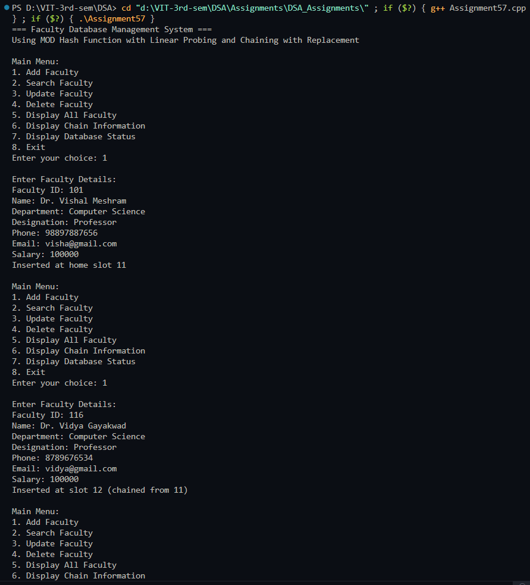
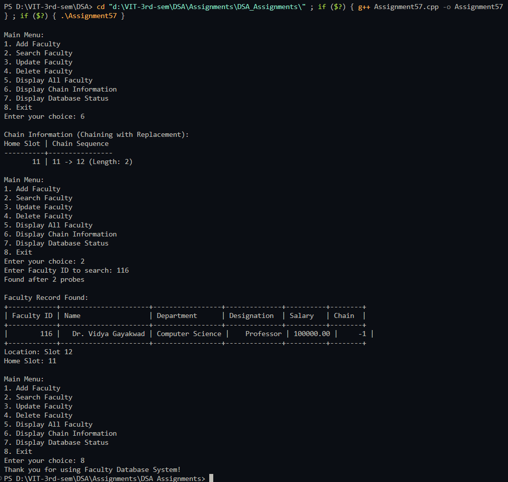

# Practical – Faculty Database with Chaining with Replacement

**Name:** Sahil Ashok Khaire  
**Roll No.:** 13  
**Title:** Faculty Database Simulation using MOD Hash Function with Linear Probing and Chaining with Replacement  

- Implement a faculty database using hash table
- Use MOD as hash function for faculty ID
- Apply linear probing with chaining with replacement for collision resolution
- Support operations: add, search, update, delete, display faculty
- Assume suitable faculty record structure with multiple fields

---

## Theory

A **Faculty Database System** using **hash table** with the **MOD hash function** provides efficient storage and retrieval of faculty records. The **MOD hash function** uses the formula: `hash = faculty_id % table_size`. **Linear probing with chaining with replacement** is an advanced collision resolution technique where records are always placed in their home slots if possible, even if it requires relocating existing records.

**Key Components**:
- **Hash Table**: Array-based structure for storing faculty records
- **MOD Hash Function**: `hash = faculty_id % table_size`
- **Chaining with Replacement**: Advanced collision resolution with record relocation
- **Faculty Record**: Contains professional and personal information
- **Chain Pointer**: Links collided records in a chain

**Chaining with Replacement Technique**:
- Each record tries to occupy its home slot (calculated by hash function)
- If home slot is occupied by a record that doesn't belong there, the existing record is relocated
- The relocated record is moved to another slot and chained appropriately
- This ensures better distribution and faster access times

**Advantages**:
- Better performance than chaining without replacement
- Records are closer to their home positions
- Reduced search time for frequently accessed records
- More efficient use of hash table space

**Disadvantages**:
- More complex implementation
- Higher overhead during insertion due to possible relocations

**Faculty Record Structure**:
- Faculty ID, Name, Department, Designation, Phone, Email, Salary, Chain Pointer

Key terms: **Hash Table**, **MOD Hash Function**, **Linear Probing**, **Chaining with Replacement**, **Faculty Database**, **Collision Resolution**, **Record Relocation**

---

## Algorithm

### Algorithm: Faculty Record Structure
1. Define faculty record with fields:
   - `facultyId_sak`: integer (unique key)
   - `name_sak`: string
   - `department_sak`: string
   - `designation_sak`: string
   - `phone_sak`: string
   - `email_sak`: string
   - `salary_sak`: double
   - `chain_sak`: integer (points to next record in chain, -1 if end)

### Algorithm: MOD Hash Function
1. Input: faculty ID `facultyId_sak`, table size `size_sak`
2. Compute hash: `hash_index_sak = facultyId_sak % size_sak`
3. Return `hash_index_sak`

### Algorithm: Insert Faculty with Replacement
1. Compute home index using MOD hash function
2. If home slot is empty:
   - Insert faculty record
   - Set `chain_sak = -1`
3. If home slot is occupied:
   - If occupying record belongs to this home slot:
     - Find end of chain using linear probing
     - Insert at next available slot
     - Update chain pointer of last node
   - Else (occupying record doesn't belong here):
     - Temporarily remove existing record
     - Insert new record in home slot
     - Reinsert the removed record using normal insertion
4. Handle table full condition

### Algorithm: Search Faculty
1. Compute home index using MOD hash function
2. Start from home slot
3. Follow chain pointers until:
   - Record found with matching faculty ID
   - End of chain reached (`chain_sak = -1`)
4. Return record and probe count

### Algorithm: Update Faculty
1. Search for faculty by ID
2. If found, input new details (except ID)
3. Update the faculty record
4. If not found, show error message

### Algorithm: Delete Faculty
1. Search for faculty by ID
2. If found:
   - Remove record from chain
   - Update previous record's chain pointer
   - Mark slot as empty
3. If not found, show error message

### Algorithm: Display All Faculty
1. Iterate through all table slots
2. Display occupied slots with chain information
3. Show home slot and actual slot for each record

### Algorithm: Display Chain Information
1. For each home slot, display the complete chain
2. Show chain length and probe sequence

---

## Program

```cpp
#include <iostream>
#include <vector>
#include <string>
#include <iomanip>
using namespace std;

struct Faculty_sak {
    int facultyId_sak;
    string name_sak;
    string department_sak;
    string designation_sak;
    string phone_sak;
    string email_sak;
    double salary_sak;
    int chain_sak; // Points to next record in chain, -1 if end
    
    Faculty_sak() {
        facultyId_sak = -1;
        name_sak = "";
        department_sak = "";
        designation_sak = "";
        phone_sak = "";
        email_sak = "";
        salary_sak = 0.0;
        chain_sak = -1;
    }
    
    Faculty_sak(int id_sak, string n_sak, string dept_sak, string desg_sak, 
                string ph_sak, string em_sak, double sal_sak) {
        facultyId_sak = id_sak;
        name_sak = n_sak;
        department_sak = dept_sak;
        designation_sak = desg_sak;
        phone_sak = ph_sak;
        email_sak = em_sak;
        salary_sak = sal_sak;
        chain_sak = -1;
    }
    
    void display_sak() {
        cout << "| " << setw(10) << facultyId_sak << " | "
             << setw(20) << name_sak << " | "
             << setw(15) << department_sak << " | "
             << setw(12) << designation_sak << " | "
             << setw(8) << fixed << setprecision(2) << salary_sak << " | "
             << setw(6) << chain_sak << " |" << endl;
    }
    
    bool isEmpty_sak() {
        return facultyId_sak == -1;
    }
    
    void clear_sak() {
        facultyId_sak = -1;
        name_sak = "";
        department_sak = "";
        designation_sak = "";
        phone_sak = "";
        email_sak = "";
        salary_sak = 0.0;
        chain_sak = -1;
    }
};

class FacultyDatabase_sak {
private:
    vector<Faculty_sak> table_sak;
    int size_sak;
    int facultyCount_sak;
    
    int hashFunction_sak(int facultyId_sak) {
        return facultyId_sak % size_sak;
    }
    
    int findEmptySlot_sak(int startIndex_sak) {
        int index_sak = startIndex_sak;
        int originalIndex_sak = startIndex_sak;
        
        do {
            if (table_sak[index_sak].isEmpty_sak()) {
                return index_sak;
            }
            index_sak = (index_sak + 1) % size_sak;
        } while (index_sak != originalIndex_sak);
        
        return -1; // No empty slot found
    }
    
    int findChainEnd_sak(int startIndex_sak) {
        int current_sak = startIndex_sak;
        while (table_sak[current_sak].chain_sak != -1) {
            current_sak = table_sak[current_sak].chain_sak;
        }
        return current_sak;
    }
    
    int findPreviousInChain_sak(int homeIndex_sak, int targetIndex_sak) {
        int current_sak = homeIndex_sak;
        while (current_sak != -1 && table_sak[current_sak].chain_sak != targetIndex_sak) {
            current_sak = table_sak[current_sak].chain_sak;
        }
        return current_sak;
    }
    
    void insertRecord_sak(Faculty_sak faculty_sak) {
        int homeIndex_sak = hashFunction_sak(faculty_sak.facultyId_sak);
        
        if (table_sak[homeIndex_sak].isEmpty_sak()) {
            // Home slot is empty, insert directly
            table_sak[homeIndex_sak] = faculty_sak;
            cout << "Inserted at home slot " << homeIndex_sak << endl;
        } else {
            // Home slot is occupied
            if (hashFunction_sak(table_sak[homeIndex_sak].facultyId_sak) == homeIndex_sak) {
                // Home slot contains a record with same home index
                int chainEnd_sak = findChainEnd_sak(homeIndex_sak);
                int emptySlot_sak = findEmptySlot_sak((chainEnd_sak + 1) % size_sak);
                
                if (emptySlot_sak != -1) {
                    table_sak[emptySlot_sak] = faculty_sak;
                    table_sak[chainEnd_sak].chain_sak = emptySlot_sak;
                    cout << "Inserted at slot " << emptySlot_sak 
                         << " (chained from " << chainEnd_sak << ")" << endl;
                }
            } else {
                // Home slot contains a record that doesn't belong here - REPLACEMENT
                Faculty_sak temp_sak = table_sak[homeIndex_sak];
                table_sak[homeIndex_sak].clear_sak();
                
                // Insert new record in home slot
                table_sak[homeIndex_sak] = faculty_sak;
                cout << "Inserted at home slot " << homeIndex_sak << " (replacement)" << endl;
                
                // Reinsert the displaced record
                cout << "Reinserting displaced record (ID: " << temp_sak.facultyId_sak << ")..." << endl;
                insertRecord_sak(temp_sak);
            }
        }
    }
    
public:
    FacultyDatabase_sak(int tableSize_sak = 15) {
        size_sak = tableSize_sak;
        facultyCount_sak = 0;
        table_sak.resize(size_sak);
        
        // Initialize all slots as empty
        for (int i_sak = 0; i_sak < size_sak; i_sak++) {
            table_sak[i_sak] = Faculty_sak();
        }
    }
    
    void addFaculty_sak() {
        if (facultyCount_sak >= size_sak) {
            cout << "Database is full! Cannot add more faculty." << endl;
            return;
        }
        
        int facultyId_sak;
        string name_sak, department_sak, designation_sak, phone_sak, email_sak;
        double salary_sak;
        
        cout << "\nEnter Faculty Details:" << endl;
        cout << "Faculty ID: ";
        cin >> facultyId_sak;
        
        // Check if faculty ID already exists
        int foundIndex_sak;
        if (searchFacultyIndex_sak(facultyId_sak, foundIndex_sak)) {
            cout << "Error: Faculty with ID " << facultyId_sak << " already exists!" << endl;
            return;
        }
        
        cin.ignore(); // Clear input buffer
        cout << "Name: ";
        getline(cin, name_sak);
        cout << "Department: ";
        getline(cin, department_sak);
        cout << "Designation: ";
        getline(cin, designation_sak);
        cout << "Phone: ";
        getline(cin, phone_sak);
        cout << "Email: ";
        getline(cin, email_sak);
        cout << "Salary: ";
        cin >> salary_sak;
        
        Faculty_sak newFaculty_sak(facultyId_sak, name_sak, department_sak, 
                                  designation_sak, phone_sak, email_sak, salary_sak);
        
        insertRecord_sak(newFaculty_sak);
        facultyCount_sak++;
    }
    
    bool searchFacultyIndex_sak(int facultyId_sak, int& foundIndex_sak) {
        int homeIndex_sak = hashFunction_sak(facultyId_sak);
        int current_sak = homeIndex_sak;
        int probes_sak = 0;
        
        while (current_sak != -1 && !table_sak[current_sak].isEmpty_sak()) {
            probes_sak++;
            if (table_sak[current_sak].facultyId_sak == facultyId_sak) {
                foundIndex_sak = current_sak;
                cout << "Found after " << probes_sak << " probes" << endl;
                return true;
            }
            current_sak = table_sak[current_sak].chain_sak;
        }
        
        return false;
    }
    
    void searchFaculty_sak() {
        int facultyId_sak;
        cout << "Enter Faculty ID to search: ";
        cin >> facultyId_sak;
        
        int foundIndex_sak;
        if (searchFacultyIndex_sak(facultyId_sak, foundIndex_sak)) {
            cout << "\nFaculty Record Found:" << endl;
            cout << "+------------+----------------------+-----------------+--------------+----------+--------+" << endl;
            cout << "| Faculty ID | Name                 | Department      | Designation  | Salary   | Chain  |" << endl;
            cout << "+------------+----------------------+-----------------+--------------+----------+--------+" << endl;
            table_sak[foundIndex_sak].display_sak();
            cout << "+------------+----------------------+-----------------+--------------+----------+--------+" << endl;
            cout << "Location: Slot " << foundIndex_sak << endl;
            cout << "Home Slot: " << hashFunction_sak(facultyId_sak) << endl;
        } else {
            cout << "Faculty with ID " << facultyId_sak << " not found!" << endl;
        }
    }
    
    void updateFaculty_sak() {
        int facultyId_sak;
        cout << "Enter Faculty ID to update: ";
        cin >> facultyId_sak;
        
        int foundIndex_sak;
        if (searchFacultyIndex_sak(facultyId_sak, foundIndex_sak)) {
            cout << "\nCurrent Faculty Details:" << endl;
            cout << "+------------+----------------------+-----------------+--------------+----------+--------+" << endl;
            cout << "| Faculty ID | Name                 | Department      | Designation  | Salary   | Chain  |" << endl;
            cout << "+------------+----------------------+-----------------+--------------+----------+--------+" << endl;
            table_sak[foundIndex_sak].display_sak();
            cout << "+------------+----------------------+-----------------+--------------+----------+--------+" << endl;
            
            cout << "\nEnter New Details:" << endl;
            cin.ignore();
            
            string input_sak;
            cout << "Name [" << table_sak[foundIndex_sak].name_sak << "]: ";
            getline(cin, input_sak);
            if (!input_sak.empty()) table_sak[foundIndex_sak].name_sak = input_sak;
            
            cout << "Department [" << table_sak[foundIndex_sak].department_sak << "]: ";
            getline(cin, input_sak);
            if (!input_sak.empty()) table_sak[foundIndex_sak].department_sak = input_sak;
            
            cout << "Designation [" << table_sak[foundIndex_sak].designation_sak << "]: ";
            getline(cin, input_sak);
            if (!input_sak.empty()) table_sak[foundIndex_sak].designation_sak = input_sak;
            
            cout << "Phone [" << table_sak[foundIndex_sak].phone_sak << "]: ";
            getline(cin, input_sak);
            if (!input_sak.empty()) table_sak[foundIndex_sak].phone_sak = input_sak;
            
            cout << "Email [" << table_sak[foundIndex_sak].email_sak << "]: ";
            getline(cin, input_sak);
            if (!input_sak.empty()) table_sak[foundIndex_sak].email_sak = input_sak;
            
            cout << "Salary [" << table_sak[foundIndex_sak].salary_sak << "]: ";
            getline(cin, input_sak);
            if (!input_sak.empty()) table_sak[foundIndex_sak].salary_sak = stod(input_sak);
            
            cout << "Faculty record updated successfully!" << endl;
        } else {
            cout << "Faculty with ID " << facultyId_sak << " not found!" << endl;
        }
    }
    
    void deleteFaculty_sak() {
        int facultyId_sak;
        cout << "Enter Faculty ID to delete: ";
        cin >> facultyId_sak;
        
        int foundIndex_sak;
        if (searchFacultyIndex_sak(facultyId_sak, foundIndex_sak)) {
            int homeIndex_sak = hashFunction_sak(facultyId_sak);
            
            if (foundIndex_sak == homeIndex_sak) {
                // Deleting home record
                if (table_sak[homeIndex_sak].chain_sak != -1) {
                    // Promote next record in chain to home position
                    int next_sak = table_sak[homeIndex_sak].chain_sak;
                    table_sak[homeIndex_sak] = table_sak[next_sak];
                    table_sak[homeIndex_sak].chain_sak = table_sak[next_sak].chain_sak;
                    table_sak[next_sak].clear_sak();
                } else {
                    table_sak[homeIndex_sak].clear_sak();
                }
            } else {
                // Deleting chained record
                int prev_sak = findPreviousInChain_sak(homeIndex_sak, foundIndex_sak);
                if (prev_sak != -1) {
                    table_sak[prev_sak].chain_sak = table_sak[foundIndex_sak].chain_sak;
                    table_sak[foundIndex_sak].clear_sak();
                }
            }
            
            facultyCount_sak--;
            cout << "Faculty record deleted successfully!" << endl;
        } else {
            cout << "Faculty with ID " << facultyId_sak << " not found!" << endl;
        }
    }
    
    void displayAllFaculty_sak() {
        if (facultyCount_sak == 0) {
            cout << "No faculty records found!" << endl;
            return;
        }
        
        cout << "\nAll Faculty Records (" << facultyCount_sak << " faculty members):" << endl;
        cout << "+------------+----------------------+-----------------+--------------+----------+--------+" << endl;
        cout << "| Faculty ID | Name                 | Department      | Designation  | Salary   | Chain  |" << endl;
        cout << "+------------+----------------------+-----------------+--------------+----------+--------+" << endl;
        
        for (int i_sak = 0; i_sak < size_sak; i_sak++) {
            if (!table_sak[i_sak].isEmpty_sak()) {
                table_sak[i_sak].display_sak();
            }
        }
        cout << "+------------+----------------------+-----------------+--------------+----------+--------+" << endl;
    }
    
    void displayChains_sak() {
        cout << "\nChain Information (Chaining with Replacement):" << endl;
        cout << "Home Slot | Chain Sequence" << endl;
        cout << "----------+----------------" << endl;
        
        for (int home_sak = 0; home_sak < size_sak; home_sak++) {
            if (!table_sak[home_sak].isEmpty_sak() && 
                hashFunction_sak(table_sak[home_sak].facultyId_sak) == home_sak) {
                
                cout << setw(9) << home_sak << " | " << home_sak;
                
                int current_sak = home_sak;
                int chainLength_sak = 1;
                
                while (table_sak[current_sak].chain_sak != -1) {
                    current_sak = table_sak[current_sak].chain_sak;
                    cout << " -> " << current_sak;
                    chainLength_sak++;
                }
                
                cout << " (Length: " << chainLength_sak << ")" << endl;
            }
        }
    }
    
    void displayDatabaseStatus_sak() {
        cout << "\nDatabase Status (Chaining with Replacement):" << endl;
        cout << "Slot | Faculty ID | Home Slot | Chain | Status" << endl;
        cout << "-----+------------+-----------+-------+----------" << endl;
        
        int occupied_sak = 0, empty_sak = 0;
        int homeRecords_sak = 0, chainedRecords_sak = 0;
        
        for (int i_sak = 0; i_sak < size_sak; i_sak++) {
            cout << setw(4) << i_sak << " | ";
            
            if (table_sak[i_sak].isEmpty_sak()) {
                cout << setw(10) << " - " << " | " << setw(9) << " - " << " | " 
                     << setw(5) << " - " << " | EMPTY" << endl;
                empty_sak++;
            } else {
                int homeSlot_sak = hashFunction_sak(table_sak[i_sak].facultyId_sak);
                cout << setw(10) << table_sak[i_sak].facultyId_sak << " | "
                     << setw(9) << homeSlot_sak << " | "
                     << setw(5) << table_sak[i_sak].chain_sak << " | ";
                
                if (homeSlot_sak == i_sak) {
                    cout << "HOME";
                    homeRecords_sak++;
                } else {
                    cout << "CHAINED";
                    chainedRecords_sak++;
                }
                cout << endl;
                occupied_sak++;
            }
        }
        
        cout << "\nDatabase Statistics:" << endl;
        cout << "Total slots: " << size_sak << endl;
        cout << "Occupied slots: " << occupied_sak << endl;
        cout << "Empty slots: " << empty_sak << endl;
        cout << "Home records: " << homeRecords_sak << endl;
        cout << "Chained records: " << chainedRecords_sak << endl;
        cout << "Load Factor: " << fixed << setprecision(2) << (double)facultyCount_sak / size_sak << endl;
        cout << "Home record percentage: " << fixed << setprecision(1) 
             << ((double)homeRecords_sak / facultyCount_sak) * 100 << "%" << endl;
    }
};

int main() {
    FacultyDatabase_sak fdb_sak(15);
    int choice_sak;
    
    cout << "=== Faculty Database Management System ===" << endl;
    cout << "Using MOD Hash Function with Linear Probing and Chaining with Replacement" << endl;
    
    do {
        cout << "\nMain Menu:" << endl;
        cout << "1. Add Faculty" << endl;
        cout << "2. Search Faculty" << endl;
        cout << "3. Update Faculty" << endl;
        cout << "4. Delete Faculty" << endl;
        cout << "5. Display All Faculty" << endl;
        cout << "6. Display Chain Information" << endl;
        cout << "7. Display Database Status" << endl;
        cout << "8. Exit" << endl;
        cout << "Enter your choice: ";
        cin >> choice_sak;
        
        switch (choice_sak) {
            case 1:
                fdb_sak.addFaculty_sak();
                break;
                
            case 2:
                fdb_sak.searchFaculty_sak();
                break;
                
            case 3:
                fdb_sak.updateFaculty_sak();
                break;
                
            case 4:
                fdb_sak.deleteFaculty_sak();
                break;
                
            case 5:
                fdb_sak.displayAllFaculty_sak();
                break;
                
            case 6:
                fdb_sak.displayChains_sak();
                break;
                
            case 7:
                fdb_sak.displayDatabaseStatus_sak();
                break;
                
            case 8:
                cout << "Thank you for using Faculty Database System!" << endl;
                break;
                
            default:
                cout << "Invalid choice! Please try again." << endl;
        }
    } while (choice_sak != 8);
    
    return 0;
}
```

## Output

