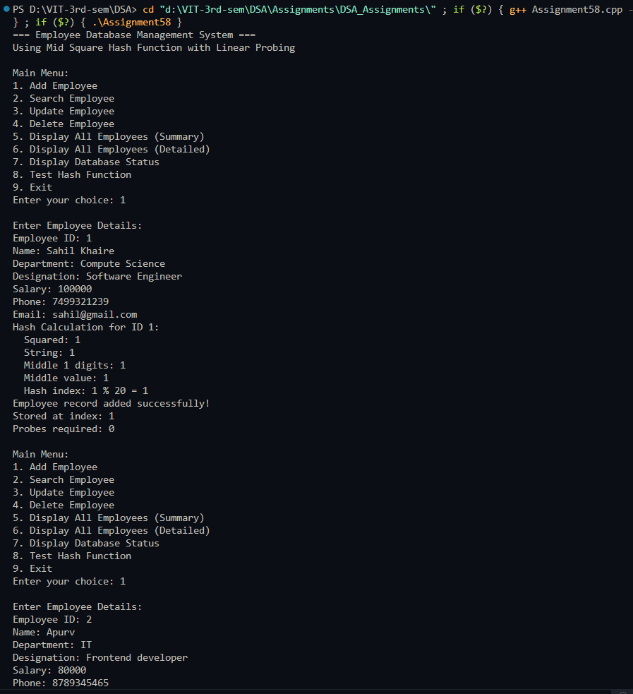
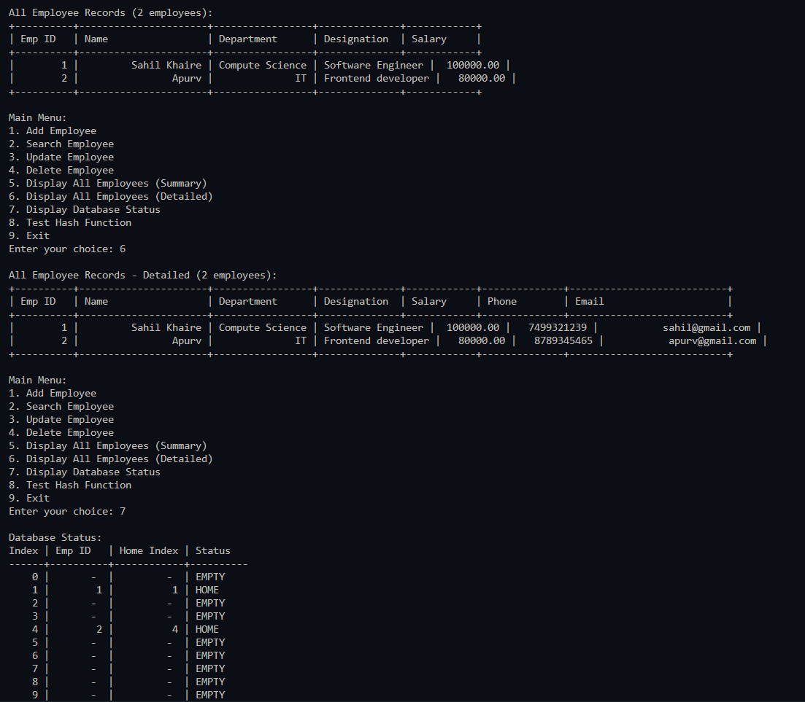
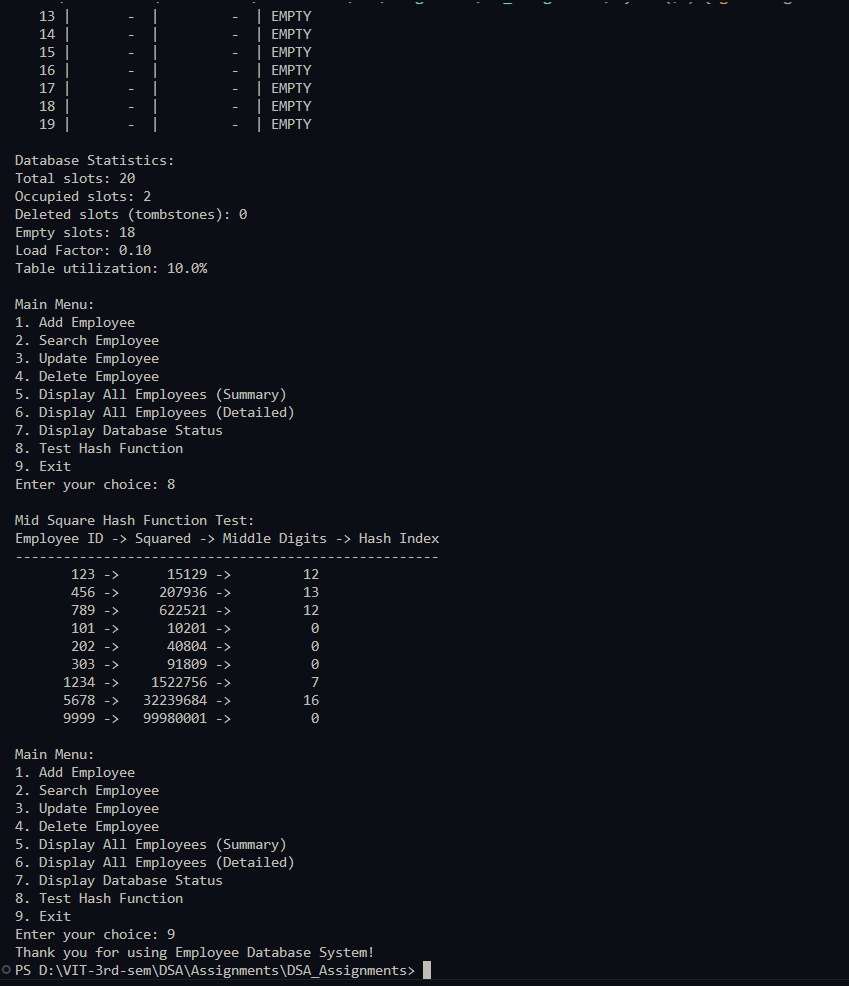

# Practical – Employee Database with Mid Square Hash Function

**Name:** Sahil Ashok Khaire  
**Roll No.:** 13  
**Title:** Employee Database Simulation using Mid Square Hash Function with Linear Probing  

- Implement an employee database using hash table
- Use Mid Square method as hash function for employee ID
- Apply linear probing for collision resolution
- Support operations: add, search, update, delete, display employees
- Assume suitable employee record structure with multiple fields

---

## Theory

An **Employee Database System** using **hash table** with the **Mid Square hash function** provides efficient storage and retrieval of employee records. The **Mid Square hash function** involves squaring the key and extracting the middle digits to form the hash value. **Linear probing** handles collisions by sequentially checking the next available slots.

**Key Components**:
- **Hash Table**: Array-based structure for storing employee records
- **Mid Square Hash Function**: `hash = middle_digits(employee_id²)`
- **Linear Probing**: Collision resolution by checking subsequent slots
- **Employee Record**: Contains professional and personal information

**Mid Square Hash Function Technique**:
1. Square the employee ID
2. Extract middle digits from the squared value
3. Use modulo operation to fit within table size
4. Provides good distribution for random keys

**Linear Probing Technique**:
- When collision occurs, check next slot `(index + 1) % size`
- Continue until empty slot or matching key is found
- Uses tombstones for deleted records

**Advantages of Mid Square Method**:
- Good distribution for random keys
- Middle digits depend on all digits of original key
- Less prone to clustering than simple modulo

**Disadvantages**:
- Computationally more expensive than simple modulo
- May require padding for small numbers

**Employee Record Structure**:
- Employee ID, Name, Department, Designation, Salary, Phone, Email

Key terms: **Hash Table**, **Employee Database**, **Mid Square Hash Function**, **Linear Probing**, **Collision Resolution**, **Employee Records**

---

## Algorithm

### Algorithm: Employee Record Structure
1. Define employee record with fields:
   - `empId_sak`: integer (unique key)
   - `name_sak`: string
   - `department_sak`: string
   - `designation_sak`: string
   - `salary_sak`: double
   - `phone_sak`: string
   - `email_sak`: string

### Algorithm: Mid Square Hash Function
1. Input: employee ID `empId_sak`, table size `size_sak`
2. Square the ID: `squared_sak = empId_sak * empId_sak`
3. Convert to string and extract middle digits
4. Convert back to integer and apply modulo: `hash_index_sak = middle_digits % size_sak`
5. Return `hash_index_sak`

### Algorithm: Insert Employee
1. Compute initial index using Mid Square hash function
2. If slot is empty or deleted:
   - Insert employee record
   - Set `isOccupied_sak = true`, `isDeleted_sak = false`
3. If slot is occupied:
   - Linear probe: `index_sak = (index_sak + 1) % size_sak`
   - Repeat until empty/deleted slot found
4. If table full, display error message

### Algorithm: Search Employee
1. Compute initial index using Mid Square hash function
2. If slot contains target employee ID:
   - Return employee record
3. If slot is empty (not deleted):
   - Return not found
4. If slot occupied with different ID or deleted:
   - Linear probe until found or empty slot
5. Return search result with probe count

### Algorithm: Update Employee
1. Search for employee by ID
2. If found, input new details (except ID)
3. Update the employee record
4. If not found, show error message

### Algorithm: Delete Employee
1. Search for employee by ID
2. If found:
   - Set `isDeleted_sak = true`, `isOccupied_sak = false`
   - Keep data for probing purposes
3. If not found, show error message

### Algorithm: Display All Employees
1. Iterate through all table slots
2. Display occupied slots in formatted table
3. Show empty and deleted slots separately

### Algorithm: Display Statistics
1. Calculate load factor
2. Count occupied, empty, and deleted slots
3. Show table utilization and collision information

---

## Program

```cpp
#include <iostream>
#include <vector>
#include <string>
#include <iomanip>
#include <sstream>
#include <cmath>
using namespace std;

struct Employee_sak {
    int empId_sak;
    string name_sak;
    string department_sak;
    string designation_sak;
    double salary_sak;
    string phone_sak;
    string email_sak;
    
    Employee_sak() {
        empId_sak = -1;
        name_sak = "";
        department_sak = "";
        designation_sak = "";
        salary_sak = 0.0;
        phone_sak = "";
        email_sak = "";
    }
    
    Employee_sak(int id_sak, string n_sak, string dept_sak, string desg_sak, 
                double sal_sak, string ph_sak, string em_sak) {
        empId_sak = id_sak;
        name_sak = n_sak;
        department_sak = dept_sak;
        designation_sak = desg_sak;
        salary_sak = sal_sak;
        phone_sak = ph_sak;
        email_sak = em_sak;
    }
    
    void display_sak() {
        cout << "| " << setw(8) << empId_sak << " | "
             << setw(20) << name_sak << " | "
             << setw(15) << department_sak << " | "
             << setw(12) << designation_sak << " | "
             << setw(10) << fixed << setprecision(2) << salary_sak << " |" << endl;
    }
    
    void displayDetailed_sak() {
        cout << "| " << setw(8) << empId_sak << " | "
             << setw(20) << name_sak << " | "
             << setw(15) << department_sak << " | "
             << setw(12) << designation_sak << " | "
             << setw(10) << fixed << setprecision(2) << salary_sak << " | "
             << setw(12) << phone_sak << " | "
             << setw(25) << email_sak << " |" << endl;
    }
};

class EmployeeDatabase_sak {
private:
    vector<Employee_sak> table_sak;
    vector<bool> isOccupied_sak;
    vector<bool> isDeleted_sak;
    int size_sak;
    int employeeCount_sak;
    
    int midSquareHash_sak(int empId_sak) {
        // Square the employee ID
        long long squared_sak = (long long)empId_sak * empId_sak;
        
        // Convert to string to extract middle digits
        string squaredStr_sak = to_string(squared_sak);
        int digits_sak = squaredStr_sak.length();
        
        // Calculate how many middle digits to take (approximately half)
        int middleDigits_sak = min(4, digits_sak); // Take up to 4 middle digits
        
        // Calculate start position for middle digits
        int start_sak = (digits_sak - middleDigits_sak) / 2;
        
        // Extract middle digits
        string middleStr_sak = squaredStr_sak.substr(start_sak, middleDigits_sak);
        
        // Convert back to integer
        int middleValue_sak = stoi(middleStr_sak);
        
        // Apply modulo to fit within table size
        return middleValue_sak % size_sak;
    }
    
    void displayHashCalculation_sak(int empId_sak, int hashIndex_sak) {
        long long squared_sak = (long long)empId_sak * empId_sak;
        string squaredStr_sak = to_string(squared_sak);
        int digits_sak = squaredStr_sak.length();
        int middleDigits_sak = min(4, digits_sak);
        int start_sak = (digits_sak - middleDigits_sak) / 2;
        string middleStr_sak = squaredStr_sak.substr(start_sak, middleDigits_sak);
        
        cout << "Hash Calculation for ID " << empId_sak << ":" << endl;
        cout << "  Squared: " << squared_sak << endl;
        cout << "  String: " << squaredStr_sak << endl;
        cout << "  Middle " << middleDigits_sak << " digits: " << middleStr_sak << endl;
        cout << "  Middle value: " << stoi(middleStr_sak) << endl;
        cout << "  Hash index: " << stoi(middleStr_sak) << " % " << size_sak 
             << " = " << hashIndex_sak << endl;
    }
    
public:
    EmployeeDatabase_sak(int tableSize_sak = 20) {
        size_sak = tableSize_sak;
        employeeCount_sak = 0;
        table_sak.resize(size_sak);
        isOccupied_sak.resize(size_sak, false);
        isDeleted_sak.resize(size_sak, false);
    }
    
    void addEmployee_sak() {
        if (employeeCount_sak >= size_sak) {
            cout << "Database is full! Cannot add more employees." << endl;
            return;
        }
        
        int empId_sak;
        string name_sak, department_sak, designation_sak, phone_sak, email_sak;
        double salary_sak;
        
        cout << "\nEnter Employee Details:" << endl;
        cout << "Employee ID: ";
        cin >> empId_sak;
        
        // Check if employee ID already exists
        int searchIndex_sak;
        if (searchEmployeeIndex_sak(empId_sak, searchIndex_sak)) {
            cout << "Error: Employee with ID " << empId_sak << " already exists!" << endl;
            return;
        }
        
        cin.ignore(); // Clear input buffer
        cout << "Name: ";
        getline(cin, name_sak);
        cout << "Department: ";
        getline(cin, department_sak);
        cout << "Designation: ";
        getline(cin, designation_sak);
        cout << "Salary: ";
        cin >> salary_sak;
        cout << "Phone: ";
        cin >> phone_sak;
        cout << "Email: ";
        cin >> email_sak;
        
        int index_sak = midSquareHash_sak(empId_sak);
        int originalIndex_sak = index_sak;
        int probes_sak = 0;
        
        // Display hash calculation
        displayHashCalculation_sak(empId_sak, index_sak);
        
        // Linear probing to find empty slot
        while (isOccupied_sak[index_sak] && !isDeleted_sak[index_sak]) {
            index_sak = (index_sak + 1) % size_sak;
            probes_sak++;
            
            if (index_sak == originalIndex_sak) {
                cout << "Database is full! Cannot add employee." << endl;
                return;
            }
        }
        
        // Insert employee record
        table_sak[index_sak] = Employee_sak(empId_sak, name_sak, department_sak, 
                                           designation_sak, salary_sak, phone_sak, email_sak);
        isOccupied_sak[index_sak] = true;
        isDeleted_sak[index_sak] = false;
        employeeCount_sak++;
        
        cout << "Employee record added successfully!" << endl;
        cout << "Stored at index: " << index_sak << endl;
        cout << "Probes required: " << probes_sak << endl;
    }
    
    bool searchEmployeeIndex_sak(int empId_sak, int& foundIndex_sak) {
        int index_sak = midSquareHash_sak(empId_sak);
        int originalIndex_sak = index_sak;
        int probes_sak = 0;
        
        while (isOccupied_sak[index_sak] || isDeleted_sak[index_sak]) {
            probes_sak++;
            if (isOccupied_sak[index_sak] && !isDeleted_sak[index_sak] && 
                table_sak[index_sak].empId_sak == empId_sak) {
                foundIndex_sak = index_sak;
                cout << "Search completed in " << probes_sak << " probes" << endl;
                return true;
            }
            
            index_sak = (index_sak + 1) % size_sak;
            
            if (index_sak == originalIndex_sak) {
                break;
            }
        }
        
        return false;
    }
    
    void searchEmployee_sak() {
        int empId_sak;
        cout << "Enter Employee ID to search: ";
        cin >> empId_sak;
        
        int foundIndex_sak;
        if (searchEmployeeIndex_sak(empId_sak, foundIndex_sak)) {
            cout << "\nEmployee Record Found:" << endl;
            cout << "+----------+----------------------+-----------------+--------------+------------+" << endl;
            cout << "| Emp ID   | Name                 | Department      | Designation  | Salary     |" << endl;
            cout << "+----------+----------------------+-----------------+--------------+------------+" << endl;
            table_sak[foundIndex_sak].display_sak();
            cout << "+----------+----------------------+-----------------+--------------+------------+" << endl;
            cout << "Location: Index " << foundIndex_sak << " in hash table" << endl;
            cout << "Home index (Mid Square): " << midSquareHash_sak(empId_sak) << endl;
        } else {
            cout << "Employee with ID " << empId_sak << " not found!" << endl;
        }
    }
    
    void updateEmployee_sak() {
        int empId_sak;
        cout << "Enter Employee ID to update: ";
        cin >> empId_sak;
        
        int foundIndex_sak;
        if (searchEmployeeIndex_sak(empId_sak, foundIndex_sak)) {
            cout << "\nCurrent Employee Details:" << endl;
            cout << "+----------+----------------------+-----------------+--------------+------------+" << endl;
            cout << "| Emp ID   | Name                 | Department      | Designation  | Salary     |" << endl;
            cout << "+----------+----------------------+-----------------+--------------+------------+" << endl;
            table_sak[foundIndex_sak].display_sak();
            cout << "+----------+----------------------+-----------------+--------------+------------+" << endl;
            
            cout << "\nEnter New Details:" << endl;
            cin.ignore();
            
            string input_sak;
            cout << "Name [" << table_sak[foundIndex_sak].name_sak << "]: ";
            getline(cin, input_sak);
            if (!input_sak.empty()) table_sak[foundIndex_sak].name_sak = input_sak;
            
            cout << "Department [" << table_sak[foundIndex_sak].department_sak << "]: ";
            getline(cin, input_sak);
            if (!input_sak.empty()) table_sak[foundIndex_sak].department_sak = input_sak;
            
            cout << "Designation [" << table_sak[foundIndex_sak].designation_sak << "]: ";
            getline(cin, input_sak);
            if (!input_sak.empty()) table_sak[foundIndex_sak].designation_sak = input_sak;
            
            cout << "Salary [" << table_sak[foundIndex_sak].salary_sak << "]: ";
            getline(cin, input_sak);
            if (!input_sak.empty()) table_sak[foundIndex_sak].salary_sak = stod(input_sak);
            
            cout << "Phone [" << table_sak[foundIndex_sak].phone_sak << "]: ";
            getline(cin, input_sak);
            if (!input_sak.empty()) table_sak[foundIndex_sak].phone_sak = input_sak;
            
            cout << "Email [" << table_sak[foundIndex_sak].email_sak << "]: ";
            getline(cin, input_sak);
            if (!input_sak.empty()) table_sak[foundIndex_sak].email_sak = input_sak;
            
            cout << "Employee record updated successfully!" << endl;
        } else {
            cout << "Employee with ID " << empId_sak << " not found!" << endl;
        }
    }
    
    void deleteEmployee_sak() {
        int empId_sak;
        cout << "Enter Employee ID to delete: ";
        cin >> empId_sak;
        
        int foundIndex_sak;
        if (searchEmployeeIndex_sak(empId_sak, foundIndex_sak)) {
            isDeleted_sak[foundIndex_sak] = true;
            isOccupied_sak[foundIndex_sak] = false;
            employeeCount_sak--;
            cout << "Employee record deleted successfully!" << endl;
        } else {
            cout << "Employee with ID " << empId_sak << " not found!" << endl;
        }
    }
    
    void displayAllEmployees_sak() {
        if (employeeCount_sak == 0) {
            cout << "No employee records found!" << endl;
            return;
        }
        
        cout << "\nAll Employee Records (" << employeeCount_sak << " employees):" << endl;
        cout << "+----------+----------------------+-----------------+--------------+------------+" << endl;
        cout << "| Emp ID   | Name                 | Department      | Designation  | Salary     |" << endl;
        cout << "+----------+----------------------+-----------------+--------------+------------+" << endl;
        
        for (int i_sak = 0; i_sak < size_sak; i_sak++) {
            if (isOccupied_sak[i_sak] && !isDeleted_sak[i_sak]) {
                table_sak[i_sak].display_sak();
            }
        }
        cout << "+----------+----------------------+-----------------+--------------+------------+" << endl;
    }
    
    void displayAllEmployeesDetailed_sak() {
        if (employeeCount_sak == 0) {
            cout << "No employee records found!" << endl;
            return;
        }
        
        cout << "\nAll Employee Records - Detailed (" << employeeCount_sak << " employees):" << endl;
        cout << "+----------+----------------------+-----------------+--------------+------------+--------------+---------------------------+" << endl;
        cout << "| Emp ID   | Name                 | Department      | Designation  | Salary     | Phone        | Email                     |" << endl;
        cout << "+----------+----------------------+-----------------+--------------+------------+--------------+---------------------------+" << endl;
        
        for (int i_sak = 0; i_sak < size_sak; i_sak++) {
            if (isOccupied_sak[i_sak] && !isDeleted_sak[i_sak]) {
                table_sak[i_sak].displayDetailed_sak();
            }
        }
        cout << "+----------+----------------------+-----------------+--------------+------------+--------------+---------------------------+" << endl;
    }
    
    void displayDatabaseStatus_sak() {
        cout << "\nDatabase Status:" << endl;
        cout << "Index | Emp ID   | Home Index | Status" << endl;
        cout << "------+----------+------------+----------" << endl;
        
        int occupied_sak = 0, deleted_sak = 0, empty_sak = 0;
        
        for (int i_sak = 0; i_sak < size_sak; i_sak++) {
            cout << setw(5) << i_sak << " | ";
            
            if (isOccupied_sak[i_sak] && !isDeleted_sak[i_sak]) {
                int homeIndex_sak = midSquareHash_sak(table_sak[i_sak].empId_sak);
                cout << setw(8) << table_sak[i_sak].empId_sak << " | "
                     << setw(10) << homeIndex_sak << " | ";
                
                if (homeIndex_sak == i_sak) {
                    cout << "HOME";
                } else {
                    cout << "PROBED";
                }
                cout << endl;
                occupied_sak++;
            } else if (isDeleted_sak[i_sak]) {
                cout << setw(8) << " - " << " | " << setw(10) << " - " << " | DELETED" << endl;
                deleted_sak++;
            } else {
                cout << setw(8) << " - " << " | " << setw(10) << " - " << " | EMPTY" << endl;
                empty_sak++;
            }
        }
        
        cout << "\nDatabase Statistics:" << endl;
        cout << "Total slots: " << size_sak << endl;
        cout << "Occupied slots: " << occupied_sak << endl;
        cout << "Deleted slots (tombstones): " << deleted_sak << endl;
        cout << "Empty slots: " << empty_sak << endl;
        cout << "Load Factor: " << fixed << setprecision(2) << (double)employeeCount_sak / size_sak << endl;
        cout << "Table utilization: " << fixed << setprecision(1) 
             << ((double)occupied_sak / size_sak) * 100 << "%" << endl;
    }
    
    void testHashFunction_sak() {
        cout << "\nMid Square Hash Function Test:" << endl;
        cout << "Employee ID -> Squared -> Middle Digits -> Hash Index" << endl;
        cout << "-----------------------------------------------------" << endl;
        
        vector<int> testIds_sak = {123, 456, 789, 101, 202, 303, 1234, 5678, 9999};
        
        for (int id_sak : testIds_sak) {
            int hash_sak = midSquareHash_sak(id_sak);
            cout << setw(10) << id_sak << " -> " << setw(10) << (id_sak * id_sak) 
                 << " -> " << setw(10) << hash_sak << endl;
        }
    }
};

int main() {
    EmployeeDatabase_sak edb_sak(20);
    int choice_sak;
    
    cout << "=== Employee Database Management System ===" << endl;
    cout << "Using Mid Square Hash Function with Linear Probing" << endl;
    
    do {
        cout << "\nMain Menu:" << endl;
        cout << "1. Add Employee" << endl;
        cout << "2. Search Employee" << endl;
        cout << "3. Update Employee" << endl;
        cout << "4. Delete Employee" << endl;
        cout << "5. Display All Employees (Summary)" << endl;
        cout << "6. Display All Employees (Detailed)" << endl;
        cout << "7. Display Database Status" << endl;
        cout << "8. Test Hash Function" << endl;
        cout << "9. Exit" << endl;
        cout << "Enter your choice: ";
        cin >> choice_sak;
        
        switch (choice_sak) {
            case 1:
                edb_sak.addEmployee_sak();
                break;
                
            case 2:
                edb_sak.searchEmployee_sak();
                break;
                
            case 3:
                edb_sak.updateEmployee_sak();
                break;
                
            case 4:
                edb_sak.deleteEmployee_sak();
                break;
                
            case 5:
                edb_sak.displayAllEmployees_sak();
                break;
                
            case 6:
                edb_sak.displayAllEmployeesDetailed_sak();
                break;
                
            case 7:
                edb_sak.displayDatabaseStatus_sak();
                break;
                
            case 8:
                edb_sak.testHashFunction_sak();
                break;
                
            case 9:
                cout << "Thank you for using Employee Database System!" << endl;
                break;
                
            default:
                cout << "Invalid choice! Please try again." << endl;
        }
    } while (choice_sak != 9);
    
    return 0;
}
```

## Output


