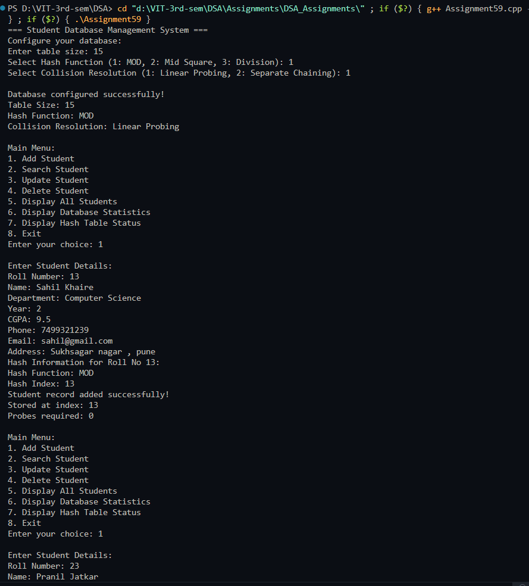
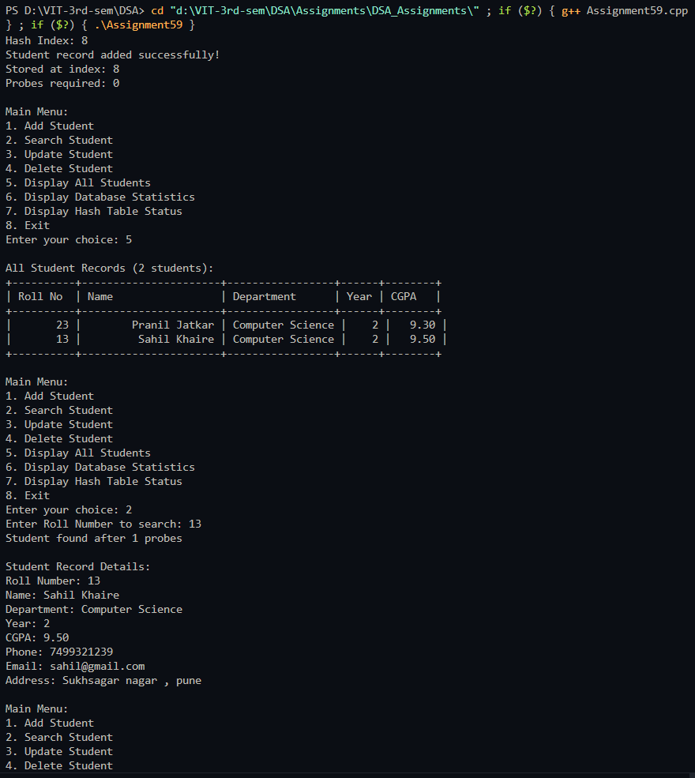
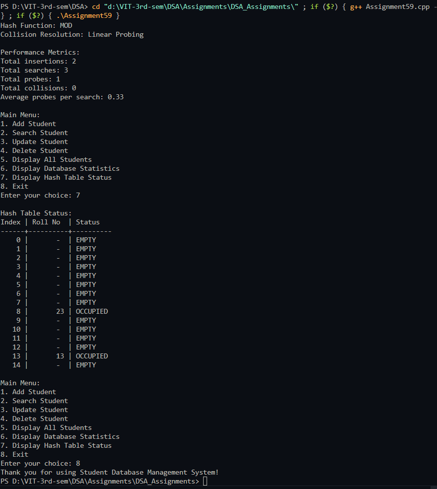

# Practical – Student Database Management System

**Name:** Sahil Ashok Khaire  
**Roll No.:** 13  
**Title:** Student Database Management System using Hashing Techniques  

- Implement a comprehensive student database using hash table
- Support multiple hashing functions (MOD, Mid Square, Division)
- Implement collision resolution techniques (Linear Probing, Separate Chaining)
- Support operations: add, search, update, delete, display students
- Provide comprehensive student record structure
- Generate statistics and performance metrics

---

## Theory

A **Student Database Management System** using **hashing techniques** provides efficient storage and retrieval of student records. Hashing maps student roll numbers to array indices using hash functions, enabling average O(1) time complexity for basic operations.

**Key Components**:
- **Hash Table**: Data structure for storing student records
- **Hash Functions**: Algorithms to map keys to indices (MOD, Mid Square, Division)
- **Collision Resolution**: Techniques to handle hash collisions (Linear Probing, Separate Chaining)
- **Student Record**: Comprehensive structure containing academic and personal information

**Hashing Techniques**:
1. **MOD Hash Function**: `hash = roll_number % table_size`
2. **Mid Square Hash Function**: Extract middle digits from squared roll number
3. **Division Hash Function**: `hash = roll_number / table_size` (for specific cases)

**Collision Resolution Methods**:
1. **Linear Probing**: Sequential search for next available slot
2. **Separate Chaining**: Linked lists at each bucket for collided elements

**Advantages of Hashing**:
- Fast insertion, deletion, and search operations
- Direct access using roll numbers as keys
- Efficient handling of large datasets
- Scalable design

**Student Record Structure**:
- Roll Number, Name, Department, Year, CGPA, Phone, Email, Address

Key terms: **Hash Table**, **Student Database**, **Hashing Functions**, **Collision Resolution**, **Linear Probing**, **Separate Chaining**, **Database Management**

---

## Algorithm

### Algorithm: Student Record Structure
1. Define student record with fields:
   - `rollNo_sak`: integer (unique key)
   - `name_sak`: string
   - `department_sak`: string
   - `year_sak`: integer
   - `cgpa_sak`: float
   - `phone_sak`: string
   - `email_sak`: string
   - `address_sak`: string

### Algorithm: Hash Functions
1. **MOD Hash**: `hash = rollNo_sak % size_sak`
2. **Mid Square Hash**:
   - Square roll number
   - Extract middle digits
   - Apply modulo: `middle_digits % size_sak`
3. **Division Hash**: `hash = rollNo_sak / size_sak` (for demonstration)

### Algorithm: Linear Probing Insertion
1. Compute initial index using selected hash function
2. If slot is empty:
   - Insert student record
3. If slot is occupied:
   - Linear probe: `index_sak = (index_sak + 1) % size_sak`
   - Repeat until empty slot found
4. Update statistics

### Algorithm: Separate Chaining Insertion
1. Compute bucket index using selected hash function
2. If bucket is empty:
   - Create new node as head
3. If bucket is occupied:
   - Add new node to beginning of linked list
4. Update chain pointers

### Algorithm: Search Operation
1. Compute initial index using selected hash function
2. Based on collision method:
   - **Linear Probing**: Sequential search until found or empty slot
   - **Separate Chaining**: Traverse linked list
3. Return student record and probe count

### Algorithm: Update Operation
1. Search for student by roll number
2. If found, update editable fields
3. Maintain roll number integrity
4. If not found, show error message

### Algorithm: Delete Operation
1. Search for student by roll number
2. Based on collision method:
   - **Linear Probing**: Mark as deleted (tombstone)
   - **Separate Chaining**: Remove node from linked list
3. Update statistics

### Algorithm: Display Operations
1. Display all students in formatted table
2. Show database statistics
3. Display performance metrics
4. Show collision information

---

## Program

```cpp
#include <iostream>
#include <vector>
#include <string>
#include <iomanip>
#include <sstream>
#include <algorithm>
using namespace std;

struct Student_sak {
    int rollNo_sak;
    string name_sak;
    string department_sak;
    int year_sak;
    float cgpa_sak;
    string phone_sak;
    string email_sak;
    string address_sak;
    
    Student_sak* next_sak; // For separate chaining
    
    Student_sak() {
        rollNo_sak = -1;
        name_sak = "";
        department_sak = "";
        year_sak = 0;
        cgpa_sak = 0.0;
        phone_sak = "";
        email_sak = "";
        address_sak = "";
        next_sak = nullptr;
    }
    
    Student_sak(int roll_sak, string n_sak, string dept_sak, int y_sak, 
                float gpa_sak, string ph_sak, string em_sak, string addr_sak) {
        rollNo_sak = roll_sak;
        name_sak = n_sak;
        department_sak = dept_sak;
        year_sak = y_sak;
        cgpa_sak = gpa_sak;
        phone_sak = ph_sak;
        email_sak = em_sak;
        address_sak = addr_sak;
        next_sak = nullptr;
    }
    
    void displaySummary_sak() {
        cout << "| " << setw(8) << rollNo_sak << " | "
             << setw(20) << name_sak << " | "
             << setw(15) << department_sak << " | "
             << setw(4) << year_sak << " | "
             << setw(6) << fixed << setprecision(2) << cgpa_sak << " |" << endl;
    }
    
    void displayDetailed_sak() {
        cout << "\nStudent Record Details:" << endl;
        cout << "Roll Number: " << rollNo_sak << endl;
        cout << "Name: " << name_sak << endl;
        cout << "Department: " << department_sak << endl;
        cout << "Year: " << year_sak << endl;
        cout << "CGPA: " << fixed << setprecision(2) << cgpa_sak << endl;
        cout << "Phone: " << phone_sak << endl;
        cout << "Email: " << email_sak << endl;
        cout << "Address: " << address_sak << endl;
    }
    
    bool isEmpty_sak() {
        return rollNo_sak == -1;
    }
};

class StudentDatabase_sak {
private:
    vector<Student_sak> table_sak; // For linear probing
    vector<Student_sak*> chains_sak; // For separate chaining
    vector<bool> isOccupied_sak;
    vector<bool> isDeleted_sak;
    int size_sak;
    int studentCount_sak;
    int hashMethod_sak; // 1: MOD, 2: Mid Square, 3: Division
    int collisionMethod_sak; // 1: Linear Probing, 2: Separate Chaining
    
    // Statistics
    int totalInsertions_sak;
    int totalSearches_sak;
    int totalProbes_sak;
    int totalCollisions_sak;
    
    int modHash_sak(int rollNo_sak) {
        return rollNo_sak % size_sak;
    }
    
    int midSquareHash_sak(int rollNo_sak) {
        long long squared_sak = (long long)rollNo_sak * rollNo_sak;
        string squaredStr_sak = to_string(squared_sak);
        int digits_sak = squaredStr_sak.length();
        int middleDigits_sak = min(4, digits_sak);
        int start_sak = (digits_sak - middleDigits_sak) / 2;
        string middleStr_sak = squaredStr_sak.substr(start_sak, middleDigits_sak);
        return stoi(middleStr_sak) % size_sak;
    }
    
    int divisionHash_sak(int rollNo_sak) {
        return rollNo_sak / size_sak;
    }
    
    int hashFunction_sak(int rollNo_sak) {
        switch (hashMethod_sak) {
            case 1: return modHash_sak(rollNo_sak);
            case 2: return midSquareHash_sak(rollNo_sak);
            case 3: return divisionHash_sak(rollNo_sak);
            default: return modHash_sak(rollNo_sak);
        }
    }
    
    void displayHashInfo_sak(int rollNo_sak, int hashIndex_sak) {
        cout << "Hash Information for Roll No " << rollNo_sak << ":" << endl;
        cout << "Hash Function: ";
        switch (hashMethod_sak) {
            case 1: cout << "MOD"; break;
            case 2: cout << "Mid Square"; break;
            case 3: cout << "Division"; break;
        }
        cout << endl;
        cout << "Hash Index: " << hashIndex_sak << endl;
    }
    
public:
    StudentDatabase_sak(int tableSize_sak = 20, int hashMethod_sak = 1, int collisionMethod_sak = 1) {
        size_sak = tableSize_sak;
        this->hashMethod_sak = hashMethod_sak;
        this->collisionMethod_sak = collisionMethod_sak;
        studentCount_sak = 0;
        totalInsertions_sak = 0;
        totalSearches_sak = 0;
        totalProbes_sak = 0;
        totalCollisions_sak = 0;
        
        if (collisionMethod_sak == 1) {
            // Linear Probing
            table_sak.resize(size_sak);
            isOccupied_sak.resize(size_sak, false);
            isDeleted_sak.resize(size_sak, false);
        } else {
            // Separate Chaining
            chains_sak.resize(size_sak, nullptr);
        }
    }
    
    void addStudent_sak() {
        if (studentCount_sak >= size_sak && collisionMethod_sak == 1) {
            cout << "Database is full! Cannot add more students." << endl;
            return;
        }
        
        int rollNo_sak;
        string name_sak, department_sak, phone_sak, email_sak, address_sak;
        int year_sak;
        float cgpa_sak;
        
        cout << "\nEnter Student Details:" << endl;
        cout << "Roll Number: ";
        cin >> rollNo_sak;
        
        // Check if roll number already exists
        if (searchStudent_sak(rollNo_sak, false)) {
            cout << "Error: Student with roll number " << rollNo_sak << " already exists!" << endl;
            return;
        }
        
        cin.ignore(); // Clear input buffer
        cout << "Name: ";
        getline(cin, name_sak);
        cout << "Department: ";
        getline(cin, department_sak);
        cout << "Year: ";
        cin >> year_sak;
        cout << "CGPA: ";
        cin >> cgpa_sak;
        cin.ignore();
        cout << "Phone: ";
        getline(cin, phone_sak);
        cout << "Email: ";
        getline(cin, email_sak);
        cout << "Address: ";
        getline(cin, address_sak);
        
        Student_sak newStudent_sak(rollNo_sak, name_sak, department_sak, year_sak, 
                                  cgpa_sak, phone_sak, email_sak, address_sak);
        
        if (collisionMethod_sak == 1) {
            // Linear Probing
            addStudentLinearProbing_sak(newStudent_sak);
        } else {
            // Separate Chaining
            addStudentSeparateChaining_sak(newStudent_sak);
        }
        
        studentCount_sak++;
        totalInsertions_sak++;
    }
    
    void addStudentLinearProbing_sak(Student_sak student_sak) {
        int index_sak = hashFunction_sak(student_sak.rollNo_sak);
        int originalIndex_sak = index_sak;
        int probes_sak = 0;
        
        displayHashInfo_sak(student_sak.rollNo_sak, index_sak);
        
        while (isOccupied_sak[index_sak] && !isDeleted_sak[index_sak]) {
            index_sak = (index_sak + 1) % size_sak;
            probes_sak++;
            totalCollisions_sak++;
            
            if (index_sak == originalIndex_sak) {
                cout << "Database is full! Cannot add student." << endl;
                return;
            }
        }
        
        table_sak[index_sak] = student_sak;
        isOccupied_sak[index_sak] = true;
        isDeleted_sak[index_sak] = false;
        
        cout << "Student record added successfully!" << endl;
        cout << "Stored at index: " << index_sak << endl;
        cout << "Probes required: " << probes_sak << endl;
        totalProbes_sak += probes_sak;
    }
    
    void addStudentSeparateChaining_sak(Student_sak student_sak) {
        int index_sak = hashFunction_sak(student_sak.rollNo_sak);
        
        displayHashInfo_sak(student_sak.rollNo_sak, index_sak);
        
        Student_sak* newStudent_sak = new Student_sak(student_sak);
        
        // Insert at beginning of chain
        newStudent_sak->next_sak = chains_sak[index_sak];
        chains_sak[index_sak] = newStudent_sak;
        
        cout << "Student record added successfully!" << endl;
        cout << "Stored in bucket: " << index_sak << endl;
        
        // Count collision if bucket was not empty
        if (newStudent_sak->next_sak != nullptr) {
            totalCollisions_sak++;
        }
    }
    
    bool searchStudent_sak(int rollNo_sak, bool display = true) {
        totalSearches_sak++;
        
        if (collisionMethod_sak == 1) {
            return searchStudentLinearProbing_sak(rollNo_sak, display);
        } else {
            return searchStudentSeparateChaining_sak(rollNo_sak, display);
        }
    }
    
    bool searchStudentLinearProbing_sak(int rollNo_sak, bool display) {
        int index_sak = hashFunction_sak(rollNo_sak);
        int originalIndex_sak = index_sak;
        int probes_sak = 0;
        
        while (isOccupied_sak[index_sak] || isDeleted_sak[index_sak]) {
            probes_sak++;
            if (isOccupied_sak[index_sak] && !isDeleted_sak[index_sak] && 
                table_sak[index_sak].rollNo_sak == rollNo_sak) {
                if (display) {
                    cout << "Student found after " << probes_sak << " probes" << endl;
                    table_sak[index_sak].displayDetailed_sak();
                }
                totalProbes_sak += probes_sak;
                return true;
            }
            
            index_sak = (index_sak + 1) % size_sak;
            
            if (index_sak == originalIndex_sak) {
                break;
            }
        }
        
        if (display) {
            cout << "Student with roll number " << rollNo_sak << " not found!" << endl;
        }
        totalProbes_sak += probes_sak;
        return false;
    }
    
    bool searchStudentSeparateChaining_sak(int rollNo_sak, bool display) {
        int index_sak = hashFunction_sak(rollNo_sak);
        Student_sak* current_sak = chains_sak[index_sak];
        int probes_sak = 0;
        
        while (current_sak != nullptr) {
            probes_sak++;
            if (current_sak->rollNo_sak == rollNo_sak) {
                if (display) {
                    cout << "Student found after " << probes_sak << " probes" << endl;
                    current_sak->displayDetailed_sak();
                }
                totalProbes_sak += probes_sak;
                return true;
            }
            current_sak = current_sak->next_sak;
        }
        
        if (display) {
            cout << "Student with roll number " << rollNo_sak << " not found!" << endl;
        }
        totalProbes_sak += probes_sak;
        return false;
    }
    
    void updateStudent_sak() {
        int rollNo_sak;
        cout << "Enter Roll Number to update: ";
        cin >> rollNo_sak;
        
        if (collisionMethod_sak == 1) {
            // Linear Probing - search and update
            int index_sak = hashFunction_sak(rollNo_sak);
            int originalIndex_sak = index_sak;
            
            while (isOccupied_sak[index_sak] || isDeleted_sak[index_sak]) {
                if (isOccupied_sak[index_sak] && !isDeleted_sak[index_sak] && 
                    table_sak[index_sak].rollNo_sak == rollNo_sak) {
                    
                    cout << "\nCurrent Student Details:" << endl;
                    table_sak[index_sak].displayDetailed_sak();
                    
                    cout << "\nEnter New Details:" << endl;
                    cin.ignore();
                    
                    string input_sak;
                    cout << "Name [" << table_sak[index_sak].name_sak << "]: ";
                    getline(cin, input_sak);
                    if (!input_sak.empty()) table_sak[index_sak].name_sak = input_sak;
                    
                    cout << "Department [" << table_sak[index_sak].department_sak << "]: ";
                    getline(cin, input_sak);
                    if (!input_sak.empty()) table_sak[index_sak].department_sak = input_sak;
                    
                    cout << "Year [" << table_sak[index_sak].year_sak << "]: ";
                    getline(cin, input_sak);
                    if (!input_sak.empty()) table_sak[index_sak].year_sak = stoi(input_sak);
                    
                    cout << "CGPA [" << table_sak[index_sak].cgpa_sak << "]: ";
                    getline(cin, input_sak);
                    if (!input_sak.empty()) table_sak[index_sak].cgpa_sak = stof(input_sak);
                    
                    cout << "Phone [" << table_sak[index_sak].phone_sak << "]: ";
                    getline(cin, input_sak);
                    if (!input_sak.empty()) table_sak[index_sak].phone_sak = input_sak;
                    
                    cout << "Email [" << table_sak[index_sak].email_sak << "]: ";
                    getline(cin, input_sak);
                    if (!input_sak.empty()) table_sak[index_sak].email_sak = input_sak;
                    
                    cout << "Address [" << table_sak[index_sak].address_sak << "]: ";
                    getline(cin, input_sak);
                    if (!input_sak.empty()) table_sak[index_sak].address_sak = input_sak;
                    
                    cout << "Student record updated successfully!" << endl;
                    return;
                }
                
                index_sak = (index_sak + 1) % size_sak;
                if (index_sak == originalIndex_sak) break;
            }
        } else {
            // Separate Chaining - search and update
            int index_sak = hashFunction_sak(rollNo_sak);
            Student_sak* current_sak = chains_sak[index_sak];
            
            while (current_sak != nullptr) {
                if (current_sak->rollNo_sak == rollNo_sak) {
                    cout << "\nCurrent Student Details:" << endl;
                    current_sak->displayDetailed_sak();
                    
                    cout << "\nEnter New Details:" << endl;
                    cin.ignore();
                    
                    string input_sak;
                    cout << "Name [" << current_sak->name_sak << "]: ";
                    getline(cin, input_sak);
                    if (!input_sak.empty()) current_sak->name_sak = input_sak;
                    
                    cout << "Department [" << current_sak->department_sak << "]: ";
                    getline(cin, input_sak);
                    if (!input_sak.empty()) current_sak->department_sak = input_sak;
                    
                    cout << "Year [" << current_sak->year_sak << "]: ";
                    getline(cin, input_sak);
                    if (!input_sak.empty()) current_sak->year_sak = stoi(input_sak);
                    
                    cout << "CGPA [" << current_sak->cgpa_sak << "]: ";
                    getline(cin, input_sak);
                    if (!input_sak.empty()) current_sak->cgpa_sak = stof(input_sak);
                    
                    cout << "Phone [" << current_sak->phone_sak << "]: ";
                    getline(cin, input_sak);
                    if (!input_sak.empty()) current_sak->phone_sak = input_sak;
                    
                    cout << "Email [" << current_sak->email_sak << "]: ";
                    getline(cin, input_sak);
                    if (!input_sak.empty()) current_sak->email_sak = input_sak;
                    
                    cout << "Address [" << current_sak->address_sak << "]: ";
                    getline(cin, input_sak);
                    if (!input_sak.empty()) current_sak->address_sak = input_sak;
                    
                    cout << "Student record updated successfully!" << endl;
                    return;
                }
                current_sak = current_sak->next_sak;
            }
        }
        
        cout << "Student with roll number " << rollNo_sak << " not found!" << endl;
    }
    
    void deleteStudent_sak() {
        int rollNo_sak;
        cout << "Enter Roll Number to delete: ";
        cin >> rollNo_sak;
        
        if (collisionMethod_sak == 1) {
            // Linear Probing
            int index_sak = hashFunction_sak(rollNo_sak);
            int originalIndex_sak = index_sak;
            
            while (isOccupied_sak[index_sak] || isDeleted_sak[index_sak]) {
                if (isOccupied_sak[index_sak] && !isDeleted_sak[index_sak] && 
                    table_sak[index_sak].rollNo_sak == rollNo_sak) {
                    isDeleted_sak[index_sak] = true;
                    isOccupied_sak[index_sak] = false;
                    studentCount_sak--;
                    cout << "Student record deleted successfully!" << endl;
                    return;
                }
                
                index_sak = (index_sak + 1) % size_sak;
                if (index_sak == originalIndex_sak) break;
            }
        } else {
            // Separate Chaining
            int index_sak = hashFunction_sak(rollNo_sak);
            Student_sak* current_sak = chains_sak[index_sak];
            Student_sak* prev_sak = nullptr;
            
            while (current_sak != nullptr) {
                if (current_sak->rollNo_sak == rollNo_sak) {
                    if (prev_sak == nullptr) {
                        chains_sak[index_sak] = current_sak->next_sak;
                    } else {
                        prev_sak->next_sak = current_sak->next_sak;
                    }
                    delete current_sak;
                    studentCount_sak--;
                    cout << "Student record deleted successfully!" << endl;
                    return;
                }
                prev_sak = current_sak;
                current_sak = current_sak->next_sak;
            }
        }
        
        cout << "Student with roll number " << rollNo_sak << " not found!" << endl;
    }
    
    void displayAllStudents_sak() {
        if (studentCount_sak == 0) {
            cout << "No student records found!" << endl;
            return;
        }
        
        cout << "\nAll Student Records (" << studentCount_sak << " students):" << endl;
        cout << "+----------+----------------------+-----------------+------+--------+" << endl;
        cout << "| Roll No  | Name                 | Department      | Year | CGPA   |" << endl;
        cout << "+----------+----------------------+-----------------+------+--------+" << endl;
        
        if (collisionMethod_sak == 1) {
            // Linear Probing
            for (int i_sak = 0; i_sak < size_sak; i_sak++) {
                if (isOccupied_sak[i_sak] && !isDeleted_sak[i_sak]) {
                    table_sak[i_sak].displaySummary_sak();
                }
            }
        } else {
            // Separate Chaining
            for (int i_sak = 0; i_sak < size_sak; i_sak++) {
                Student_sak* current_sak = chains_sak[i_sak];
                while (current_sak != nullptr) {
                    current_sak->displaySummary_sak();
                    current_sak = current_sak->next_sak;
                }
            }
        }
        cout << "+----------+----------------------+-----------------+------+--------+" << endl;
    }
    
    void displayDatabaseStats_sak() {
        cout << "\nDatabase Statistics:" << endl;
        cout << "Total students: " << studentCount_sak << endl;
        cout << "Table size: " << size_sak << endl;
        cout << "Load Factor: " << fixed << setprecision(2) << (double)studentCount_sak / size_sak << endl;
        
        cout << "\nHashing Configuration:" << endl;
        cout << "Hash Function: ";
        switch (hashMethod_sak) {
            case 1: cout << "MOD"; break;
            case 2: cout << "Mid Square"; break;
            case 3: cout << "Division"; break;
        }
        cout << endl;
        
        cout << "Collision Resolution: ";
        if (collisionMethod_sak == 1) {
            cout << "Linear Probing" << endl;
        } else {
            cout << "Separate Chaining" << endl;
        }
        
        cout << "\nPerformance Metrics:" << endl;
        cout << "Total insertions: " << totalInsertions_sak << endl;
        cout << "Total searches: " << totalSearches_sak << endl;
        cout << "Total probes: " << totalProbes_sak << endl;
        cout << "Total collisions: " << totalCollisions_sak << endl;
        
        if (totalSearches_sak > 0) {
            cout << "Average probes per search: " << fixed << setprecision(2) 
                 << (double)totalProbes_sak / totalSearches_sak << endl;
        }
        
        if (collisionMethod_sak == 2) {
            // Separate Chaining specific stats
            int emptyBuckets_sak = 0;
            int maxChainLength_sak = 0;
            
            for (int i_sak = 0; i_sak < size_sak; i_sak++) {
                int chainLength_sak = 0;
                Student_sak* current_sak = chains_sak[i_sak];
                
                while (current_sak != nullptr) {
                    chainLength_sak++;
                    current_sak = current_sak->next_sak;
                }
                
                if (chainLength_sak == 0) {
                    emptyBuckets_sak++;
                }
                if (chainLength_sak > maxChainLength_sak) {
                    maxChainLength_sak = chainLength_sak;
                }
            }
            
            cout << "\nSeparate Chaining Statistics:" << endl;
            cout << "Empty buckets: " << emptyBuckets_sak << endl;
            cout << "Maximum chain length: " << maxChainLength_sak << endl;
            cout << "Bucket utilization: " << fixed << setprecision(1) 
                 << ((double)(size_sak - emptyBuckets_sak) / size_sak) * 100 << "%" << endl;
        }
    }
    
    void displayHashTableStatus_sak() {
        cout << "\nHash Table Status:" << endl;
        
        if (collisionMethod_sak == 1) {
            cout << "Index | Roll No  | Status" << endl;
            cout << "------+----------+----------" << endl;
            
            for (int i_sak = 0; i_sak < size_sak; i_sak++) {
                cout << setw(5) << i_sak << " | ";
                if (isOccupied_sak[i_sak] && !isDeleted_sak[i_sak]) {
                    cout << setw(8) << table_sak[i_sak].rollNo_sak << " | OCCUPIED" << endl;
                } else if (isDeleted_sak[i_sak]) {
                    cout << setw(8) << " - " << " | DELETED" << endl;
                } else {
                    cout << setw(8) << " - " << " | EMPTY" << endl;
                }
            }
        } else {
            cout << "Bucket | Chain Length | Students" << endl;
            cout << "-------+--------------+----------" << endl;
            
            for (int i_sak = 0; i_sak < size_sak; i_sak++) {
                int chainLength_sak = 0;
                Student_sak* current_sak = chains_sak[i_sak];
                string students_sak = "";
                
                while (current_sak != nullptr) {
                    chainLength_sak++;
                    if (!students_sak.empty()) students_sak += ", ";
                    students_sak += to_string(current_sak->rollNo_sak);
                    current_sak = current_sak->next_sak;
                }
                
                cout << setw(6) << i_sak << " | "
                     << setw(12) << chainLength_sak << " | "
                     << students_sak << endl;
            }
        }
    }
    
    ~StudentDatabase_sak() {
        // Clean up memory for separate chaining
        if (collisionMethod_sak == 2) {
            for (int i_sak = 0; i_sak < size_sak; i_sak++) {
                Student_sak* current_sak = chains_sak[i_sak];
                while (current_sak != nullptr) {
                    Student_sak* temp_sak = current_sak;
                    current_sak = current_sak->next_sak;
                    delete temp_sak;
                }
            }
        }
    }
};

int main() {
    int tableSize_sak, hashMethod_sak, collisionMethod_sak;
    
    cout << "=== Student Database Management System ===" << endl;
    cout << "Configure your database:" << endl;
    cout << "Enter table size: ";
    cin >> tableSize_sak;
    
    cout << "Select Hash Function (1: MOD, 2: Mid Square, 3: Division): ";
    cin >> hashMethod_sak;
    
    cout << "Select Collision Resolution (1: Linear Probing, 2: Separate Chaining): ";
    cin >> collisionMethod_sak;
    
    StudentDatabase_sak sdb_sak(tableSize_sak, hashMethod_sak, collisionMethod_sak);
    int choice_sak;
    
    cout << "\nDatabase configured successfully!" << endl;
    cout << "Table Size: " << tableSize_sak << endl;
    cout << "Hash Function: " << (hashMethod_sak == 1 ? "MOD" : hashMethod_sak == 2 ? "Mid Square" : "Division") << endl;
    cout << "Collision Resolution: " << (collisionMethod_sak == 1 ? "Linear Probing" : "Separate Chaining") << endl;
    
    do {
        cout << "\nMain Menu:" << endl;
        cout << "1. Add Student" << endl;
        cout << "2. Search Student" << endl;
        cout << "3. Update Student" << endl;
        cout << "4. Delete Student" << endl;
        cout << "5. Display All Students" << endl;
        cout << "6. Display Database Statistics" << endl;
        cout << "7. Display Hash Table Status" << endl;
        cout << "8. Exit" << endl;
        cout << "Enter your choice: ";
        cin >> choice_sak;
        
        switch (choice_sak) {
            case 1:
                sdb_sak.addStudent_sak();
                break;
                
            case 2:
                int rollNo_sak;
                cout << "Enter Roll Number to search: ";
                cin >> rollNo_sak;
                sdb_sak.searchStudent_sak(rollNo_sak);
                break;
                
            case 3:
                sdb_sak.updateStudent_sak();
                break;
                
            case 4:
                sdb_sak.deleteStudent_sak();
                break;
                
            case 5:
                sdb_sak.displayAllStudents_sak();
                break;
                
            case 6:
                sdb_sak.displayDatabaseStats_sak();
                break;
                
            case 7:
                sdb_sak.displayHashTableStatus_sak();
                break;
                
            case 8:
                cout << "Thank you for using Student Database Management System!" << endl;
                break;
                
            default:
                cout << "Invalid choice! Please try again." << endl;
        }
    } while (choice_sak != 8);
    
    return 0;
}
```

## Output


