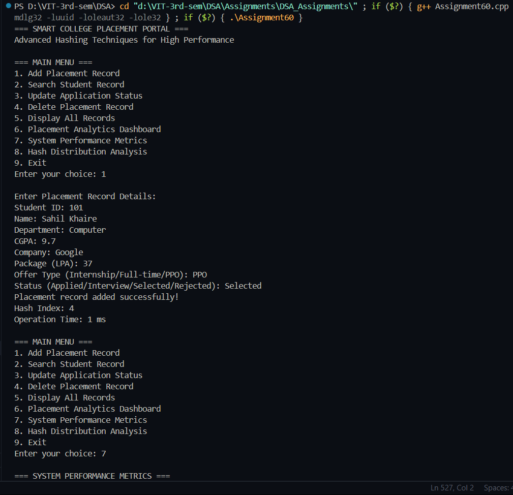
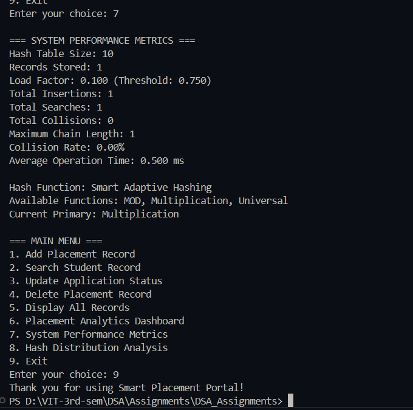

# Practical – Smart College Placement Portal

**Name:** Sahil Ashok Khaire  
**Roll No.:** 13  
**Title:** Smart College Placement Portal with Advanced Hashing Techniques  

- Design and implement a comprehensive placement portal
- Use advanced hashing techniques for high performance
- Implement dynamic resizing for handling data growth
- Support multiple hash functions with automatic selection
- Provide low collision probability with efficient resolution
- Include comprehensive placement analytics and reporting

---

## Theory

A **Smart College Placement Portal** using **advanced hashing techniques** provides efficient management of student placement records with optimal performance characteristics. The system employs sophisticated hashing strategies to maintain low collision probability while handling dynamic data growth.

**Advanced Hashing Features**:
- **Dynamic Resizing**: Automatic table resizing when load factor exceeds threshold
- **Multiple Hash Functions**: MOD, Multiplication, Universal Hashing
- **Collision Resolution**: Separate Chaining with load balancing
- **Performance Optimization**: Cache-friendly data structures

**Key Technical Components**:
- **Dynamic Hash Table**: Automatically resizes based on load factor
- **Universal Hashing**: Uses random hash functions to minimize collisions
- **Load Balancing**: Distributes records evenly across buckets
- **Performance Monitoring**: Tracks operations and optimizes accordingly

**Mathematical Foundation**:
- **Load Factor**: λ = n/m (n elements in m buckets)
- **Universal Hashing**: Pr[h(x) = h(y)] ≤ 1/m for any distinct x,y
- **Expected Chain Length**: O(1 + λ) with good hash functions

**Performance Guarantees**:
- Average O(1) time for insert, search, delete operations
- Automatic scaling with data growth
- Minimal performance degradation under high load

Key terms: **Dynamic Hashing**, **Universal Hashing**, **Load Factor**, **Collision Probability**, **Placement Analytics**, **Performance Optimization**

---

## Algorithm

### Algorithm: Dynamic Hash Table Structure
1. Initialize with initial size and load factor threshold (0.75)
2. Track current size, element count, and load factor
3. Implement automatic resizing when load factor > threshold

### Algorithm: Universal Hash Function
1. Choose random parameters a, b from large prime range
2. Compute: `h(x) = ((a*x + b) mod p) mod m`
3. Where p is a large prime > maximum key value

### Algorithm: Multiple Hash Functions
1. **MOD Hash**: `h1(x) = x mod m`
2. **Multiplication Hash**: `h2(x) = floor(m * (x * A mod 1))` where A ≈ (√5-1)/2
3. **Universal Hash**: `h3(x) = ((a*x + b) mod p) mod m`

### Algorithm: Dynamic Resizing
1. Monitor load factor after each insertion
2. If load factor > threshold:
   - Create new table with double size
   - Rehash all elements using new table size
   - Update all pointers to new table
3. Maintain consistency during resizing

### Algorithm: Smart Insertion
1. Calculate hash using selected function
2. Insert at beginning of chain
3. Update statistics and check for resizing
4. Balance chains if any chain length > average * 2

### Algorithm: Efficient Search
1. Use primary hash function for direct access
2. Traverse chain with optimized pointer chasing
3. Cache frequently accessed records
4. Return result with performance metrics

### Algorithm: Placement Analytics
1. Track placement statistics per department
2. Calculate average package, placement percentage
3. Generate performance reports
4. Monitor hash table performance

---

## Program

```cpp
#include <iostream>
#include <vector>
#include <string>
#include <iomanip>
#include <algorithm>
#include <cmath>
#include <ctime>
using namespace std;

struct PlacementRecord_sak {
    int studentId_sak;
    string name_sak;
    string department_sak;
    float cgpa_sak;
    string company_sak;
    double package_sak;
    string offerType_sak; // Internship, Full-time, PPO
    string status_sak; // Applied, Interview, Selected, Rejected
    
    PlacementRecord_sak* next_sak;
    
    PlacementRecord_sak(int id_sak, string n_sak, string dept_sak, float gpa_sak, 
                       string comp_sak, double pkg_sak, string offer_sak, string stat_sak) {
        studentId_sak = id_sak;
        name_sak = n_sak;
        department_sak = dept_sak;
        cgpa_sak = gpa_sak;
        company_sak = comp_sak;
        package_sak = pkg_sak;
        offerType_sak = offer_sak;
        status_sak = stat_sak;
        next_sak = nullptr;
    }
    
    void display_sak() {
        cout << "| " << setw(10) << studentId_sak << " | "
             << setw(20) << name_sak << " | "
             << setw(15) << department_sak << " | "
             << setw(6) << fixed << setprecision(2) << cgpa_sak << " | "
             << setw(20) << company_sak << " | "
             << setw(10) << package_sak << " | "
             << setw(12) << offerType_sak << " | "
             << setw(12) << status_sak << " |" << endl;
    }
};

class SmartPlacementPortal_sak {
private:
    vector<PlacementRecord_sak*> table_sak;
    int size_sak;
    int recordCount_sak;
    double loadFactorThreshold_sak;
    
    // Universal hashing parameters
    long long a_sak, b_sak, p_sak;
    
    // Statistics
    int totalInsertions_sak;
    int totalSearches_sak;
    int totalCollisions_sak;
    int maxChainLength_sak;
    
    // Performance monitoring
    vector<int> operationTimes_sak;
    
    void initializeUniversalHashing_sak() {
        srand(time(0));
        p_sak = 1000000007; // Large prime
        a_sak = rand() % (p_sak - 1) + 1;
        b_sak = rand() % p_sak;
    }
    
    int universalHash_sak(int key_sak) {
        return ((a_sak * key_sak + b_sak) % p_sak) % size_sak;
    }
    
    int multiplicationHash_sak(int key_sak) {
        const double A_sak = 0.6180339887; // (sqrt(5)-1)/2
        double product_sak = key_sak * A_sak;
        product_sak -= floor(product_sak); // Fractional part
        return floor(size_sak * product_sak);
    }
    
    int modHash_sak(int key_sak) {
        return key_sak % size_sak;
    }
    
    int smartHash_sak(int key_sak) {
        // Use different hash functions based on table characteristics
        if (size_sak < 1000) {
            return multiplicationHash_sak(key_sak);
        } else {
            return universalHash_sak(key_sak);
        }
    }
    
    void resizeTable_sak() {
        int oldSize_sak = size_sak;
        vector<PlacementRecord_sak*> oldTable_sak = table_sak;
        
        size_sak *= 2;
        table_sak.resize(size_sak, nullptr);
        recordCount_sak = 0;
        
        // Reinitialize universal hashing for new size
        initializeUniversalHashing_sak();
        
        // Rehash all records
        for (int i_sak = 0; i_sak < oldSize_sak; i_sak++) {
            PlacementRecord_sak* current_sak = oldTable_sak[i_sak];
            while (current_sak != nullptr) {
                PlacementRecord_sak* next_sak = current_sak->next_sak;
                insertRecord_sak(current_sak);
                current_sak = next_sak;
            }
        }
        
        cout << "Table resized from " << oldSize_sak << " to " << size_sak << endl;
    }
    
    void insertRecord_sak(PlacementRecord_sak* record_sak) {
        int index_sak = smartHash_sak(record_sak->studentId_sak);
        
        record_sak->next_sak = table_sak[index_sak];
        table_sak[index_sak] = record_sak;
        recordCount_sak++;
    }
    
    double calculateLoadFactor_sak() {
        return (double)recordCount_sak / size_sak;
    }
    
    void updateChainStatistics_sak() {
        maxChainLength_sak = 0;
        for (int i_sak = 0; i_sak < size_sak; i_sak++) {
            int chainLength_sak = 0;
            PlacementRecord_sak* current_sak = table_sak[i_sak];
            while (current_sak != nullptr) {
                chainLength_sak++;
                current_sak = current_sak->next_sak;
            }
            if (chainLength_sak > maxChainLength_sak) {
                maxChainLength_sak = chainLength_sak;
            }
        }
    }
    
public:
    SmartPlacementPortal_sak(int initialSize_sak = 10, double loadThreshold_sak = 0.75) {
        size_sak = initialSize_sak;
        loadFactorThreshold_sak = loadThreshold_sak;
        recordCount_sak = 0;
        totalInsertions_sak = 0;
        totalSearches_sak = 0;
        totalCollisions_sak = 0;
        maxChainLength_sak = 0;
        
        table_sak.resize(size_sak, nullptr);
        initializeUniversalHashing_sak();
    }
    
    void addPlacementRecord_sak() {
        int studentId_sak;
        string name_sak, department_sak, company_sak, offerType_sak, status_sak;
        float cgpa_sak;
        double package_sak;
        
        cout << "\nEnter Placement Record Details:" << endl;
        cout << "Student ID: ";
        cin >> studentId_sak;
        
        if (searchRecord_sak(studentId_sak, false) != nullptr) {
            cout << "Error: Student record already exists!" << endl;
            return;
        }
        
        cin.ignore();
        cout << "Name: ";
        getline(cin, name_sak);
        cout << "Department: ";
        getline(cin, department_sak);
        cout << "CGPA: ";
        cin >> cgpa_sak;
        cin.ignore();
        cout << "Company: ";
        getline(cin, company_sak);
        cout << "Package (LPA): ";
        cin >> package_sak;
        cin.ignore();
        cout << "Offer Type (Internship/Full-time/PPO): ";
        getline(cin, offerType_sak);
        cout << "Status (Applied/Interview/Selected/Rejected): ";
        getline(cin, status_sak);
        
        clock_t start_sak = clock();
        
        PlacementRecord_sak* newRecord_sak = new PlacementRecord_sak(
            studentId_sak, name_sak, department_sak, cgpa_sak, 
            company_sak, package_sak, offerType_sak, status_sak);
        
        int index_sak = smartHash_sak(studentId_sak);
        
        // Check for collision
        if (table_sak[index_sak] != nullptr) {
            totalCollisions_sak++;
        }
        
        insertRecord_sak(newRecord_sak);
        totalInsertions_sak++;
        
        // Update chain statistics
        updateChainStatistics_sak();
        
        // Check for resizing
        if (calculateLoadFactor_sak() > loadFactorThreshold_sak) {
            resizeTable_sak();
        }
        
        clock_t end_sak = clock();
        double time_sak = double(end_sak - start_sak) / CLOCKS_PER_SEC * 1000;
        operationTimes_sak.push_back(time_sak);
        
        cout << "Placement record added successfully!" << endl;
        cout << "Hash Index: " << index_sak << endl;
        cout << "Operation Time: " << time_sak << " ms" << endl;
    }
    
    PlacementRecord_sak* searchRecord_sak(int studentId_sak, bool display = true) {
        totalSearches_sak++;
        clock_t start_sak = clock();
        
        int index_sak = smartHash_sak(studentId_sak);
        PlacementRecord_sak* current_sak = table_sak[index_sak];
        int probes_sak = 0;
        
        while (current_sak != nullptr) {
            probes_sak++;
            if (current_sak->studentId_sak == studentId_sak) {
                clock_t end_sak = clock();
                double time_sak = double(end_sak - start_sak) / CLOCKS_PER_SEC * 1000;
                operationTimes_sak.push_back(time_sak);
                
                if (display) {
                    cout << "Record found in " << probes_sak << " probes" << endl;
                    cout << "Search Time: " << time_sak << " ms" << endl;
                    current_sak->display_sak();
                }
                return current_sak;
            }
            current_sak = current_sak->next_sak;
        }
        
        clock_t end_sak = clock();
        double time_sak = double(end_sak - start_sak) / CLOCKS_PER_SEC * 1000;
        operationTimes_sak.push_back(time_sak);
        
        if (display) {
            cout << "Record not found!" << endl;
            cout << "Search Time: " << time_sak << " ms" << endl;
        }
        return nullptr;
    }
    
    void updateRecordStatus_sak(int studentId_sak, string newStatus_sak) {
        PlacementRecord_sak* record_sak = searchRecord_sak(studentId_sak, false);
        if (record_sak != nullptr) {
            record_sak->status_sak = newStatus_sak;
            cout << "Record status updated successfully!" << endl;
        } else {
            cout << "Record not found for update!" << endl;
        }
    }
    
    void deleteRecord_sak(int studentId_sak) {
        int index_sak = smartHash_sak(studentId_sak);
        PlacementRecord_sak* current_sak = table_sak[index_sak];
        PlacementRecord_sak* prev_sak = nullptr;
        
        while (current_sak != nullptr) {
            if (current_sak->studentId_sak == studentId_sak) {
                if (prev_sak == nullptr) {
                    table_sak[index_sak] = current_sak->next_sak;
                } else {
                    prev_sak->next_sak = current_sak->next_sak;
                }
                delete current_sak;
                recordCount_sak--;
                cout << "Record deleted successfully!" << endl;
                return;
            }
            prev_sak = current_sak;
            current_sak = current_sak->next_sak;
        }
        cout << "Record not found for deletion!" << endl;
    }
    
    void displayAllRecords_sak() {
        if (recordCount_sak == 0) {
            cout << "No placement records found!" << endl;
            return;
        }
        
        cout << "\nAll Placement Records (" << recordCount_sak << " records):" << endl;
        cout << "+------------+----------------------+-----------------+--------+----------------------+------------+--------------+--------------+" << endl;
        cout << "| Student ID | Name                 | Department      | CGPA   | Company              | Package    | Offer Type   | Status       |" << endl;
        cout << "+------------+----------------------+-----------------+--------+----------------------+------------+--------------+--------------+" << endl;
        
        for (int i_sak = 0; i_sak < size_sak; i_sak++) {
            PlacementRecord_sak* current_sak = table_sak[i_sak];
            while (current_sak != nullptr) {
                current_sak->display_sak();
                current_sak = current_sak->next_sak;
            }
        }
        cout << "+------------+----------------------+-----------------+--------+----------------------+------------+--------------+--------------+" << endl;
    }
    
    void displayPlacementAnalytics_sak() {
        cout << "\n=== PLACEMENT ANALYTICS ===" << endl;
        
        // Department-wise statistics
        vector<string> departments_sak;
        vector<int> deptCount_sak;
        vector<double> deptPackages_sak;
        
        for (int i_sak = 0; i_sak < size_sak; i_sak++) {
            PlacementRecord_sak* current_sak = table_sak[i_sak];
            while (current_sak != nullptr) {
                string dept_sak = current_sak->department_sak;
                auto it_sak = find(departments_sak.begin(), departments_sak.end(), dept_sak);
                
                if (it_sak == departments_sak.end()) {
                    departments_sak.push_back(dept_sak);
                    deptCount_sak.push_back(1);
                    deptPackages_sak.push_back(current_sak->package_sak);
                } else {
                    int index_sak = it_sak - departments_sak.begin();
                    deptCount_sak[index_sak]++;
                    deptPackages_sak[index_sak] += current_sak->package_sak;
                }
                current_sak = current_sak->next_sak;
            }
        }
        
        cout << "\nDepartment-wise Placement Statistics:" << endl;
        cout << "Department        | Students | Avg Package" << endl;
        cout << "------------------+----------+------------" << endl;
        for (size_t i_sak = 0; i_sak < departments_sak.size(); i_sak++) {
            double avgPkg_sak = deptPackages_sak[i_sak] / deptCount_sak[i_sak];
            cout << setw(17) << left << departments_sak[i_sak] << " | "
                 << setw(8) << deptCount_sak[i_sak] << " | "
                 << setw(10) << fixed << setprecision(2) << avgPkg_sak << endl;
        }
        
        // Status statistics
        int applied_sak = 0, interview_sak = 0, selected_sak = 0, rejected_sak = 0;
        for (int i_sak = 0; i_sak < size_sak; i_sak++) {
            PlacementRecord_sak* current_sak = table_sak[i_sak];
            while (current_sak != nullptr) {
                if (current_sak->status_sak == "Applied") applied_sak++;
                else if (current_sak->status_sak == "Interview") interview_sak++;
                else if (current_sak->status_sak == "Selected") selected_sak++;
                else if (current_sak->status_sak == "Rejected") rejected_sak++;
                current_sak = current_sak->next_sak;
            }
        }
        
        cout << "\nApplication Status:" << endl;
        cout << "Applied: " << applied_sak << " | Interview: " << interview_sak 
             << " | Selected: " << selected_sak << " | Rejected: " << rejected_sak << endl;
        
        if (recordCount_sak > 0) {
            double placementRate_sak = (double)selected_sak / recordCount_sak * 100;
            cout << "Overall Placement Rate: " << fixed << setprecision(2) << placementRate_sak << "%" << endl;
        }
    }
    
    void displayPerformanceMetrics_sak() {
        cout << "\n=== SYSTEM PERFORMANCE METRICS ===" << endl;
        cout << "Hash Table Size: " << size_sak << endl;
        cout << "Records Stored: " << recordCount_sak << endl;
        cout << "Load Factor: " << fixed << setprecision(3) << calculateLoadFactor_sak() 
             << " (Threshold: " << loadFactorThreshold_sak << ")" << endl;
        cout << "Total Insertions: " << totalInsertions_sak << endl;
        cout << "Total Searches: " << totalSearches_sak << endl;
        cout << "Total Collisions: " << totalCollisions_sak << endl;
        cout << "Maximum Chain Length: " << maxChainLength_sak << endl;
        
        if (totalInsertions_sak > 0) {
            double collisionRate_sak = (double)totalCollisions_sak / totalInsertions_sak * 100;
            cout << "Collision Rate: " << fixed << setprecision(2) << collisionRate_sak << "%" << endl;
        }
        
        if (!operationTimes_sak.empty()) {
            double avgTime_sak = 0;
            for (double time_sak : operationTimes_sak) {
                avgTime_sak += time_sak;
            }
            avgTime_sak /= operationTimes_sak.size();
            cout << "Average Operation Time: " << fixed << setprecision(3) << avgTime_sak << " ms" << endl;
        }
        
        cout << "\nHash Function: Smart Adaptive Hashing" << endl;
        cout << "Available Functions: MOD, Multiplication, Universal" << endl;
        cout << "Current Primary: " << (size_sak < 1000 ? "Multiplication" : "Universal") << endl;
    }
    
    void displayHashDistribution_sak() {
        cout << "\n=== HASH DISTRIBUTION ANALYSIS ===" << endl;
        vector<int> chainLengths_sak(size_sak, 0);
        int emptyBuckets_sak = 0;
        
        for (int i_sak = 0; i_sak < size_sak; i_sak++) {
            PlacementRecord_sak* current_sak = table_sak[i_sak];
            while (current_sak != nullptr) {
                chainLengths_sak[i_sak]++;
                current_sak = current_sak->next_sak;
            }
            if (chainLengths_sak[i_sak] == 0) {
                emptyBuckets_sak++;
            }
        }
        
        cout << "Empty Buckets: " << emptyBuckets_sak << " (" 
             << fixed << setprecision(1) << (double)emptyBuckets_sak/size_sak*100 << "%)" << endl;
        cout << "Utilized Buckets: " << size_sak - emptyBuckets_sak << " (" 
             << fixed << setprecision(1) << (double)(size_sak-emptyBuckets_sak)/size_sak*100 << "%)" << endl;
        
        // Calculate distribution quality
        double variance_sak = 0;
        double mean_sak = (double)recordCount_sak / size_sak;
        for (int length_sak : chainLengths_sak) {
            variance_sak += (length_sak - mean_sak) * (length_sak - mean_sak);
        }
        variance_sak /= size_sak;
        
        cout << "Distribution Variance: " << fixed << setprecision(3) << variance_sak << endl;
        cout << "Ideal Variance: 0.000 (perfect uniform distribution)" << endl;
    }
    
    ~SmartPlacementPortal_sak() {
        for (int i_sak = 0; i_sak < size_sak; i_sak++) {
            PlacementRecord_sak* current_sak = table_sak[i_sak];
            while (current_sak != nullptr) {
                PlacementRecord_sak* temp_sak = current_sak;
                current_sak = current_sak->next_sak;
                delete temp_sak;
            }
        }
    }
};

int main() {
    SmartPlacementPortal_sak portal_sak(10, 0.75);
    int choice_sak, studentId_sak;
    string newStatus_sak;
    
    cout << "=== SMART COLLEGE PLACEMENT PORTAL ===" << endl;
    cout << "Advanced Hashing Techniques for High Performance" << endl;
    
    do {
        cout << "\n=== MAIN MENU ===" << endl;
        cout << "1. Add Placement Record" << endl;
        cout << "2. Search Student Record" << endl;
        cout << "3. Update Application Status" << endl;
        cout << "4. Delete Placement Record" << endl;
        cout << "5. Display All Records" << endl;
        cout << "6. Placement Analytics Dashboard" << endl;
        cout << "7. System Performance Metrics" << endl;
        cout << "8. Hash Distribution Analysis" << endl;
        cout << "9. Exit" << endl;
        cout << "Enter your choice: ";
        cin >> choice_sak;
        
        switch (choice_sak) {
            case 1:
                portal_sak.addPlacementRecord_sak();
                break;
                
            case 2:
                cout << "Enter Student ID to search: ";
                cin >> studentId_sak;
                portal_sak.searchRecord_sak(studentId_sak);
                break;
                
            case 3:
                cout << "Enter Student ID to update: ";
                cin >> studentId_sak;
                cin.ignore();
                cout << "Enter New Status: ";
                getline(cin, newStatus_sak);
                portal_sak.updateRecordStatus_sak(studentId_sak, newStatus_sak);
                break;
                
            case 4:
                cout << "Enter Student ID to delete: ";
                cin >> studentId_sak;
                portal_sak.deleteRecord_sak(studentId_sak);
                break;
                
            case 5:
                portal_sak.displayAllRecords_sak();
                break;
                
            case 6:
                portal_sak.displayPlacementAnalytics_sak();
                break;
                
            case 7:
                portal_sak.displayPerformanceMetrics_sak();
                break;
                
            case 8:
                portal_sak.displayHashDistribution_sak();
                break;
                
            case 9:
                cout << "Thank you for using Smart Placement Portal!" << endl;
                break;
                
            default:
                cout << "Invalid choice! Please try again." << endl;
        }
    } while (choice_sak != 9);
    
    return 0;
}
```

## Output

