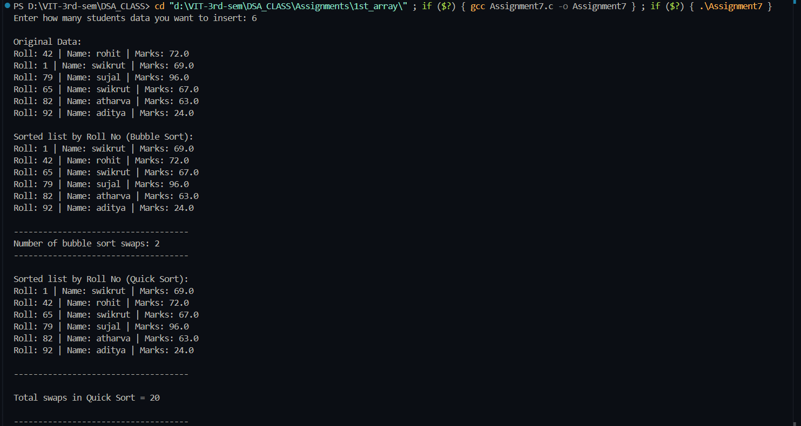

# Student Sorting Program (Bubble Sort & Quick Sort)

**Name:** Sahil Ashok Khaire  
**Roll No:** 13  
**Title:** Sorting Student Records using Bubble Sort and Quick Sort

## Theory

In this program, we demonstrate **sorting techniques** applied to a structure (`Student_sak`) that stores:
- Roll Number
- Name
- Marks

### Concepts Used
1. **Structure in C**  
   - To group student data into one entity.
2. **Dynamic Memory Allocation (`malloc`)**  
   - Allocates memory at runtime based on the number of students.
3. **Bubble Sort**  
   - Simple comparison-based sorting algorithm.
   - Time Complexity: O(n²)
4. **Quick Sort**  
   - Divide and Conquer sorting algorithm.
   - Time Complexity: O(n log n) average, O(n²) worst case.
5. **Swapping Technique**  
   - Used to interchange structure elements.


## Algorithm

### Bubble Sort
1. Repeat (n-1) passes.
2. In each pass, compare adjacent elements.
3. If the first element is greater than the next, swap them.
4. Continue until sorted.

### Quick Sort
1. Select a **pivot element** (last element in this case).
2. Partition the array into two sub-arrays:
   - Left side → elements smaller than pivot.
   - Right side → elements larger than pivot.
3. Recursively apply Quick Sort to left and right sub-arrays.
4. Combine results.


**Code** :
      
```
#include <stdio.h>
#include <stdlib.h>
#include <string.h>

typedef struct
{
    int roll_sak;
    char name_sak[50];
    float marks_sak;
} Student_sak;

int bubblesort_sak(Student_sak s1_sak[], int n_sak)
{
    int bc_sak = 0;
    for (int i_sak = 0; i_sak < n_sak - 1; i_sak++)
    {
        for (int j_sak = 0; j_sak < n_sak - 1 - i_sak; j_sak++)
        {
            if (s1_sak[j_sak].roll_sak > s1_sak[j_sak + 1].roll_sak)
            {
                Student_sak temp_sak = s1_sak[j_sak];
                s1_sak[j_sak] = s1_sak[j_sak + 1];
                s1_sak[j_sak + 1] = temp_sak;
                bc_sak++;
            }
        }
    }
    return bc_sak;
}

int partition_sak(Student_sak s1_sak[], int low_sak, int high_sak, int *qcount_sak)
{
    Student_sak temp_sak;
    int pivot_sak = s1_sak[high_sak].roll_sak;
    int i_sak = low_sak - 1;

    for (int j_sak = low_sak; j_sak < high_sak; j_sak++)
    {
        if (s1_sak[j_sak].roll_sak < pivot_sak)
        {
            i_sak++;
            temp_sak = s1_sak[i_sak];
            s1_sak[i_sak] = s1_sak[j_sak];
            s1_sak[j_sak] = temp_sak;
            (*qcount_sak)++;
        }
    }
    temp_sak = s1_sak[i_sak + 1];
    s1_sak[i_sak + 1] = s1_sak[high_sak];
    s1_sak[high_sak] = temp_sak;
    (*qcount_sak)++;

    return (i_sak + 1);
}

void quicksort_sak(Student_sak s1_sak[], int low_sak, int high_sak, int *qcount_sak)
{
    if (low_sak < high_sak)
    {
        int pi_sak = partition_sak(s1_sak, low_sak, high_sak, qcount_sak);
        quicksort_sak(s1_sak, low_sak, pi_sak - 1, qcount_sak);
        quicksort_sak(s1_sak, pi_sak + 1, high_sak, qcount_sak);
    }
}

int main()
{
    Student_sak *s1_sak = NULL;
    int n_sak;
    int bcount_sak = 0, qc_sak = 0;

    printf("Enter how many students data you want to insert: ");
    scanf("%d", &n_sak);

    s1_sak = (Student_sak *)malloc(sizeof(Student_sak) * n_sak);
    if (s1_sak == NULL)
    {
        printf("Memory is not allocated!!!!");
        exit(-1);
    }

    const char *name_sak[] = {"sahil", "apurv", "aryan", "atharva", "prathmesh","swikrut", "sujal", "aditya", "krishna", "kunal", "aman", "rohit"};

    int l_name_sak = (int)sizeof(name_sak) / sizeof(name_sak[0]);

    for (int i_sak = 0; i_sak < n_sak; i_sak++)
    {
        s1_sak[i_sak].roll_sak = (rand() % 100 + 1);
        strcpy(s1_sak[i_sak].name_sak, name_sak[rand() % l_name_sak]);
        s1_sak[i_sak].marks_sak = (float)(rand() % 101);
    }

    printf("\nOriginal Data:\n");
    for (int i_sak = 0; i_sak < n_sak; i_sak++)
    {
        printf("Roll: %d | Name: %s | Marks: %.1f\n",
        s1_sak[i_sak].roll_sak, s1_sak[i_sak].name_sak, s1_sak[i_sak].marks_sak);
    }

    bcount_sak = bubblesort_sak(s1_sak, n_sak);

    printf("\nSorted list by Roll No (Bubble Sort):\n");
    for (int i_sak = 0; i_sak < n_sak; i_sak++)
    {
        printf("Roll: %d | Name: %s | Marks: %.1f\n",
        s1_sak[i_sak].roll_sak, s1_sak[i_sak].name_sak, s1_sak[i_sak].marks_sak);
    }
    printf("\n------------------------------------\n");
    printf("Number of bubble sort swaps: %d", bcount_sak);
    printf("\n------------------------------------\n");

    quicksort_sak(s1_sak, 0, n_sak - 1, &qc_sak);

    printf("\nSorted list by Roll No (Quick Sort):\n");
    for (int i_sak = 0; i_sak < n_sak; i_sak++)
    {
        printf("Roll: %d | Name: %s | Marks: %.1f\n",
        s1_sak[i_sak].roll_sak, s1_sak[i_sak].name_sak, s1_sak[i_sak].marks_sak);
    }
    printf("\n------------------------------------\n");
    printf("\nTotal swaps in Quick Sort = %d\n", qc_sak);
    printf("\n------------------------------------\n");

    free(s1_sak);
    s1_sak = NULL;
}

```

## Output

