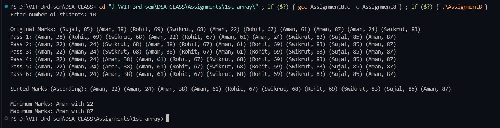

# Quick Sort and Divide & Conquer on Student Marks

**Name:** Sahil Ashok Khaire  
**Roll No:** 13 
**Title:** Sorting Student Marks using Quick Sort and Finding Min/Max using Divide & Conquer


## Theory

In this program:
- Marks of `n` students are input.
- **Quick Sort Algorithm** is used to sort marks in ascending order.
- Sorting is analyzed **pass by pass**.
- **Divide and Conquer Technique** is applied recursively to find **minimum and maximum marks**.

### Concepts Used
1. **Dynamic Memory Allocation**  
   - Memory for marks array is allocated at runtime using `malloc`.
2. **Quick Sort**  
   - Pivot element divides array into two halves.
   - Each half is sorted recursively.
   - Efficient: O(n log n) average time.
3. **Pass by Pass Analysis**  
   - After each partition, array is printed to show sorting progress.
4. **Divide and Conquer (Recursion)**  
   - Array is split into halves recursively.
   - Min and Max of each half are compared to find global Min/Max.

---

## Algorithm

### Quick Sort
1. Choose pivot (last element).
2. Partition array:
   - Elements smaller than pivot on left.
   - Elements greater than pivot on right.
3. Recursively apply Quick Sort on left and right sub-arrays.
4. Print array after each partition (to show passes).

### Divide & Conquer for Min/Max
1. If only one element → both min and max = element.
2. If two elements → compare and assign min/max.
3. If more than two elements:
   - Split array into two halves.
   - Recursively find min/max of each half.
   - Combine results.


**Code** :
      
```
#include <stdio.h>
#include <stdlib.h>
#include <string.h>

struct Student_sak {
    char name_sak[50];
    int marks_sak;
};

void printArray_sak(struct Student_sak arr_sak[], int n_sak, int pass_sak) {
    printf("Pass %d: ", pass_sak);
    for (int i_sak = 0; i_sak < n_sak; i_sak++) {
        printf("(%s, %d) ", arr_sak[i_sak].name_sak, arr_sak[i_sak].marks_sak);
    }
    printf("\n");
}

int partition_sak(struct Student_sak arr_sak[], int low_sak, int high_sak, int n_sak, int *passCount_sak) {
    int pivot_sak = arr_sak[high_sak].marks_sak;
    int i_sak = low_sak - 1;

    for (int j_sak = low_sak; j_sak < high_sak; j_sak++) {
        if (arr_sak[j_sak].marks_sak < pivot_sak) {
            i_sak++;
            struct Student_sak temp_sak = arr_sak[i_sak];
            arr_sak[i_sak] = arr_sak[j_sak];
            arr_sak[j_sak] = temp_sak;
        }
    }
    struct Student_sak temp_sak = arr_sak[i_sak + 1];
    arr_sak[i_sak + 1] = arr_sak[high_sak];
    arr_sak[high_sak] = temp_sak;

    (*passCount_sak)++;
    printArray_sak(arr_sak, n_sak, *passCount_sak);

    return (i_sak + 1);
}

void quicksort_sak(struct Student_sak arr_sak[], int low_sak, int high_sak, int n_sak, int *passCount_sak) {
    if (low_sak < high_sak) {
        int pi_sak = partition_sak(arr_sak, low_sak, high_sak, n_sak, passCount_sak);
        quicksort_sak(arr_sak, low_sak, pi_sak - 1, n_sak, passCount_sak);
        quicksort_sak(arr_sak, pi_sak + 1, high_sak, n_sak, passCount_sak);
    }
}

void findMinMax_sak(struct Student_sak arr_sak[], int low_sak, int high_sak, struct Student_sak *min_sak, struct Student_sak *max_sak) {
    if (low_sak == high_sak) {
        *min_sak = arr_sak[low_sak];
        *max_sak = arr_sak[low_sak];
    }
    else if (high_sak == low_sak + 1) {
        if (arr_sak[low_sak].marks_sak < arr_sak[high_sak].marks_sak) {
            *min_sak = arr_sak[low_sak];
            *max_sak = arr_sak[high_sak];
        } else {
            *min_sak = arr_sak[high_sak];
            *max_sak = arr_sak[low_sak];
        }
    }
    else {
        int mid_sak = (low_sak + high_sak) / 2;
        struct Student_sak min1_sak, max1_sak, min2_sak, max2_sak;

        findMinMax_sak(arr_sak, low_sak, mid_sak, &min1_sak, &max1_sak);
        findMinMax_sak(arr_sak, mid_sak + 1, high_sak, &min2_sak, &max2_sak);

        *min_sak = (min1_sak.marks_sak < min2_sak.marks_sak) ? min1_sak : min2_sak;
        *max_sak = (max1_sak.marks_sak > max2_sak.marks_sak) ? max1_sak : max2_sak;
    }
}

int main() {
    int n_sak;
    printf("Enter number of students: ");
    scanf("%d", &n_sak);

    struct Student_sak *students_sak = malloc(n_sak * sizeof(struct Student_sak));
    if (students_sak == NULL) {
        printf("Memory not allocated!\n");
        exit(0);
    }

    const char * names_sak[]={"Sahil","Atharva","Prathmesh","Swikrut","Apurv","Sujal","Kunal","Aman","Rohit"};

    int l_name_sak=(int)sizeof(names_sak)/sizeof(names_sak[0]);

    for (int i_sak = 0; i_sak < n_sak; i_sak++) {
        strcpy(students_sak[i_sak].name_sak,names_sak[rand()%l_name_sak]);
        students_sak[i_sak].marks_sak = rand() % 101;
    }

    printf("\nOriginal Marks: ");
    for (int i_sak = 0; i_sak < n_sak; i_sak++) {
        printf("(%s, %d) ", students_sak[i_sak].name_sak, students_sak[i_sak].marks_sak);
    }
    printf("\n");

    int passCount_sak = 0;
    quicksort_sak(students_sak, 0, n_sak - 1, n_sak, &passCount_sak);

    printf("\nSorted Marks (Ascending): ");
    for (int i_sak = 0; i_sak < n_sak; i_sak++) {
        printf("(%s, %d) ", students_sak[i_sak].name_sak, students_sak[i_sak].marks_sak);
    }
    printf("\n");

    struct Student_sak min_sak, max_sak;
    findMinMax_sak(students_sak, 0, n_sak - 1, &min_sak, &max_sak);

    printf("\nMinimum Marks: %s with %d", min_sak.name_sak, min_sak.marks_sak);
    printf("\nMaximum Marks: %s with %d\n", max_sak.name_sak, max_sak.marks_sak);

    free(students_sak);
    return 0;
}

```

## Output

