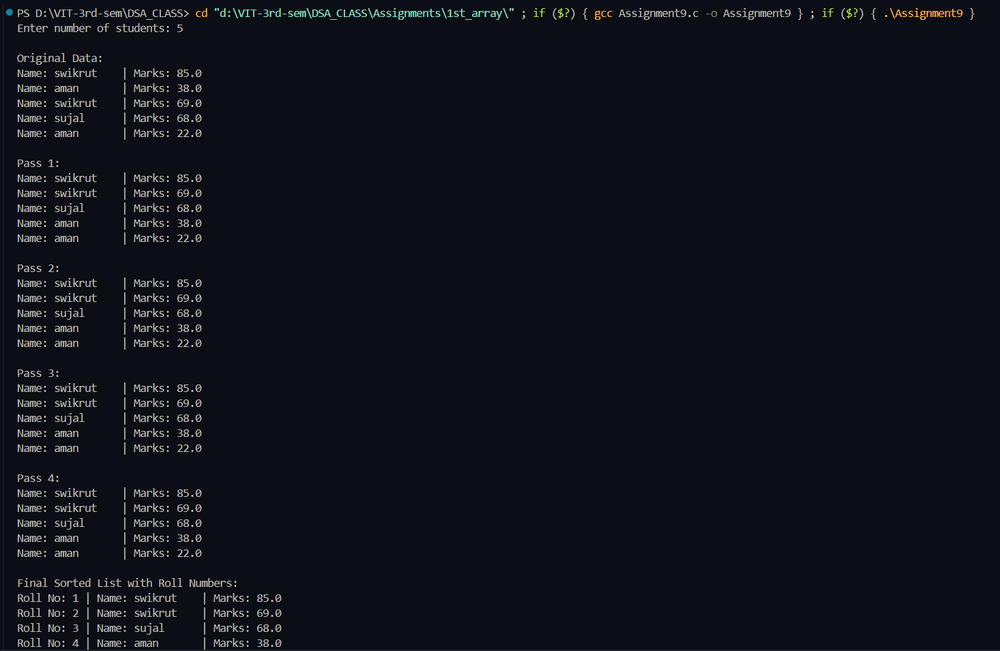

# Bubble Sort – Assigning Roll Numbers Based on Marks

**Name:** Sahil Ashok Khaire  
**Roll No:** 13 

## Aim
To write a program using **Bubble Sort algorithm** to assign roll numbers to students of a class according to their marks in the previous year.  
The topper should get Roll No. 1.


## Theory
- **Bubble Sort** is a comparison-based algorithm.  
- In each pass, adjacent elements are compared and swapped if they are in the wrong order.  
- Here, we sort **in descending order of marks** so that the highest marks come first.  
- After sorting, roll numbers are assigned sequentially (1 to n).

## Algorithm
1. Start  
2. Input number of students `n`.  
3. Generate random marks and assign names.  
4. Apply **Bubble Sort**:  
   - Repeat for `n-1` passes.  
   - In each pass, compare adjacent marks.  
   - Swap if the earlier mark is less than the next one (for descending order).  
   - Print list after each pass.  
5. Assign roll numbers: first student → Roll 1, second → Roll 2, …  
6. Display the final roll list.  
7. Stop  


**Code** :
      
```
#include <stdio.h>
#include <stdlib.h>
#include <string.h>

typedef struct
{
    int roll_sak;
    char name_sak[50];
    float marks_sak;
} Student_sak;

void bubbleSort_sak(Student_sak arr_sak[], int n_sak)
{
    for (int i_sak = 0; i_sak < n_sak - 1; i_sak++)
    {
        printf("\nPass %d:\n", i_sak + 1);
        for (int j_sak = 0; j_sak < n_sak - 1 - i_sak; j_sak++)
        {
            if (arr_sak[j_sak].marks_sak < arr_sak[j_sak + 1].marks_sak)
            {
                Student_sak temp_sak = arr_sak[j_sak];
                arr_sak[j_sak] = arr_sak[j_sak + 1];
                arr_sak[j_sak + 1] = temp_sak;
            }
        }

        for (int k_sak = 0; k_sak < n_sak; k_sak++)
        {
            printf("Name: %-10s | Marks: %.1f\n",
                   arr_sak[k_sak].name_sak, arr_sak[k_sak].marks_sak);
        }
    }

    for (int i_sak = 0; i_sak < n_sak; i_sak++)
    {
        arr_sak[i_sak].roll_sak = i_sak + 1;
    }
}

int main()
{
    int n_sak;
    Student_sak *s1_sak = NULL;

    printf("Enter number of students: ");
    scanf("%d", &n_sak);

    s1_sak = (Student_sak *)malloc(n_sak * sizeof(Student_sak));
    if (s1_sak == NULL)
    {
        printf("Memory allocation failed!\n");
        exit(0);
    }

    const char *name_list_sak[] = {"sahil", "apurv", "aryan", "atharva","prathmesh", "swikrut", "sujal", "aditya","krishna", "kunal", "aman", "rohit"};
    int name_count_sak = sizeof(name_list_sak) / sizeof(name_list_sak[0]);

    for (int i_sak = 0; i_sak < n_sak; i_sak++)
    {
        strcpy(s1_sak[i_sak].name_sak, name_list_sak[rand() % name_count_sak]);
        s1_sak[i_sak].marks_sak = (float)(rand() % 101);
    }

    printf("\nOriginal Data:\n");
    for (int i_sak = 0; i_sak < n_sak; i_sak++)
    {
        printf("Name: %-10s | Marks: %.1f\n",s1_sak[i_sak].name_sak, s1_sak[i_sak].marks_sak);
    }

    bubbleSort_sak(s1_sak, n_sak);

    printf("\nFinal Sorted List with Roll Numbers:\n");
    for (int i_sak = 0; i_sak < n_sak; i_sak++)
    {
        printf("Roll No: %d | Name: %-10s | Marks: %.1f\n",s1_sak[i_sak].roll_sak, s1_sak[i_sak].name_sak, s1_sak[i_sak].marks_sak);
    }

    free(s1_sak);
    return 0;
}

```

## Output

